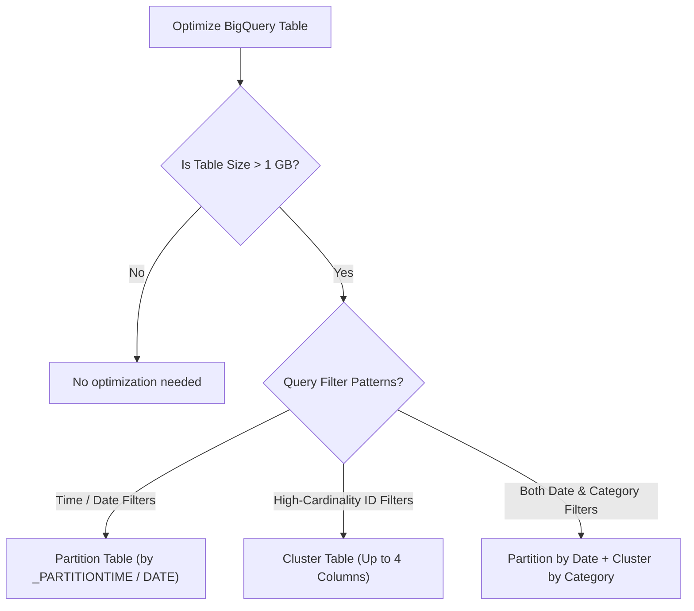

# BigQuery: Decision Trees (ASCII & Visual)

This document provides decision logic trees for selecting BigQuery Partitioning, Clustering, Billing Models, and Ingestion Strategies.

---

## 1. Table Optimization: Partitioning vs Clustering (ASCII Decision Tree)

```
================================================================================
               BIGQUERY TABLE OPTIMIZATION DECISION TREE
================================================================================

                  How large is your BigQuery table?
                                       │
                        ┌──────────────┴──────────────┐
                        ▼                             ▼
                  [ < 1 GB ]                     [ > 1 GB ]
                        │                             │
                        ▼                             ▼
              No Optimization Needed       How do queries filter data?
              Small table scans are fast             │
                                      ┌──────────────┼──────────────┐
                                      ▼              ▼              ▼
                               [ Date / Time ]  [ High-Card ] [ Both Date & Category ]
                                 TIMESTAMP /     UserID, SKU,   Filter by Date AND
                                 DATE Field      Device ID      Category (e.g. Region)
                                      │              │              │
                                      ▼              ▼              ▼
                                PARTITION ONLY  CLUSTER ONLY   PARTITION + CLUSTER
                                 (By Date)       (By Column)    (Partition by Date,
                                                                 Cluster by Region)
```

---

## 2. BigQuery Billing Model Selection (ASCII Decision Tree)

```
================================================================================
               BIGQUERY BILLING & RESERVATION DECISION TREE
================================================================================

                 What is your query workload traffic pattern?
                                       │
        ┌──────────────────────────────┼──────────────────────────────┐
        ▼                              ▼                              ▼
 [ Ad-hoc / Unpredictable ]     [ Steady State Production ]   [ Mission Critical High Scale ]
  Spiky query usage,             Continuous 24/7 background   Enterprise workload needing
  Development projects           ELT pipelines & dashboards   predictable monthly budget
        │                              │                              │
        ▼                              ▼                              ▼
  ON-DEMAND BILLING              STANDARD EDITION             ENTERPRISE EDITION
  Pay per TB scanned             Slots reservation            Autoscaling slots
  (First 1TB/mo FREE)            Cost cap protection          Disaster recovery
```

---

## 3. Visual Mermaid Decision Flowcharts

### Partitioning vs Clustering Flowchart:


### Data Ingestion Strategy Flowchart:
```mermaid
graph TD
    StartIngest["Choose Data Ingestion Method"] --> Latency{"Latency Requirement?"}
    
    Latency -->|Real-Time / Streaming (< 1 second)| Stream["Storage Write API (Stream)"]
    Latency -->|Micro-Batch (Minutes)| MicroBatch["Storage Write API (Pending / Committed)"]
    Latency -->|Batch (Hourly / Daily)| BatchLoad["bq load / Load Job ($0 Load Cost)"]
```
