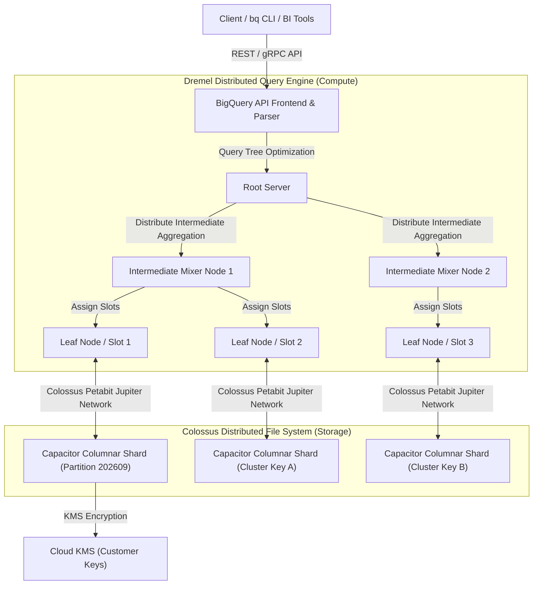
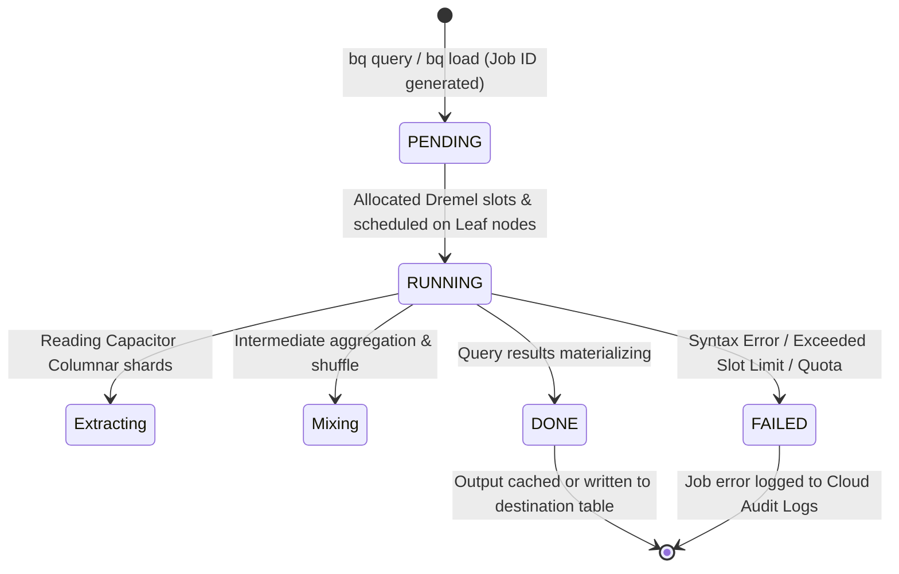

# Feature 4: Google Cloud BigQuery (`bq`) — High-Level Design (HLD) & Low-Level Design (LLD)

This document details the architectural design for **Google Cloud BigQuery Serverless Enterprise Data Warehouse** and **`bq` CLI Interaction**.

---

## 1. High-Level Design (HLD)

BigQuery separates compute (query engine) from storage (columnar storage), connected over Google's petabit Jupiter network fabric:

### Key HLD Components:
1. **Dremel Execution Engine**: Multi-tenant compute engine that compiles SQL queries into execution trees of Mixer and Leaf nodes (Slots).
2. **Capacitor Columnar Storage**: Compressed, read-optimized binary storage format stored on Google's Colossus distributed file system.
3. **Jupiter Network Fabric**: Petabit-per-second network topology connecting thousands of compute slots to Colossus storage shards without bandwidth bottlenecks.
4. **Separation of Compute & Storage**: Slots are allocated dynamically per query, enabling serverless auto-scaling from zero to thousands of vCPUs.

---

## 2. Low-Level Design (LLD)

### BigQuery Job Execution State Machine:

### LLD Internal Mechanics:
* **Partitioning & Pruning**: Partitioning divides a table based on daily time-unit (`DAY`, `MONTH`) or integer ranges. During query execution, BigQuery prunes unreferenced partition shards before reading storage, cutting cost and latency.
* **Clustering**: Groups data within partitions based on up to 4 column keys. BigQuery sorts and groups contiguous data blocks, eliminating full table scans.
* **Cached Query Results**: Queries yielding identical SQL text return instant $0-cost cached results within 24 hours if underlying table data remains unchanged.
