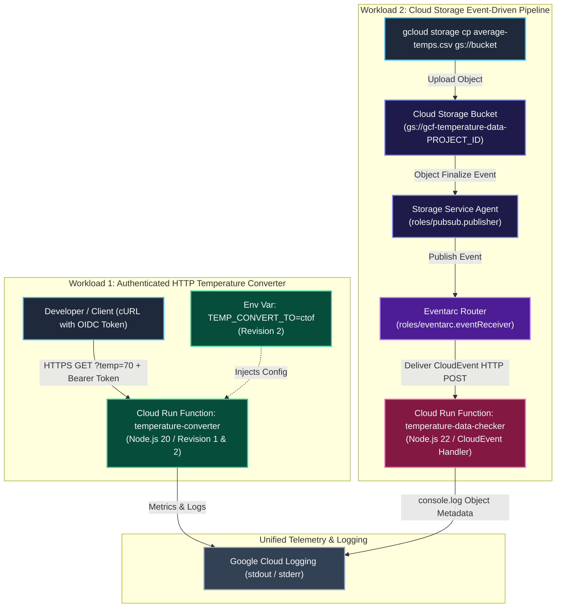

# Hands-On Lab: Building, Testing, and Deploying HTTP & Event-Driven Cloud Run Functions with Multi-Revision Traffic Management

A complete end-to-end hands-on engineering lab for Google Cloud Run Functions (2nd gen). This lab covers building authenticated HTTP functions with Functions Framework, implementing Cloud Storage-triggered event functions via Eventarc and Pub/Sub, writing local unit tests with Mocha and Sinon, and deploying immutable revisions with environment variable traffic management.

---

## 1. Lab Architecture Overview

Cloud Run functions is Google Cloud's next-generation Function-as-a-Service (FaaS) engine powered by **Google Cloud Run**, **Google Cloud Build**, and **Eventarc**. It provides advanced control over performance, cold start mitigation, up to 60-minute execution timeouts, and native triggers from over 90+ event sources.



---

## 2. Lab Objectives & Architectural Highlights

1. **Enterprise API Activation**: Provision the necessary Google Cloud Service APIs (`cloudfunctions`, `run`, `cloudbuild`, `artifactregistry`, `eventarc`, `logging`, `storage`, `pubsub`).
2. **Authenticated HTTP Function**: Develop and deploy a temperature conversion function using `@google-cloud/functions-framework`, secured with Google Cloud IAM OIDC token authentication.
3. **Eventarc & Storage Trigger**: Configure the underlying Cloud Storage and Eventarc IAM service identities to capture `google.cloud.storage.object.v1.finalized` events.
4. **Local Testing & Mocking**: Extract source packages, configure a local Node.js test environment, and write unit tests using `mocha`, `sinon` stubs, and `@google-cloud/functions-framework/testing`.
5. **Immutable Revisions & Traffic Shifting**: Deploy a second revision introducing environment variable configuration (`TEMP_CONVERT_TO=ctof`) and verify traffic execution behavior.

---

## 3. Step-by-Step Implementation Runbook

### Task 1: Environment Setup & API Enablement

In Google Cloud Shell, initialize the project environment variables and enable the required service APIs:

```bash
# 1. Capture Project ID and set desired deployment region
export PROJECT_ID=$(gcloud config get-value project)
export REGION="us-central1"

# 2. Enable all required service APIs
gcloud services enable \
  artifactregistry.googleapis.com \
  cloudfunctions.googleapis.com \
  cloudbuild.googleapis.com \
  eventarc.googleapis.com \
  run.googleapis.com \
  logging.googleapis.com \
  storage.googleapis.com \
  pubsub.googleapis.com

# 3. Verify API activation
gcloud services list --enabled --filter="name:(cloudfunctions OR run OR cloudbuild OR eventarc)"
```

---

### Task 2: Create and Test Authenticated HTTP Function

Develop a Node.js function using `@google-cloud/functions-framework` that accepts temperature values and conversion directions via HTTP query parameters.

#### 1. Function Code (`index.js`):
```javascript
const functions = require('@google-cloud/functions-framework');

functions.http('convertTemp', (req, res) => {
  var dirn = req.query.convert;
  var ctemp = (req.query.temp - 32) * 5 / 9;
  var target_unit = 'Celsius';

  if (req.query.temp === undefined) {
    res.status(400);
    res.send('Temperature value not supplied in request.');
    return;
  }
  
  if (dirn === undefined) {
    dirn = process.env.TEMP_CONVERT_TO;
  }
  
  if (dirn === 'ctof') {
    ctemp = (req.query.temp * 9 / 5) + 32;
    target_unit = 'Fahrenheit';
  }

  res.send(`Temperature in ${target_unit} is: ${ctemp.toFixed(2)}.`);
});
```

#### 2. Dependency Manifest (`package.json`):
```json
{
  "name": "temperature-converter",
  "version": "1.0.0",
  "dependencies": {
    "@google-cloud/functions-framework": "^3.0.0"
  }
}
```

#### 3. Deploy HTTP Function with Authentication Required:
```bash
# Deploy with authentication enforced and max-instances limited to 1
gcloud functions deploy temperature-converter \
  --gen2 \
  --region=$REGION \
  --runtime=nodejs20 \
  --entry-point=convertTemp \
  --source=. \
  --trigger-http \
  --no-allow-unauthenticated \
  --max-instances=1
```

#### 4. Test Authenticated Ingress with OIDC Identity Token:
```bash
# Retrieve the service URL
export FUNCTION_URI=$(gcloud run services describe temperature-converter \
  --region $REGION \
  --format 'value(status.url)')

# Test default conversion (Fahrenheit -> Celsius)
curl -H "Authorization: bearer $(gcloud auth print-identity-token)" \
  "${FUNCTION_URI}?temp=70"
# Expected Output: Temperature in Celsius is: 21.11.

# Test explicit conversion (Celsius -> Fahrenheit)
curl -H "Authorization: bearer $(gcloud auth print-identity-token)" \
  "${FUNCTION_URI}?temp=21.11&convert=ctof"
# Expected Output: Temperature in Fahrenheit is: 70.00.
```

---

### Task 3: Create Cloud Storage Event-Driven Function (Eventarc)

Deploy an event-driven function that triggers automatically whenever a new file is uploaded to a target Cloud Storage bucket.

#### 1. Configure IAM Roles for Storage and Eventarc Service Identities:
```bash
export PROJECT_NUMBER=$(gcloud projects describe $PROJECT_ID --format='value(projectNumber)')

# Grant Eventarc Event Receiver to default compute engine service account
gcloud projects add-iam-policy-binding $PROJECT_ID \
  --member="serviceAccount:$PROJECT_NUMBER-compute@developer.gserviceaccount.com" \
  --role="roles/eventarc.eventReceiver"

# Create Cloud Storage service identity (if not already present)
gcloud beta services identity create --service=storage.googleapis.com --project=$PROJECT_ID

# Grant Pub/Sub Publisher to Cloud Storage service agent
gcloud projects add-iam-policy-binding $PROJECT_ID \
  --member="serviceAccount:service-$PROJECT_NUMBER@gs-project-accounts.iam.gserviceaccount.com" \
  --role="roles/pubsub.publisher"

# Grant Eventarc Service Agent role
gcloud projects add-iam-policy-binding $PROJECT_ID \
  --member="serviceAccount:service-$PROJECT_NUMBER@gs-project-accounts.iam.gserviceaccount.com" \
  --role="roles/eventarc.serviceAgent"
```

#### 2. Create Storage Trigger Bucket:
```bash
export BUCKET="gs://gcf-temperature-data-$PROJECT_ID"
gcloud storage buckets create -l $REGION $BUCKET
```

#### 3. Write CloudEvent Handler (`temp-data-checker/index.js`):
```javascript
const functions = require('@google-cloud/functions-framework');

// Register a CloudEvent callback with the Functions Framework
functions.cloudEvent('checkTempData', cloudEvent => {
  console.log(`Event ID: ${cloudEvent.id}`);
  console.log(`Event Type: ${cloudEvent.type}`);

  const file = cloudEvent.data;
  console.log(`Bucket: ${file.bucket}`);
  console.log(`File: ${file.name}`);
  console.log(`Created: ${file.timeCreated}`);
});
```

#### 4. Dependency Manifest (`temp-data-checker/package.json`):
```json
{
  "name": "temperature-data-checker",
  "version": "0.0.1",
  "main": "index.js",
  "dependencies": {
    "@google-cloud/functions-framework": "^2.1.0"
  }
}
```

#### 5. Deploy Event-Driven Function:
```bash
gcloud functions deploy temperature-data-checker \
  --gen2 \
  --runtime=nodejs22 \
  --entry-point=checkTempData \
  --source=. \
  --region=$REGION \
  --trigger-bucket=$BUCKET \
  --trigger-location=$REGION \
  --max-instances=1
```

#### 6. Trigger and Verify Event Processing:
```bash
# Upload sample test data to the bucket
echo "station,temp\nNYC,72\nLA,85" > average-temps.csv
gcloud storage cp average-temps.csv $BUCKET/average-temps.csv

# Inspect Cloud Logging output
gcloud functions logs read temperature-data-checker \
  --region=$REGION \
  --gen2 \
  --limit=20 \
  --format="value(log)"
```

Sample expected log output:
```
Event ID: 5834307012388233
Event Type: google.cloud.storage.object.v1.finalized
Bucket: gcf-temperature-data-my-project
File: average-temps.csv
Created: 2026-09-21T15:20:00.000Z
```

---

### Task 4: Local Development, Mocking & Unit Testing

Pre-deployment testing ensures functional correctness, isolates regressions, and accelerates development cycles.

#### 1. Unit Test Suite (`tests/unit.http.test.js`):
```javascript
const { getFunction } = require('@google-cloud/functions-framework/testing');
const sinon = require('sinon');
const assert = require('assert');

describe('functions_convert_temperature_http', () => {
  require('../index.js');

  const getMocks = () => {
    const req = { body: {}, query: {} };
    return {
      req: req,
      res: {
        send: sinon.stub().returnsThis(),
        status: sinon.stub().returnsThis()
      },
    };
  };

  let envOrig;
  before(() => {
    envOrig = JSON.stringify(process.env);
  });

  after(() => {
    process.env = JSON.parse(envOrig);
  });

  it('convertTemp: should convert a Fahrenheit temp value by default', () => {
    const mocks = getMocks();
    mocks.req.query = { temp: 70 };

    const convertTemp = getFunction('convertTemp');
    convertTemp(mocks.req, mocks.res);
    assert.strictEqual(mocks.res.send.calledOnceWith('Temperature in Celsius is: 21.11.'), true);
  });

  it('convertTemp: should convert a Celsius temp value', () => {
    const mocks = getMocks();
    mocks.req.query = { temp: 21.11, convert: 'ctof' };

    const convertTemp = getFunction('convertTemp');
    convertTemp(mocks.req, mocks.res);
    assert.strictEqual(mocks.res.send.calledOnceWith('Temperature in Fahrenheit is: 70.00.'), true);
  });

  it('convertTemp: should convert a Celsius temp value by default via ENV', () => {
    process.env.TEMP_CONVERT_TO = 'ctof';
    const mocks = getMocks();
    mocks.req.query = { temp: 21.11 };

    const convertTemp = getFunction('convertTemp');
    convertTemp(mocks.req, mocks.res);
    assert.strictEqual(mocks.res.send.calledOnceWith('Temperature in Fahrenheit is: 70.00.'), true);
  });

  it('convertTemp: should return an error message on missing temp', () => {
    const mocks = getMocks();

    const convertTemp = getFunction('convertTemp');
    convertTemp(mocks.req, mocks.res);

    assert.strictEqual(mocks.res.status.calledOnce, true);
    assert.strictEqual(mocks.res.status.firstCall.args[0], 400);
  });
});
```

#### 2. Test Manifest (`package.json`):
```json
{
  "name": "temperature-converter",
  "version": "0.0.1",
  "main": "index.js",
  "scripts": {
    "unit-test": "mocha tests/unit*test.js --timeout=6000 --exit",
    "test": "npm -- run unit-test"
  },
  "devDependencies": {
    "mocha": "^9.0.0",
    "sinon": "^14.0.0"
  },
  "dependencies": {
    "@google-cloud/functions-framework": "^3.0.0"
  }
}
```

#### 3. Execute Unit Tests:
```bash
npm install
npm test
```

Expected output:
```
  functions_convert_temperature_http
    ✔ convertTemp: should convert a Fahrenheit temp value by default
    ✔ convertTemp: should convert a Celsius temp value
    ✔ convertTemp: should convert a Celsius temp value by default via ENV
    ✔ convertTemp: should return an error message on missing temp

  4 passing (12ms)
```

---

### Task 5: Immutable Revisions & Traffic Management

In Cloud Run functions, every deployment creates an **immutable revision** of the underlying Cloud Run service.

#### 1. Deploy Revision 2 with Environment Variable:
```bash
gcloud functions deploy temperature-converter \
  --gen2 \
  --region=$REGION \
  --set-env-vars=TEMP_CONVERT_TO=ctof
```

#### 2. Verify Revision List & Traffic Allocation:
```bash
# View all revisions of the underlying Cloud Run service
gcloud run revisions list \
  --service=temperature-converter \
  --region=$REGION \
  --format="table(name,active,traffic_percent)"
```

#### 3. Verify Changed Behavior on Latest Revision:
```bash
# Invoking without explicit 'convert' parameter now defaults to 'ctof'
curl -H "Authorization: bearer $(gcloud auth print-identity-token)" \
  "${FUNCTION_URI}?temp=21.11"

# Output: Temperature in Fahrenheit is: 70.00.
```

#### 4. Traffic Splitting & Rollback:
```bash
# Split traffic: 50% to previous revision, 50% to latest
export REV1="temperature-converter-00001-xxx"
export REV2="temperature-converter-00002-yyy"

gcloud run services update-traffic temperature-converter \
  --region=$REGION \
  --to-revisions=${REV1}=50,${REV2}=50

# Rollback 100% traffic to Revision 1
gcloud run services update-traffic temperature-converter \
  --region=$REGION \
  --to-revisions=${REV1}=100
```
