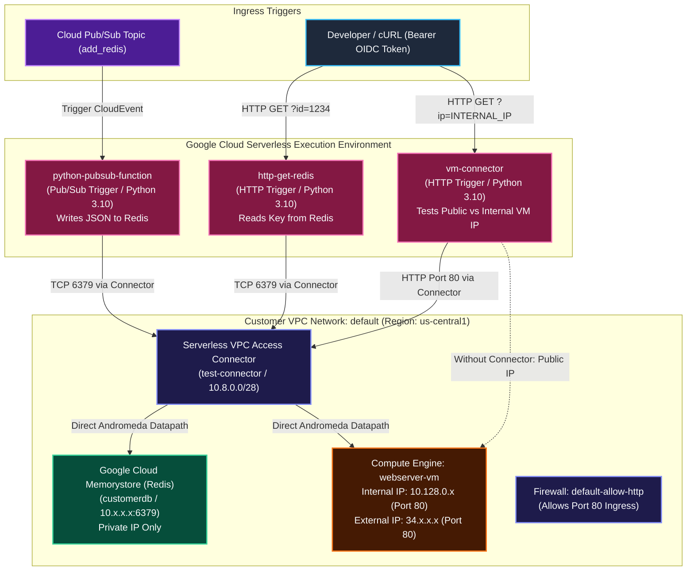

# Hands-On Lab: Connecting Cloud Run Functions to Resources in a VPC Network (Memorystore for Redis & Internal VM)

A comprehensive hands-on engineering lab detailing how to establish private, secure connectivity from **Google Cloud Run Functions (2nd Gen)** to internal VPC resources (**Google Cloud Memorystore for Redis** and an **internal Compute Engine VM**) using a **Serverless VPC Access Connector**.

---

## 1. Lab Architecture & Topology

By default, Cloud Run functions execute in an isolated Google-managed multi-tenant environment, routing external traffic across the public internet. Connecting to private VPC resources (such as private Memorystore instances or Compute Engine VMs with RFC 1918 internal IPs) requires provisioning a **Serverless VPC Access Connector** backed by an unreserved `/28` CIDR range.



---

## 2. Key Architecture Pillars & Engineering Principles

1. **Zero Public Internet Routing for Databases**:
   - The Memorystore Redis instance is provisioned with a private RFC 1918 internal IP address only, completely inaccessible from the public internet.
2. **Dedicated `/28` Connector Allocation**:
   - The Serverless VPC Access connector (`test-connector`) reserves an unreserved `10.8.0.0/28` CIDR block (16 IP addresses), ensuring no conflict with existing subnets.
3. **Region Parity Requirement**:
   - The connector is provisioned in the exact same region as the Cloud Run functions and Memorystore instance (`$REGION`), avoiding cross-region egress charges and latency penalties.
4. **Decoupled Asynchronous Ingestion & Synchronous Query**:
   - **Ingestion (`python-pubsub-function`)**: Consumes high-throughput JSON messages from Pub/Sub asynchronously and writes customer records to Redis cache.
   - **Retrieval (`http-get-redis`)**: Synchronously looks up cached records by `id` over authenticated HTTPS endpoints.
5. **Private vs. Public Network Verification**:
   - The `vm-connector` demonstrates that without a VPC connector, calls to an internal IP fail with a 10-second upstream timeout, whereas adding `--vpc-connector` enables seamless private HTTP routing to the VM.

---

## 3. Step-by-Step Implementation Runbook

### Task 1: Environment Setup & API Activation

In Google Cloud Shell, set project variables and enable the full suite of required APIs:

```bash
# 1. Capture Project ID and set Region
export PROJECT_ID=$(gcloud config get-value project)
export REGION="us-central1"
export ZONE="us-central1-a"

# 2. Enable all required services
gcloud services enable \
  artifactregistry.googleapis.com \
  cloudfunctions.googleapis.com \
  cloudbuild.googleapis.com \
  eventarc.googleapis.com \
  run.googleapis.com \
  logging.googleapis.com \
  pubsub.googleapis.com \
  redis.googleapis.com \
  vpcaccess.googleapis.com

# 3. Verify API enablement status
gcloud services list --enabled --filter="name:(redis OR vpcaccess OR cloudfunctions)"
```

---

### Task 2: Provision Memorystore for Redis Instance

Create a managed, regional Redis instance in the VPC:

```bash
export REDIS_INSTANCE="customerdb"

# 1. Create a 2 GiB Memorystore for Redis instance (redis_6_x)
gcloud redis instances create $REDIS_INSTANCE \
  --size=2 \
  --region=$REGION \
  --redis-version=redis_6_x

# 2. Capture private internal Host IP and Port
export REDIS_IP=$(gcloud redis instances describe $REDIS_INSTANCE \
  --region=$REGION \
  --format="value(host)")
export REDIS_PORT=$(gcloud redis instances describe $REDIS_INSTANCE \
  --region=$REGION \
  --format="value(port)")

echo "Memorystore Private Endpoint: ${REDIS_IP}:${REDIS_PORT}"
```

---

### Task 3: Provision Serverless VPC Access Connector

Provision a dedicated VPC connector to bridge serverless functions into the VPC network:

```bash
# 1. Create the connector with exclusive /28 CIDR range (10.8.0.0/28)
gcloud compute networks vpc-access connectors create test-connector \
  --region=$REGION \
  --network=default \
  --range=10.8.0.0/28 \
  --min-instances=2 \
  --max-instances=10 \
  --machine-type=e2-micro

# 2. Verify connector state is READY
gcloud compute networks vpc-access connectors describe test-connector \
  --region=$REGION \
  --format="table(name,network,ipCidrRange,state)"
```

---

### Task 4: Develop & Deploy Pub/Sub Event-Driven Function for Redis

Develop a Python function that consumes CloudEvents from a Pub/Sub topic and commits customer records into Redis.

#### 1. Create Pub/Sub Topic:
```bash
export TOPIC="add_redis"
gcloud pubsub topics create $TOPIC
```

#### 2. Function Implementation (`main.py`):
```python
import os
import base64
import json
import redis
import functions_framework

# Initialize Redis client using environment variables injected by Cloud Run
redis_host = os.environ.get('REDISHOST', 'localhost')
redis_port = int(os.environ.get('REDISPORT', 6379))
redis_client = redis.StrictRedis(host=redis_host, port=redis_port)

@functions_framework.cloud_event
def addToRedis(cloud_event):
    """
    Triggered from a message on a Pub/Sub topic.
    Extracts base64-encoded JSON message and writes record to Memorystore Redis.
    """
    try:
        # Decode base64 Pub/Sub payload
        json_data_str = base64.b64decode(cloud_event.data["message"]["data"]).decode()
        json_payload = json.loads(json_data_str)
        
        if json_payload and 'id' in json_payload:
            record_id = json_payload['id']
            redis_client.set(record_id, json_data_str)
            cached_data = redis_client.get(record_id)
            print(f"Added data to Redis for ID {record_id}: {cached_data}")
        else:
            print("Message is invalid or missing an 'id' attribute")
    except Exception as e:
        print(f"Error processing Pub/Sub event: {str(e)}")
```

#### 3. Dependencies (`requirements.txt`):
```text
functions-framework==3.2.0
redis==4.3.4
```

#### 4. Deploy Function Attached to VPC Connector:
```bash
gcloud functions deploy python-pubsub-function \
  --runtime=python310 \
  --region=$REGION \
  --source=. \
  --entry-point=addToRedis \
  --trigger-topic=$TOPIC \
  --vpc-connector=projects/$PROJECT_ID/locations/$REGION/connectors/test-connector \
  --set-env-vars=REDISHOST=$REDIS_IP,REDISPORT=$REDIS_PORT
```

#### 5. Test Pub/Sub Ingestion:
```bash
# Publish test customer record
gcloud pubsub topics publish $TOPIC \
  --message='{"id": 1234, "firstName": "Lucas", "lastName": "Sherman", "Phone": "555-555-5555"}'

# Verify entry in Cloud Logging
gcloud functions logs read python-pubsub-function \
  --region=$REGION \
  --limit=10 \
  --format="value(log)"
```

---

### Task 5: Develop & Deploy HTTP Function for Redis Querying

Develop an authenticated HTTP endpoint that reads records from Redis by `id`.

#### 1. Function Implementation (`main.py`):
```python
import os
import redis
from flask import request
import functions_framework

redis_host = os.environ.get('REDISHOST', 'localhost')
redis_port = int(os.environ.get('REDISPORT', 6379))
redis_client = redis.StrictRedis(host=redis_host, port=redis_port)

@functions_framework.http
def getFromRedis(request):
    """
    HTTP handler that accepts a customer ID in query parameters
    and retrieves the corresponding JSON record from Memorystore Redis.
    """
    response_data = ""
    if request.method == 'GET':
        record_id = request.args.get('id')
        try:
            raw_data = redis_client.get(record_id)
            if raw_data:
                response_data = raw_data.decode('utf-8')
        except Exception as e:
            print(f"Redis retrieval error: {str(e)}")
            response_data = ""
            
    return (response_data, 200, {'Content-Type': 'application/json'})
```

#### 2. Dependencies (`requirements.txt`):
```text
functions-framework==3.2.0
redis==4.3.4
```

#### 3. Deploy HTTP Function Attached to VPC Connector:
```bash
gcloud functions deploy http-get-redis \
  --gen2 \
  --runtime=python310 \
  --entry-point=getFromRedis \
  --source=. \
  --region=$REGION \
  --trigger-http \
  --timeout=600s \
  --max-instances=1 \
  --vpc-connector=projects/$PROJECT_ID/locations/$REGION/connectors/test-connector \
  --set-env-vars=REDISHOST=$REDIS_IP,REDISPORT=$REDIS_PORT \
  --no-allow-unauthenticated
```

#### 4. Query HTTP Function via OIDC Bearer Token:
```bash
# Retrieve function endpoint URL
export HTTP_FUNCTION_URI=$(gcloud functions describe http-get-redis \
  --gen2 \
  --region=$REGION \
  --format="value(serviceConfig.uri)")

# Execute authenticated GET request
curl -H "Authorization: bearer $(gcloud auth print-identity-token)" \
  "${HTTP_FUNCTION_URI}?id=1234"
```

Expected JSON Response:
```json
{"id": 1234, "firstName": "Lucas", "lastName": "Sherman", "Phone": "555-555-5555"}
```

---

### Task 6: Connect to Compute Engine VM via Internal IP

Demonstrate the difference between public internet egress and internal VPC connectivity.

#### 1. Launch Web Server VM with Startup Script & Firewall Rule:
```bash
# Download web server startup script
cat << 'EOF' > startup.sh
#! /bin/bash
apt-get update
apt-get install -y apache2
cat << 'HTML' > /var/www/html/index.html
<html><body><p>Linux startup script from a local file.</p></body></html>
HTML
EOF

# Create VM in target zone
gcloud compute instances create webserver-vm \
  --image-family=debian-11 \
  --image-project=debian-cloud \
  --metadata-from-file=startup-script=./startup.sh \
  --machine-type=e2-standard-2 \
  --tags=http-server \
  --scopes=https://www.googleapis.com/auth/cloud-platform \
  --zone=$ZONE

# Open firewall port 80 for HTTP traffic
gcloud compute firewall-rules create default-allow-http \
  --direction=INGRESS \
  --priority=1000 \
  --network=default \
  --action=ALLOW \
  --rules=tcp:80 \
  --source-ranges=0.0.0.0/0 \
  --target-tags=http-server

# Extract internal and external IP addresses
export VM_INT_IP=$(gcloud compute instances describe webserver-vm \
  --zone=$ZONE \
  --format='get(networkInterfaces[0].networkIP)')
export VM_EXT_IP=$(gcloud compute instances describe webserver-vm \
  --zone=$ZONE \
  --format='get(networkInterfaces[0].accessConfigs[0].natIP)')

echo "VM External IP: $VM_EXT_IP"
echo "VM Internal IP: $VM_INT_IP"
```

#### 2. Function Implementation (`main.py`):
```python
import functions_framework
import requests

@functions_framework.http
def connectVM(request):
    resp_text = ""
    if request.method == 'GET':
        target_ip = request.args.get('ip')
        try:
            # Query web server on target IP with 5-second connection timeout
            response = requests.get(f"http://{target_ip}", timeout=5)
            resp_text = response.text
        except Exception as e:
            resp_text = f"Connection error: {str(e)}"
    return resp_text
```

#### 3. Dependencies (`requirements.txt`):
```text
functions-framework==3.2.0
requests==2.28.1
flask==2.1.3
Werkzeug==2.3.7
```

#### 4. Baseline Test: Deploy WITHOUT VPC Connector
```bash
gcloud functions deploy vm-connector \
  --runtime=python310 \
  --entry-point=connectVM \
  --source=. \
  --region=$REGION \
  --trigger-http \
  --timeout=10s \
  --max-instances=1 \
  --no-allow-unauthenticated

export VM_FN_URI=$(gcloud functions describe vm-connector --region=$REGION --format='value(url)')

# Test 1: Calling VM External IP (Succeeds via public internet gateway)
curl -H "Authorization: bearer $(gcloud auth print-identity-token)" "${VM_FN_URI}?ip=$VM_EXT_IP"
# Output: <html><body><p>Linux startup script from a local file.</p></body></html>

# Test 2: Calling VM Internal IP (FAILS with upstream request timeout!)
curl -H "Authorization: bearer $(gcloud auth print-identity-token)" "${VM_FN_URI}?ip=$VM_INT_IP"
# Output: upstream request timeout (HTTP 504)
```

#### 5. Resolution: Redeploy WITH Serverless VPC Access Connector
```bash
# Attach the connector to enable private RFC 1918 VPC routing
gcloud functions deploy vm-connector \
  --runtime=python310 \
  --entry-point=connectVM \
  --source=. \
  --region=$REGION \
  --trigger-http \
  --timeout=10s \
  --max-instances=1 \
  --no-allow-unauthenticated \
  --vpc-connector=projects/$PROJECT_ID/locations/$REGION/connectors/test-connector

# Re-test calling VM Internal IP
curl -H "Authorization: bearer $(gcloud auth print-identity-token)" "${VM_FN_URI}?ip=$VM_INT_IP"
```

Expected Output:
```html
<html><body><p>Linux startup script from a local file.</p></body></html>
```
*Verification Successful*: The function now traverses the Serverless VPC Access connector to directly communicate with the internal Compute Engine VM across Google Andromeda SDN without exposing traffic to the public internet.
