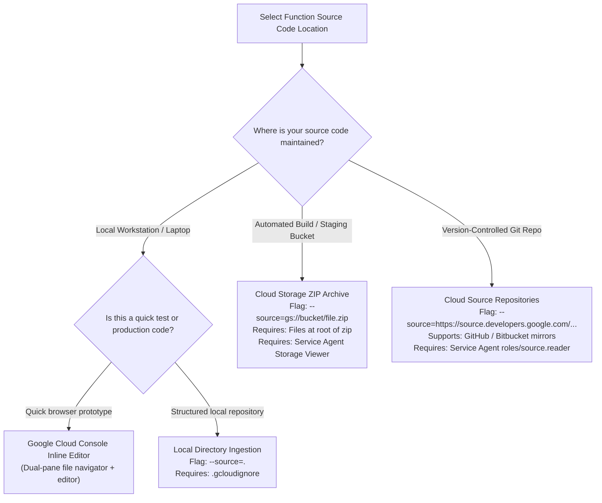
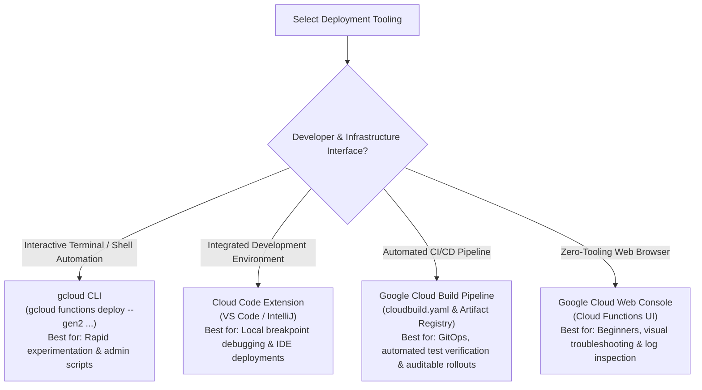
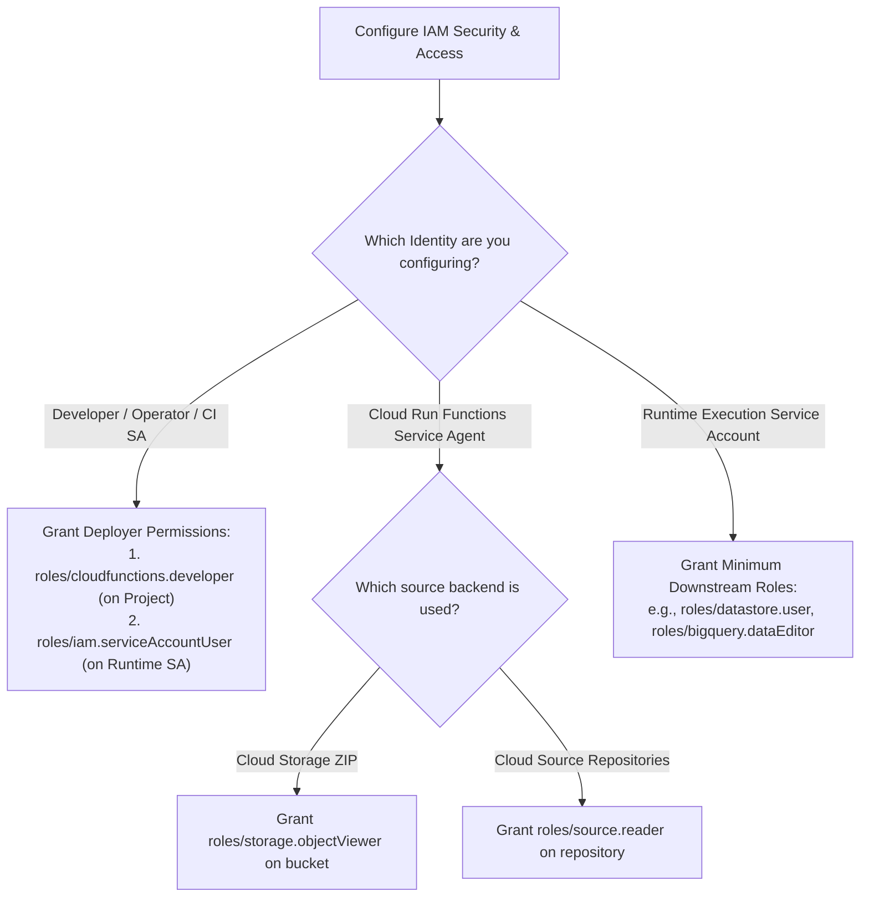
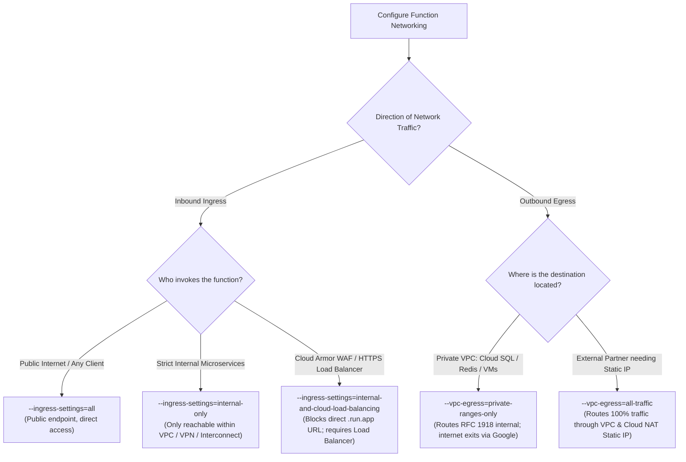
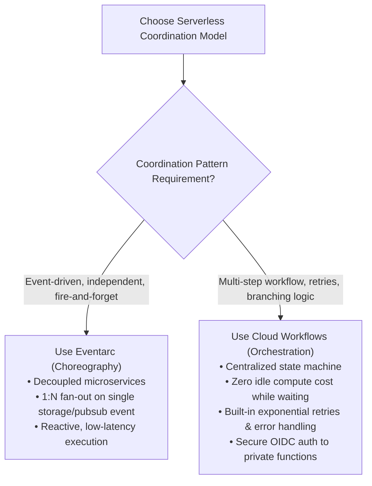

# Cloud Run Functions: Decision Trees (ASCII & Visual)

This document provides structured decision logic trees for selecting source code locations, deployment tooling, runtime triggers, and IAM permission strategies for **Google Cloud Run Functions**.

---

## 1. Source Location Selection (ASCII Decision Tree)

```
================================================================================
              CLOUD RUN FUNCTIONS SOURCE LOCATION DECISION TREE
================================================================================

            Where does your function source code currently reside?
                                       │
        ┌──────────────────────────────┼──────────────────────────────┐
        ▼                              ▼                              ▼
  [ Local Machine ]            [ Object Storage ]            [ Git Repository ]
   Workstation, Laptop          Pre-packaged Builds,          Cloud Source Repositories,
   or Local CI Runner           Automated CI Artifacts        GitHub, Bitbucket Mirrors
        │                              │                              │
        ├────────────────┐             ▼                              ▼
        ▼                ▼      USE CLOUD STORAGE               USE SOURCE REPO
  Quick testing?   Multi-file   `--source=gs://.../app.zip`    `--source=https://...`
        │          production?         │                              │
        │                │             ▼                              ▼
        ▼                ▼       CRITICAL RULE:                 CRITICAL RULE:
  CONSOLE INLINE   USE LOCAL     Files MUST reside at root      Grant Cloud Run Functions
  EDITOR           DIRECTORY     of the ZIP archive (no         Service Agent `roles/`
  (Console UI)     `--source=.`  nested top-level directory).   `source.reader` role.
        │                │
        ▼                ▼
  Use for rapid    CRITICAL RULE:
  prototypes &     Always configure `.gcloudignore`
  syntax tweaks    to exclude `node_modules` & secrets.
```

---

## 2. Deployment Tooling Selection (ASCII Decision Tree)

```
================================================================================
             CLOUD RUN FUNCTIONS DEPLOYMENT TOOLING DECISION TREE
================================================================================

              What is your primary interface / operational environment?
                                       │
        ┌──────────────────────────────┼──────────────────────────────┐
        ▼                              ▼                              ▼
  [ Local Terminal / CLI ]      [ Inside the IDE ]             [ CI/CD Pipeline ]
   Scripting, One-Off Tasks,     VS Code or IntelliJ           GitOps, Production
   Terminal automation           Developer Experience           Build & Automated Tests
        │                              │                              │
        ▼                              ▼                              ▼
  USE GCLOUD CLI                 USE CLOUD CODE                 USE CLOUD BUILD
  `gcloud functions deploy`      IDE Extension                  `cloudbuild.yaml`
  - Granular flag control        - Run & debug locally          - Ephemeral build worker
  - Scriptable shell commands    - Visual deployment wizard     - Direct Artifact Registry
  - Fast feedback loops          - Built-in breakpoint tooling    integration & audit logs
```

---

## 3. Runtime Trigger & Architecture Selection (ASCII Decision Tree)

```
================================================================================
           CLOUD RUN FUNCTIONS TRIGGER & GENERATION DECISION TREE
================================================================================

                 How will your function be invoked by clients?
                                       │
        ┌──────────────────────────────┴──────────────────────────────┐
        ▼                                                             ▼
  [ Synchronous Invocations ]                                  [ Asynchronous Invocations ]
  REST APIs, Webhooks, Microservices                            Event-Driven, Storage, Pub/Sub
        │                                                             │
        ▼                                                             ▼
  USE HTTP TRIGGER                                             USE EVENTARC TRIGGER
  `--trigger-http`                                             `--trigger-event-filters=...`
        │                                                             │
        ├───────────────────────────────┐                             ├───────────────────────┐
        ▼                               ▼                             ▼                       ▼
  Public Endpoint?               Internal / Auth?               Pub/Sub Topic?          Cloud Storage?
  `--allow-unauthenticated`      `--no-allow-unauthenticated`   `--trigger-topic=...`   `--trigger-event-filters=`
  (API Gateway / Web Frontend)   (Requires OIDC token auth)                             `type=google.cloud.storage...`
```

---

## 4. VPC Ingress & Egress Networking Decision Tree (ASCII)

```
================================================================================
              CLOUD RUN FUNCTIONS VPC NETWORKING DECISION TREE
================================================================================

              What network path is required for your function?
                                       │
        ┌──────────────────────────────┴──────────────────────────────┐
        ▼                                                             ▼
  [ INGRESS (Inbound Traffic) ]                                [ EGRESS (Outbound Traffic) ]
  Who should be allowed to invoke?                             Where does the function call out to?
        │                                                             │
        ├──────────────────────────────┬───────────────┐              ├──────────────────────────────┐
        ▼                              ▼               ▼              ▼                              ▼
  [ Public Internet ]          [ Internal VPC ]  [ Cloud WAF / ALB ] [ Internal VPC Resources ]     [ External APIs / Whitelisting ]
  `--ingress-settings=all`     `--ingress-settings= `--ingress-settings= Cloud SQL, Redis, GKE       Third-party API requiring
  Open webhooks &              internal-only`     internal-and-cloud- `--vpc-egress=                 static public IP address
  developer APIs               Strict private     load-balancing`     private-ranges-only`           `--vpc-egress=all-traffic`
                               microservices      Guarded by Cloud    Direct internal routing via    Routes through Cloud NAT
                                                  Armor security rules Andromeda SDN                  Gateway for fixed public IP
```

---

## 5. Eventarc vs. Cloud Workflows Selection (ASCII Decision Tree)

```
================================================================================
         SERVERLESS ORCHESTRATION VS. CHOREOGRAPHY DECISION TREE
================================================================================

            How are multiple functions / services coordinated?
                                       │
        ┌──────────────────────────────┴──────────────────────────────┐
        ▼                                                             ▼
  [ Asynchronous Choreography ]                                [ Stateful Orchestration ]
  Decoupled, event-driven reactive pipelines                    Sequential steps, conditional business logic,
  "Fire-and-forget" notifications                               human approvals, complex retries & error handling
        │                                                             │
        ▼                                                             ▼
  USE EVENTARC (EVENT-DRIVEN)                                   USE GOOGLE CLOUD WORKFLOWS
  - Single event fan-out (1:N)                                  - Centralized declarative state machine (YAML)
  - Latency-sensitive event routing                             - Zero cold-start stacking (free wait state)
  - Independent microservices without central coordinator       - Native OIDC token injection for private endpoints
  - Direct integration with 90+ GCP event sources               - Up to 1 year execution durability
```

---

## 6. Visual Mermaid Decision Flowcharts

### 6.1 Source Code Location Strategy Flowchart:



---

### 6.2 Deployment Tooling Selection Flowchart:



---

### 6.3 IAM Role Assignment Flowchart:



---

### 6.4 VPC Ingress & Egress Routing Flowchart:



---

### 6.5 Orchestration vs. Event Choreography Flowchart:


