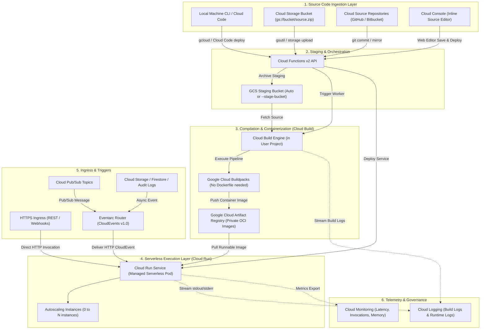
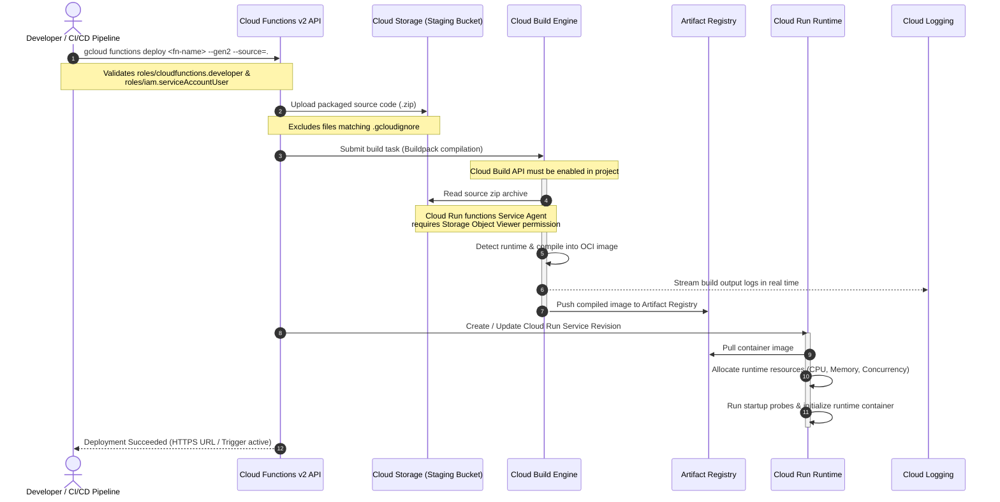
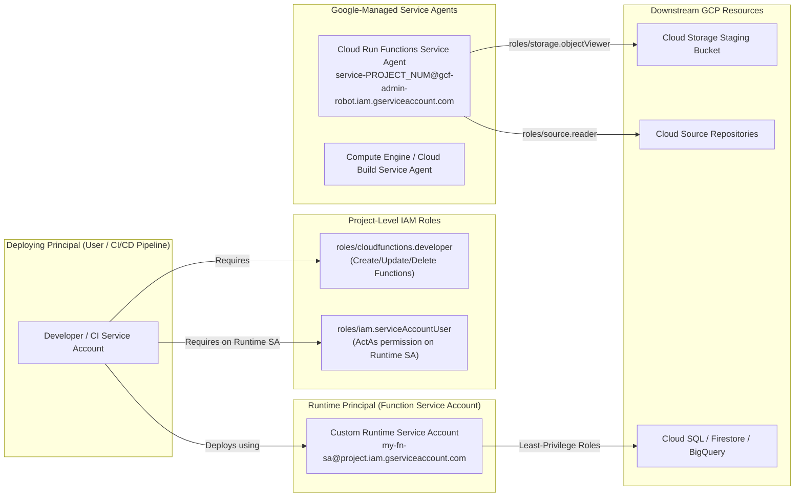

# Feature 9: Cloud Run Functions — High-Level Design (HLD) & Low-Level Design (LLD)

This document details the architectural design, build-and-deploy pipeline, runtime infrastructure, and IAM delegation models for **Google Cloud Run Functions (2nd Gen)**.

---

## 1. High-Level Design (HLD)

Cloud Run functions (2nd gen) is Google Cloud's next-generation Function-as-a-Service (FaaS) platform built natively on top of **Google Cloud Run**, **Google Cloud Build**, and **Eventarc**.

The high-level architecture diagram illustrates the end-to-end lifecycle from source code ingestion to containerized runtime execution:



### Key HLD Architectural Components:

1. **Source Ingestion Layer**:
   - Supports 4 distinct deployment sources: local developer workstations (via `gcloud` or Cloud Code), Cloud Storage zip packages, Cloud Source Repositories (connected to GitHub/Bitbucket), and the GCP Console web-based inline editor.
2. **Cloud Storage Staging**:
   - Compresses and stages the source code in a Google Cloud Storage bucket prior to compilation. Developers can allow GCP to manage the bucket automatically or supply an explicit target via `--stage-bucket`.
3. **Cloud Build Execution Engine**:
   - Operates inside the user's Google Cloud project. It compiles source code into standard OCI-compliant container images using Google Cloud Buildpacks, completely eliminating the need for developers to craft or maintain Dockerfiles.
4. **Artifact Registry**:
   - Secure private repository storing the compiled container images and language packages. Cloud Run functions pulls images from Artifact Registry during instance cold starts and revision rollouts.
5. **Cloud Run Runtime Core**:
   - Fully managed container execution environment providing scale-to-zero, multi-concurrency (up to 1,000 concurrent requests per container instance), regional high availability, and configurable CPU/memory allocations.
6. **Dual Trigger Model**:
   - **HTTP Functions**: Invoked directly via secure HTTPS endpoints.
   - **Event-Driven Functions**: Invoked asynchronously through Google Cloud Eventarc, processing standardized CloudEvents from over 130+ Google Cloud event sources.

---

## 2. Low-Level Design (LLD)

### 2.1 Build & Deployment Sequence Flow

The following sequence diagram outlines the chronological interaction between the developer, APIs, IAM service agents, Cloud Build, Artifact Registry, and Cloud Run during deployment:



---

### 2.2 Generation Comparison: Gen 1 vs. Gen 2 (Cloud Run Functions)

Understanding the architectural differences between 1st Gen and 2nd Gen is crucial for enterprise migration and deployment configuration:

| Architectural Dimension | 1st Generation (Legacy) | 2nd Generation (Cloud Run Functions) |
| :--- | :--- | :--- |
| **Runtime Underlay** | Internal Borg Worker VMs | Google Cloud Run (Container microVMs) |
| **Max Execution Timeout** | 9 minutes (540 seconds) | **60 minutes** (3,600 seconds) for HTTP / 9 min for events |
| **Concurrency Support** | Strictly 1 request per container instance | **Up to 1,000 concurrent requests** per container instance |
| **Maximum Memory Allocation** | Up to 8 GiB RAM | **Up to 32 GiB RAM** (with up to 8 vCPUs) |
| **Container Image Storage** | Container Registry (Deprecated) | **Artifact Registry** (Private OCI repositories) |
| **Event Routing Fabric** | Legacy Internal Event Daemon | **Eventarc** (Standardized CloudEvents v1.0, 130+ sources) |
| **Traffic Splitting / Canaries** | Not natively supported | **Supported natively** (Percentage-based traffic routing) |
| **Build Infrastructure** | Internal build mechanism | **Cloud Build** in the user's project (100% visible logs) |
| **Minimum Instances (Warm Pool)** | Supported (Idle fees apply) | **Supported** (Reduces cold start latency to near zero) |
| **VPC Egress Integration** | Serverless VPC Access Connector | Direct VPC Egress or Serverless VPC Connector |

---

### 2.3 Source Ingestion Mechanics & Constraints

Cloud Run functions supports three distinct remote and local source ingestion formats, each with strict filesystem constraints:

#### 1. Local Filesystem Deployment (`--source=.` or `--source=/path/to/dir`)
* The CLI compresses all files in the designated directory and transfers them to a Google Cloud Storage staging bucket.
* **`.gcloudignore` Engine**: Must be used to exclude unnecessary overhead. Unfiltered uploads of `node_modules/`, `.git/`, `.venv/`, or test fixtures will cause build timeouts and expose local secrets.

#### 2. Cloud Storage Archive Deployment (`--source=gs://bucket-name/archive.zip`)
* Source files **must be located at the root of the ZIP archive**.
* If the archive contains a nested enclosing folder (e.g., `archive.zip` -> `my-function/index.js`), Cloud Build will fail with an entry-point missing error (`FileNotFoundError` / `Cannot find module`).
* **IAM Requirement**:
  - In Gen 1, the user deploying the function required read access to the bucket.
  - In Gen 2 (Cloud Run functions), the **Cloud Run functions Service Agent** (`service-PROJECT_NUMBER@gcf-admin-robot.iam.gserviceaccount.com`) must have read permissions (`roles/storage.objectViewer`) on the Cloud Storage bucket.

#### 3. Cloud Source Repositories Deployment (`--source=https://source.developers.google.com/...`)
* Enables continuous deployment from Git repositories hosted on Google Cloud Source Repositories, or mirrored from GitHub / Bitbucket.
* **Syntax Format**:
  ```
  https://source.developers.google.com/p/[PROJECT_ID]/r/[REPO_NAME]/revisions/[REVISION]/paths/[SOURCE_DIRECTORY]
  ```
* **Revision Syntax**: Supports branch names (`revisions/main`), tags (`revisions/v1.0.0`), or commit SHAs (`revisions/4a1b2c3...`).
* **Sub-Directory Syntax**: Enables multi-function mono-repos by targeting specific code roots via `/paths/[PATH]`.
* **IAM Requirement**: The Cloud Run functions Service Agent must be granted the **Source Repository Reader** role (`roles/source.reader`) on the repository.

#### 4. GCP Console Inline Editor
* Provides a dual-pane web IDE inside the Google Cloud Console:
  - **Left Pane**: Interactive file explorer to view, add, rename, and delete source files and dependency manifests (e.g., `package.json`, `requirements.txt`, `go.mod`).
  - **Right Pane**: Syntax-highlighted code editor for real-time modifications and testing.

---

### 2.4 IAM Permission & Security Delegation Model

Deploying and running Cloud Run functions requires precise role separation across two distinct identities: the **Deploying Identity** (User or CI/CD Service Account) and the **Runtime Identity** (Function Execution Service Account).



#### Detailed IAM Matrix:

1. **Deploying User Roles**:
   - `roles/cloudfunctions.developer`: Grants permissions to create, update, delete, and view Cloud Functions.
   - `roles/iam.serviceAccountUser` (on the target runtime service account): Allows the deployer to attach the runtime service account to the Cloud Run function ("ActAs" authorization). Without this role, deployments fail with an authorization exception.
2. **Runtime Service Account**:
   - By default, Cloud Run functions runs as the default Compute Engine service account (`PROJECT_NUMBER-compute@developer.gserviceaccount.com`).
   - **Enterprise Best Practice**: Always pass a dedicated, least-privilege custom service account via `--service-account=SERVICE_ACCOUNT_EMAIL` having access only to the downstream resources (e.g. Firestore, BigQuery) needed by that specific function.
3. **Cloud Run Functions Service Agent**:
   - Email format: `service-PROJECT_NUMBER@gcf-admin-robot.iam.gserviceaccount.com`.
   - Requires `roles/storage.objectViewer` on source storage buckets.
   - Requires `roles/source.reader` on Cloud Source Repositories.
   - Automatically provisions container build tasks via Cloud Build.
