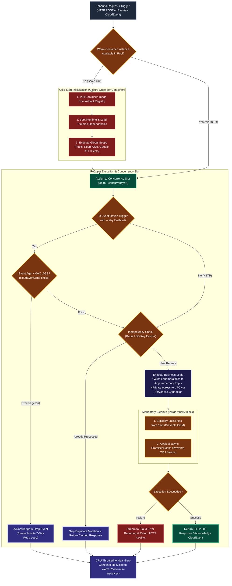

# Cloud Run Functions: Official Reference Links & Resources

This document provides curated links to official Google Cloud documentation, CLI references, Cloud Buildpack specifications, and production best practices for **Google Cloud Run Functions**.

---

## 1. Official Documentation Links

| Resource Title | URL Link | Description |
| :--- | :--- | :--- |
| **Cloud Run Functions Overview** | [cloud.google.com/functions/docs](https://cloud.google.com/functions/docs) | Official landing page for Google Cloud Run Functions documentation. |
| **Deploying from Source Code** | [cloud.google.com/functions/docs/deploy](https://cloud.google.com/functions/docs/deploy) | Step-by-step guides for deploying from local files, Cloud Storage, and repositories. |
| **`gcloud functions deploy` Reference** | [cloud.google.com/sdk/gcloud/reference/functions/deploy](https://cloud.google.com/sdk/gcloud/reference/functions/deploy) | Complete CLI command specification and parameter dictionary. |
| **Cloud Run Functions IAM Roles** | [cloud.google.com/functions/docs/concepts/iam](https://cloud.google.com/functions/docs/concepts/iam) | Guide on Developer roles, runtime service accounts, and service agent permissions. |
| **Cloud Build Integration & Buildpacks** | [cloud.google.com/build/docs/building-with-buildpacks](https://cloud.google.com/build/docs/building-with-buildpacks) | Details on how Google Cloud Buildpacks automatically compile container images. |
| **Artifact Registry Integration** | [cloud.google.com/artifact-registry/docs/docker/manage-images](https://cloud.google.com/artifact-registry/docs/docker/manage-images) | Managing compiled container images and software artifacts. |
| **Cloud Code IDE Extension** | [cloud.google.com/code/docs](https://cloud.google.com/code/docs) | Using Cloud Code in VS Code and IntelliJ to create, run, and debug functions. |
| **Eventarc Triggers Guide** | [cloud.google.com/eventarc/docs/run/create-trigger](https://cloud.google.com/eventarc/docs/run/create-trigger) | Configuring event-driven CloudEvent triggers across 130+ GCP event sources. |
| **Connecting to Memorystore (Redis)** | [cloud.google.com/functions/docs/networking/connecting-redis](https://cloud.google.com/functions/docs/networking/connecting-redis) | Configuring Serverless VPC Access to securely connect functions to Memorystore Redis and Memcached. |
| **Using Environment Variables** | [cloud.google.com/functions/docs/configuring/env-var](https://cloud.google.com/functions/docs/configuring/env-var) | Setting and reading runtime and buildpack environment variables via CLI and YAML configs. |
| **Firestore Triggers (Native Mode)** | [cloud.google.com/functions/docs/calling/cloud-firestore](https://cloud.google.com/functions/docs/calling/cloud-firestore) | Handling document create, update, delete, and write events via Eventarc CloudEvents. |
| **Using Secrets from Secret Manager** | [cloud.google.com/functions/docs/configuring/secrets](https://cloud.google.com/functions/docs/configuring/secrets) | Mounting secrets as volume files or environment variables with automatic rotation and cross-project access. |
| **Serverless VPC Access Guide** | [cloud.google.com/vpc/docs/configure-serverless-vpc-access](https://cloud.google.com/vpc/docs/configure-serverless-vpc-access) | Dedicated `/28` CIDR allocation, region constraints, and lifecycle management for VPC connectors. |
| **BigQuery Remote Functions Overview** | [cloud.google.com/bigquery/docs/remote-functions](https://cloud.google.com/bigquery/docs/remote-functions) | Direct integration between BigQuery Google Standard SQL and Cloud Run functions via `CLOUD_RESOURCE` connections. |
| **BigQuery Remote Functions Tutorial** | [cloud.google.com/bigquery/docs/remote-functions-tutorial](https://cloud.google.com/bigquery/docs/remote-functions-tutorial) | Step-by-step tutorial implementing remote functions with Cloud Run functions. |
| **BigQuery Cloud Resource Connections** | [cloud.google.com/bigquery/docs/create-cloud-resource-connection](https://cloud.google.com/bigquery/docs/create-cloud-resource-connection) | Configuring Google-managed service accounts for delegated external resource access. |
| **BigQuery CREATE FUNCTION Statement** | [cloud.google.com/bigquery/docs/reference/standard-sql/data-definition-language#create_function_statement](https://cloud.google.com/bigquery/docs/reference/standard-sql/data-definition-language#create_function_statement) | Standard SQL DDL specification for remote UDFs using `REMOTE WITH CONNECTION`. |
| **BigQuery User-Defined Functions (UDF)** | [cloud.google.com/bigquery/docs/reference/standard-sql/user-defined-functions](https://cloud.google.com/bigquery/docs/reference/standard-sql/user-defined-functions) | Operational rules, constraints, and syntax for SQL and external UDFs in BigQuery. |
| **`bq` CLI Command Reference** | [cloud.google.com/bigquery/docs/reference/bq-cli-reference](https://cloud.google.com/bigquery/docs/reference/bq-cli-reference) | Command line parameters for `bq mk --connection`, `bq show`, and query execution. |

---

## 2. Comprehensive Production Best Practices Guide

This section codifies the enterprise engineering best practices for building, optimizing, securing, and operating Google Cloud Run Functions (2nd Generation).

---

### 2.0 End-to-End Execution & Lifecycle Best Practice Flow

The following architectural flow illustrates the end-to-end request lifecycle within Cloud Run functions (2nd gen), highlighting the decision branches for cold starts, concurrency allocation, in-flight execution safeguards, and graceful container recycling:



---

### 2.1 Implementation & Code Hygiene

#### 1. Idempotency & Deduplication
* **The Reality of At-Least-Once Delivery**: Both Eventarc (Pub/Sub, Cloud Storage, Firestore) and external HTTP callers may deliver events multiple times due to network retries, connection timeouts, or distributed race conditions.
* **Architecture Rule**: All functions must be **strictly idempotent** — invoking the function multiple times with the identical payload must produce the exact same system state and outcome.
* **Implementation Strategy**:
  - For event-driven functions, inspect the unique event ID (`cloudEvent.id`) or database mutation timestamps.
  - Record processed event IDs in an atomic fast cache (Memorystore Redis) or transactional database (Cloud Firestore / Cloud SQL) before executing business logic. If the ID is already present, safely acknowledge and exit.

#### 2. HTTP Response Guarantees & Timeout Cost Mitigation
* **Mandatory Response Obligation**: An HTTP function **must always return an HTTP response** (status code and body) across every logical code branch (success, validation failure, error, or fallback).
* **The Hanging Execution Anti-Pattern**: If an HTTP function omits a return statement or fails to call `res.send()` / `res.json()`, the container worker will continue executing until the `--timeout` duration expires (up to 3,600 seconds).
* **Financial & Resource Impact**: You are billed for the entire duration the function hangs waiting for a timeout, needlessly consuming concurrency slots and billing budget.

#### 3. Asynchronous Operations & Background Activity Freezing
* **CPU Throttling Mechanics**: The moment a function handler terminates (by returning an HTTP response or resolving the event handler promise), Google Cloud throttles the container's CPU allocation to near zero.
* **The Dangling Task Hazard**: Any background threads, unawaited promises, or deferred callbacks initiated during that invocation will freeze immediately.
* **Warm Container Cross-Contamination**: When a subsequent invocation arrives at the same recycled container instance, the container unfreezes. The frozen background task resumes unpredictably during the new request, leading to shared state corruption, data leakage between tenants, unhandled race conditions, and cryptic crashes.
* **Strict Rule**: Always `await` all asynchronous operations, flush logging buffers, and await all external network tasks **before** sending the response or terminating the handler.

#### 4. In-Memory `/tmp` File System Cleanup
* **The In-Memory File System (`tmpfs`)**: In Cloud Run functions, write operations to the `/tmp` directory are stored directly in the container's allocated memory (RAM), not on a persistent physical disk.
* **Gradual Memory Leaks**: Files written to `/tmp` persist across warm invocations of the same container instance. If functions generate temporary downloads, image transformations, or CSV exports without explicitly purging them, container RAM will steadily deplete.
* **Failure Mode**: The container will eventually crash with an **Out-Of-Memory (OOM)** error, forcing an abrupt container recreation and a costly cold start for the next request.
* **Cleanup Pattern**: Always delete temporary files inside a `finally` block or Python context manager (`os.remove()`, `fs.unlinkSync()`).

#### 5. Runtime Exception Handling & Process Exit Prohibitions
* **Prohibition of Manual Exits**: Never call `process.exit()` in Node.js or `sys.exit()` in Python inside function code. Calling manual exit terminates the underlying container worker process abruptly, aborting any concurrent requests being served and forcing a cold start for future invocations.
* **Uncaught Exceptions Trigger Cold Starts**: In languages with exception handling, uncaught exceptions force the runtime container to crash and restart. Future invocations must undergo a full cold start.
* **Error Reporting Integration**: Catch all operational exceptions gracefully in `try/catch` or `try/except` blocks. Format errors and stream them explicitly to **Google Cloud Error Reporting** using the client libraries (`@google-cloud/error-reporting` or `google-cloud-error-reporting`) while returning appropriate HTTP 4xx/5xx status codes.

#### 6. Local Development via Functions Framework
* **Feedback Loop Optimization**: Do not deploy code to Cloud Run simply to test minor code changes. A remote deployment cycle (source upload -> Cloud Buildpack compilation -> Artifact Registry push -> Cloud Run service deployment) introduces multi-minute feedback loops.
* **Standard Tooling**: Leverage Google's open-source **Functions Framework** (`@google-cloud/functions-framework` for Node.js, `functions-framework` for Python/Go) to run, debug, and unit test functions locally on `http://localhost:8080`.

#### 7. Open Source Portability & Data Locality
* **Knative & OCI Compatibility**: Cloud Run functions (2nd gen) are built on top of standard Open Container Initiative (OCI) images and Knative serving specifications.
* **Regulatory Compliance**: If workloads face stringent data sovereignty or geographical isolation laws where public cloud endpoints cannot be utilized, you can containerize and deploy identical function source code to on-premises Google Distributed Cloud (Anthos) or private Kubernetes clusters running Knative.

---

### 2.2 Performance Optimization & Networking

```
   COLD START (Slow: 1-5s+)                   WARM INVOCATION (Fast: <10ms)
 ┌───────────────────────────┐               ┌───────────────────────────┐
 │ 1. Pull Container Image   │               │                           │
 │ 2. Initialize Runtime     │               │  Execute Handler Directly │
 │ 3. Load Dependencies      │               │  Reusing:                 │
 │ 4. Execute Global Scope   │               │   • Database Pools        │
 │    (DB Pools, Clients)    │               │   • API Clients           │
 │ 5. Execute Handler        │               │   • Keep-Alive Sockets    │
 └─────────────┬─────────────┘               └─────────────▲─────────────┘
               │                                           │
               └──────── Container Recycled & Kept Warm ───┘
```

#### 1. Cold Start Elimination & Dependency Trimming
* **Anatomy of a Cold Start**: A cold start occurs when an invocation requires spinning up a new container instance. The latency comprises: container scheduling, runtime engine boot, dependency loading, and global variable initialization.
* **Dependency Hygiene**: Dependencies declared in `package.json` or `requirements.txt` are parsed and loaded into memory on cold start. Eliminate unused dependencies, devDependencies, and heavy monolithic libraries. Use modular tree-shaken imports (e.g., import specific AWS/GCP sub-modules instead of full SDKs).

#### 2. Global Scope Variable Caching & Connection Reuse
* **Execution Environment Recycling**: Cloud Run function instances are recycled and reused across subsequent invocations whenever possible.
* **Global Scope Instantiation**: Variables declared outside the request handler function reside in **global scope** and remain initialized across warm invocations.
* **What to Cache Globally**:
  - Relational database connection pools (Cloud SQL via Knex, Prisma, SQLAlchemy).
  - Google Cloud service client SDKs (`@google-cloud/storage`, `BigQuery`, `Firestore`).
  - Cryptographic keys and external HTTP client sessions.
* **Lazy Initialization Pattern**: If an expensive object or database connection is only used in a specific, infrequently executed conditional branch, do not initialize it globally at cold start. Initialize it lazily on first access and cache the instance in global scope for future warm hits.

#### 3. Persistent HTTP Connections & Keep-Alive
* **Socket Exhaustion Hazard**: Opening and closing a new TCP/TLS connection on every function invocation consumes substantial CPU cycles for TLS handshakes and can rapidly exhaust system socket descriptors under load.
* **Connection Pooling**: Use HTTP client sessions configured with persistent keep-alive connections (e.g., Node.js `agentkeepalive` or Python `requests.Session()`) instantiated in global scope. This reuses underlying TCP sockets across warm invocations.

#### 4. Serverless VPC Access Connectors
* **Zero-Trust Private Egress**: When functions access internal Google Cloud resources (Cloud SQL private IPs, Memorystore Redis, internal Compute Engine VMs), never route traffic over the public internet.
* **VPC Connector Binding**: Bind a dedicated Serverless VPC Access connector (`--vpc-connector`) configured with an isolated `/28` CIDR block.
* **Egress Route Optimization**: Use `--egress-settings=private-ranges-only` to ensure internal RFC 1918 traffic (10.0.0.0/8, 172.16.0.0/12, 192.168.0.0/16) routes privately through the VPC connector while outbound public API traffic routes directly via the Google edge, saving connector bandwidth.

#### 5. Baseline Warm Pool (`--min-instances`)
* Set `--min-instances=1` (or higher) on critical customer-facing APIs to maintain pre-warmed container instances at all times, completely eliminating cold starts during off-peak transitions.

---

### 2.3 Eventarc Failure Retries & Infinite Loop Mitigation

| Parameter / Metric | Operational Rule & Constraint |
| :--- | :--- |
| **Applicable Trigger Types** | **Event-driven functions only** (Pub/Sub, Cloud Storage, Firestore). Direct HTTP functions do not have automatic platform retries. |
| **Default Configuration** | **Disabled by default**. An unhandled error drops the event unless `--retry` is explicitly specified during deployment. |
| **Retry Window & Schedule** | Google Cloud automatically retries failed event executions repeatedly with exponential backoff for up to **7 days** (or until successful completion). |
| **Transient vs. Non-Transient** | Retries are engineered **strictly for transient failures** (temporary network partitions, downstream 503 Service Unavailable, connection limits). |
| **Bug Quarantine** | Code-level bugs (syntax errors, null pointer dereferences, schema mismatches) will never resolve via retries and will spin in a 7-day retry loop. Test thoroughly prior to enabling `--retry`. |

#### Infinite Retry Loop Prevention Pattern
To prevent permanent failures from trapping your function in a 7-day retry loop that inflates cloud bills, implement an **event age cutoff guard** at the top of every event-driven function:

```typescript
import * as functions from '@google-cloud/functions-framework';
import type { CloudEvent } from '@google-cloud/functions-framework';

// Node.js: Eventarc Storage Event Handler with Age Cutoff Guard
functions.cloudEvent('processStorageUpload', async (cloudEvent: CloudEvent<any>) => {
  const eventTimestamp = new Date(cloudEvent.time || '').getTime();
  const currentTimestamp = Date.now();
  const MAX_EVENT_AGE_MS = 60 * 1000; // 60 seconds age ceiling

  // 1. Defend against infinite retry loops for stale/poison events
  if (currentTimestamp - eventTimestamp > MAX_EVENT_AGE_MS) {
    console.warn(`[DEAD-LETTER] Dropping expired event ${cloudEvent.id} created at ${cloudEvent.time}`);
    return; // Returning resolves the invocation successfully and drops the event
  }

  // 2. Wrap transient business logic in managed error handling
  try {
    await processDataPayload(cloudEvent.data);
  } catch (err: any) {
    if (isTransientError(err)) {
      console.error(`Transient error encountered on event ${cloudEvent.id}. Throwing to trigger retry:`, err);
      throw err; // Rethrowing signals Eventarc to backoff and retry
    } else {
      console.error(`Non-transient poison pill error on event ${cloudEvent.id}. Acknowledging to discard:`, err);
      return; // Swallow permanent errors to avoid 7-day retry loop
    }
  }
});

function isTransientError(err: any): boolean {
  // Retry on rate limits (429) or temporary server errors (500, 503)
  return err.code === 'ECONNRESET' || err.code === 'ETIMEDOUT' || err.status === 429 || err.status >= 500;
}
```

---

### 2.4 Configuration, Security & Concurrency

```
                   CONCURRENCY TUNING (GEN 2 / CLOUD RUN)
  ┌────────────────────────────────────────────────────────────────────────┐
  │ Single-Concurrency (Default: --concurrency=1)                          │
  │ Request 1 ──► [ Instance 1 (CPU Busy) ]                                │
  │ Request 2 ──► [ Instance 2 (Cold Start / Extra Cost) ]                 │
  │                                                                        │
  │ Multi-Concurrency (Tuned: --concurrency=80 for I/O Bound Tasks)        │
  │ Request 1 ──┐                                                          │
  │ Request 2 ──┼─► [ Instance 1 (Processes requests concurrently in RAM) ]│
  │ Request 3 ──┘     Shared global connection pools & memory footprint   │
  └────────────────────────────────────────────────────────────────────────┘
```

#### 1. Identity & Access Management (Least Privilege)
* **Never Use Default Service Accounts**: Deploying functions under the Compute Engine default service account (`PROJECT_NUMBER-compute@developer.gserviceaccount.com`) exposes your project to severe privilege escalation risks because default accounts carry broad project-wide Editor permissions.
* **Dedicated User-Managed Service Accounts**: Assign a dedicated user-managed service account (`--service-account=fn-processor@PROJECT_ID.iam.gserviceaccount.com`) configured with only the precise IAM permissions needed for its operational dependencies (e.g., `roles/datastore.user` for Firestore, `roles/storage.objectViewer` for Cloud Storage).
* **Inter-Function Segmentation**: In a microservice ecosystem, never allow all functions to call all other functions. Enforce `--no-allow-unauthenticated` on internal functions and grant `roles/run.invoker` strictly to the specific caller service accounts. Authenticate inter-service calls using signed Google OpenID Connect (OIDC) ID tokens.

#### 2. Sizing Memory, CPU & Timeouts
* **Coupled Memory & CPU**: In Cloud Run functions, you do not configure CPU cores independently from memory. Allocating higher memory tiers automatically assigns higher proportional CPU shares. If a function is computationally intensive, increasing memory from 512MiB to 2GiB provides double the CPU speed.
* **Timeout Buffer**: Configure `--timeout` slightly higher than the expected 99th percentile execution time to guard against temporary downstream latency fluctuations, up to a maximum of 3,600s (60 minutes).

#### 3. Multi-Concurrency (Cloud Run Functions 2nd Gen)
* **Default Behavior**: By default, each function instance processes only **one request at a time** (`--concurrency=1`).
* **High-Throughput Concurrency**: For I/O-bound runtimes (Node.js, Python async, Go), configure multi-concurrency (`--concurrency=40` to `80`). A single warm container instance can handle dozens of concurrent requests simultaneously, dramatically reducing instance counts, avoiding cold starts, and slashing billing costs.
* **Thread-Safety Prerequisite**: Your function code must be completely stateless and thread-safe. Global variables must not store request-scoped data.

---

### 2.5 Scaling Guardrails & Revision Traffic Splitting

#### 1. Autoscaling Dynamics & Downstream Protection
* **Independent Elasticity**: Cloud Run functions scale horizontally and independently based on incoming request volume and concurrency limits.
* **Downstream Database Defense (`--max-instances`)**: Serverless functions can scale out to hundreds of instances within seconds. If those instances all open connections to a downstream relational database (Cloud SQL, PostgreSQL, MySQL), the connection limit will be instantly exhausted, crashing the database.
* **Strict Rule**: Always set `--max-instances` based on the downstream system's concurrency capacity:
  $$\text{Max Instances} \le \frac{\text{Downstream Database Max Connections}}{\text{Connection Pool Size per Instance}}$$
* **Burst & Deployment Overscaling**: Be aware that during sharp traffic spikes or while deploying new revisions, Cloud Run may temporarily exceed `--max-instances` for short intervals to ensure traffic continuity while previous container instances drain.

#### 2. Immutable Revisions, Canary Releases & Instant Rollbacks
* **Revision Immutability**: Every deployment of a Cloud Run function creates an immutable, timestamped revision of the underlying Cloud Run service. Revisions can never be edited in-place; changes require a redeployment.
* **Canary Traffic Splitting**: Instead of deploying 100% of production traffic directly to a new version, deploy with `--no-traffic` and split traffic gradually across revisions:

```bash
# 1. Deploy the new code revision without routing live production traffic
gcloud functions deploy payment-gateway \
  --gen2 \
  --region=us-central1 \
  --runtime=nodejs20 \
  --entry-point=processPayment \
  --source=./src \
  --no-traffic

# 2. Split traffic: 90% to stable revision, 10% Canary to new revision
gcloud run services update-traffic payment-gateway \
  --region=us-central1 \
  --to-revisions=payment-gateway-00001-abc=90,payment-gateway-00002-xyz=10

# 3. Instant Rollback: immediately redirect 100% traffic back to previous stable revision
gcloud run services update-traffic payment-gateway \
  --region=us-central1 \
  --to-revisions=payment-gateway-00001-abc=100
```

---

### 2.6 Enterprise Master Command Reference & Lifecycle Blueprints

Below are the production-grade, fully annotated Master Commands that enforce all performance, security, networking, concurrency, and reliability best practices in single declarative invocations.

---

#### Master Command 1: High-Throughput HTTP Microservice (All Best Practices Applied)

This blueprint configures a secure, private, multi-concurrent, warm-pooled HTTP function connected to a VPC with dynamic secrets:

```bash
gcloud functions deploy api-order-service \
  # ── 1. RUNTIME & GENERATION SPECIFICATION ────────────────────────────────
  --gen2 \
  # Enforces 2nd Generation (Cloud Run infrastructure, multi-concurrency, 60m timeout)
  --region=us-central1 \
  # Target deployment region co-located with backend databases (Cloud SQL / Firestore)
  --runtime=nodejs20 \
  # Modern runtime (nodejs20 / python312 / go122)
  --entry-point=handleOrderRequest \
  # Exact exported function symbol in source code
  --source=./dist \
  # Pre-compiled / bundled source directory (excludes node_modules via .gcloudignore)

  # ── 2. INGRESS & IDENTITY AUTHORIZATION ──────────────────────────────────
  --trigger-http \
  # Exposes an HTTPS invocation endpoint
  --no-allow-unauthenticated \
  # Zero-Trust: Rejects public internet callers; mandates IAM OIDC ID token
  --service-account=order-service-sa@my-prod-project.iam.gserviceaccount.com \
  # Dedicated least-privilege user-managed runtime service account (never default SA!)

  # ── 3. HARDWARE COUPLED SIZING & CONCURRENCY ─────────────────────────────
  --memory=1Gi \
  # Allocates 1024 MiB RAM and proportional CPU compute shares
  --cpu=1 \
  # Explicit 1 vCPU allocation to ensure deterministic processing speeds
  --timeout=60s \
  # Configures 60s execution timeout (padded beyond p99 latency to prevent hang billing)
  --concurrency=40 \
  # Allows 1 container instance to process up to 40 concurrent requests simultaneously

  # ── 4. SCALING GUARDRAILS & DOWNSTREAM PROTECTION ────────────────────────
  --min-instances=1 \
  # Eliminates cold starts: keeps at least 1 pre-warmed container ready 24/7
  --max-instances=50 \
  # Downstream guardrail: prevents connection exhaustion on Cloud SQL / Redis

  # ── 5. PRIVATE NETWORKING & ZERO-TRUST EGRESS ────────────────────────────
  --vpc-connector=projects/my-prod-project/locations/us-central1/connectors/central-vpc-conn \
  # Routes private egress into VPC subnet via Serverless VPC Access connector
  --egress-settings=private-ranges-only \
  # RFC 1918 traffic routes through connector; public internet egress routes directly

  # ── 6. SECRETS & ENVIRONMENT CONFIGURATION ───────────────────────────────
  --set-secrets=/secrets/db-password=prod-db-password:latest \
  # Volume mounts Secret Manager secret as file for automatic dynamic rotation
  --set-env-vars=ENVIRONMENT=production,NODE_ENV=production,LOG_LEVEL=info \
  # Injects non-sensitive operational environment variables

  # ── 7. ZERO-DOWNTIME CANARY DEPLOYMENT SAFETY ────────────────────────────
  --no-traffic
  # Deploys code as a new revision without immediately shifting 100% production traffic
```

---

#### Master Command 2: Resilient Eventarc Event Processor (With Retry & Loop Defense)

This blueprint configures an asynchronous Cloud Storage event-driven processor with automatic failure retries, concurrency tuning, and least-privilege identity:

```bash
gcloud functions deploy storage-event-processor \
  # ── 1. RUNTIME & GENERATION ──────────────────────────────────────────────
  --gen2 \
  --region=us-central1 \
  --runtime=python312 \
  --entry-point=process_gcs_event \
  --source=./src \

  # ── 2. EVENTARC TRIGGER BINDING & FAILURE RETRIES ────────────────────────
  --trigger-event-filters="type=google.cloud.storage.object.v1.finalized" \
  --trigger-event-filters="bucket=my-prod-incoming-bucket" \
  # Automatically provisions Eventarc trigger on Cloud Storage bucket finalization
  --retry \
  # Enables automatic platform retries with exponential backoff for up to 7 days

  # ── 3. SECURITY & COMPUTE SIZING ─────────────────────────────────────────
  --service-account=storage-processor-sa@my-prod-project.iam.gserviceaccount.com \
  --memory=2Gi \
  --cpu=2 \
  --timeout=300s \
  --concurrency=10 \
  # Multi-concurrency tuned for async Python I/O pipelines

  # ── 4. SCALING BOUNDARIES & PRIVATE CONNECTIVITY ─────────────────────────
  --min-instances=0 \
  # Scale-to-zero enabled for cost-optimized asynchronous batch processing
  --max-instances=30 \
  # Caps peak concurrent instances to avoid throttling downstream BigQuery APIs
  --vpc-connector=projects/my-prod-project/locations/us-central1/connectors/central-vpc-conn \
  --egress-settings=private-ranges-only \
  --set-secrets=/secrets/api-key=third-party-api-key:latest \
  --set-env-vars=ENV=prod,MAX_EVENT_AGE_SECONDS=60
```

---

#### Master Parameter Reference Matrix

| CLI Parameter Flag | Category | Production Best-Practice Default | Architectural Purpose & Operational Justification |
| :--- | :--- | :--- | :--- |
| `--gen2` | Architecture | Required | Mandates Cloud Run functions (2nd gen), unlocking 60m timeout, multi-concurrency, and Eventarc. |
| `--no-allow-unauthenticated` | Security | Mandatory | Enforces Zero-Trust identity; callers must provide an OIDC token with `roles/run.invoker`. |
| `--service-account` | Security | User-Managed SA | Never use default Compute Engine SA; grants minimal IAM roles required for the function. |
| `--concurrency` | Performance | `40` – `80` (I/O) / `1` (CPU) | Allows single container to serve multiple requests concurrently, eliminating cold starts & lowering cost. |
| `--min-instances` | Resilience | `1` (APIs) / `0` (Batch) | Keeps pre-warmed instance baseline active to eliminate cold-start latency spikes. |
| `--max-instances` | Resilience | Sized to DB pool | Prevents autoscaling floods from crashing downstream Cloud SQL or Memorystore Redis. |
| `--timeout` | Reliability | Padded p99 (e.g. `60s`) | Prevents early cutoff during network jitter; mitigates hanging executions that bill until cap. |
| `--retry` | Reliability | Enabled on Events | Enables 7-day exponential retry on transient network errors (requires timestamp age cutoff guard). |
| `--vpc-connector` | Networking | Active `/28` Connector | Directs traffic to private RFC 1918 subnets without exposing database ports to the internet. |
| `--egress-settings` | Networking | `private-ranges-only` | Sends only internal traffic through connector; external API calls route via high-speed Google edge. |
| `--set-secrets` | Security | File mount (`/path=...`) | Enables zero-downtime secret rotation without requiring container re-compilation or deployment. |
| `--no-traffic` | Operations | Recommended for CI/CD | Creates an immutable revision without routing live traffic, enabling safe Canary testing. |

---

#### Canary Traffic Rollout & Zero-Downtime Rollback Workflow

Once deployed with `--no-traffic`, manage traffic splitting and rollbacks via the underlying Cloud Run service commands:

```bash
# 1. Inspect all active revisions and their current traffic percentage
gcloud run services describe api-order-service \
  --region=us-central1 \
  --format="table(status.traffic.revisionName,status.traffic.percent)"

# 2. Canary Split: Route 90% traffic to stable revision, 10% to new revision
gcloud run services update-traffic api-order-service \
  --region=us-central1 \
  --to-revisions=api-order-service-00001-abc=90,api-order-service-00002-xyz=10

# 3. Monitor Cloud Logging & Error Reporting for errors in new revision:
gcloud logging read \
  'resource.type="cloud_run_revision" AND resource.labels.service_name="api-order-service" AND severity>=ERROR' \
  --limit=20 \
  --format="json(timestamp,textPayload)"

# 4A. PROMOTION: If Canary is healthy, shift 100% traffic to latest revision
gcloud run services update-traffic api-order-service \
  --region=us-central1 \
  --to-latest

# 4B. EMERGENCY ROLLBACK: If errors spike, instantly route 100% back to stable revision (<1s)
gcloud run services update-traffic api-order-service \
  --region=us-central1 \
  --to-revisions=api-order-service-00001-abc=100
```


