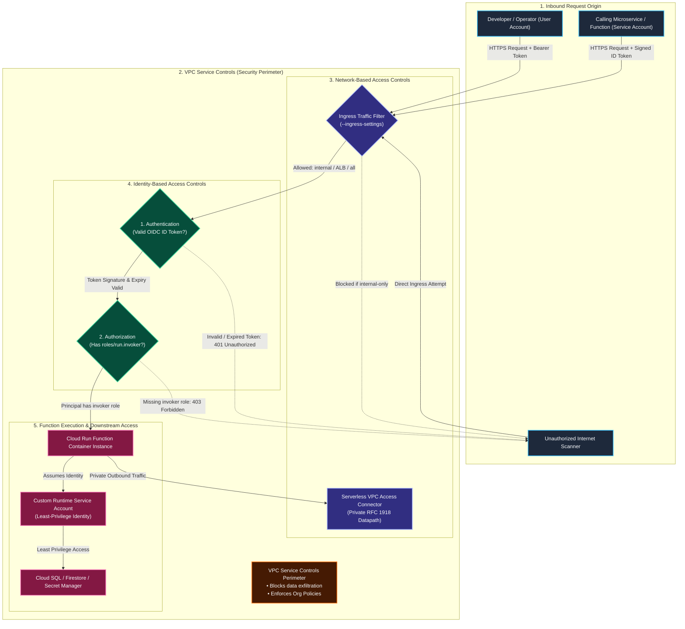
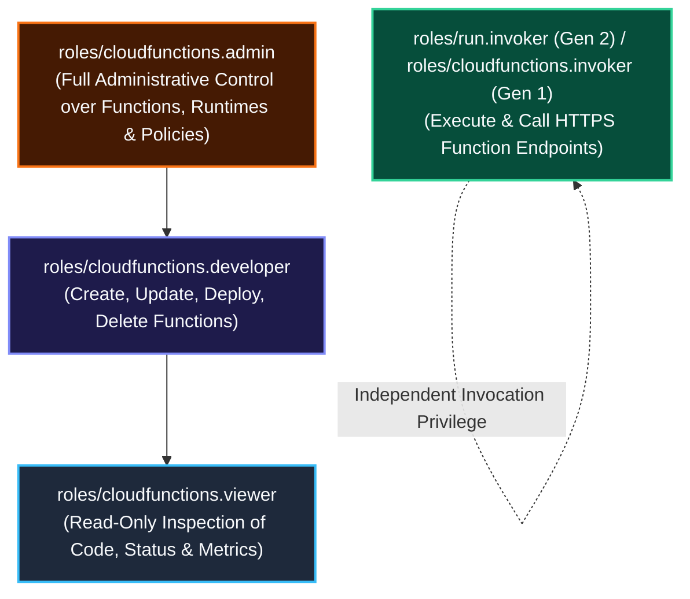
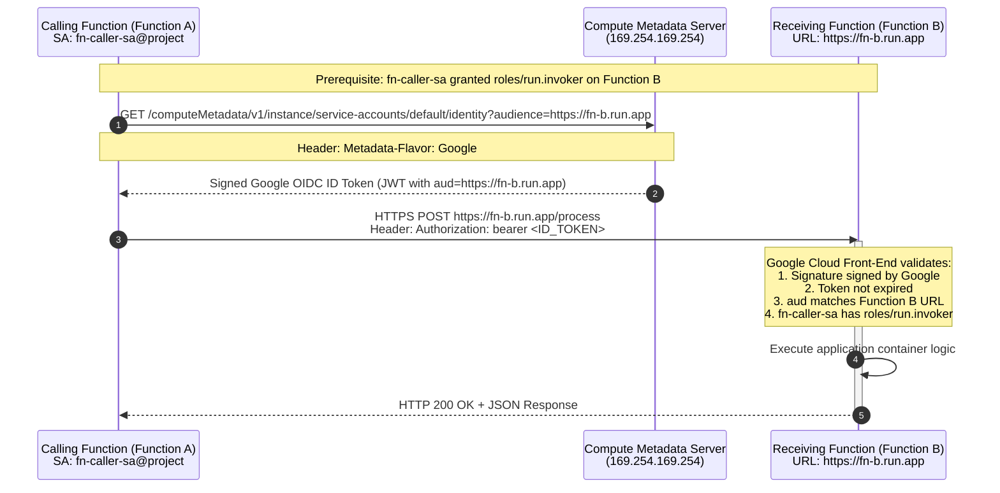
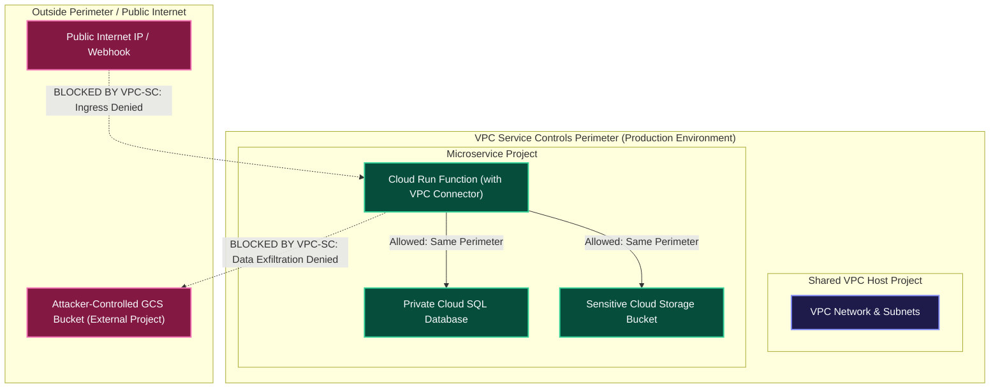
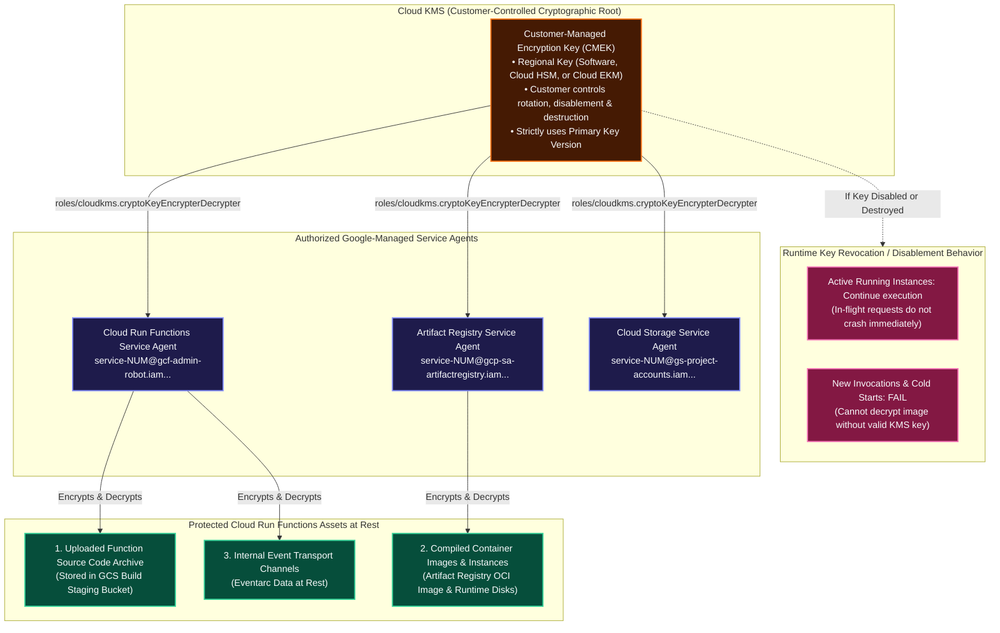
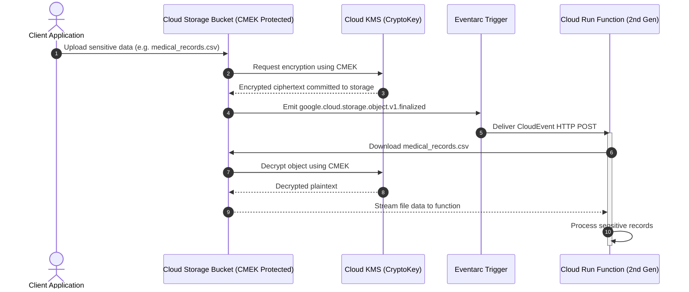

# Cloud Run Functions: Security, IAM & Zero-Trust Network Controls Manual

A comprehensive engineering guide detailing **Identity-Based Access Controls**, **OIDC Token Authentication**, **Service-to-Service Function Security**, **Network Ingress/Egress Isolation**, and **VPC Service Controls (VPC-SC)** for Google Cloud Run Functions (2nd Gen).

---

## 1. Zero-Trust Security Architecture

Securing Cloud Run functions follows Google Cloud's **Defense-in-Depth** and **Zero-Trust** security models. Protection is enforced at two distinct validation perimeters: **Identity-Based Access Controls** (Layer 7 Authentication & Authorization) and **Network-Based Access Controls** (Layer 3/4 Ingress & Egress Boundaries).



---

## 2. Authentication vs. Authorization

Access control is evaluated as a strict two-phase handshake:

```
+-----------------------------------------------------------------------------------+
| 1. AUTHENTICATION (AuthN)            | 2. AUTHORIZATION (AuthZ)                    |
| "Who are you?"                       | "What are you permitted to do?"             |
| Validates credentials & signatures   | Evaluates IAM roles & policy permissions    |
+-----------------------------------------------------------------------------------+
| • Verifies cryptographically signed  | • Evaluates if the authenticated identity   |
|   Google OIDC ID Token or Access     |   has been granted `roles/run.invoker`      |
|   Token passed in the request.       |   on the target function.                   |
| • Fails with: HTTP 401 Unauthorized  | • Fails with: HTTP 403 Forbidden            |
+-----------------------------------------------------------------------------------+
```

### Identity Types Supported
1. **User Accounts**:
   - Represents humans: individual Google accounts (`developer@company.com`) or Google Workspace / Cloud Identity groups (`devops-team@company.com`).
   - Primarily utilized during local development, staging testing, and emergency debugging.
2. **Service Accounts**:
   - Represents non-human workloads: applications, VMs, CI/CD runners, or other Cloud Run functions.
   - Format: `account-name@PROJECT_ID.iam.gserviceaccount.com`.

---

## 3. Token-Based Authentication: Access Tokens vs. ID Tokens

To prevent catastrophic credential compromise if a password or private key leaks, Cloud Run functions exclusively relies on **short-lived tokens** issued via OAuth 2.0 and OpenID Connect (OIDC).

| Architectural Dimension | OAuth 2.0 Access Tokens | OpenID Connect (OIDC) ID Tokens |
| :--- | :--- | :--- |
| **Primary Purpose** | Authenticating to Google Cloud REST APIs. | Authenticating to **developer-deployed code** (Cloud Run functions, Cloud Run, custom webhooks). |
| **Data Format** | Opaque string or internal Google token format. | Standardized **JWT (JSON Web Token)** containing header, claims payload, and cryptographic RSA signature. |
| **Key Claims Evaluated** | Scopes (`https://www.googleapis.com/auth/...`). | `iss` (accounts.google.com), `sub` (principal ID), `email`, `exp` (expiration), and **`aud` (audience URL)**. |
| **Generation Command** | `gcloud auth print-access-token` | `gcloud auth print-identity-token --audiences=...` |
| **Target Service** | Calling `cloudfunctions.googleapis.com`, `storage.googleapis.com`. | Calling `https://my-service.a.run.app` or `https://region-project.cloudfunctions.net/fn`. |

---

## 4. Cloud Run Functions IAM Roles Hierarchy

Administrative operations (creating, editing, and deleting functions) and invocation actions are segregated across distinct predefined IAM roles:



### Predefined Roles Breakdown:
1. **`roles/cloudfunctions.admin`**:
   - Full control over all Cloud Functions resources, IAM access policies, runtimes, and quotas.
2. **`roles/cloudfunctions.developer`**:
   - Create, deploy, update, and delete functions.
   - **Critical Prerequisite**: The developer must also possess the `roles/iam.serviceAccountUser` role on the function's runtime service account to attach it to the function ("ActAs" privilege).
3. **`roles/run.invoker` (Gen 2) / `roles/cloudfunctions.invoker` (Gen 1)**:
   - Grants permissions to invoke the function via its HTTPS endpoint.
   - Can be scoped globally to the project, or granularly bound to an individual function.
4. **`roles/cloudfunctions.viewer`**:
   - Read-only access to view deployed functions, source code configuration, and Cloud Logging streams without permissions to execute or modify code.

---

## 5. Service-to-Service Authentication (Function-to-Function)

When building microservice architectures where `Function A` (Calling Function) must securely invoke `Function B` (Receiving Function), strict zero-trust identity verification is required.



### Critical Rules for Service-to-Service Calls:
1. **Audience (`aud`) Strict Matching**:
   - When generating the ID token, the `audience` claim **must exactly match the base URL of the receiving function** (`https://<receiving-function-url>`).
   - If the token audience does not match, Cloud Run automatically rejects the request with **HTTP 401 Unauthorized**.
2. **Dedicated Invoker Binding**:
   - Grant `roles/run.invoker` strictly to `fn-caller-sa@project.iam.gserviceaccount.com` on `Function B`, preventing any other service from invoking it.

---

## 6. Runtime Service Accounts: Best Practices & Least Privilege

Every function executes under a designated **Runtime Service Account** that determines what Google Cloud resources (Firestore, Cloud SQL, BigQuery, Pub/Sub) the function's code can access.

```
+-----------------------------------------------------------------------------------+
| ❌ ANTIPATTERN (Default Compute Service Account)                                  |
| PROJECT_NUMBER-compute@developer.gserviceaccount.com                              |
| • Automatically assigned if --service-account is omitted.                         |
| • Granted the broad `Editor` role on the entire GCP project by default.           |
| • Severe Security Risk: If function code is vulnerable to Remote Code Execution   |
|   (RCE) or SSRF, attackers gain administrative access across the entire project! |
+-----------------------------------------------------------------------------------+
| ✅ ENTERPRISE STANDARD (Dedicated Least-Privilege Service Account)                |
| my-fn-sa@PROJECT_ID.iam.gserviceaccount.com                                       |
| • Provisioned specifically for one function or bounded microservice.              |
| • Granted strictly the minimum permissions required (e.g., read-only on 1 bucket).|
| • Zero administrative access outside its designated scope.                        |
+-----------------------------------------------------------------------------------+
```

---

## 7. Network-Based Access Controls (Ingress & Egress)

Network access controls restrict traffic flow at the IP and network perimeter layers, operating completely independently of IAM identity tokens.

### 7.1 Ingress Settings (Inbound Exposure)
Controls which network locations can establish TCP/HTTPS connections to the function:

| Ingress Flag Setting | Permitted Inbound Traffic Sources |
| :--- | :--- |
| `--ingress-settings=all` | Public internet, any external IP, VPC networks, and Google Cloud services. *(Default)* |
| `--ingress-settings=internal-only` | Traffic originating from **VPC networks in the same project**, VPC networks within the same VPC Service Controls perimeter, and **Google Cloud Workflows**. Direct internet requests return HTTP 403 Forbidden. |
| `--ingress-settings=internal-and-cloud-load-balancing` | Traffic routed through an **External Application Load Balancer (ALB)** guarded by **Google Cloud Armor WAF**, OR internal VPC traffic. Blocks direct `.run.app` invocations over the public internet. |

### 7.2 Egress Settings (Outbound Routing)
Controls outbound traffic routing through a Serverless VPC Access connector or Direct VPC Egress:
- `--vpc-egress=private-ranges-only`: Only RFC 1918 traffic (`10.0.0.0/8`, `172.16.0.0/12`, `192.168.0.0/16`) enters the VPC. Internet traffic exits via Google's gateway.
- `--vpc-egress=all-traffic`: **100% of outbound traffic** is routed through the customer VPC. This forces external internet traffic through a **Cloud NAT Gateway with a fixed static IP address**, enabling whitelisting by corporate firewalls.

---

## 8. VPC Service Controls (VPC-SC) & Organization Policies

**VPC Service Controls** establishes an impermeable cryptographic security perimeter around Google Cloud resources to prevent accidental or malicious **data exfiltration**.



### 8.1 Enforcing Security with Organization Policies
Inside a VPC Service Controls perimeter, organization policies enforce mandatory network settings:
1. **`constraints/cloudfunctions.allowedIngressSettings`**: Restricts functions to `internal-only` or `internal-and-cloud-load-balancing`, prohibiting public internet endpoints.
2. **`constraints/cloudfunctions.requireVpcConnector`**: Mandates that every deployed function must be attached to a Serverless VPC Access connector.
3. **`constraints/cloudfunctions.allowedVpcEgressSettings`**: Forces functions to use `all-traffic` egress, preventing any direct egress to the public internet.

---

## 9. Production CLI Commands for Security & IAM

### 9.1 Authorizing Public vs. Authenticated Ingress

```bash
export FUNCTION_NAME="payment-service"
export REGION="us-central1"

# ── MAKE FUNCTION PUBLIC (UNAUTHENTICATED) ─────────────────────────────────
gcloud functions add-iam-policy-binding ${FUNCTION_NAME} \
  --region=${REGION} \
  --member="allUsers" \
  --role="roles/run.invoker"

# ── REMOVE PUBLIC ACCESS (ENFORCE AUTHENTICATION) ──────────────────────────
gcloud functions remove-iam-policy-binding ${FUNCTION_NAME} \
  --region=${REGION} \
  --member="allUsers" \
  --role="roles/run.invoker"
```

---

### 9.2 Authorizing Calling Service Account (Function-to-Function Invoker)

```bash
export CALLING_SA="order-orchestrator-sa@my-prod-project.iam.gserviceaccount.com"
export RECEIVING_FUNCTION="inventory-validator"

# Grant Calling Service Account permission to invoke Receiving Function
gcloud functions add-iam-policy-binding ${RECEIVING_FUNCTION} \
  --region=${REGION} \
  --member="serviceAccount:${CALLING_SA}" \
  --role="roles/run.invoker"
```

---

### 9.3 Developer Testing: Invoking Authenticated Function with OIDC Token

```bash
# 1. Retrieve the target function HTTPS endpoint
export FUNCTION_URL=$(gcloud functions describe ${RECEIVING_FUNCTION} \
  --region=${REGION} \
  --format="value(serviceConfig.uri)")

# 2. Generate Google-signed OIDC ID token with audience matching target URL
export ID_TOKEN=$(gcloud auth print-identity-token --audiences="${FUNCTION_URL}")

# 3. Invoke function passing ID token in Authorization header
curl -X POST "${FUNCTION_URL}" \
  -H "Authorization: bearer ${ID_TOKEN}" \
  -H "Content-Type: application/json" \
  -d '{"itemId": "SKU-994", "quantity": 2}'
```

---

### 9.4 Generating ID Tokens Programmatically (Python & Node.js)

#### Python Implementation (`google-auth`):
```python
import urllib.request
import google.auth.transport.requests
import google.oauth2.id_token

def call_private_function(target_function_url, payload_json):
    # 1. Obtain authenticated HTTP request transport
    auth_req = google.auth.transport.requests.Request()
    
    # 2. Fetch OIDC ID token with audience set to target function URL
    id_token = google.oauth2.id_token.fetch_id_token(auth_req, target_function_url)
    
    # 3. Construct request with Authorization header
    req = urllib.request.Request(
        target_function_url,
        data=payload_json.encode('utf-8'),
        headers={
            'Authorization': f'bearer {id_token}',
            'Content-Type': 'application/json'
        }
    )
    
    with urllib.request.urlopen(req) as response:
        return response.read().decode('utf-8')
```

#### Node.js Implementation (`google-auth-library`):
```javascript
const { GoogleAuth } = require('google-auth-library');
const auth = new GoogleAuth();

async function callPrivateFunction(targetFunctionUrl, payloadData) {
  // Obtain client configured with target audience
  const client = await auth.getIdTokenClient(targetFunctionUrl);
  
  // Dispatch authenticated request automatically attaching ID token
  const res = await client.request({
    url: targetFunctionUrl,
    method: 'POST',
    data: payloadData,
  });
  
  return res.data;
}
```

---

### 9.5 Deploying Function with Dedicated Runtime SA & Ingress Controls

```bash
gcloud functions deploy secure-vault-service \
  --gen2 \
  --region=us-central1 \
  --runtime=nodejs20 \
  --entry-point=processSecret \
  --source=. \
  --trigger-http \
  --no-allow-unauthenticated \
  --service-account=vault-runner-sa@my-prod-project.iam.gserviceaccount.com \
  --ingress-settings=internal-and-cloud-load-balancing \
  --vpc-connector=projects/my-prod-project/locations/us-central1/connectors/secure-vpc-conn \
  --vpc-egress=all-traffic
```

---

## 10. Data Protection at Rest with Customer-Managed Encryption Keys (CMEK)

While Google Cloud encrypts all customer data at rest by default using Google-managed keys, compliance mandates (HIPAA, PCI-DSS, FedRAMP) often demand **Customer-Managed Encryption Keys (CMEK)** managed via **Google Cloud Key Management Service (KMS)**.

CMEK ensures that the customer retains complete cryptographic ownership over the encryption keys. If the customer disables, revokes, or destroys the key, access to the encrypted data is revoked immediately across Google Cloud infrastructure.



---

### 10.1 Types of Function Data Encrypted by CMEK

When CMEK is enabled on a Cloud Run function, Google Cloud encrypts three core categories of data at rest:
1. **Function Source Code Archive**: The source code uploaded for deployment, stored in the Cloud Storage build staging bucket.
2. **Build Results & Container Images**: The compiled OCI container images stored in Artifact Registry and the disk images backing each deployed function instance.
3. **Internal Event Transport Channels**: Data at rest for internal event delivery queues and Eventarc triggers.

---

### 10.2 Four-Step CMEK Implementation Workflow

To deploy a Cloud Run function protected with CMEK, complete the following prerequisites in order:

#### Step 1: Create a Single-Region KMS Key
* Cloud Run functions requires a **single-region key**. Multi-region or global keys are not supported.
* The key must reside in the **exact same region** as the Cloud Run function.

#### Step 2: Provision a CMEK-Enabled Artifact Registry Repository
* Create an Artifact Registry Docker repository with CMEK encryption enabled.
* **Strict Rule**: You must configure the repository with the **exact same KMS key** that is used for the Cloud Run function.

#### Step 3: Grant KMS Decryption Permissions to Required Service Agents
The `roles/cloudkms.cryptoKeyEncrypterDecrypter` role must be granted to three distinct Google-managed service identities:
1. **Cloud Run Functions Service Agent**:
   `service-PROJECT_NUMBER@gcf-admin-robot.iam.gserviceaccount.com`
2. **Artifact Registry Service Agent**:
   `service-PROJECT_NUMBER@gcp-sa-artifactregistry.iam.gserviceaccount.com`
3. **Cloud Storage Service Agent**:
   `service-PROJECT_NUMBER@gs-project-accounts.iam.gserviceaccount.com`

#### Step 4: Deploy Function Specifying Key & Repository
Deploy the function passing the `--kms-key` and `--docker-repository` flags.

---

### 10.3 Key Versioning & Revocation Mechanics

1. **Primary Key Version Constraint**:
   - Cloud Run functions **always uses the primary version** of the KMS key for CMEK protection.
   - You **cannot specify a specific key version** (e.g. `/cryptoKeyVersions/2`) during deployment.
2. **Impact of Disabling or Destroying a CMEK Key**:
   - **Active Instances**: Instances of functions already booted and running are **not shut down immediately**. Executions currently in progress will complete.
   - **New Executions**: Any invocation requiring a new instance (cold start, traffic autoscaling spike) will **fail immediately** with an internal decryption error.
   - **Re-enablement**: Re-enabling the key in Cloud KMS restores normal scaling and execution without redeploying the function.

---

### 10.4 Cloud Storage CMEK & Eventarc Integration Pattern

A common enterprise pattern involves storing sensitive files in Cloud Storage buckets encrypted with CMEK and triggering Cloud Run functions via Eventarc:



---

### 10.5 Production CLI Runbook for CMEK Configuration

```bash
export PROJECT_ID=$(gcloud config get-value project)
export PROJECT_NUMBER=$(gcloud projects describe ${PROJECT_ID} --format="value(projectNumber)")
export REGION="us-central1"
export KEYRING_NAME="fn-keyring-${REGION}"
export KEY_NAME="fn-cmek-key"

# ── STEP 1: CREATE KMS KEY RING & REGIONAL CRYPTOKEY ───────────────────────

# Create regional key ring
gcloud kms keyrings create ${KEYRING_NAME} \
  --location=${REGION}

# Create symmetric encryption key in key ring
gcloud kms keys create ${KEY_NAME} \
  --location=${REGION} \
  --keyring=${KEYRING_NAME} \
  --purpose=encryption \
  --protection-level=software

export KMS_KEY_ID="projects/${PROJECT_ID}/locations/${REGION}/keyRings/${KEYRING_NAME}/cryptoKeys/${KEY_NAME}"

# ── STEP 2: CREATE CMEK-ENABLED ARTIFACT REGISTRY REPOSITORY ───────────────

gcloud artifacts repositories create gcf-cmek-repo \
  --repository-format=docker \
  --location=${REGION} \
  --kms-key=${KMS_KEY_ID} \
  --description="CMEK Encrypted Docker Repository for Cloud Run Functions"

export DOCKER_REPO="projects/${PROJECT_ID}/locations/${REGION}/repositories/gcf-cmek-repo"

# ── STEP 3: GRANT KMS ROLES TO SERVICE AGENTS ──────────────────────────────

# 1. Cloud Run Functions Service Agent
export GCF_SA="service-${PROJECT_NUMBER}@gcf-admin-robot.iam.gserviceaccount.com"
gcloud kms keys add-iam-policy-binding ${KEY_NAME} \
  --location=${REGION} \
  --keyring=${KEYRING_NAME} \
  --member="serviceAccount:${GCF_SA}" \
  --role="roles/cloudkms.cryptoKeyEncrypterDecrypter"

# 2. Artifact Registry Service Agent
export AR_SA="service-${PROJECT_NUMBER}@gcp-sa-artifactregistry.iam.gserviceaccount.com"
gcloud kms keys add-iam-policy-binding ${KEY_NAME} \
  --location=${REGION} \
  --keyring=${KEYRING_NAME} \
  --member="serviceAccount:${AR_SA}" \
  --role="roles/cloudkms.cryptoKeyEncrypterDecrypter"

# 3. Cloud Storage Service Agent
export GCS_SA="service-${PROJECT_NUMBER}@gs-project-accounts.iam.gserviceaccount.com"
gcloud kms keys add-iam-policy-binding ${KEY_NAME} \
  --location=${REGION} \
  --keyring=${KEYRING_NAME} \
  --member="serviceAccount:${GCS_SA}" \
  --role="roles/cloudkms.cryptoKeyEncrypterDecrypter"

# ── STEP 4: DEPLOY FUNCTION WITH CMEK PROTECTION ───────────────────────────

gcloud functions deploy secure-cmek-service \
  --gen2 \
  --region=${REGION} \
  --runtime=nodejs20 \
  --entry-point=processData \
  --source=. \
  --trigger-http \
  --no-allow-unauthenticated \
  --kms-key=${KMS_KEY_ID} \
  --docker-repository=${DOCKER_REPO}
```
