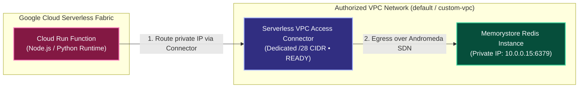
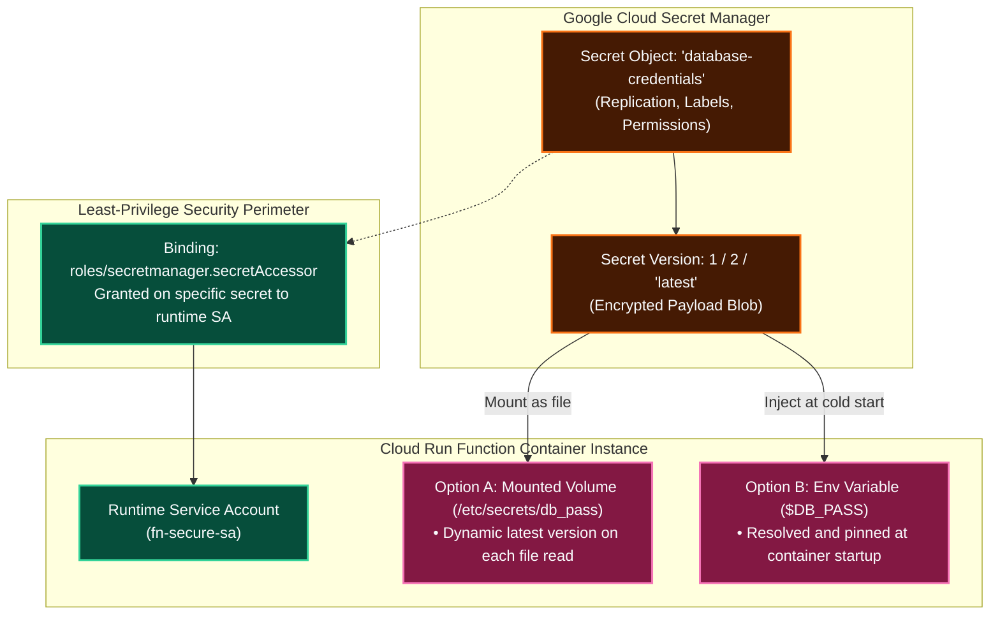

# Cloud Run Functions (`gcloud functions`) Production Command Reference

A comprehensive, production-grade CLI manual for building, deploying, and managing **Google Cloud Run Functions (2nd Generation)**. Every command is structured into logical architectural sections (`# ── SECTION ──`), with explicit breakdowns of valid values, data formats, enums, units, and security trade-offs.

---

## 1. Project Prerequisites & API Activation

Cloud Run functions (2nd gen) executes builds via Cloud Build and provisions serverless containers on Cloud Run, requiring core service APIs to be active in your project before initial deployment.

```bash
# Enable required Google Cloud Service APIs
gcloud services enable \
  cloudfunctions.googleapis.com \
  run.googleapis.com \
  cloudbuild.googleapis.com \
  artifactregistry.googleapis.com \
  eventarc.googleapis.com \
  logging.googleapis.com \
  storage.googleapis.com
```

---

## 2. Comprehensive `gcloud functions deploy` Master Command

The master command below demonstrates an enterprise-grade, fully annotated deployment of a 2nd-generation Cloud Run function.

```bash
gcloud functions deploy order-processing-service \
  # ── GENERATION & REGIONAL SCOPE ──────────────────────────────────────────
  --gen2 \
  # Flag: Enables 2nd generation (Cloud Run functions).
  # Required for: 60-minute execution timeouts, concurrency, and Eventarc.
  --region=us-central1 \
  # String: Target Google Cloud deployment region.
  # Values: us-central1, us-east1, europe-west1, asia-east1, etc.
  # Best practice: Co-locate with primary databases (Firestore, Cloud SQL).

  # ── RUNTIME & ENTRY POINT SPECIFICATION ──────────────────────────────────
  --runtime=nodejs20 \
  # String: Target language runtime environment.
  # Values:
  #   Node.js:  nodejs18, nodejs20, nodejs22
  #   Python:   python310, python311, python312
  #   Go:       go121, go122
  #   Java:     java11, java17, java21
  #   .NET:     dotnet6, dotnet8
  #   Ruby:     ruby32
  #   PHP:      php82, php83
  --entry-point=processOrder \
  # String: Name of function or class in source code executed on invocation.
  # Node.js: Exported function name in index.js (e.g., exports.processOrder).
  # Python: Function name defined in main.py (e.g., def process_order(request):).

  # ── SOURCE CODE INGESTION ────────────────────────────────────────────────
  --source=. \
  # Path/URI: Location of function source code.
  # Valid values:
  #   1. Local filesystem directory: "." or "./src/service"
  #   2. Cloud Storage ZIP: "gs://my-bucket/artifacts/source.zip"
  #   3. Source Repo: "https://source.developers.google.com/p/PROJ/r/REPO/revisions/main/paths/src"
  --stage-bucket=my-prod-gcf-staging-bucket \
  # Bucket name (optional): Cloud Storage bucket for uploading source archives.
  # Omit to let Google Cloud provision and manage a default staging bucket.

  # ── INGRESS & TRIGGER DEFINITION ─────────────────────────────────────────
  --trigger-http \
  # Flag: Configures HTTP/HTTPS endpoint trigger.
  # Alternatives:
  #   --trigger-topic=TOPIC_NAME (Pub/Sub trigger)
  #   --trigger-event-filters="type=google.cloud.storage.object.v1.finalized"
  --allow-unauthenticated \
  # Flag: Allows public, unauthenticated invocations over the public internet.
  # Enterprise alternative:
  #   --no-allow-unauthenticated (Requires IAM Cloud Run Invoker or OIDC token)

  # ── RUNTIME SERVICE ACCOUNT & SECURITY ───────────────────────────────────
  --service-account=order-fn-sa@my-gcp-project.iam.gserviceaccount.com \
  # Email: Custom IAM Service Account used by the running container.
  # Default (if omitted): Default Compute Engine Service Account (over-privileged!).
  # Security rule: Always use a dedicated least-privilege service account.

  # ── HARDWARE RESOURCES & CONCURRENCY SCALING ─────────────────────────────
  --memory=1024Mi \
  # Memory string: Memory allocated per container instance.
  # Values: 128Mi, 256Mi, 512Mi, 1024Mi (1Gi), 2048Mi (2Gi), 4096Mi (4Gi), up to 32Gi.
  --cpu=1 \
  # String/Number: Number of vCPUs allocated.
  # Values: 0.08 to 8 (e.g., 0.58, 1, 2, 4, 8).
  --timeout=60s \
  # Time string: Maximum execution duration before timing out.
  # Gen 2 HTTP Max: 3600s (60 minutes). Gen 2 Event Max: 540s (9 minutes).
  --concurrency=80 \
  # Integer: Max simultaneous requests processed by a single container instance.
  # Gen 2 Range: 1 to 1000. Default: 1 (safe for CPU-bound code).
  # High-throughput async Node.js/Go: 80-100 recommended.

  # ── INSTANCE AUTOSCALING BOUNDARIES ──────────────────────────────────────
  --min-instances=1 \
  # Integer: Minimum number of warm instances kept alive at all times.
  # Default: 0 (Scale-to-zero). Set >= 1 to completely eliminate cold starts.
  --max-instances=100 \
  # Integer: Upper scaling ceiling to protect downstream databases from flooding.
  # Default: 100.

  # ── ENVIRONMENT VARIABLES & SECRET MANAGER INTEGRATION ───────────────────
  --set-env-vars=ENVIRONMENT=production,LOG_LEVEL=info \
  # Key-value pairs: Runtime environment variables exposed to container.
  --set-secrets=DATABASE_PASSWORD=projects/123456789/secrets/db-pass:latest \
  # Secret Manager mapping: Injects secret as environment variable or mounted file.

  # ── CUSTOMER-MANAGED ENCRYPTION KEYS (CMEK) ──────────────────────────────
  --kms-key=projects/my-prod-project/locations/us-central1/keyRings/fn-ring/cryptoKeys/fn-cmek-key \
  # Resource URI: Cloud KMS key for encrypting source archive, container image, and runtime disks.
  # Constraint: Must be a single-region key in the same region as the function. Always uses primary version.
  --docker-repository=projects/my-prod-project/locations/us-central1/repositories/gcf-cmek-repo
  # Resource URI: Artifact Registry Docker repository configured with the same CMEK key.
```

---

## 3. Source Code Ingestion Patterns

### Pattern 1: Deploying from Local Filesystem with `.gcloudignore`

When deploying from a local machine (`--source=.`), `gcloud` creates a ZIP archive and uploads it to Cloud Storage. To avoid multi-gigabyte uploads and accidental secret leakage, maintain a `.gcloudignore` file in the root directory.

#### Create `.gcloudignore`:
```bash
cat << 'EOF' > .gcloudignore
.gcloudignore
.git/
.gitignore
node_modules/
npm-debug.log
yarn-error.log
.env
.env.*
.venv/
__pycache__/
*.pyc
tests/
*.md
Dockerfile
.dockerignore
EOF
```

#### Deploy from Local Directory:
```bash
gcloud functions deploy user-service \
  --gen2 \
  --region=us-central1 \
  --runtime=nodejs20 \
  --entry-point=handler \
  --source=. \
  --trigger-http \
  --allow-unauthenticated
```

---

### Pattern 2: Deploying from Cloud Storage ZIP Archive

When automated CI systems produce pre-built source bundles, package the files into a ZIP archive and upload to Cloud Storage.

> [!IMPORTANT]
> **Archive Root Constraint**: All source files (`package.json`, `index.js`, or `main.py`) **MUST reside at the root of the ZIP file**, NOT inside an enclosing parent folder.

```bash
# Correct Packaging: Compress directory contents directly (without parent folder)
cd /path/to/my-function-code
zip -r /tmp/source.zip .

# Upload archive to Cloud Storage
gcloud storage cp /tmp/source.zip gs://my-function-artifacts-bucket/releases/v1.0.0.zip

# Deploy directly referencing Cloud Storage URI
gcloud functions deploy payment-service \
  --gen2 \
  --region=us-central1 \
  --runtime=python311 \
  --entry-point=process_payment \
  --source=gs://my-function-artifacts-bucket/releases/v1.0.0.zip \
  --trigger-http \
  --no-allow-unauthenticated
```

---

### Pattern 3: Deploying from Cloud Source Repositories (or GitHub / Bitbucket)

Deploy directly from revision-controlled Git repositories without uploading local archives.

```bash
# Format:
# https://source.developers.google.com/p/[PROJECT_ID]/r/[REPO_NAME]/revisions/[REVISION]/paths/[SUBDIR]

# Deploy from a specific Git tag in a monorepo sub-directory:
gcloud functions deploy inventory-service \
  --gen2 \
  --region=us-central1 \
  --runtime=go122 \
  --entry-point=HandleInventory \
  --source="https://source.developers.google.com/p/prod-corp-cloud/r/backend-services/revisions/v2.1.0/paths/services/inventory" \
  --trigger-http

# Deploy from the 'main' branch root directory:
gcloud functions deploy webhook-listener \
  --gen2 \
  --region=us-central1 \
  --runtime=python311 \
  --entry-point=webhook_entry \
  --source="https://source.developers.google.com/p/prod-corp-cloud/r/webhook-repo/revisions/main" \
  --trigger-topic=webhook-incoming
```

---

## 4. IAM Permissions & Service Account Delegation

Deploying Cloud Run functions requires two distinct IAM configurations: permissions for the deployer, and permissions for Google service agents.

### Step 4.1: Grant Deployer Permissions (User or CI/CD Service Account)

The developer or CI pipeline deploying the function must have permissions to manage functions and impersonate the runtime service account.

```bash
export PROJECT_ID="my-gcp-project"
export DEPLOYER_USER="developer@company.com"
export RUNTIME_SA="fn-runner-sa@${PROJECT_ID}.iam.gserviceaccount.com"

# 1. Grant Cloud Functions Developer role at the project level
gcloud projects add-iam-policy-binding ${PROJECT_ID} \
  --member="user:${DEPLOYER_USER}" \
  --role="roles/cloudfunctions.developer"

# 2. Grant Service Account User role ON the specific runtime Service Account
gcloud iam service-accounts add-iam-policy-binding ${RUNTIME_SA} \
  --member="user:${DEPLOYER_USER}" \
  --role="roles/iam.serviceAccountUser"
```

---

### Step 4.2: Grant Permissions to Cloud Run Functions Service Agent

When deploying from Cloud Storage or Cloud Source Repositories, Google Cloud's managed service agent requires read permissions.

```bash
export PROJECT_NUMBER=$(gcloud projects describe ${PROJECT_ID} --format="value(projectNumber)")
export GCF_SERVICE_AGENT="service-${PROJECT_NUMBER}@gcf-admin-robot.iam.gserviceaccount.com"

# Grant Storage Object Viewer to read deployment ZIP archives from GCS
gcloud storage buckets add-iam-policy-binding gs://my-function-artifacts-bucket \
  --member="serviceAccount:${GCF_SERVICE_AGENT}" \
  --role="roles/storage.objectViewer"

# Grant Source Repository Reader to fetch code from Cloud Source Repositories
gcloud projects add-iam-policy-binding ${PROJECT_ID} \
  --member="serviceAccount:${GCF_SERVICE_AGENT}" \
  --role="roles/source.reader"
```

---

## 5. Build Inspection & Observability Commands

Because Cloud Run functions (2nd gen) builds container images with Cloud Build and stores them in Artifact Registry, all build output is visible in your project's Cloud Logging.

```bash
# ── BUILD PIPELINE OBSERVABILITY ───────────────────────────────────────────

# List recent builds executed by Cloud Run Functions
gcloud builds list --limit=5

# Stream real-time build logs for a specific Cloud Build ID
gcloud builds log <BUILD_ID> --stream

# List container images generated for Cloud Run functions in Artifact Registry
gcloud artifacts docker images list us-central1-docker.pkg.dev/${PROJECT_ID}/gcf-artifacts

# ── RUNTIME LOGS & TELEMETRY ───────────────────────────────────────────────

# Read live runtime execution logs (stdout/stderr) from Cloud Run
gcloud functions logs read order-processing-service \
  --gen2 \
  --region=us-central1 \
  --limit=50

# Describe deployed Cloud Run function details, revision status, and endpoints
gcloud functions describe order-processing-service \
  --gen2 \
  --region=us-central1 \
  --format="yaml(state,serviceConfig.uri,buildConfig.build)"

# ── REVISION MANAGEMENT & TRAFFIC SPLITTING ─────────────────────────────────

# List all revisions of the underlying Cloud Run service
gcloud run revisions list \
  --service=order-processing-service \
  --region=us-central1 \
  --format="table(name,active,traffic_percent)"

# Split traffic across two revisions (e.g. 50% Canary / A-B testing)
gcloud run services update-traffic order-processing-service \
  --region=us-central1 \
  --to-revisions=order-processing-service-00001-abc=50,order-processing-service-00002-xyz=50

# Roll back 100% of traffic to a previous stable revision
gcloud run services update-traffic order-processing-service \
  --region=us-central1 \
  --to-revisions=order-processing-service-00001-abc=100

# Route 100% of traffic to the latest deployed revision
gcloud run services update-traffic order-processing-service \
  --region=us-central1 \
  --to-latest

# ── LOCAL TESTING WITH FUNCTIONS FRAMEWORK ─────────────────────────────────

# Run function locally on port 8080 with Functions Framework
npx @google-cloud/functions-framework --target=processOrder --port=8080

# Invoke locally running HTTP function
curl "http://localhost:8080/?temp=70"

# Execute pre-deployment unit test suite via Mocha
npm test
```

---

## 6. Environment Variables Management (`--set-env-vars`, `--env-vars-file`)

Cloud Run functions supports runtime and buildpack environment variables. Environment variables are key-value pairs stored securely within the Cloud Run functions service configuration, bound to a single function lifecycle, and resolved upon container instance cold start.

### Key Deployment Flags & Syntax

| Parameter Flag | Data Format | Description & Production Behavior |
| :--- | :--- | :--- |
| `--set-env-vars` | `KEY1=VAL1,KEY2=VAL2` | Sets or overwrites existing environment variables on deployment. |
| `--update-env-vars` | `KEY1=VAL1,KEY2=VAL2` | Updates or adds specific variables while preserving existing unset keys. |
| `--remove-env-vars` | `KEY1,KEY2` | Deletes specific environment variables from the function configuration. |
| `--clear-env-vars` | *(Boolean flag)* | Strips **all** user-defined environment variables from the deployed function. |
| `--env-vars-file` | `FILE_PATH` (YAML) | Loads environment variable key-value dictionary from a version-controlled YAML file. |

---

### Command 6.1: Inline Environment Variable Configuration

```bash
gcloud functions deploy user-service \
  # ── GENERATION & REGION ──────────────────────────────────────────────────
  --gen2 \
  --region=us-central1 \
  --runtime=nodejs20 \
  --entry-point=handleUser \
  --source=. \
  --trigger-http \
  --allow-unauthenticated \
  # ── ENVIRONMENT VARIABLE INJECTION ───────────────────────────────────────
  --set-env-vars=ENVIRONMENT=production,LOG_LEVEL=info,MAX_RETRIES=3,APP_NAME="UserMicroservice"
  # Format: Comma-separated KEY=VALUE pairs.
  # Values with spaces: Wrap entire flag value in quotes.
```

---

### Command 6.2: External YAML Environment File Configuration

For automated CI/CD pipelines, maintain non-sensitive environment configuration in a version-controlled YAML file (`env.yaml`).

#### 1. Define `env.yaml`:
```yaml
ENVIRONMENT: "production"
LOG_LEVEL: "warn"
MAX_CONNECTIONS: "50"
FEATURE_FLAG_BETA: "true"
CACHE_TTL_SECONDS: "300"
```

#### 2. Deploy with `--env-vars-file`:
```bash
gcloud functions deploy user-service \
  --gen2 \
  --region=us-central1 \
  --runtime=python311 \
  --entry-point=main_handler \
  --source=. \
  --trigger-http \
  --env-vars-file=./config/env.yaml
```

---

### Runtime Code Consumption Patterns

#### Python 3 (`main.py`):
```python
import os
import functions_framework

# Read environment variables at startup/invocation
ENVIRONMENT = os.environ.get("ENVIRONMENT", "development")
LOG_LEVEL = os.environ.get("LOG_LEVEL", "info")
MAX_RETRIES = int(os.environ.get("MAX_RETRIES", "3"))

@functions_framework.http
def main_handler(request):
    return {"environment": ENVIRONMENT, "log_level": LOG_LEVEL, "max_retries": MAX_RETRIES}, 200
```

#### Node.js (`index.js`):
```javascript
const functions = require('@google-cloud/functions-framework');

// Read from process.env
const ENVIRONMENT = process.env.ENVIRONMENT || 'development';
const LOG_LEVEL = process.env.LOG_LEVEL || 'info';
const MAX_CONNECTIONS = parseInt(process.env.MAX_CONNECTIONS || '10', 10);

functions.http('handleUser', (req, res) => {
  res.status(200).json({ status: 'ok', env: ENVIRONMENT, maxConn: MAX_CONNECTIONS });
});
```

---

## 7. Memorystore (Redis / Memcached) Private Integration via Serverless VPC Access

Google Cloud Memorystore provides fully managed, highly available in-memory caching for Redis and Memcached. Because Memorystore instances are provisioned exclusively with private RFC 1918 internal IP addresses (no public endpoints), Cloud Run functions must communicate through a **Serverless VPC Access Connector**.



---

### Step 7.1: Identify Memorystore Authorized Network, IP & Port

```bash
# Retrieve the authorized VPC network, host IP, and port of the Redis cache
gcloud redis instances describe my-redis-cache \
  --region=us-central1 \
  --format="yaml(authorizedNetwork,host,port,currentLocationId,state)"
```

*Example Output*:
```yaml
authorizedNetwork: projects/my-prod-project/global/networks/default
host: 10.0.0.15
port: 6379
state: READY
```

---

### Step 7.2: Create Serverless VPC Access Connector

> [!IMPORTANT]
> **Connector Rules**:
> 1. Must be deployed in the **exact same region** (`us-central1`) as the Cloud Run function.
> 2. Requires a dedicated, unreserved `/28` CIDR block (16 IPs) that **does not overlap** with any existing subnets or secondary ranges.

```bash
gcloud compute networks vpc-access connectors create vpc-conn-us-central1 \
  # ── REGION & NETWORK SCOPE ───────────────────────────────────────────────
  --region=us-central1 \
  # Constraint: Must match function region exactly.
  --network=default \
  # String: The authorized VPC network of the Memorystore instance.
  
  # ── DEDICATED CIDR ALLOCATION ────────────────────────────────────────────
  --range=10.8.0.0/28 \
  # CIDR: Unreserved /28 IP block exclusively allocated for connector VM instances.
  
  # ── CONNECTOR SCALING & SIZING ───────────────────────────────────────────
  --min-instances=2 \
  # Minimum warm connector VM instances (2 for HA redundancy).
  --max-instances=10 \
  # Maximum scaling ceiling during traffic spikes.
  --machine-type=e2-micro
  # Values: e2-micro (low throughput), f1-micro, e2-standard-4 (10 Gbps throughput).
```

---

### Step 7.3: Validate Connector `READY` State

Deploying functions to a connector that is still provisioning (`CREATING`) causes deployment failure. Ensure state is `READY`:

```bash
gcloud compute networks vpc-access connectors describe vpc-conn-us-central1 \
  --region=us-central1 \
  --format="value(state)"
# Output must read: READY
```

---

### Step 7.4: Deploy Cloud Run Function Connected to Memorystore

```bash
gcloud functions deploy cache-service \
  # ── GENERATION & RUNTIME ─────────────────────────────────────────────────
  --gen2 \
  --region=us-central1 \
  --runtime=python311 \
  --entry-point=get_cache_metric \
  --source=. \
  --trigger-http \
  --allow-unauthenticated \
  
  # ── SERVERLESS VPC ACCESS ROUTING ────────────────────────────────────────
  --vpc-connector=projects/my-prod-project/locations/us-central1/connectors/vpc-conn-us-central1 \
  # Resource path: Fully qualified path or connector name within the same region.
  --vpc-egress=private-ranges-only \
  # Enum: "private-ranges-only" | "all-traffic"
  # private-ranges-only: Routes RFC 1918 traffic (10.x.x.x, 172.16.x.x, 192.168.x.x) into VPC.
  # Direct internet traffic bypasses the connector (saves connector bandwidth).
  
  # ── MEMORYSTORE HOST & PORT ENVIRONMENT INJECTION ────────────────────────
  --set-env-vars=REDIS_HOST=10.0.0.15,REDIS_PORT=6379,CACHE_KEY=page_views
```

---

### Step 7.5: Runtime Redis Client Implementation

#### Python 3 (`main.py` + `requirements.txt: redis==5.0.3`):
```python
import os
import redis
import functions_framework

# Initialize client outside handler to reuse connection across warm container invocations
REDIS_HOST = os.environ.get("REDIS_HOST", "127.0.0.1")
REDIS_PORT = int(os.environ.get("REDIS_PORT", "6379"))
redis_client = redis.Redis(host=REDIS_HOST, port=REDIS_PORT, decode_responses=True, socket_timeout=5)

@functions_framework.http
def get_cache_metric(request):
    try:
        # Increment counter in Memorystore Redis
        views = redis_client.incr("page_views")
        return {"status": "success", "cached_page_views": views}, 200
    except redis.RedisError as e:
        return {"status": "error", "message": f"Memorystore connection error: {str(e)}"}, 500
```

#### Node.js (`index.js` + `package.json: ioredis: ^5.3.2`):
```javascript
const functions = require('@google-cloud/functions-framework');
const Redis = require('ioredis');

// Reusable connection pool across invocations
const redis = new Redis({
  host: process.env.REDIS_HOST || '127.0.0.1',
  port: parseInt(process.env.REDIS_PORT || '6379', 10),
  connectTimeout: 5000,
  maxRetriesPerRequest: 3,
});

functions.http('getCacheMetric', async (req, res) => {
  try {
    const visits = await redis.incr('visitor_count');
    res.status(200).json({ status: 'ok', visits });
  } catch (err) {
    res.status(500).json({ error: 'Redis query failed', details: err.message });
  }
});
```

#### Test Invocations:
```bash
# Obtain deployed HTTPS URL
FUNCTION_URL=$(gcloud functions describe cache-service --gen2 --region=us-central1 --format='value(serviceConfig.uri)')

# Send HTTP GET requests to verify incrementing cache counters
curl -s -X GET "${FUNCTION_URL}"
# {"status":"success","cached_page_views":1}

curl -s -X GET "${FUNCTION_URL}"
# {"status":"success","cached_page_views":2}
```

---

## 8. Cloud Firestore Database Triggers (Native Mode)

Cloud Run functions can react directly to document mutations in Google Cloud Firestore. When documents are inserted, mutated, or deleted, Eventarc delivers a standard CloudEvent containing data snapshots before and after the change.

### Critical Firestore Architectural Constraints

1. **Native Mode Requirement**: Firestore triggers are supported **strictly on Firestore in Native mode**. Triggers are **not supported in Datastore mode**.
2. **Document-Level Granularity**: Triggers fire exclusively at the document level. You cannot filter on field-level mutations.
3. **No Trailing Slash**: Document path filters must never end with a trailing `/` (e.g., `users/{userId}` is valid; `users/{userId}/` causes syntax errors).
4. **Colocated Project**: The Firestore database and Cloud Run function must reside in the **same Google Cloud project**.

### Supported Event Types

| Event Type String | Fired When | Snapshot Availability |
| :--- | :--- | :--- |
| `google.cloud.firestore.document.v1.created` | New document created | `cloudEvent.data.value` (new state) |
| `google.cloud.firestore.document.v1.updated` | Existing document mutated | `cloudEvent.data.value` (new) + `cloudEvent.data.oldValue` (prior) |
| `google.cloud.firestore.document.v1.deleted` | Document purged | `cloudEvent.data.oldValue` (pre-deletion state) |
| `google.cloud.firestore.document.v1.written` | Created, updated, OR deleted | Dynamic depending on mutation operation |

---

### Command 8.1: Deploy Firestore Trigger with Eventarc

```bash
gcloud functions deploy on-user-document-written \
  # ── GENERATION & REGIONAL SCOPE ──────────────────────────────────────────
  --gen2 \
  --region=us-central1 \
  --runtime=nodejs20 \
  --entry-point=onUserWritten \
  --source=. \
  
  # ── EVENTARC FIRESTORE TRIGGER CONFIGURATION ─────────────────────────────
  --trigger-location=nam5 \
  # Location string: Multi-region ("nam5", "eur3") or region ("us-central1") of Firestore database.
  --trigger-event-filters="type=google.cloud.firestore.document.v1.written" \
  # Eventarc filter: Specific Firestore event type (created, updated, deleted, written).
  --trigger-event-filters-path-pattern="document=users/{userId}" \
  # Path pattern: Document path with wildcards. Do NOT include trailing slash.
  # Subcollection example: "document=users/{userId}/orders/{orderId}"
  
  # ── LEAST-PRIVILEGE SERVICE ACCOUNT ──────────────────────────────────────
  --service-account=firestore-fn-sa@my-prod-project.iam.gserviceaccount.com
```

---

### Step 8.2: Grant IAM Eventarc Permissions

The runtime service account and Eventarc service agent require permissions to listen to Firestore events and invoke Cloud Run:

```bash
export PROJECT_ID="my-prod-project"
export PROJECT_NUM=$(gcloud projects describe ${PROJECT_ID} --format="value(projectNumber)")
export RUNTIME_SA="firestore-fn-sa@${PROJECT_ID}.iam.gserviceaccount.com"

# Grant Datastore User role to runtime SA to read and write documents
gcloud projects add-iam-policy-binding ${PROJECT_ID} \
  --member="serviceAccount:${RUNTIME_SA}" \
  --role="roles/datastore.user"

# Grant Eventarc Event Receiver to runtime SA
gcloud projects add-iam-policy-binding ${PROJECT_ID} \
  --member="serviceAccount:${RUNTIME_SA}" \
  --role="roles/eventarc.eventReceiver"
```

---

### Step 8.3: Runtime Firestore Event Processing Code

Each invocation delivers the triggering document's `DocumentReference` through the Firebase Admin SDK / Firestore SDK, enabling in-place mutations as well as cross-document transactions.

#### Node.js (`index.js` using `@google-cloud/functions-framework` and `firebase-admin`):
```javascript
const functions = require('@google-cloud/functions-framework');
const admin = require('firebase-admin');

// Initialize Firebase Admin SDK for multi-document access
admin.initializeApp();
const db = admin.firestore();

functions.cloudEvent('onUserWritten', async (cloudEvent) => {
  console.log(`Event ID: ${cloudEvent.id}`);
  console.log(`Event Type: ${cloudEvent.type}`);
  console.log(`Document Subject: ${cloudEvent.subject}`);

  const eventData = cloudEvent.data;
  const beforeData = eventData.oldValue ? eventData.oldValue.fields : null;
  const afterData = eventData.value ? eventData.value.fields : null;

  // Extract document path from resource name:
  // Format: "projects/{proj}/databases/(default)/documents/users/{userId}"
  const resourceName = cloudEvent.document || cloudEvent.subject;
  const pathParts = resourceName.split('/documents/')[1];
  
  // Access the triggering document reference
  const triggeringDocRef = db.doc(pathParts);

  if (!beforeData && afterData) {
    console.log('Document was CREATED.');
    // Mutate the triggering document via DocumentReference
    await triggeringDocRef.set({ processedAt: new Date().toISOString() }, { merge: true });

    // Write to a separate collection using Firebase Admin SDK
    await db.collection('audit_logs').add({
      action: 'USER_CREATED',
      targetDocument: pathParts,
      timestamp: admin.firestore.FieldValue.serverTimestamp(),
    });
  } else if (beforeData && afterData) {
    console.log('Document was UPDATED.');
  } else if (beforeData && !afterData) {
    console.log('Document was DELETED.');
  }
});
```

---

## 9. Google Cloud Secret Manager Integration & Zero-Trust Secret Injection

Hardcoding database passwords, OAuth secrets, or third-party API keys in source code or plain environment variables creates critical compliance violations. Cloud Run functions integrates natively with **Google Cloud Secret Manager** to securely bind secrets either as **Mounted Volumes (files)** or **Environment Variables**.



---

### Step 9.1: Enable Secret Manager API & Create Secrets

```bash
# 1. Enable Google Cloud Secret Manager API
gcloud services enable secretmanager.googleapis.com

# 2. Create the secret container object
gcloud secrets create db-api-key \
  --replication-policy="automatic" \
  --labels=environment=production,tier=backend

# 3. Add secret version containing the sensitive payload (API key / password)
echo -n "ENTERPRISE_API_SECRET_998822" | gcloud secrets versions add db-api-key --data-file=-
```

---

### Step 9.2: Grant IAM Access to Runtime Service Account

> [!CAUTION]
> The runtime service account **MUST** be granted `roles/secretmanager.secretAccessor` on the specific secret. Without this binding, container instance startup fails with HTTP 500 / Secret Access Denied errors.

```bash
export PROJECT_ID="my-prod-project"
export RUNTIME_SA="fn-secure-sa@${PROJECT_ID}.iam.gserviceaccount.com"

# Grant least-privilege accessor permission directly on the secret resource
gcloud secrets add-iam-policy-binding db-api-key \
  --member="serviceAccount:${RUNTIME_SA}" \
  --role="roles/secretmanager.secretAccessor"
```

---

### Secret Injection Architecture: Volume Mount vs. Environment Variable

| Dimension | Option A: Mounted Volume File | Option B: Environment Variable |
| :--- | :--- | :--- |
| **CLI Flag Syntax** | `--set-secrets=/mount/path=SECRET_NAME:VERSION` | `--set-secrets=ENV_VAR_NAME=SECRET_NAME:VERSION` |
| **Rotation Behavior** | **Dynamic rotation**: Specifying `:latest` reads the newly published secret version on the next disk read **without restarting instances**. | **Static snapshot**: The secret version is fetched once during container instance cold start and cached in memory. Version rotation requires deploying a new revision. |
| **Process Leaks** | Higher security: Memory dumps or `env` inspection utilities cannot discover the secret value. | Visible in `/proc/self/environ` and standard diagnostic crash logs. |
| **Recommended Use** | Long-lived production services requiring seamless credential rotation. | Quick scripts, libraries that strictly read configuration from environment variables. |

---

### Command 9.3: Deploy Function with Mounted Secret Volume (Recommended)

```bash
gcloud functions deploy payment-gateway \
  --gen2 \
  --region=us-central1 \
  --runtime=python311 \
  --entry-point=process_payment \
  --source=. \
  --trigger-http \
  --service-account=${RUNTIME_SA} \
  # ── MOUNT SECRET AS VOLUME FILE ──────────────────────────────────────────
  --set-secrets=/etc/secrets/api_key.txt=db-api-key:latest
  # Syntax: /PATH/TO/MOUNTED/FILE=SECRET_NAME:VERSION
  # ":latest" automatically tracks the newest version on each file read.
```

---

### Command 9.4: Deploy Function with Secret as Environment Variable

```bash
gcloud functions deploy payment-gateway \
  --gen2 \
  --region=us-central1 \
  --runtime=nodejs20 \
  --entry-point=processPayment \
  --source=. \
  --trigger-http \
  --service-account=${RUNTIME_SA} \
  # ── INJECT SECRET AS ENVIRONMENT VARIABLE ────────────────────────────────
  --set-secrets=THIRD_PARTY_API_KEY=db-api-key:1
  # Syntax: ENV_VAR_NAME=SECRET_NAME:VERSION
  # Pinning ":1" ensures the container only ever uses audited version 1.
```

---

### Command 9.5: Cross-Project Secret Injection

When secrets reside in a centralized security project (e.g., `corp-sec-vault`) while functions run in application projects (e.g., `app-prod`):

#### 1. Grant Access in the Central Security Project:
```bash
# Run in security project: Grant app runtime SA access to the vault secret
gcloud secrets add-iam-policy-binding corp-master-api-key \
  --project=corp-sec-vault \
  --member="serviceAccount:fn-secure-sa@app-prod.iam.gserviceaccount.com" \
  --role="roles/secretmanager.secretAccessor"
```

#### 2. Deploy Function in Application Project Referencing Full Resource Path:
```bash
gcloud functions deploy cross-proj-service \
  --project=app-prod \
  --gen2 \
  --region=us-central1 \
  --runtime=python311 \
  --entry-point=main_entry \
  --source=. \
  --trigger-http \
  --service-account=fn-secure-sa@app-prod.iam.gserviceaccount.com \
  # Reference cross-project secret via full canonical resource path
  --set-secrets=/etc/secrets/vault_key.txt=projects/corp-sec-vault/secrets/corp-master-api-key:latest
```

---

### Runtime Code Consumption for Secrets

#### Python 3 (Reading Mounted Volume File):
```python
import os
import functions_framework

SECRET_FILE_PATH = "/etc/secrets/api_key.txt"

def get_secret_payload() -> str:
    # Reading file dynamically retrieves latest version when volume-mounted
    if os.path.exists(SECRET_FILE_PATH):
        with open(SECRET_FILE_PATH, "r", encoding="utf-8") as f:
            return f.read().strip()
    # Fallback to environment variable if configured
    return os.environ.get("THIRD_PARTY_API_KEY", "")

@functions_framework.http
def process_payment(request):
    api_key = get_secret_payload()
    if not api_key:
        return {"error": "API Key credential missing"}, 500
    
    # Securely invoke third-party API using secret credential
    return {"status": "authenticated", "payload_length": len(api_key)}, 200
```

#### Node.js (Reading Environment Variable or File):
```javascript
const functions = require('@google-cloud/functions-framework');
const fs = require('fs');

function getSecret() {
  const filePath = '/etc/secrets/api_key.txt';
  if (fs.existsSync(filePath)) {
    return fs.readFileSync(filePath, 'utf8').trim();
  }
  return process.env.THIRD_PARTY_API_KEY || '';
}

functions.http('processPayment', (req, res) => {
  const secretKey = getSecret();
  if (!secretKey) {
    return res.status(500).json({ error: 'Secret credential unavailable' });
  }
  return res.status(200).json({ status: 'ok', secured: true });
});
```

---

## 10. Comprehensive Troubleshooting & Error Matrix

| Symptom / Error Message | Root Cause Analysis | Corrective Resolution Action |
| :--- | :--- | :--- |
| `Cloud Build API has not been used in project...` | The `cloudbuild.googleapis.com` API is disabled. 2nd gen functions strictly require Cloud Build for containerization. | Run `gcloud services enable cloudbuild.googleapis.com` and retry the deployment. |
| `Permission 'iam.serviceaccounts.actAs' denied on service account` | Deploying identity lacks `roles/iam.serviceAccountUser` permission on the runtime service account. | Bind `roles/iam.serviceAccountUser` on the target runtime SA to the deployer identity using `gcloud iam service-accounts add-iam-policy-binding`. |
| `Function failed on loading user code: FileNotFoundError / Cannot find module 'index.js'` | When deploying from a Cloud Storage ZIP archive, files were compressed inside a sub-folder instead of the archive root. | Repackage archive: `cd my-code-dir && zip -r /tmp/source.zip .` ensuring `package.json`/`main.py` is at the root. |
| `AccessDenied: Cloud Run functions service agent does not have permission to read from bucket` | The service agent `service-PROJECT_NUMBER@gcf-admin-robot.iam.gserviceaccount.com` lacks read permissions on the staging bucket. | Run `gcloud storage buckets add-iam-policy-binding gs://BUCKET --member="serviceAccount:service-NUM@gcf-admin-robot..." --role="roles/storage.objectViewer"`. |
| `AccessDenied: Cloud Run functions service agent does not have permission to read repository` | The service agent lacks `roles/source.reader` on the Google Cloud Source Repository. | Run `gcloud projects add-iam-policy-binding PROJECT_ID --member="serviceAccount:service-NUM@gcf-admin-robot..." --role="roles/source.reader"`. |
| `Deployment times out during source upload (> 50 MB - 500 MB uploaded)` | Missing `.gcloudignore` causing `node_modules/`, `.git/`, or large test media to be compressed and uploaded over WAN. | Create a `.gcloudignore` file in the root source directory containing `node_modules/`, `.git/`, `.venv/`. |
| `Build failed: buildpack could not determine runtime` | Missing dependency descriptor file (`package.json` for Node, `requirements.txt` for Python, `go.mod` for Go). | Ensure the required manifest file exists at the root of the source directory. |
| `Permission denied on KMS key / CryptoKey Encrypter/Decrypter` | Google-managed service agent (Cloud Run functions, Artifact Registry, or Cloud Storage) lacks `roles/cloudkms.cryptoKeyEncrypterDecrypter` on the CMEK key. | Grant `roles/cloudkms.cryptoKeyEncrypterDecrypter` on the key to `service-NUM@gcf-admin-robot.iam...`, `service-NUM@gcp-sa-artifactregistry...`, and `service-NUM@gs-project-accounts...`. |
| `Internal error during container cold start: Key disabled or destroyed` | The CMEK key protecting the function was disabled or destroyed in Cloud KMS. Active instances remain up, but all new cold starts fail. | Re-enable the CryptoKey version in Cloud KMS via `gcloud kms keys versions enable`. |
| `KMS key location mismatch error` | The Cloud KMS key was created in a different region than the function or Artifact Registry repository. | Create a single-region key residing in the **exact same region** as the Cloud Run function. |
| `Serverless VPC Access connector is not in READY state` | Function deployment attempted while the connector was in `CREATING` or `FAILED` state. | Check status: `gcloud compute networks vpc-access connectors describe <NAME>`. Wait until status is `READY` before deploying. |
| `Redis connection timeout: ETIMEDOUT / ConnectionRefused` | Function is unable to reach Memorystore IP. Egress routing is missing or connector CIDR is blocked by VPC firewall. | Verify `--vpc-connector` is configured, `--vpc-egress=private-ranges-only`, and VPC firewall allows ingress on TCP port `6379` from the connector's `/28` CIDR range. |
| `Firestore trigger failed: Triggers not supported in Datastore mode` | Function trigger was targeted at a Firestore database operating in Datastore Mode. | Firestore triggers are strictly supported on **Firestore in Native mode**. Provision a Native mode database or migrate. |
| `Eventarc trigger path syntax error: Trailing slash detected` | The `--trigger-event-filters-path-pattern="document=..."` parameter was specified with a trailing slash (e.g. `users/{userId}/`). | Remove trailing slash: use `document=users/{userId}`. |
| `PermissionDenied: Access denied to secret [SECRET_NAME]` | Container failed to start because runtime service account lacks access to the secret in Secret Manager. | Grant `roles/secretmanager.secretAccessor` on the secret to the runtime service account: `gcloud secrets add-iam-policy-binding <SECRET> --member="serviceAccount:<SA>" --role="roles/secretmanager.secretAccessor"`. |
| `Secret file not found: /etc/secrets/api_key.txt` | Application code attempts to read volume secret path before mount is established or mount path was mistyped in `--set-secrets`. | Verify that the path in `--set-secrets=/mount/path=SECRET:VERSION` matches the path opened in runtime code. |
| `Cross-project secret access failed (HTTP 403)` | Runtime SA in project A was not granted `roles/secretmanager.secretAccessor` in foreign project B where secret resides. | Bind the role in the foreign project: `gcloud secrets add-iam-policy-binding <SEC> --project=<PROJ_B> --member="serviceAccount:<SA_FROM_PROJ_A>" --role="roles/secretmanager.secretAccessor"`. |

