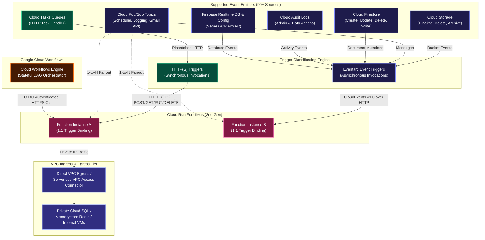
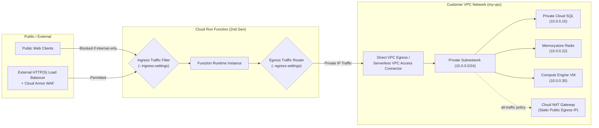
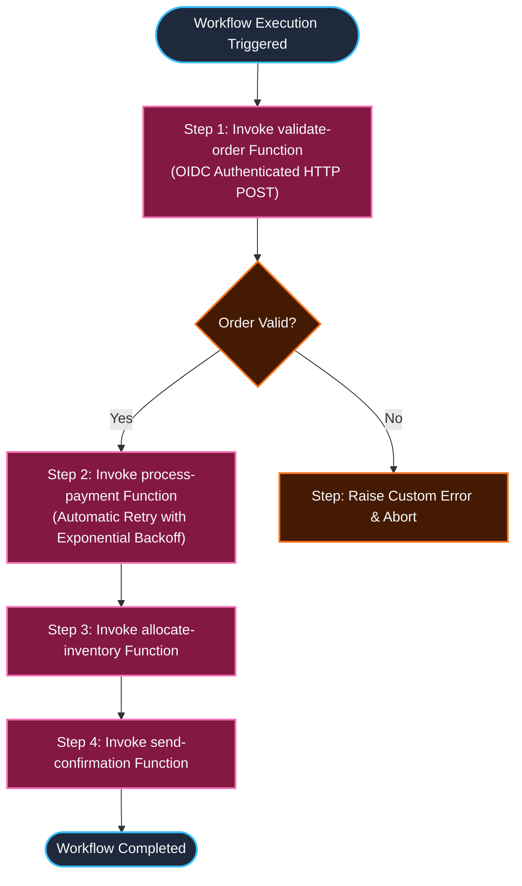

# Cloud Run Functions: Triggers, VPC Networking & Workflows Architecture Manual

A comprehensive engineering guide detailing **Function Triggers**, **Eventarc Integration**, **Virtual Private Cloud (VPC) Networking**, and **Google Cloud Workflows Orchestration** for Cloud Run functions (2nd Generation).

---

## 1. Function Triggers Architecture

Cloud Run functions executes code in response to external stimulation through **Triggers**. Every function deployment can configure exactly one trigger binding, connecting the function to HTTP traffic or asynchronous platform events.



---

## 2. Core Operational Rules: 1:1 Binding vs. 1:N Fan-Out

When architecting serverless event-driven systems on Google Cloud, two fundamental rules govern trigger topologies:

### Rule 1: Strict 1-to-1 Function-to-Trigger Binding
* A single Cloud Run function **can only be bound to one trigger at a time**.
* You *cannot* configure a single deployed function to listen simultaneously to both an HTTP endpoint and a Pub/Sub topic, or listen to two different Cloud Storage buckets.
* If a business capability must be accessible via both HTTP and Pub/Sub, deploy two separate functions sharing common business logic code.

### Rule 2: 1-to-N Event Source Fan-Out
* A single event source (e.g. a Cloud Storage bucket, a Pub/Sub topic, or a Firestore collection) can trigger **multiple independent Cloud Run functions**.
* Each function defines its own independent deployment and trigger configuration pointing to the same event source.
* Example: An image upload to `gs://user-media` can simultaneously trigger:
  1. `generate-thumbnails` (Cloud Run function 1)
  2. `extract-exif-metadata` (Cloud Run function 2)
  3. `audit-compliance-scan` (Cloud Run function 3)

---

## 3. In-Depth Trigger Types & Protocols

### 3.1 HTTP(S) Triggers
* **Protocols**: Exposes a dedicated HTTPS endpoint supporting standard HTTP verbs (`GET`, `POST`, `PUT`, `DELETE`, `PATCH`, `OPTIONS`).
* **Ingress URL Format**: `https://<REGION>-<PROJECT_ID>.cloudfunctions.net/<FUNCTION_NAME>` or `https://<SERVICE_NAME>-<HASH>-<REGION>.a.run.app`.
* **Security & Auth**:
  - Public webhooks / APIs: Configured with `--allow-unauthenticated`.
  - Internal / Service-to-Service: Configured with `--no-allow-unauthenticated`. Callers must supply an `Authorization: bearer $(gcloud auth print-identity-token)` containing an OpenID Connect (OIDC) token verifying `roles/run.invoker`.
* **Cloud Tasks Handler**: HTTP functions act as targets for Cloud Tasks queues, allowing asynchronous rate-limited execution with automatic exponential retries.

---

### 3.2 Cloud Pub/Sub Triggers
* **Underlying Architecture**: In Cloud Run functions (2nd gen), Pub/Sub triggers are managed as an Eventarc trigger under the hood. Eventarc provisions an internal Pub/Sub push subscription that converts messages into standardized CloudEvents delivered to the function container.
* **Payload Formatting**:
  - **Gen 2 (CloudEvent)**: The Pub/Sub payload is wrapped in standard CloudEvents v1.0 format (`cloudEvent.data.message.data` base64-encoded).
  - **Gen 1 (Legacy Background)**: Passed as a direct `event` object (`event.data`).
* **Ecosystem Event Bus Integration**:
  - **Cloud Scheduler**: Cron-based scheduled function execution by publishing messages to Pub/Sub on a cron cadence.
  - **Cloud Logging Sinks**: Log routing sinks that export matched log entries to Pub/Sub topics, triggering reactive remediation functions.
  - **Gmail Push Notification API**: Forwards mailbox changes to a Pub/Sub topic, which immediately executes a Cloud Run function to parse incoming email.

---

### 3.3 Cloud Storage Triggers
* **Trigger Mechanics**: Invoked whenever an object is mutated in a specified Google Cloud Storage bucket.
* **Supported Event Types**:
  1. `google.cloud.storage.object.v1.finalized` (New file created or overwritten)
  2. `google.cloud.storage.object.v1.deleted` (File deleted or archived)
  3. `google.cloud.storage.object.v1.archived` (Live version changed to noncurrent)
  4. `google.cloud.storage.object.v1.metadataUpdated` (Object metadata altered)
* **Payload Schema**:
  - Gen 2 passes `CloudEvents` containing metadata: `bucket`, `name`, `generation`, `size`, `contentType`, `timeCreated`.

---

### 3.4 Cloud Firestore Triggers
* **Scope & Restrictions**:
  - **Document-Level Only**: Firestore triggers execute **strictly at the document level**. You cannot trigger on individual field mutations within a document, nor can you listen to an entire collection without specifying a document path.
  - **Same Project Constraint**: The Firestore database **must reside in the same Google Cloud project** as the Cloud Run function.
* **Supported Event Types**:
  1. `google.cloud.firestore.document.v1.created`
  2. `google.cloud.firestore.document.v1.updated`
  3. `google.cloud.firestore.document.v1.deleted`
  4. `google.cloud.firestore.document.v1.written` (Fires on create, update, OR delete)
* **Document Path Wildcard Syntax**:
  - Target specific documents: `users/admin-user`
  - Target wildcard document IDs: `users/{userId}` or nested subcollections: `users/{userId}/orders/{orderId}`.
* **Data Snapshot Payload**:
  - Delivers `cloudEvent.data.value` (current document state) and `cloudEvent.data.oldValue` (state prior to mutation).

---

### 3.5 Firebase Triggers
Cloud Run functions can consume events generated by connected Firebase backend services:

| Firebase Service | Supported Generation | Description |
| :--- | :--- | :--- |
| **Firebase Realtime Database** | Gen 1 & Gen 2 | Triggers on data changes (`ref.create`, `ref.update`, `ref.delete`, `ref.write`). |
| **Firebase Remote Config** | Gen 1 & Gen 2 | Triggers when template updates are published. |
| **Google Analytics for Firebase** | **Gen 1 Only** | Triggers on specific in-app user conversion events. |
| **Firebase Authentication** | **Gen 1 Only** | Triggers upon user account creation (`user.create`) or deletion (`user.delete`). |

---

## 4. Connecting Cloud Run Functions to Virtual Private Cloud (VPC)

By default, Cloud Run functions run in an isolated multi-tenant network managed by Google, sending all outbound traffic over the public internet. To securely communicate with private enterprise resources (Cloud SQL, Memorystore Redis, private GKE microservices, or on-premises systems via Interconnect/VPN), configure **VPC Egress** and **Ingress Controls**.



---

### 4.1 Ingress Settings (Inbound Access Control)

Ingress settings control which network paths are permitted to invoke the function:

| Ingress Setting Flag Value | Permitted Traffic Sources | Recommended Production Use Case |
| :--- | :--- | :--- |
| `--ingress-settings=all` | Public internet, other VPC networks, Cloud Load Balancers, and GCP services. *(Default)* | Public webhooks, open developer APIs, or public callbacks. |
| `--ingress-settings=internal-only` | Traffic originating from the same VPC project, VPC Peering, Cloud VPN, or Interconnect. | Private microservices communicating strictly within internal enterprise boundaries. |
| `--ingress-settings=internal-and-cloud-load-balancing` | Traffic routed through an **External HTTP(S) Cloud Load Balancer** OR internal VPC clients. Direct internet requests to the raw `.run.app` URL are rejected with HTTP 403 Forbidden. | Production APIs requiring **Cloud Armor WAF**, DDoS mitigation, custom domains, and SSL termination. |

---

### 4.2 Egress Settings (Outbound Private Routing)

To route outbound function requests into your VPC network, configure either **Direct VPC Egress** (recommended for 2nd gen) or a **Serverless VPC Access Connector**.

#### Egress Traffic Routing Options:
1. **`private-ranges-only` (Default)**:
   - Only traffic destined for RFC 1918 private IP ranges (`10.0.0.0/8`, `172.16.0.0/12`, `192.168.0.0/16`) is routed into the customer VPC.
   - Public internet traffic exits directly via Google Cloud's default internet gateway.
2. **`all-traffic`**:
   - **All outbound traffic** (both private RFC 1918 and public internet traffic) is routed through your customer VPC.
   - **Critical Enterprise Use Case**: Allows Cloud Run functions to exit through a **Cloud NAT Gateway with fixed static external IP addresses**, enabling whitelisting on external third-party firewalls and payment gateways.

---

## 5. Orchestrating Functions with Google Cloud Workflows

While Eventarc provides decoupled event-driven *choreography*, complex enterprise workflows requiring sequential execution, conditional decision branching, human-in-the-loop approvals, and robust distributed retries require centralized *orchestration*.

**Google Cloud Workflows** coordinates multiple Cloud Run functions into resilient, stateful directed acyclic graphs (DAGs).



### 5.1 Benefits of Workflows over Direct Function-to-Function Calls
1. **Zero Cold-Start Stacking**: In a chained architecture (`FnA -> FnB -> FnC`), caller functions remain active and billed while waiting for downstream functions. Workflows pauses execution state at zero compute cost while waiting for HTTP responses.
2. **Automatic Exponential Retries**: Built-in retry policies handle transient network glitches without writing custom retry code in the functions.
3. **State Durability & Timeouts**: Workflows can pause and wait for up to **1 year**, orchestrating long-running business processes.
4. **Native OIDC Token Generation**: Workflows automatically generates signed OIDC authentication tokens to invoke private Cloud Run functions securely.

---

### 5.2 Declarative Workflow Specification (`workflow.yaml`)

```yaml
main:
  params: [args]
  steps:
    - initConstants:
        assign:
          - orderId: ${args.orderId}
          - amount: ${args.amount}
          - project: ${sys.get_env("GOOGLE_CLOUD_PROJECT_ID")}
          - region: "us-central1"

    - validateOrderStep:
        call: http.post
        args:
          url: ${"https://" + region + "-" + project + ".cloudfunctions.net/validate-order"}
          auth:
            type: OIDC
          body:
            orderId: ${orderId}
            amount: ${amount}
        result: validateResult

    - checkValidity:
        switch:
          - condition: ${validateResult.body.valid == false}
            next: orderRejected

    - processPaymentStep:
        try:
          call: http.post
          args:
            url: ${"https://" + region + "-" + project + ".cloudfunctions.net/process-payment"}
            auth:
              type: OIDC
            body:
              orderId: ${orderId}
              amount: ${amount}
          result: paymentResult
        retry:
          predicate: ${http.default_retry_predicate}
          max_retries: 5
          backoff:
            initial_delay: 2
            max_delay: 30
            multiplier: 2

    - finalizeOrderStep:
        call: http.post
        args:
          url: ${"https://" + region + "-" + project + ".cloudfunctions.net/finalize-order"}
          auth:
            type: OIDC
          body:
            orderId: ${orderId}
            transactionId: ${paymentResult.body.transactionId}
        result: finalResult

    - returnSuccess:
        return:
          status: "SUCCESS"
          orderId: ${orderId}
          details: ${finalResult.body}

    - orderRejected:
        return:
          status: "REJECTED"
          reason: "Order failed business validation checks."
```

---

## 6. Production CLI Command Reference

### 6.1 Deploying Functions with Eventarc Triggers

#### 1. Cloud Storage Bucket Trigger:
```bash
gcloud functions deploy gcs-thumbnail-generator \
  --gen2 \
  --region=us-central1 \
  --runtime=nodejs20 \
  --entry-point=generateThumbnail \
  --source=. \
  --trigger-bucket=my-media-bucket \
  --trigger-location=us-central1
```

#### 2. Pub/Sub Topic Trigger:
```bash
gcloud functions deploy pubsub-log-processor \
  --gen2 \
  --region=us-central1 \
  --runtime=python311 \
  --entry-point=process_pubsub_log \
  --source=. \
  --trigger-topic=security-audit-events
```

#### 3. Firestore Document Mutation Trigger:
```bash
gcloud functions deploy firestore-user-sync \
  --gen2 \
  --region=us-central1 \
  --runtime=nodejs20 \
  --entry-point=syncUserRecord \
  --source=. \
  --trigger-location=nam5 \
  --trigger-event-filters="type=google.cloud.firestore.document.v1.written" \
  --trigger-event-filters="database=(default)" \
  --trigger-event-filters-path-pattern="document=users/{userId}"
```

---

### 6.2 Deploying Functions with VPC Ingress & Egress Controls

#### 1. Deploy with Direct VPC Egress (Private Cloud SQL & Memorystore Access):
```bash
gcloud functions deploy database-backend-service \
  --gen2 \
  --region=us-central1 \
  --runtime=nodejs20 \
  --entry-point=queryDatabase \
  --source=. \
  --network=my-custom-vpc \
  --subnet=backend-subnet-us-central1 \
  --vpc-egress=private-ranges-only \
  --ingress-settings=internal-only
```

#### 2. Deploy with Serverless VPC Access Connector and Static Egress NAT:
```bash
# Egress all outbound traffic through the connector to exit via Cloud NAT static IP
gcloud functions deploy payment-gateway-integration \
  --gen2 \
  --region=us-central1 \
  --runtime=python311 \
  --entry-point=call_external_bank \
  --source=. \
  --vpc-connector=projects/my-prod-project/locations/us-central1/connectors/vpc-conn-central1 \
  --vpc-egress=all-traffic \
  --ingress-settings=internal-and-cloud-load-balancing
```

---

### 6.3 Deploying and Executing Cloud Workflows

```bash
# 1. Deploy workflow definition
gcloud workflows deploy order-orchestrator \
  --location=us-central1 \
  --source=workflow.yaml \
  --service-account=workflow-runner-sa@my-prod-project.iam.gserviceaccount.com

# 2. Execute workflow with JSON payload
gcloud workflows run order-orchestrator \
  --location=us-central1 \
  --data='{"orderId": "ORD-99823", "amount": 250.75}'
```
