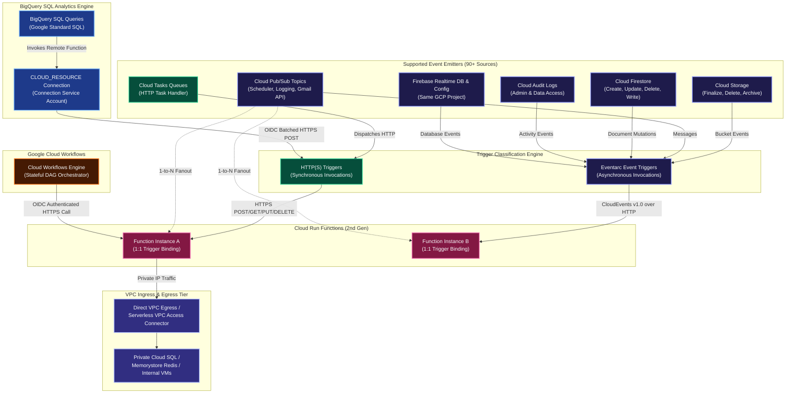
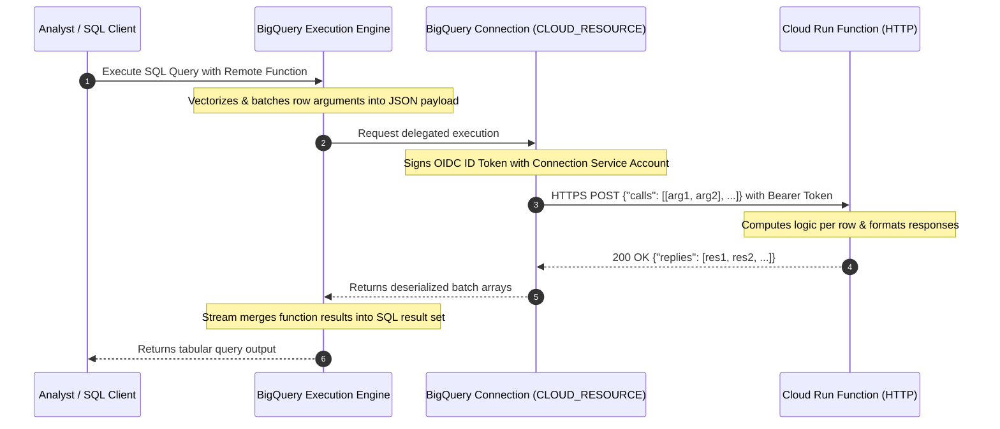
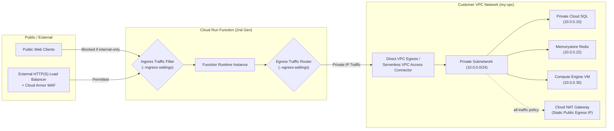
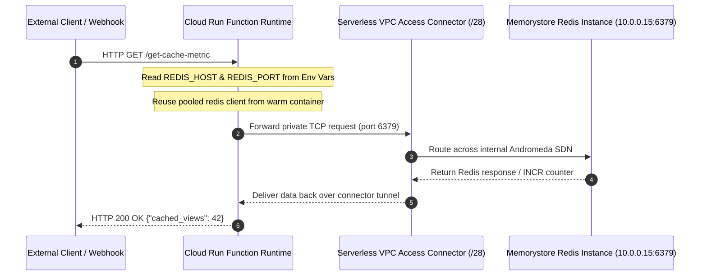
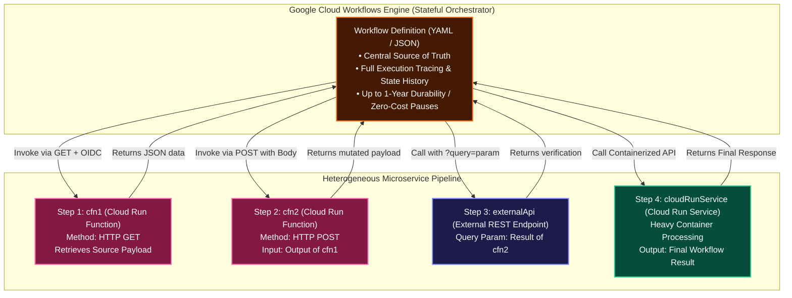

# Cloud Run Functions: Triggers, VPC Networking & Workflows Architecture Manual

A comprehensive engineering guide detailing **Function Triggers**, **Eventarc Integration**, **Virtual Private Cloud (VPC) Networking**, and **Google Cloud Workflows Orchestration** for Cloud Run functions (2nd Generation).

---

## 1. Function Triggers Architecture

Cloud Run functions executes code in response to external stimulation through **Triggers**. Every function deployment can configure exactly one trigger binding, connecting the function to HTTP traffic or asynchronous platform events.



---

## 2. Core Operational Rules: 1:1 Binding vs. 1:N Fan-Out

When architecting serverless event-driven systems on Google Cloud, two fundamental rules govern trigger topologies:

### Rule 1: Strict 1-to-1 Function-to-Trigger Binding
* A single Cloud Run function **can only be bound to one trigger at a time**.
* You *cannot* configure a single deployed function to listen simultaneously to both an HTTP endpoint and a Pub/Sub topic, or listen to two different Cloud Storage buckets.
* If a business capability must be accessible via both HTTP and Pub/Sub, deploy two separate functions sharing common business logic code.

### Rule 2: 1-to-N Event Source Fan-Out
* A single event source (e.g. a Cloud Storage bucket, a Pub/Sub topic, or a Firestore collection) can trigger **multiple independent Cloud Run functions**.
* Each function defines its own independent deployment and trigger configuration pointing to the same event source.
* Example: An image upload to `gs://user-media` can simultaneously trigger:
  1. `generate-thumbnails` (Cloud Run function 1)
  2. `extract-exif-metadata` (Cloud Run function 2)
  3. `audit-compliance-scan` (Cloud Run function 3)

---

## 3. In-Depth Trigger Types & Protocols

### 3.1 HTTP(S) Triggers
* **Protocols**: Exposes a dedicated HTTPS endpoint supporting standard HTTP verbs (`GET`, `POST`, `PUT`, `DELETE`, `PATCH`, `OPTIONS`).
* **Ingress URL Format**: `https://<REGION>-<PROJECT_ID>.cloudfunctions.net/<FUNCTION_NAME>` or `https://<SERVICE_NAME>-<HASH>-<REGION>.a.run.app`.
* **Security & Auth**:
  - Public webhooks / APIs: Configured with `--allow-unauthenticated`.
  - Internal / Service-to-Service: Configured with `--no-allow-unauthenticated`. Callers must supply an `Authorization: bearer $(gcloud auth print-identity-token)` containing an OpenID Connect (OIDC) token verifying `roles/run.invoker`.
* **Cloud Tasks Handler**: HTTP functions act as targets for Cloud Tasks queues, allowing asynchronous rate-limited execution with automatic exponential retries.
* **BigQuery Remote Functions**: BigQuery SQL queries invoke HTTP functions directly via a `CLOUD_RESOURCE` connection to perform batch row transformations in Google Standard SQL.

---

### 3.2 Cloud Pub/Sub Triggers
* **Underlying Architecture**: In Cloud Run functions (2nd gen), Pub/Sub triggers are managed as an Eventarc trigger under the hood. Eventarc provisions an internal Pub/Sub push subscription that converts messages into standardized CloudEvents delivered to the function container.
* **Payload Formatting**:
  - **Gen 2 (CloudEvent)**: The Pub/Sub payload is wrapped in standard CloudEvents v1.0 format (`cloudEvent.data.message.data` base64-encoded).
  - **Gen 1 (Legacy Background)**: Passed as a direct `event` object (`event.data`).
* **Ecosystem Event Bus Integration**:
  - **Cloud Scheduler**: Cron-based scheduled function execution by publishing messages to Pub/Sub on a cron cadence.
  - **Cloud Logging Sinks**: Log routing sinks that export matched log entries to Pub/Sub topics, triggering reactive remediation functions.
  - **Gmail Push Notification API**: Forwards mailbox changes to a Pub/Sub topic, which immediately executes a Cloud Run function to parse incoming email.

---

### 3.3 Cloud Storage Triggers
* **Trigger Mechanics**: Invoked whenever an object is mutated in a specified Google Cloud Storage bucket.
* **Supported Event Types**:
  1. `google.cloud.storage.object.v1.finalized` (New file created or overwritten)
  2. `google.cloud.storage.object.v1.deleted` (File deleted or archived)
  3. `google.cloud.storage.object.v1.archived` (Live version changed to noncurrent)
  4. `google.cloud.storage.object.v1.metadataUpdated` (Object metadata altered)
* **Payload Schema**:
  - Gen 2 passes `CloudEvents` containing metadata: `bucket`, `name`, `generation`, `size`, `contentType`, `timeCreated`.

---

### 3.4 Cloud Firestore Triggers (Native Mode)

Cloud Run functions can react in real time to mutations in Google Cloud Firestore collections. This enables asynchronous document post-processing, validation, event auditing, and cross-collection data syncing without provisioning dedicated listener servers.

#### Core Architectural Constraints & Rules

1. **Strict Firestore Mode Compatibility**:
   - **Supported**: Firestore in **Native mode** exclusively.
   - **Unsupported**: Firestore in **Datastore mode** does **not** support Cloud Run function triggers or Eventarc subscriptions.
2. **Document-Level Granularity**:
   - Triggers fire strictly at the **document level**. You cannot filter on mutations of individual fields within a document, nor can you listen to an entire collection without specifying a document path or wildcard pattern.
3. **Document Path Wildcard Syntax & Rules**:
   - Must specify document paths relative to the database root (e.g., `users/{userId}` or `customers/{customerId}/orders/{orderId}`).
   - **Crucial Rule**: Document paths **must never contain a trailing slash** (`users/{userId}/` is invalid and causes deployment failure).
4. **Project Colocation**:
   - The Firestore database and the Cloud Run function must reside in the **same Google Cloud project**.

#### Supported Firestore Event Types

| Event Type String | Invocation Timing | CloudEvent Snapshot Payloads |
| :--- | :--- | :--- |
| `google.cloud.firestore.document.v1.created` | New document inserted | `cloudEvent.data.value` (Newly created document state) |
| `google.cloud.firestore.document.v1.updated` | Existing document modified | Both `cloudEvent.data.value` (After) AND `cloudEvent.data.oldValue` (Before) |
| `google.cloud.firestore.document.v1.deleted` | Document purged | `cloudEvent.data.oldValue` (State immediately before deletion) |
| `google.cloud.firestore.document.v1.written` | Created, updated, OR deleted | Dynamic: `value` (Create), both (Update), or `oldValue` (Delete) |

#### Event Snapshot Mechanics & Document Modification Patterns

* **Accessing the Triggering Document (`DocumentReference`)**:
  - Each function invocation is associated with a specific document in the database.
  - In the Firebase/Firestore SDK, the event snapshot exposes the document reference via the `ref` property.
  - This `DocumentReference` contains methods (`set()`, `update()`, `delete()`) enabling direct modification of the triggering document without having to manually reconstruct its path.
* **Accessing External Documents (Firebase Admin SDK)**:
  - When the function must read or write data in collections **other than the triggering document** (e.g., writing an audit trail or incrementing a global counter), instantiate and use the **Firebase Admin SDK** (`firebase-admin/firestore`).

```javascript
// Example Node.js handler illustrating DocumentReference vs Firebase Admin SDK
const functions = require('@google-cloud/functions-framework');
const admin = require('firebase-admin');

admin.initializeApp();
const db = admin.firestore();

functions.cloudEvent('processFirestoreEvent', async (cloudEvent) => {
  const { value, oldValue } = cloudEvent.data;
  
  // 1. Identify triggering document from event subject
  const docPath = (cloudEvent.document || cloudEvent.subject).split('/documents/')[1];
  const triggeringDocRef = db.doc(docPath);

  // 2. Modify triggering document via its reference
  await triggeringDocRef.set({ lastAuditedAt: new Date().toISOString() }, { merge: true });

  // 3. Read/write to separate collections using Firebase Admin SDK
  await db.collection('audit_events').add({
    action: 'DOCUMENT_MUTATION',
    path: docPath,
    before: oldValue ? oldValue.fields : null,
    after: value ? value.fields : null,
    timestamp: admin.firestore.FieldValue.serverTimestamp()
  });
});
```

---

### 3.5 Firebase Triggers
Cloud Run functions can consume events generated by connected Firebase backend services:

| Firebase Service | Supported Generation | Description |
| :--- | :--- | :--- |
| **Firebase Realtime Database** | Gen 1 & Gen 2 | Triggers on data changes (`ref.create`, `ref.update`, `ref.delete`, `ref.write`). |
| **Firebase Remote Config** | Gen 1 & Gen 2 | Triggers when template updates are published. |
| **Google Analytics for Firebase** | **Gen 1 Only** | Triggers on specific in-app user conversion events. |
| **Firebase Authentication** | **Gen 1 Only** | Triggers upon user account creation (`user.create`) or deletion (`user.delete`). |

---

### 3.6 BigQuery Remote Functions (Direct SQL Integration)

#### Architectural Overview & Core Value Proposition
**BigQuery** is Google Cloud's fully managed, petabyte-scale serverless enterprise data warehouse designed for high-performance analytical processing, integrated machine learning (BigQuery ML), and geospatial intelligence. BigQuery's distributed SQL engine queries terabytes of structured data in seconds and petabytes in minutes.

A **BigQuery Remote Function** bridges the data warehouse with external software by providing a direct, native integration between Google Standard SQL and **Cloud Run functions** (HTTP-triggered). Rather than extracting data through slow, brittle ETL/ELT pipelines, BigQuery remote functions allow analysts and data pipelines to execute custom application logic directly inside SQL statements.



#### Key Technical Principles:
1. **Direct Google Standard SQL Integration**: Deploy custom application logic as an HTTP Cloud Run function, declare a user-defined function in BigQuery using `REMOTE WITH CONNECTION`, and invoke it inline across millions of rows (`SELECT`, `WHERE`, projections).
2. **Eliminates Reverse-ETL & Export Pipelines**: Enables tasks such as real-time PII tokenization/masking, proprietary scoring algorithms, address geocoding, external CRM lookups, and legacy cryptographic hashing directly during query runtime.
3. **Fully Managed Serverless Scale**: Both BigQuery and Cloud Run functions scale independently. BigQuery distributes query tasks across hundreds of query workers, and Cloud Run functions scales container instances automatically to match worker concurrency.

---

#### HTTP Batching Protocol & Serialization Contract
To achieve massive query performance and avoid the latency of row-by-row HTTP round trips, BigQuery **vectorizes and batches rows** before dispatching an HTTP POST request to the Cloud Run function endpoint.

##### 1. Inbound Request Payload (`POST /`)
BigQuery transmits a JSON object containing a 2D array under the key `calls`, where each element represents one row's input arguments in column order:
```json
{
  "requestId": "124abcd-5678-ef90-1234-56789abcdef0",
  "caller": "//bigquery.googleapis.com/projects/my_project_id/jobs/bqux_job_12345",
  "sessionUser": "analyst@example.com",
  "userDefinedContext": {},
  "calls": [
    [null, 2],
    [2, 2],
    [3, 2],
    [5, 2],
    [8, 2]
  ]
}
```

##### 2. Outbound Success Response (`200 OK`)
The Cloud Run function **must** respond with a JSON object containing a `replies` array:
* **Strict Cardinality Constraint**: The `replies` array length **must exactly equal** the `calls` array length.
* **Strict Positional Ordering**: `replies[i]` must correspond directly to the computed output of `calls[i]`.
```json
{
  "replies": [
    2,
    4,
    5,
    7,
    10
  ]
}
```

##### 3. Outbound Error Response (`400` or `500`)
If an unrecoverable failure occurs, the function returns an error JSON object. BigQuery will fail the entire query execution with the provided message:
```json
{
  "errorMessage": "Invalid argument format: Expected numeric operands"
}
```

##### 4. Null Value Semantics
SQL `NULL` values are serialized into JSON as `null`. When writing functions, explicitly handle `null` inputs to avoid uncaught exceptions (e.g. converting `null` to a default value or returning `null`).

---

#### Production Code Implementation (Node.js & Python)

##### Node.js 20 Implementation (`index.js`)
```javascript
const functions = require('@google-cloud/functions-framework');

functions.http('addValuesRemote', (req, res) => {
  try {
    const { calls } = req.body;
    if (!calls || !Array.isArray(calls)) {
      return res.status(400).json({ errorMessage: "Invalid payload: 'calls' array required." });
    }

    // Process each row batch: (x, y) => (x ?? 0) + y
    const replies = calls.map((call) => {
      const x = call[0];
      const y = call[1];

      // Handle SQL NULL semantics gracefully
      const valX = (x === null || x === undefined) ? 0 : Number(x);
      const valY = (y === null || y === undefined) ? 0 : Number(y);

      return valX + valY;
    });

    // Return replies matching the calls array cardinality exactly
    return res.status(200).json({ replies });
  } catch (err) {
    return res.status(500).json({ errorMessage: err.message });
  }
});
```

##### Python 3.11 Implementation (`main.py`)
```python
import functions_framework
from flask import jsonify, request

@functions_framework.http
def add_values_remote(request):
    try:
        request_json = request.get_json(silent=True)
        if not request_json or "calls" not in request_json:
            return jsonify({"errorMessage": "Invalid payload: 'calls' array required."}), 400

        calls = request_json["calls"]
        replies = []

        for call in calls:
            x, y = call[0], call[1]
            val_x = 0 if x is None else int(x)
            val_y = 0 if y is None else int(y)
            replies.append(val_x + val_y)

        return jsonify({"replies": replies}), 200
    except Exception as e:
        return jsonify({"errorMessage": str(e)}), 500
```

---

#### Security & IAM Access Control Hierarchy
Configuring BigQuery Remote Functions follows a **three-tier security model** establishing least privilege across administrators, automated connections, and query runners:

| Security Domain | Identity / Resource | Minimum IAM Role | Purpose |
| :--- | :--- | :--- | :--- |
| **Connection Administration** | Cloud Administrator / DevOps | `roles/bigquery.admin` or `roles/bigquery.connectionAdmin` | Enable Connection API and create/manage `CLOUD_RESOURCE` connection. |
| **Service-to-Service Invocation** | BigQuery Connection Service Account (`service-PROJECT_NUM@gcp-sa-bigqueryconnection.iam.gserviceaccount.com`) | `roles/run.invoker` (Gen 2) or `roles/cloudfunctions.invoker` (Gen 1) | Allows the BigQuery connection service agent to mint OIDC identity tokens and invoke the private Cloud Run function. |
| **Remote Function Creation** | Data Engineer | `roles/bigquery.admin` or `roles/bigquery.dataEditor` on dataset + `roles/bigquery.connectionUser` on connection | Allows defining the `CREATE FUNCTION ... REMOTE WITH CONNECTION` DDL routine. |
| **SQL Query Execution** | Data Analyst / End User | `roles/bigquery.dataViewer` (or `roles/bigquery.user`) on dataset + `roles/bigquery.connectionUser` on connection | Allows executing queries that invoke the remote function routine via the delegated connection. |

---

#### SQL Definition & Invocation Specification

##### 1. Declaring the Remote Function Routine
```sql
CREATE OR REPLACE FUNCTION my_project_id.my_dataset.function_name(x INT64, y INT64)
RETURNS INT64
REMOTE WITH CONNECTION `my_project_id.US.my-connection`
OPTIONS (
  endpoint = 'https://us-east1-my_gcf_project.cloudfunctions.net/function_name',
  max_batching_rows = 1000
);
```

##### 2. Invoking the Function in a Query
The remote function acts as a scalar function in SQL, accepting column expressions or literals:
```sql
SELECT 
  val, 
  my_project_id.my_dataset.function_name(val, 2) AS f0_ 
FROM UNNEST([NULL, 2, 3, 5, 8]) AS val;
```

##### 3. Result Set Output
```
+------+-----+
| val  | f0_ |
+------+-----+
| NULL |   2 |
|    2 |   4 |
|    3 |   5 |
|    5 |   7 |
|    8 |  10 |
+------+-----+
```

#### Related Documentation & Official Links
For deeper architectural specifications, refer to the official Google Cloud guides:
* [BigQuery Remote Functions Overview](https://cloud.google.com/bigquery/docs/remote-functions) - Official documentation detailing BigQuery remote function architecture and limits.
* [BigQuery Remote Functions Hands-On Tutorial](https://cloud.google.com/bigquery/docs/remote-functions-tutorial) - Step-by-step tutorial on deploying Cloud Run functions and invoking them from BigQuery.
* [Creating Cloud Resource Connections](https://cloud.google.com/bigquery/docs/create-cloud-resource-connection) - Setting up and managing `CLOUD_RESOURCE` connections in BigQuery.
* [Google Standard SQL CREATE FUNCTION Statement](https://cloud.google.com/bigquery/docs/reference/standard-sql/data-definition-language#create_function_statement) - DDL reference for creating external UDFs with `REMOTE WITH CONNECTION`.
* [User-Defined Functions (UDF) in BigQuery](https://cloud.google.com/bigquery/docs/reference/standard-sql/user-defined-functions) - General concepts for scalar and remote UDFs.
* [Cloud Run Functions HTTP Invocations](https://cloud.google.com/functions/docs/calling/http) - Specifications for synchronous HTTP-triggered functions and OIDC authorization headers.

---

## 4. Connecting Cloud Run Functions to Virtual Private Cloud (VPC)

By default, Cloud Run functions run in an isolated multi-tenant network managed by Google, sending all outbound traffic over the public internet. To securely communicate with private enterprise resources (Cloud SQL, Memorystore Redis, private GKE microservices, or on-premises systems via Interconnect/VPN), configure **VPC Egress** and **Ingress Controls**.



---

### 4.1 Ingress Settings (Inbound Access Control)

Ingress settings control which network paths are permitted to invoke the function:

| Ingress Setting Flag Value | Permitted Traffic Sources | Recommended Production Use Case |
| :--- | :--- | :--- |
| `--ingress-settings=all` | Public internet, other VPC networks, Cloud Load Balancers, and GCP services. *(Default)* | Public webhooks, open developer APIs, or public callbacks. |
| `--ingress-settings=internal-only` | Traffic originating from the same VPC project, VPC Peering, Cloud VPN, or Interconnect. | Private microservices communicating strictly within internal enterprise boundaries. |
| `--ingress-settings=internal-and-cloud-load-balancing` | Traffic routed through an **External HTTP(S) Cloud Load Balancer** OR internal VPC clients. Direct internet requests to the raw `.run.app` URL are rejected with HTTP 403 Forbidden. | Production APIs requiring **Cloud Armor WAF**, DDoS mitigation, custom domains, and SSL termination. |

---

### 4.2 Egress Settings (Outbound Private Routing)

To route outbound function requests into your VPC network, configure either **Direct VPC Egress** (recommended for 2nd gen) or a **Serverless VPC Access Connector**.

#### Egress Traffic Routing Options:
1. **`private-ranges-only` (Default)**:
   - Only traffic destined for RFC 1918 private IP ranges (`10.0.0.0/8`, `172.16.0.0/12`, `192.168.0.0/16`) is routed into the customer VPC.
   - Public internet traffic exits directly via Google Cloud's default internet gateway.
2. **`all-traffic`**:
   - **All outbound traffic** (both private RFC 1918 and public internet traffic) is routed through your customer VPC.
   - **Critical Enterprise Use Case**: Allows Cloud Run functions to exit through a **Cloud NAT Gateway with fixed static external IP addresses**, enabling whitelisting on external third-party firewalls and payment gateways.

---

### 4.3 Serverless VPC Access Connector Architecture & Core Constraints

A **Serverless VPC Access Connector** is a managed regional resource composed of underlying connector VM instances that transparently handle traffic translation between the multi-tenant serverless environment and your private Google Cloud VPC Andromeda SDN fabric.

#### Core Architectural Constraints:
1. **Dedicated Exclusive `/28` CIDR Range**:
   - The connector requires an unreserved CIDR block with a **minimum `/28` mask** (16 IP addresses, e.g., `10.8.0.0/28`) or an existing dedicated custom subnet.
   - **Strict Rule**: The CIDR block must be allocated **strictly and exclusively** for the connector. It cannot overlap with any other subnetwork in the VPC network, and no Compute Engine VMs, containers, or other workloads may share this IP space.
2. **Strict Region Matching**:
   - The connector must be created in the **exact same Google Cloud region** as the Cloud Run functions communicating through it.
3. **Internal DNS & Private IP Resolution**:
   - Once connected, Cloud Run functions can resolve internal `.internal` DNS zone names and communicate directly with:
     - **Compute Engine VMs** via internal IP (`10.x.x.x`).
     - **Google Cloud Memorystore (Redis / Memcached)** clusters without public IPs.
     - **Private Cloud SQL instances** connected via VPC Service Networking peering.
     - **Internal Application Load Balancers (ILB)** and private microservices.
4. **Zero-Trust VPC Firewall Segmentation**:
   - Ingress and egress firewall rules within your VPC network can specifically target the connector's `/28` IP range or network tags to tightly restrict which backend internal databases or VMs the serverless functions can reach.
5. **Shared VPC Enterprise Topology**:
   - When deploying in enterprise organizations using Shared VPC, the Serverless VPC Access connector can be hosted in either the Shared VPC Host Project or the Service Project. The Serverless VPC Access Service Agent (`service-SERVICE_PROJECT_NUM@gcp-sa-vpcaccess.iam.gserviceaccount.com`) must be granted the `roles/compute.networkUser` role in the Host Project.

### 4.4 In-Memory Cache Integration: Google Cloud Memorystore (Redis & Memcached)

Google Cloud **Memorystore** provides fully managed, scalable, and secure in-memory caching for Redis and Memcached. Memorystore automates provisioning, replication, failover, and maintenance patching, while providing native integration with Cloud IAM and Cloud Monitoring.

Because Memorystore instances are deployed without public endpoints and bind strictly to private RFC 1918 VPC addresses, Cloud Run functions must establish connectivity via a **Serverless VPC Access Connector**.



#### End-to-End Implementation Flow:

1. **Discover Memorystore Network Parameters**:
   Inspect the target Redis instance to identify its authorized VPC network (e.g. `default` or `my-custom-vpc`), internal IP address (e.g. `10.0.0.15`), and service port (`6379`).
2. **Provision Regional Serverless VPC Access Connector**:
   Create a connector in the **same region** as the Cloud Run function, attaching it to the authorized network and assigning an unallocated `/28` CIDR range.
3. **Verify Connector State**:
   Confirm the connector is in `READY` status. Deploying workloads while the connector is in `CREATING` or `FAILED` causes immediate deployment aborts.
4. **Deploy Function with Connector & Environment Variables**:
   Specify `--vpc-connector=<CONNECTOR_NAME>`, set `--vpc-egress=private-ranges-only` (to ensure external internet traffic does not saturate the connector), and inject `REDIS_HOST` and `REDIS_PORT` as environment variables.
5. **Instantiate Client Outside the Handler**:
   Instantiate the Redis/Memcached client in the global scope outside the function handler. This ensures TCP connections are reused across warm container invocations, avoiding connection flooding on the Redis engine.
6. **Trigger Invocation**:
   Send HTTP GET requests to the function's URL to invoke cache operations.

---

## 5. Orchestrating Functions with Google Cloud Workflows

While Eventarc provides decoupled event-driven *choreography*, complex enterprise architectures requiring sequential execution, conditional business branching, human-in-the-loop approvals, long delays, and robust distributed retries require centralized **Service Orchestration**.

**Google Cloud Workflows** is a fully-managed, serverless orchestration platform that executes services in a deterministic order that you define.



### 5.1 Architectural Benefits of Workflows
1. **Central Source of Truth**: Provides a single declarative definition for the entire end-to-end business transaction.
2. **Full Observability & State History**: Each execution is logged in Cloud Logging with detailed execution call trees, variable states, and error stack traces.
3. **Zero Cold-Start Stacking**: In chained calls (`Function A -> Function B -> Function C`), upstream functions sit idle while waiting for downstream responses, incurring ongoing memory/CPU billing. Workflows pauses execution state at **zero cost** while waiting for HTTP responses.
4. **Long-Running Workflows (Up to 1 Year)**: Workflows can pause, sleep, poll, or wait for asynchronous callbacks for up to **365 days**, enabling long-running business processes.
5. **Native Security**: Injects signed OpenID Connect (OIDC) identity tokens automatically to invoke private Cloud Run functions and Cloud Run services without managing API keys.

---

### 5.2 Multi-Service Workflow Implementation (`workflow.yaml`)

The following production workflow implements the complete 4-tier heterogeneous pipeline linking **`cfn1` (HTTP GET)**, **`cfn2` (HTTP POST)**, an **External REST API**, and a downstream **Cloud Run container service**:

```yaml
# workflow.yaml - Orchestrating Cloud Run Functions, External APIs, and Cloud Run Services
main:
  params: [args]
  steps:
    # ── STEP 0: INITIALIZE RUNTIME CONSTANTS ────────────────────────────────
    - initConstants:
        assign:
          - projectId: ${sys.get_env("GOOGLE_CLOUD_PROJECT_ID")}
          - region: "us-central1"
          - inputUserId: ${args.userId}

    # ── STEP 1: INVOKE CFN1 (HTTP GET) ─────────────────────────────────────
    - callCloudFunction1:
        call: http.get
        args:
          url: ${"https://" + region + "-" + projectId + ".cloudfunctions.net/cfn1"}
          auth:
            type: OIDC
          query:
            userId: ${inputUserId}
        result: cfn1Response

    # ── STEP 2: INVOKE CFN2 (HTTP POST WITH CFN1 OUTPUT) ───────────────────
    - callCloudFunction2:
        call: http.post
        args:
          url: ${"https://" + region + "-" + projectId + ".cloudfunctions.net/cfn2"}
          auth:
            type: OIDC
          body:
            initialData: ${cfn1Response.body}
            timestamp: ${sys.now()}
        result: cfn2Response

    # ── STEP 3: CALL EXTERNAL REST API WITH CFN2 RESULT AS QUERY PARAM ──────
    - callExternalApi:
        try:
          call: http.get
          args:
            url: "https://api.external-partner.com/v1/verify"
            query:
              token: ${cfn2Response.body.verificationToken}
              score: ${cfn2Response.body.riskScore}
          result: externalApiResponse
        retry:
          predicate: ${http.default_retry_predicate}
          max_retries: 5
          backoff:
            initial_delay: 2
            max_delay: 30
            multiplier: 2

    # ── STEP 4: INVOKE CLOUD RUN SERVICE (FINAL HEAVY CONTAINER PROCESSING) 
    - callCloudRunService:
        call: http.post
        args:
          url: ${"https://data-aggregator-service-" + projectId + "." + region + ".run.app/process"}
          auth:
            type: OIDC
          body:
            cfn1Data: ${cfn1Response.body}
            cfn2Data: ${cfn2Response.body}
            externalStatus: ${externalApiResponse.body.status}
        result: cloudRunResponse

    # ── STEP 5: RETURN FINAL WORKFLOW RESULT ────────────────────────────────
    - returnFinalResult:
        return:
          workflowStatus: "COMPLETED"
          userId: ${inputUserId}
          finalOutput: ${cloudRunResponse.body}
```

---

### 5.3 Equivalent Workflow Definition in JSON Format (`workflow.json`)

Google Cloud Workflows fully supports JSON as a first-class definition format:

```json
{
  "main": {
    "params": ["args"],
    "steps": [
      {
        "initConstants": {
          "assign": [
            { "projectId": "${sys.get_env(\"GOOGLE_CLOUD_PROJECT_ID\")}" },
            { "region": "us-central1" },
            { "inputUserId": "${args.userId}" }
          ]
        }
      },
      {
        "callCloudFunction1": {
          "call": "http.get",
          "args": {
            "url": "${\"https://\" + region + \"-\" + projectId + \".cloudfunctions.net/cfn1\"}",
            "auth": { "type": "OIDC" },
            "query": { "userId": "${inputUserId}" }
          },
          "result": "cfn1Response"
        }
      },
      {
        "callCloudFunction2": {
          "call": "http.post",
          "args": {
            "url": "${\"https://\" + region + \"-\" + projectId + \".cloudfunctions.net/cfn2\"}",
            "auth": { "type": "OIDC" },
            "body": {
              "initialData": "${cfn1Response.body}",
              "timestamp": "${sys.now()}"
            }
          },
          "result": "cfn2Response"
        }
      },
      {
        "callExternalApi": {
          "call": "http.get",
          "args": {
            "url": "https://api.external-partner.com/v1/verify",
            "query": {
              "token": "${cfn2Response.body.verificationToken}",
              "score": "${cfn2Response.body.riskScore}"
            }
          },
          "result": "externalApiResponse"
        }
      },
      {
        "callCloudRunService": {
          "call": "http.post",
          "args": {
            "url": "${\"https://data-aggregator-service-\" + projectId + \".\" + region + \".run.app/process\"}",
            "auth": { "type": "OIDC" },
            "body": {
              "cfn1Data": "${cfn1Response.body}",
              "cfn2Data": "${cfn2Response.body}",
              "externalStatus": "${externalApiResponse.body.status}"
            }
          },
          "result": "cloudRunResponse"
        }
      },
      {
        "returnFinalResult": {
          "return": {
            "workflowStatus": "COMPLETED",
            "userId": "${inputUserId}",
            "finalOutput": "${cloudRunResponse.body}"
          }
        }
      }
    ]
  }
}
```

---

## 6. Production CLI Command Reference

### 6.1 Deploying Functions with Eventarc Triggers

#### 1. Cloud Storage Bucket Trigger:
```bash
gcloud functions deploy gcs-thumbnail-generator \
  --gen2 \
  --region=us-central1 \
  --runtime=nodejs20 \
  --entry-point=generateThumbnail \
  --source=. \
  --trigger-bucket=my-media-bucket \
  --trigger-location=us-central1
```

#### 2. Pub/Sub Topic Trigger:
```bash
gcloud functions deploy pubsub-log-processor \
  --gen2 \
  --region=us-central1 \
  --runtime=python311 \
  --entry-point=process_pubsub_log \
  --source=. \
  --trigger-topic=security-audit-events
```

#### 3. Firestore Document Mutation Trigger:
```bash
gcloud functions deploy firestore-user-sync \
  --gen2 \
  --region=us-central1 \
  --runtime=nodejs20 \
  --entry-point=syncUserRecord \
  --source=. \
  --trigger-location=nam5 \
  --trigger-event-filters="type=google.cloud.firestore.document.v1.written" \
  --trigger-event-filters="database=(default)" \
  --trigger-event-filters-path-pattern="document=users/{userId}"
```

---

### 6.2 Configuring Serverless VPC Access & Network Controls

#### Step 1: Enable Serverless VPC Access API
```bash
gcloud services enable vpcaccess.googleapis.com
```

#### Step 2: Create Serverless VPC Access Connector (with Dedicated /28 Range)
```bash
# Creates regional connector handling traffic into the VPC
gcloud compute networks vpc-access connectors create vpc-conn-us-central1 \
  --region=us-central1 \
  --network=my-custom-vpc \
  --range=10.8.0.0/28 \
  --min-instances=2 \
  --max-instances=10 \
  --machine-type=e2-micro
```

#### Step 3: Configure Ingress Firewall Rule for Connector Traffic
```bash
# Allow traffic originating from the connector (/28) to reach private databases
gcloud compute firewall-rules create allow-from-serverless-connector \
  --network=my-custom-vpc \
  --action=ALLOW \
  --direction=INGRESS \
  --source-ranges=10.8.0.0/28 \
  --rules=tcp:3306,tcp:5432,tcp:6379,tcp:80,tcp:443 \
  --target-tags=private-backend
```

#### Step 4: Shared VPC Host Project Permission Binding (If Applicable)
```bash
export SERVICE_PROJECT_NUMBER=$(gcloud projects describe my-service-project --format='value(projectNumber)')

# Grant Serverless VPC Access Service Agent permission in the Host Project
gcloud projects add-iam-policy-binding my-shared-vpc-host-project \
  --member="serviceAccount:service-${SERVICE_PROJECT_NUMBER}@gcp-sa-vpcaccess.iam.gserviceaccount.com" \
  --role="roles/compute.networkUser"
```

#### Step 5: Deploy Cloud Run Function Connected to VPC
```bash
# Deploy function routing private RFC 1918 traffic through the connector
gcloud functions deploy database-backend-service \
  --gen2 \
  --region=us-central1 \
  --runtime=nodejs20 \
  --entry-point=queryDatabase \
  --source=. \
  --vpc-connector=projects/my-custom-project/locations/us-central1/connectors/vpc-conn-us-central1 \
  --vpc-egress=private-ranges-only \
  --ingress-settings=internal-only
```

---

### 6.3 Deploying and Executing Cloud Workflows

#### Step 1: Enable Workflows API & Provision Dedicated Service Account
```bash
# Enable Workflows API
gcloud services enable workflows.googleapis.com

# Create dedicated Workflow execution Service Account
gcloud iam service-accounts create workflow-orchestrator-sa \
  --display-name="Workflows Orchestrator Identity"

# Grant permission to invoke Cloud Run and Cloud Run functions
gcloud projects add-iam-policy-binding my-prod-project \
  --member="serviceAccount:workflow-orchestrator-sa@my-prod-project.iam.gserviceaccount.com" \
  --role="roles/run.invoker"

gcloud projects add-iam-policy-binding my-prod-project \
  --member="serviceAccount:workflow-orchestrator-sa@my-prod-project.iam.gserviceaccount.com" \
  --role="roles/cloudfunctions.invoker"
```

#### Step 2: Deploy Workflow Definition (YAML / JSON)
```bash
# Deploy declarative workflow pipeline
gcloud workflows deploy order-orchestrator \
  --location=us-central1 \
  --source=workflow.yaml \
  --service-account=workflow-orchestrator-sa@my-prod-project.iam.gserviceaccount.com
```

#### Step 3: Execute Workflow & Inspect State
```bash
# Execute workflow passing runtime parameters
gcloud workflows run order-orchestrator \
  --location=us-central1 \
  --data='{"userId": "USER-48921"}'

# List executions and view execution status
gcloud workflows executions list order-orchestrator \
  --location=us-central1 \
  --limit=5

# Describe execution output and call tree logs
gcloud workflows executions describe <EXECUTION_ID> \
  --workflow=order-orchestrator \
  --location=us-central1
```

---

### 6.4 Configuring BigQuery Remote Functions & Invocation Workflow

Follow this step-by-step CLI runbook to configure, deploy, permission, and execute a BigQuery Remote Function backed by an HTTP Cloud Run function.

#### Step 1: Deploy Authenticated HTTP Cloud Run Function
Deploy the HTTP function with authentication strictly enforced (`--no-allow-unauthenticated`).
```bash
# Deploy HTTP Cloud Run function (2nd gen)
gcloud functions deploy function_name \
  --gen2 \
  --region=us-east1 \
  --runtime=nodejs20 \
  --entry-point=addValuesRemote \
  --source=. \
  --trigger-http \
  --no-allow-unauthenticated \
  --ingress-settings=all
```

#### Step 2: Enable BigQuery Connection API
Ensure the BigQuery Connection API is activated in your project:
```bash
# Enable the Connection API
gcloud services enable bigqueryconnection.googleapis.com
```

#### Step 3: Create `CLOUD_RESOURCE` Connection via `bq` CLI
Provision a dedicated external cloud resource connection in the dataset's multi-region or regional location:
```bash
# Create BigQuery CLOUD_RESOURCE connection
bq mk --connection \
  --display_name='friendly name' \
  --connection_type=CLOUD_RESOURCE \
  --project_id=my_project_id \
  --location=US \
  my-connection
```

#### Step 4: Retrieve Connection Service Account Identity
Inspect the newly created connection to obtain its auto-generated Google-managed service account:
```bash
# Describe the connection to extract the serviceAccountId
bq show --location=US --connection my_project_id:my-connection
```
*Expected Output Snippet*:
```text
Connection my_project_id.US.my-connection
name         : my-connection
type         : CLOUD_RESOURCE
serviceAccountId : service-123456789012@gcp-sa-bigqueryconnection.iam.gserviceaccount.com
```

#### Step 5: Grant Invoker Role to Connection Service Account
Authorize the connection service account to invoke the target Cloud Run function:

* **For Cloud Run functions (2nd Gen)**:
  ```bash
  gcloud run services add-iam-policy-binding function_name \
    --region=us-east1 \
    --member="serviceAccount:service-123456789012@gcp-sa-bigqueryconnection.iam.gserviceaccount.com" \
    --role="roles/run.invoker"
  ```
* **For Cloud Run functions (1st Gen)**:
  ```bash
  gcloud functions add-iam-policy-binding function_name \
    --region=us-east1 \
    --member="serviceAccount:service-123456789012@gcp-sa-bigqueryconnection.iam.gserviceaccount.com" \
    --role="roles/cloudfunctions.invoker"
  ```

#### Step 6: Grant Connection & Dataset Permissions to End Users / Analysts
Grant querying analysts permission to utilize the delegated connection and read data:
```bash
# Grant connection usage rights
gcloud projects add-iam-policy-binding my_project_id \
  --member="user:analyst@example.com" \
  --role="roles/bigquery.connectionUser"

# Ensure user has dataset viewer permission
gcloud projects add-iam-policy-binding my_project_id \
  --member="user:analyst@example.com" \
  --role="roles/bigquery.dataViewer"
```

#### Step 7: Create Remote Function in BigQuery
Execute the `CREATE FUNCTION` DDL statement linking the connection to the HTTP endpoint URL:
```bash
bq query --use_legacy_sql=false \
"CREATE OR REPLACE FUNCTION my_project_id.my_dataset.function_name(x INT64, y INT64) 
RETURNS INT64 
REMOTE WITH CONNECTION \`my_project_id.US.my-connection\` 
OPTIONS (
  endpoint = 'https://us-east1-my_gcf_project.cloudfunctions.net/function_name'
);"
```

#### Step 8: Execute SQL Query Calling Remote Function
Invoke the function over sample array rows or standard dataset tables:
```bash
bq query --use_legacy_sql=false \
"SELECT 
  val, 
  my_project_id.my_dataset.function_name(val, 2) AS f0_ 
FROM UNNEST([NULL, 2, 3, 5, 8]) AS val;"
```

*Expected Query Output*:
```text
+------+-----+
| val  | f0_ |
+------+-----+
| NULL |   2 |
|    2 |   4 |
|    3 |   5 |
|    5 |   7 |
|    8 |  10 |
+------+-----+
```

---

## 7. Official Documentation & Technical References

| Topic / Service | Reference Link | Description |
| :--- | :--- | :--- |
| **BigQuery Remote Functions** | [cloud.google.com/bigquery/docs/remote-functions](https://cloud.google.com/bigquery/docs/remote-functions) | Comprehensive guide on BigQuery remote functions architecture, limitations, and pricing. |
| **Remote Functions Tutorial** | [cloud.google.com/bigquery/docs/remote-functions-tutorial](https://cloud.google.com/bigquery/docs/remote-functions-tutorial) | Step-by-step tutorial implementing remote functions with Cloud Run functions. |
| **BigQuery Resource Connections** | [cloud.google.com/bigquery/docs/create-cloud-resource-connection](https://cloud.google.com/bigquery/docs/create-cloud-resource-connection) | Configuring Google-managed connection service accounts and permissions. |
| **BigQuery DDL CREATE FUNCTION** | [cloud.google.com/bigquery/docs/reference/standard-sql/data-definition-language#create_function_statement](https://cloud.google.com/bigquery/docs/reference/standard-sql/data-definition-language#create_function_statement) | SQL syntax reference for remote function routines and options. |
| **Standard SQL UDF Guide** | [cloud.google.com/bigquery/docs/reference/standard-sql/user-defined-functions](https://cloud.google.com/bigquery/docs/reference/standard-sql/user-defined-functions) | General syntax and operational characteristics of user-defined functions. |
| **`bq` CLI Connection Commands** | [cloud.google.com/bigquery/docs/reference/bq-cli-reference#bq_mk](https://cloud.google.com/bigquery/docs/reference/bq-cli-reference#bq_mk) | Command line specifications for managing external resource connections. |
| **Cloud Run Functions HTTP Triggers** | [cloud.google.com/functions/docs/calling/http](https://cloud.google.com/functions/docs/calling/http) | Calling HTTP functions, handling request concurrency, and timeouts. |
| **Cloud Functions Authentication** | [cloud.google.com/functions/docs/securing/authenticating](https://cloud.google.com/functions/docs/securing/authenticating) | Identity-based verification using OpenID Connect (OIDC) ID tokens. |
| **Serverless VPC Access Guide** | [cloud.google.com/vpc/docs/configure-serverless-vpc-access](https://cloud.google.com/vpc/docs/configure-serverless-vpc-access) | Connecting serverless workloads to private VPC networks. |
| **Google Cloud Workflows** | [cloud.google.com/workflows/docs](https://cloud.google.com/workflows/docs) | Orchestrating multi-service HTTP pipelines and error recovery. |
