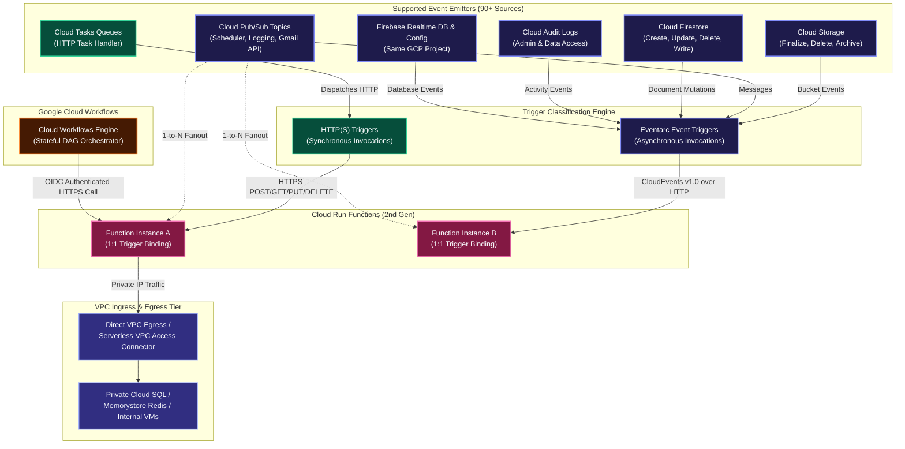
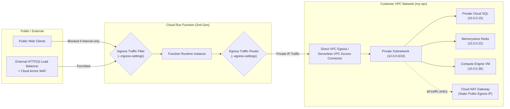
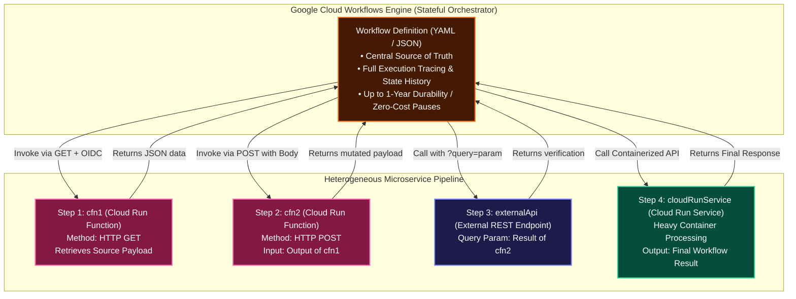

# Cloud Run Functions: Triggers, VPC Networking & Workflows Architecture Manual

A comprehensive engineering guide detailing **Function Triggers**, **Eventarc Integration**, **Virtual Private Cloud (VPC) Networking**, and **Google Cloud Workflows Orchestration** for Cloud Run functions (2nd Generation).

---

## 1. Function Triggers Architecture

Cloud Run functions executes code in response to external stimulation through **Triggers**. Every function deployment can configure exactly one trigger binding, connecting the function to HTTP traffic or asynchronous platform events.



---

## 2. Core Operational Rules: 1:1 Binding vs. 1:N Fan-Out

When architecting serverless event-driven systems on Google Cloud, two fundamental rules govern trigger topologies:

### Rule 1: Strict 1-to-1 Function-to-Trigger Binding
* A single Cloud Run function **can only be bound to one trigger at a time**.
* You *cannot* configure a single deployed function to listen simultaneously to both an HTTP endpoint and a Pub/Sub topic, or listen to two different Cloud Storage buckets.
* If a business capability must be accessible via both HTTP and Pub/Sub, deploy two separate functions sharing common business logic code.

### Rule 2: 1-to-N Event Source Fan-Out
* A single event source (e.g. a Cloud Storage bucket, a Pub/Sub topic, or a Firestore collection) can trigger **multiple independent Cloud Run functions**.
* Each function defines its own independent deployment and trigger configuration pointing to the same event source.
* Example: An image upload to `gs://user-media` can simultaneously trigger:
  1. `generate-thumbnails` (Cloud Run function 1)
  2. `extract-exif-metadata` (Cloud Run function 2)
  3. `audit-compliance-scan` (Cloud Run function 3)

---

## 3. In-Depth Trigger Types & Protocols

### 3.1 HTTP(S) Triggers
* **Protocols**: Exposes a dedicated HTTPS endpoint supporting standard HTTP verbs (`GET`, `POST`, `PUT`, `DELETE`, `PATCH`, `OPTIONS`).
* **Ingress URL Format**: `https://<REGION>-<PROJECT_ID>.cloudfunctions.net/<FUNCTION_NAME>` or `https://<SERVICE_NAME>-<HASH>-<REGION>.a.run.app`.
* **Security & Auth**:
  - Public webhooks / APIs: Configured with `--allow-unauthenticated`.
  - Internal / Service-to-Service: Configured with `--no-allow-unauthenticated`. Callers must supply an `Authorization: bearer $(gcloud auth print-identity-token)` containing an OpenID Connect (OIDC) token verifying `roles/run.invoker`.
* **Cloud Tasks Handler**: HTTP functions act as targets for Cloud Tasks queues, allowing asynchronous rate-limited execution with automatic exponential retries.

---

### 3.2 Cloud Pub/Sub Triggers
* **Underlying Architecture**: In Cloud Run functions (2nd gen), Pub/Sub triggers are managed as an Eventarc trigger under the hood. Eventarc provisions an internal Pub/Sub push subscription that converts messages into standardized CloudEvents delivered to the function container.
* **Payload Formatting**:
  - **Gen 2 (CloudEvent)**: The Pub/Sub payload is wrapped in standard CloudEvents v1.0 format (`cloudEvent.data.message.data` base64-encoded).
  - **Gen 1 (Legacy Background)**: Passed as a direct `event` object (`event.data`).
* **Ecosystem Event Bus Integration**:
  - **Cloud Scheduler**: Cron-based scheduled function execution by publishing messages to Pub/Sub on a cron cadence.
  - **Cloud Logging Sinks**: Log routing sinks that export matched log entries to Pub/Sub topics, triggering reactive remediation functions.
  - **Gmail Push Notification API**: Forwards mailbox changes to a Pub/Sub topic, which immediately executes a Cloud Run function to parse incoming email.

---

### 3.3 Cloud Storage Triggers
* **Trigger Mechanics**: Invoked whenever an object is mutated in a specified Google Cloud Storage bucket.
* **Supported Event Types**:
  1. `google.cloud.storage.object.v1.finalized` (New file created or overwritten)
  2. `google.cloud.storage.object.v1.deleted` (File deleted or archived)
  3. `google.cloud.storage.object.v1.archived` (Live version changed to noncurrent)
  4. `google.cloud.storage.object.v1.metadataUpdated` (Object metadata altered)
* **Payload Schema**:
  - Gen 2 passes `CloudEvents` containing metadata: `bucket`, `name`, `generation`, `size`, `contentType`, `timeCreated`.

---

### 3.4 Cloud Firestore Triggers
* **Scope & Restrictions**:
  - **Document-Level Only**: Firestore triggers execute **strictly at the document level**. You cannot trigger on individual field mutations within a document, nor can you listen to an entire collection without specifying a document path.
  - **Same Project Constraint**: The Firestore database **must reside in the same Google Cloud project** as the Cloud Run function.
* **Supported Event Types**:
  1. `google.cloud.firestore.document.v1.created`
  2. `google.cloud.firestore.document.v1.updated`
  3. `google.cloud.firestore.document.v1.deleted`
  4. `google.cloud.firestore.document.v1.written` (Fires on create, update, OR delete)
* **Document Path Wildcard Syntax**:
  - Target specific documents: `users/admin-user`
  - Target wildcard document IDs: `users/{userId}` or nested subcollections: `users/{userId}/orders/{orderId}`.
* **Data Snapshot Payload**:
  - Delivers `cloudEvent.data.value` (current document state) and `cloudEvent.data.oldValue` (state prior to mutation).

---

### 3.5 Firebase Triggers
Cloud Run functions can consume events generated by connected Firebase backend services:

| Firebase Service | Supported Generation | Description |
| :--- | :--- | :--- |
| **Firebase Realtime Database** | Gen 1 & Gen 2 | Triggers on data changes (`ref.create`, `ref.update`, `ref.delete`, `ref.write`). |
| **Firebase Remote Config** | Gen 1 & Gen 2 | Triggers when template updates are published. |
| **Google Analytics for Firebase** | **Gen 1 Only** | Triggers on specific in-app user conversion events. |
| **Firebase Authentication** | **Gen 1 Only** | Triggers upon user account creation (`user.create`) or deletion (`user.delete`). |

---

## 4. Connecting Cloud Run Functions to Virtual Private Cloud (VPC)

By default, Cloud Run functions run in an isolated multi-tenant network managed by Google, sending all outbound traffic over the public internet. To securely communicate with private enterprise resources (Cloud SQL, Memorystore Redis, private GKE microservices, or on-premises systems via Interconnect/VPN), configure **VPC Egress** and **Ingress Controls**.



---

### 4.1 Ingress Settings (Inbound Access Control)

Ingress settings control which network paths are permitted to invoke the function:

| Ingress Setting Flag Value | Permitted Traffic Sources | Recommended Production Use Case |
| :--- | :--- | :--- |
| `--ingress-settings=all` | Public internet, other VPC networks, Cloud Load Balancers, and GCP services. *(Default)* | Public webhooks, open developer APIs, or public callbacks. |
| `--ingress-settings=internal-only` | Traffic originating from the same VPC project, VPC Peering, Cloud VPN, or Interconnect. | Private microservices communicating strictly within internal enterprise boundaries. |
| `--ingress-settings=internal-and-cloud-load-balancing` | Traffic routed through an **External HTTP(S) Cloud Load Balancer** OR internal VPC clients. Direct internet requests to the raw `.run.app` URL are rejected with HTTP 403 Forbidden. | Production APIs requiring **Cloud Armor WAF**, DDoS mitigation, custom domains, and SSL termination. |

---

### 4.2 Egress Settings (Outbound Private Routing)

To route outbound function requests into your VPC network, configure either **Direct VPC Egress** (recommended for 2nd gen) or a **Serverless VPC Access Connector**.

#### Egress Traffic Routing Options:
1. **`private-ranges-only` (Default)**:
   - Only traffic destined for RFC 1918 private IP ranges (`10.0.0.0/8`, `172.16.0.0/12`, `192.168.0.0/16`) is routed into the customer VPC.
   - Public internet traffic exits directly via Google Cloud's default internet gateway.
2. **`all-traffic`**:
   - **All outbound traffic** (both private RFC 1918 and public internet traffic) is routed through your customer VPC.
   - **Critical Enterprise Use Case**: Allows Cloud Run functions to exit through a **Cloud NAT Gateway with fixed static external IP addresses**, enabling whitelisting on external third-party firewalls and payment gateways.

---

### 4.3 Serverless VPC Access Connector Architecture & Core Constraints

A **Serverless VPC Access Connector** is a managed regional resource composed of underlying connector VM instances that transparently handle traffic translation between the multi-tenant serverless environment and your private Google Cloud VPC Andromeda SDN fabric.

#### Core Architectural Constraints:
1. **Dedicated Exclusive `/28` CIDR Range**:
   - The connector requires an unreserved CIDR block with a **minimum `/28` mask** (16 IP addresses, e.g., `10.8.0.0/28`) or an existing dedicated custom subnet.
   - **Strict Rule**: The CIDR block must be allocated **strictly and exclusively** for the connector. It cannot overlap with any other subnetwork in the VPC network, and no Compute Engine VMs, containers, or other workloads may share this IP space.
2. **Strict Region Matching**:
   - The connector must be created in the **exact same Google Cloud region** as the Cloud Run functions communicating through it.
3. **Internal DNS & Private IP Resolution**:
   - Once connected, Cloud Run functions can resolve internal `.internal` DNS zone names and communicate directly with:
     - **Compute Engine VMs** via internal IP (`10.x.x.x`).
     - **Google Cloud Memorystore (Redis / Memcached)** clusters without public IPs.
     - **Private Cloud SQL instances** connected via VPC Service Networking peering.
     - **Internal Application Load Balancers (ILB)** and private microservices.
4. **Zero-Trust VPC Firewall Segmentation**:
   - Ingress and egress firewall rules within your VPC network can specifically target the connector's `/28` IP range or network tags to tightly restrict which backend internal databases or VMs the serverless functions can reach.
5. **Shared VPC Enterprise Topology**:
   - When deploying in enterprise organizations using Shared VPC, the Serverless VPC Access connector can be hosted in either the Shared VPC Host Project or the Service Project. The Serverless VPC Access Service Agent (`service-SERVICE_PROJECT_NUM@gcp-sa-vpcaccess.iam.gserviceaccount.com`) must be granted the `roles/compute.networkUser` role in the Host Project.

---

## 5. Orchestrating Functions with Google Cloud Workflows

While Eventarc provides decoupled event-driven *choreography*, complex enterprise architectures requiring sequential execution, conditional business branching, human-in-the-loop approvals, long delays, and robust distributed retries require centralized **Service Orchestration**.

**Google Cloud Workflows** is a fully-managed, serverless orchestration platform that executes services in a deterministic order that you define.



### 5.1 Architectural Benefits of Workflows
1. **Central Source of Truth**: Provides a single declarative definition for the entire end-to-end business transaction.
2. **Full Observability & State History**: Each execution is logged in Cloud Logging with detailed execution call trees, variable states, and error stack traces.
3. **Zero Cold-Start Stacking**: In chained calls (`Function A -> Function B -> Function C`), upstream functions sit idle while waiting for downstream responses, incurring ongoing memory/CPU billing. Workflows pauses execution state at **zero cost** while waiting for HTTP responses.
4. **Long-Running Workflows (Up to 1 Year)**: Workflows can pause, sleep, poll, or wait for asynchronous callbacks for up to **365 days**, enabling long-running business processes.
5. **Native Security**: Injects signed OpenID Connect (OIDC) identity tokens automatically to invoke private Cloud Run functions and Cloud Run services without managing API keys.

---

### 5.2 Multi-Service Workflow Implementation (`workflow.yaml`)

The following production workflow implements the complete 4-tier heterogeneous pipeline linking **`cfn1` (HTTP GET)**, **`cfn2` (HTTP POST)**, an **External REST API**, and a downstream **Cloud Run container service**:

```yaml
# workflow.yaml - Orchestrating Cloud Run Functions, External APIs, and Cloud Run Services
main:
  params: [args]
  steps:
    # ── STEP 0: INITIALIZE RUNTIME CONSTANTS ────────────────────────────────
    - initConstants:
        assign:
          - projectId: ${sys.get_env("GOOGLE_CLOUD_PROJECT_ID")}
          - region: "us-central1"
          - inputUserId: ${args.userId}

    # ── STEP 1: INVOKE CFN1 (HTTP GET) ─────────────────────────────────────
    - callCloudFunction1:
        call: http.get
        args:
          url: ${"https://" + region + "-" + projectId + ".cloudfunctions.net/cfn1"}
          auth:
            type: OIDC
          query:
            userId: ${inputUserId}
        result: cfn1Response

    # ── STEP 2: INVOKE CFN2 (HTTP POST WITH CFN1 OUTPUT) ───────────────────
    - callCloudFunction2:
        call: http.post
        args:
          url: ${"https://" + region + "-" + projectId + ".cloudfunctions.net/cfn2"}
          auth:
            type: OIDC
          body:
            initialData: ${cfn1Response.body}
            timestamp: ${sys.now()}
        result: cfn2Response

    # ── STEP 3: CALL EXTERNAL REST API WITH CFN2 RESULT AS QUERY PARAM ──────
    - callExternalApi:
        try:
          call: http.get
          args:
            url: "https://api.external-partner.com/v1/verify"
            query:
              token: ${cfn2Response.body.verificationToken}
              score: ${cfn2Response.body.riskScore}
          result: externalApiResponse
        retry:
          predicate: ${http.default_retry_predicate}
          max_retries: 5
          backoff:
            initial_delay: 2
            max_delay: 30
            multiplier: 2

    # ── STEP 4: INVOKE CLOUD RUN SERVICE (FINAL HEAVY CONTAINER PROCESSING) 
    - callCloudRunService:
        call: http.post
        args:
          url: ${"https://data-aggregator-service-" + projectId + "." + region + ".run.app/process"}
          auth:
            type: OIDC
          body:
            cfn1Data: ${cfn1Response.body}
            cfn2Data: ${cfn2Response.body}
            externalStatus: ${externalApiResponse.body.status}
        result: cloudRunResponse

    # ── STEP 5: RETURN FINAL WORKFLOW RESULT ────────────────────────────────
    - returnFinalResult:
        return:
          workflowStatus: "COMPLETED"
          userId: ${inputUserId}
          finalOutput: ${cloudRunResponse.body}
```

---

### 5.3 Equivalent Workflow Definition in JSON Format (`workflow.json`)

Google Cloud Workflows fully supports JSON as a first-class definition format:

```json
{
  "main": {
    "params": ["args"],
    "steps": [
      {
        "initConstants": {
          "assign": [
            { "projectId": "${sys.get_env(\"GOOGLE_CLOUD_PROJECT_ID\")}" },
            { "region": "us-central1" },
            { "inputUserId": "${args.userId}" }
          ]
        }
      },
      {
        "callCloudFunction1": {
          "call": "http.get",
          "args": {
            "url": "${\"https://\" + region + \"-\" + projectId + \".cloudfunctions.net/cfn1\"}",
            "auth": { "type": "OIDC" },
            "query": { "userId": "${inputUserId}" }
          },
          "result": "cfn1Response"
        }
      },
      {
        "callCloudFunction2": {
          "call": "http.post",
          "args": {
            "url": "${\"https://\" + region + \"-\" + projectId + \".cloudfunctions.net/cfn2\"}",
            "auth": { "type": "OIDC" },
            "body": {
              "initialData": "${cfn1Response.body}",
              "timestamp": "${sys.now()}"
            }
          },
          "result": "cfn2Response"
        }
      },
      {
        "callExternalApi": {
          "call": "http.get",
          "args": {
            "url": "https://api.external-partner.com/v1/verify",
            "query": {
              "token": "${cfn2Response.body.verificationToken}",
              "score": "${cfn2Response.body.riskScore}"
            }
          },
          "result": "externalApiResponse"
        }
      },
      {
        "callCloudRunService": {
          "call": "http.post",
          "args": {
            "url": "${\"https://data-aggregator-service-\" + projectId + \".\" + region + \".run.app/process\"}",
            "auth": { "type": "OIDC" },
            "body": {
              "cfn1Data": "${cfn1Response.body}",
              "cfn2Data": "${cfn2Response.body}",
              "externalStatus": "${externalApiResponse.body.status}"
            }
          },
          "result": "cloudRunResponse"
        }
      },
      {
        "returnFinalResult": {
          "return": {
            "workflowStatus": "COMPLETED",
            "userId": "${inputUserId}",
            "finalOutput": "${cloudRunResponse.body}"
          }
        }
      }
    ]
  }
}
```

---

## 6. Production CLI Command Reference

### 6.1 Deploying Functions with Eventarc Triggers

#### 1. Cloud Storage Bucket Trigger:
```bash
gcloud functions deploy gcs-thumbnail-generator \
  --gen2 \
  --region=us-central1 \
  --runtime=nodejs20 \
  --entry-point=generateThumbnail \
  --source=. \
  --trigger-bucket=my-media-bucket \
  --trigger-location=us-central1
```

#### 2. Pub/Sub Topic Trigger:
```bash
gcloud functions deploy pubsub-log-processor \
  --gen2 \
  --region=us-central1 \
  --runtime=python311 \
  --entry-point=process_pubsub_log \
  --source=. \
  --trigger-topic=security-audit-events
```

#### 3. Firestore Document Mutation Trigger:
```bash
gcloud functions deploy firestore-user-sync \
  --gen2 \
  --region=us-central1 \
  --runtime=nodejs20 \
  --entry-point=syncUserRecord \
  --source=. \
  --trigger-location=nam5 \
  --trigger-event-filters="type=google.cloud.firestore.document.v1.written" \
  --trigger-event-filters="database=(default)" \
  --trigger-event-filters-path-pattern="document=users/{userId}"
```

---

### 6.2 Configuring Serverless VPC Access & Network Controls

#### Step 1: Enable Serverless VPC Access API
```bash
gcloud services enable vpcaccess.googleapis.com
```

#### Step 2: Create Serverless VPC Access Connector (with Dedicated /28 Range)
```bash
# Creates regional connector handling traffic into the VPC
gcloud compute networks vpc-access connectors create vpc-conn-us-central1 \
  --region=us-central1 \
  --network=my-custom-vpc \
  --range=10.8.0.0/28 \
  --min-instances=2 \
  --max-instances=10 \
  --machine-type=e2-micro
```

#### Step 3: Configure Ingress Firewall Rule for Connector Traffic
```bash
# Allow traffic originating from the connector (/28) to reach private databases
gcloud compute firewall-rules create allow-from-serverless-connector \
  --network=my-custom-vpc \
  --action=ALLOW \
  --direction=INGRESS \
  --source-ranges=10.8.0.0/28 \
  --rules=tcp:3306,tcp:5432,tcp:6379,tcp:80,tcp:443 \
  --target-tags=private-backend
```

#### Step 4: Shared VPC Host Project Permission Binding (If Applicable)
```bash
export SERVICE_PROJECT_NUMBER=$(gcloud projects describe my-service-project --format='value(projectNumber)')

# Grant Serverless VPC Access Service Agent permission in the Host Project
gcloud projects add-iam-policy-binding my-shared-vpc-host-project \
  --member="serviceAccount:service-${SERVICE_PROJECT_NUMBER}@gcp-sa-vpcaccess.iam.gserviceaccount.com" \
  --role="roles/compute.networkUser"
```

#### Step 5: Deploy Cloud Run Function Connected to VPC
```bash
# Deploy function routing private RFC 1918 traffic through the connector
gcloud functions deploy database-backend-service \
  --gen2 \
  --region=us-central1 \
  --runtime=nodejs20 \
  --entry-point=queryDatabase \
  --source=. \
  --vpc-connector=projects/my-custom-project/locations/us-central1/connectors/vpc-conn-us-central1 \
  --vpc-egress=private-ranges-only \
  --ingress-settings=internal-only
```

---

### 6.3 Deploying and Executing Cloud Workflows

#### Step 1: Enable Workflows API & Provision Dedicated Service Account
```bash
# Enable Workflows API
gcloud services enable workflows.googleapis.com

# Create dedicated Workflow execution Service Account
gcloud iam service-accounts create workflow-orchestrator-sa \
  --display-name="Workflows Orchestrator Identity"

# Grant permission to invoke Cloud Run and Cloud Run functions
gcloud projects add-iam-policy-binding my-prod-project \
  --member="serviceAccount:workflow-orchestrator-sa@my-prod-project.iam.gserviceaccount.com" \
  --role="roles/run.invoker"

gcloud projects add-iam-policy-binding my-prod-project \
  --member="serviceAccount:workflow-orchestrator-sa@my-prod-project.iam.gserviceaccount.com" \
  --role="roles/cloudfunctions.invoker"
```

#### Step 2: Deploy Workflow Definition (YAML / JSON)
```bash
# Deploy declarative workflow pipeline
gcloud workflows deploy order-orchestrator \
  --location=us-central1 \
  --source=workflow.yaml \
  --service-account=workflow-orchestrator-sa@my-prod-project.iam.gserviceaccount.com
```

#### Step 3: Execute Workflow & Inspect State
```bash
# Execute workflow passing runtime parameters
gcloud workflows run order-orchestrator \
  --location=us-central1 \
  --data='{"userId": "USER-48921"}'

# List executions and view execution status
gcloud workflows executions list order-orchestrator \
  --location=us-central1 \
  --limit=5

# Describe execution output and call tree logs
gcloud workflows executions describe <EXECUTION_ID> \
  --workflow=order-orchestrator \
  --location=us-central1
```
