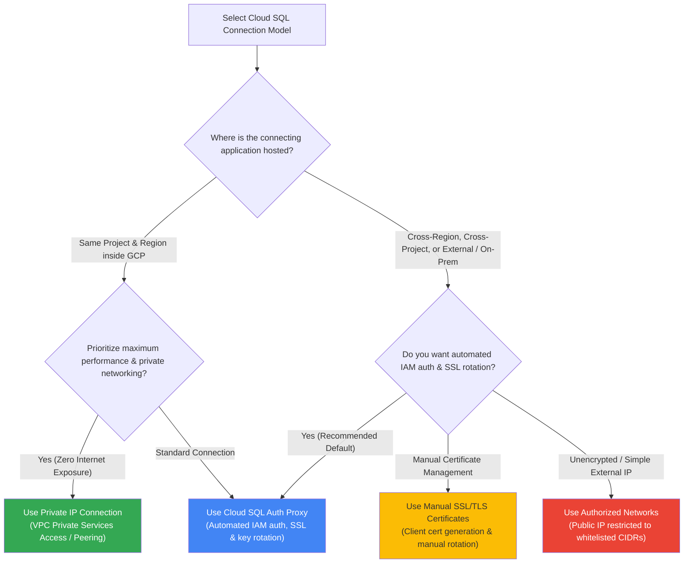
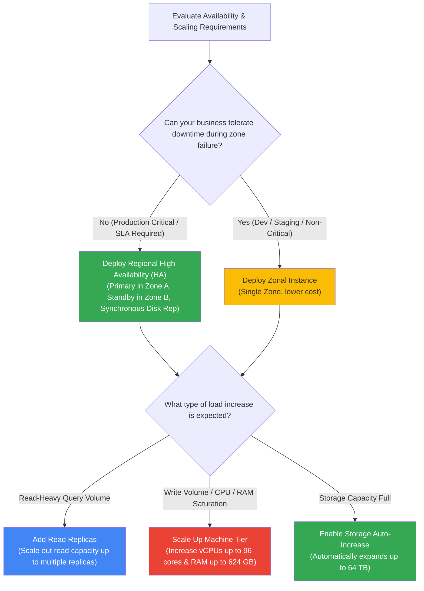

# Cloud SQL: Decision Trees (ASCII & Visual)

This document provides architectural decision trees for selecting GCP relational database services (Cloud SQL vs. Cloud Spanner vs. BigQuery vs. Memorystore), connection models, and High Availability configurations.

---

## 1. GCP Database & Storage Selection (ASCII Decision Tree)

```
================================================================================
                GCP DATABASE & DATA STORE SELECTION DECISION TREE
================================================================================

                  What type of data and workload is required?
                                       │
        ┌──────────────────────────────┼──────────────────────────────┐
        ▼                              ▼                              ▼
 [ In-Memory Caching ]          [ Relational Analytics ]        [ Relational OLTP / HTAP ]
  Microsecond response,          Data Warehousing, SQL          Transactional & Hybrid SQL,
  real-time analytics, gaming    reporting over petabytes       ACID compliance
        │                              │                              │
        ▼                              ▼                              │
 [ MEMORYSTORE ]                [ BIGQUERY ]                          │
  Managed Redis/Memcached        Serverless Data Warehouse            │
                                                                      ▼
                                                   Do you need global scale / horizontal scaling?
                                                                      │
                        ┌─────────────────────────────────────────────┴─────────────────────────────────────────────┐
                        ▼                                                                                           ▼
                     [ YES ]                                                                                     [ NO ]
              [ CLOUD SPANNER ]                                                             Is this a high-demanding HTAP / PostgreSQL workload?
              Unlimited scale, global                                                                               │
              synchronous transactions                                                          ┌───────────────────┴───────────────────┐
                                                                                                ▼                                       ▼
                                                                                             [ YES ]                                  [ NO ]
                                                                                       [ ALLOYDB POSTGRES ]                       [ CLOUD SQL ]
                                                                                       >4x OLTP, 100x OLAP,                       Cost-effective managed
                                                                                       99.99% SLA, Columnar                       MySQL, Postgres, SQL Server
```

---

## 2. Connection Strategy Flowchart



---

## 3. High Availability & Scaling Decision Tree


