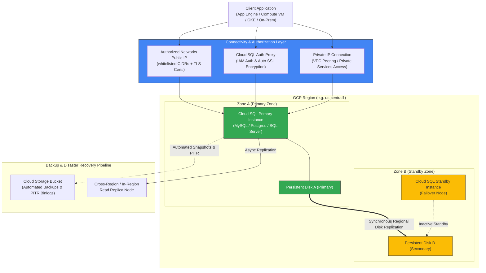
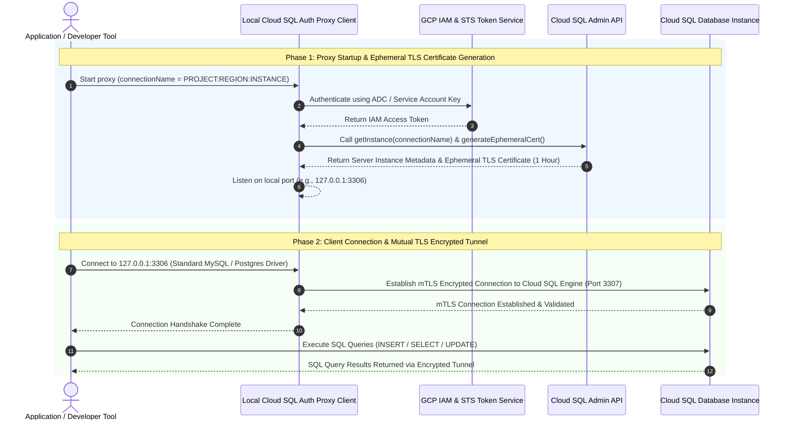
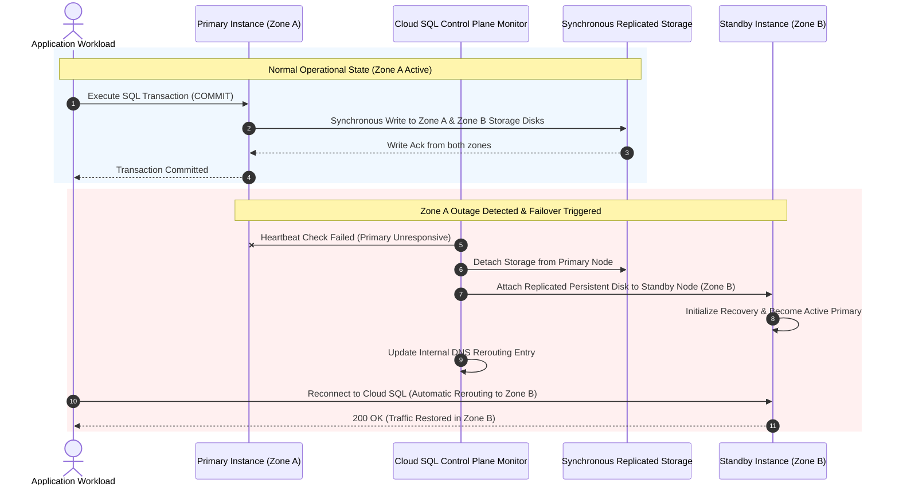
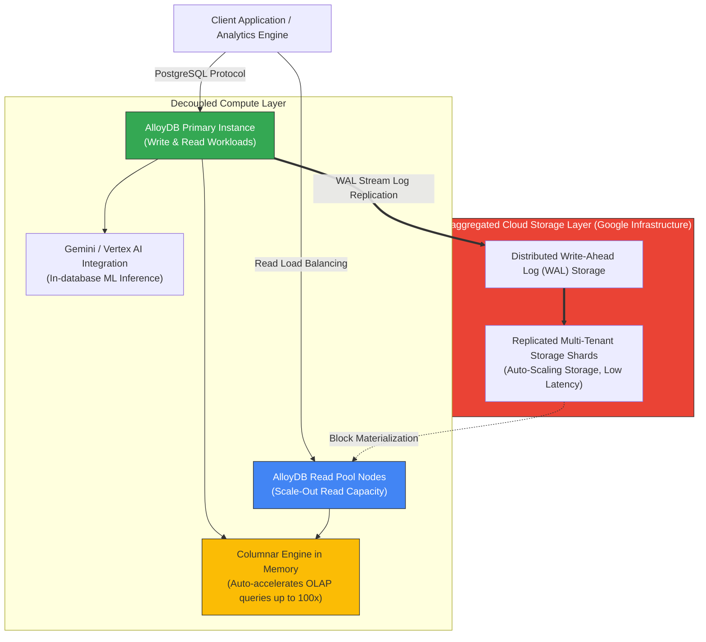

# Cloud SQL: High-Level Design (HLD) & Low-Level Design (LLD)

This document details the architectural design for **Google Cloud SQL**, covering High Availability (HA) failover mechanics, synchronous disk replication, Private IP VPC peering, and Cloud SQL Auth Proxy security architectures.

---

## 1. High-Level Design (HLD) Architecture

The High-Level Architecture illustrates regional High Availability deployment, synchronous persistent disk replication, client connectivity paths, and automated backup/recovery pipelines:

### Key HLD Architectural Components:
1. **Regional High Availability (HA)**:
   - **Primary Instance**: Active instance in Zone A handling all read and write queries.
   - **Standby Instance**: Standby node in Zone B.
   - **Synchronous Disk Replication**: Every write transaction is synchronously replicated to persistent disks across both Zone A and Zone B before the transaction is reported as committed.
2. **Failover Execution**: In the event of a zone or primary instance failure, the persistent disk is attached to the standby node, which becomes the new primary instance. Traffic is automatically rerouted.
3. **Connectivity Models**:
   - **Private IP**: Maximum performance and zero internet exposure using VPC Private Services Access.
   - **Cloud SQL Auth Proxy**: Recommended for external or cross-region traffic; handles IAM authentication and TLS certificate rotation automatically.

---

## 2. Low-Level Design (LLD)

### 2.1 Cloud SQL Auth Proxy Connection Sequence

The Auth Proxy uses IAM credentials to authorize access and generates ephemeral SSL/TLS certificates automatically:

---

### 2.2 High Availability (HA) Failover Sequence

When a failure occurs in Zone A, Cloud SQL automatically executes failover to Zone B:

---

### 2.3 LLD Mechanics Summary:
* **Private Services Access (VPC Peering)**: Private IP connections utilize an internal Google-managed VPC peered to the customer VPC, guaranteeing zero public IP exposure.
* **Point-In-Time Recovery (PITR)**: Uses daily base disk snapshots combined with continuous binary log (`binlog` / `wal`) archiving in GCS, allowing recovery to any exact second within the retention window.
* **Vertical Scaling Restart**: Upgrading CPU or RAM tier patches the underlying compute VM, causing a brief restarting window during which HA standby nodes minimize downtime.

---

## 3. AlloyDB for PostgreSQL Disaggregated Multi-Node Architecture

AlloyDB decouples database compute processing from a disaggregated, multi-tenant storage layer to deliver **99.99% uptime SLA** (inclusive of maintenance) and $>4\times$ transactional / $100\times$ analytical performance over standard PostgreSQL:

### Key AlloyDB Mechanics:
* **Decoupled Log-Store Architecture**: Transactions commit as soon as WAL entries are persisted to the low-latency log store. Storage shard materialization occurs asynchronously in the background.
* **In-Memory Columnar Engine**: Automatically converts hot row-oriented relational data into in-memory columnar format for analytical queries, accelerating OLAP performance by up to $100\times$.
* **ML-Driven Adaptive Vacuuming**: Machine learning algorithms optimize PostgreSQL vacuuming, memory allocation, and data tiering without manual DBA tuning.

