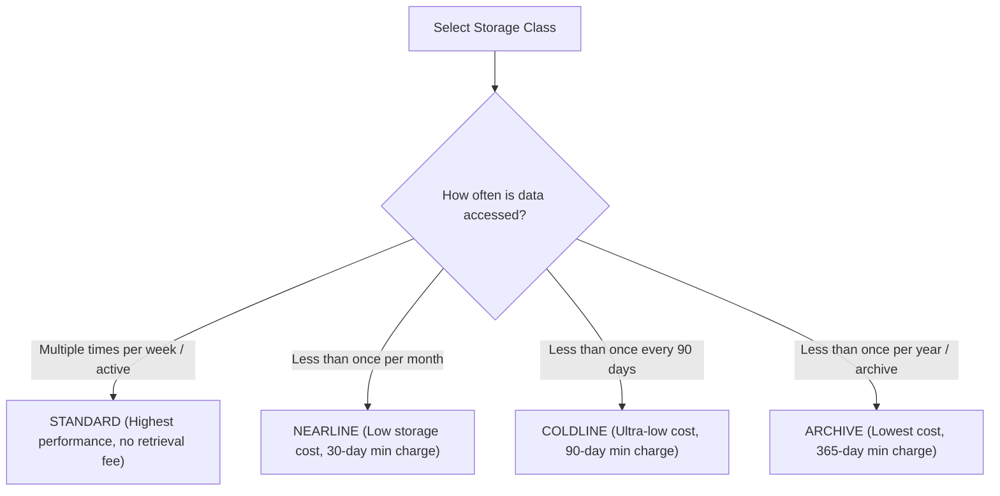

# Cloud Storage: Decision Trees (ASCII & Visual)

This document provides decision logic trees for selecting Cloud Storage classes, location redundancy strategies, and access security models.

---

## 1. Storage Class Selection (ASCII Decision Tree)

```
================================================================================
                    CLOUD STORAGE CLASS DECISION TREE
================================================================================

                    How frequently is your object data accessed?
                                       │
        ┌──────────────────────────────┼──────────────────────────────┐
        ▼                              ▼                              ▼
 [ Multiple Times / Month ]    [ Once Per Month ]            [ Infrequent Access ]
  Active Web Assets, API Logs,  Monthly Backups,              Archival & Disaster Recovery
  Data Processing Input         Reporting Data
        │                              │                              │
        ▼                              ▼                              ├──────────────────────────────┐
 [ STANDARD CLASS ]            [ NEARLINE CLASS ]                     ▼                              ▼
  No retrieval fees             Low storage cost               [ Once per 90 Days ]           [ Once per Year ]
  Highest availability          30-day min charge              COLDLINE CLASS                 ARCHIVE CLASS
                                                               90-day min charge              365-day min charge
```

---

## 2. Location Strategy (ASCII Decision Tree)

```
================================================================================
                    BUCKET LOCATION STRATEGY DECISION TREE
================================================================================

                    What are your data distribution requirements?
                                       │
        ┌──────────────────────────────┼──────────────────────────────┐
        ▼                              ▼                              ▼
 [ Lowest Latency ]            [ High Availability ]          [ Global Content ]
  Single Region compute         Active-Active failover         Global distribution
  e.g. us-central1              e.g. nam4 (us-central+east)    e.g. US / EU Multi-Region
        │                              │                              │
        ▼                              ▼                              ▼
 [ REGIONAL BUCKET ]           [ DUAL-REGION BUCKET ]         [ MULTI-REGION BUCKET ]
```

---

## 3. Visual Mermaid Decision Flowcharts

### Storage Class Flowchart:


### Location Redundancy Flowchart:
```mermaid
graph TD
    StartLoc["Select Bucket Location"] --> LocType{"Distribution Requirement?"}
    
    LocType -->|Single Region (Lowest Latency / In-Region Compute)| Region["Regional (e.g. us-central1)"]
    LocType -->|Dual-Region (High Availability / Active-Active)| Dual["Dual-Region (e.g. nam4: us-central1 + us-east1)"]
    LocType -->|Multi-Region (Global Content Distribution)| Multi["Multi-Region (e.g. US / EU / ASIA)"]
```
