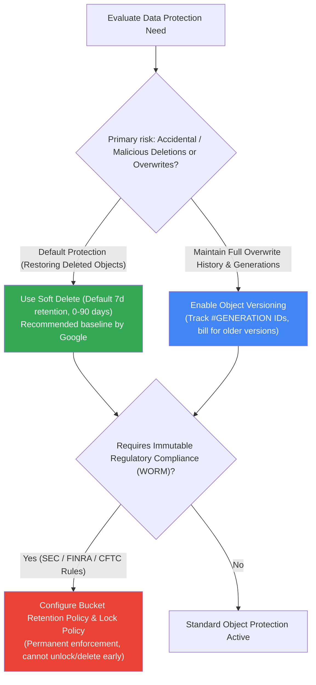
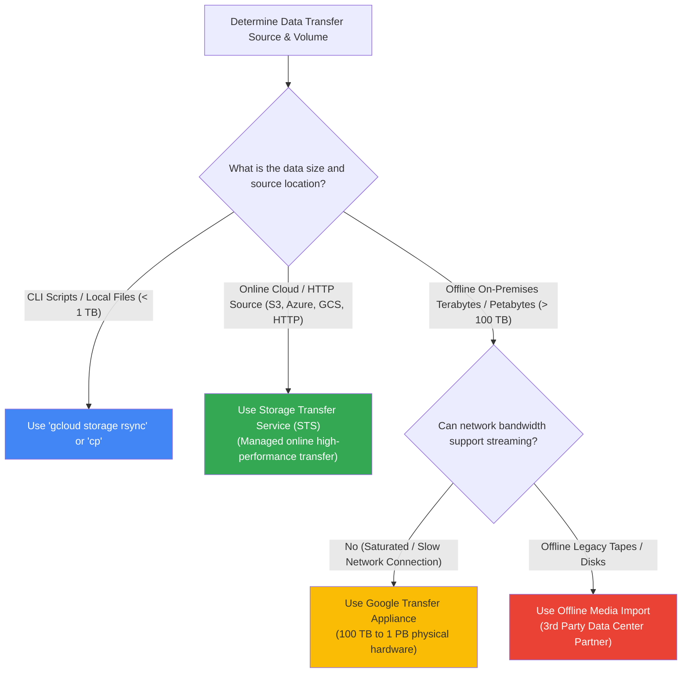
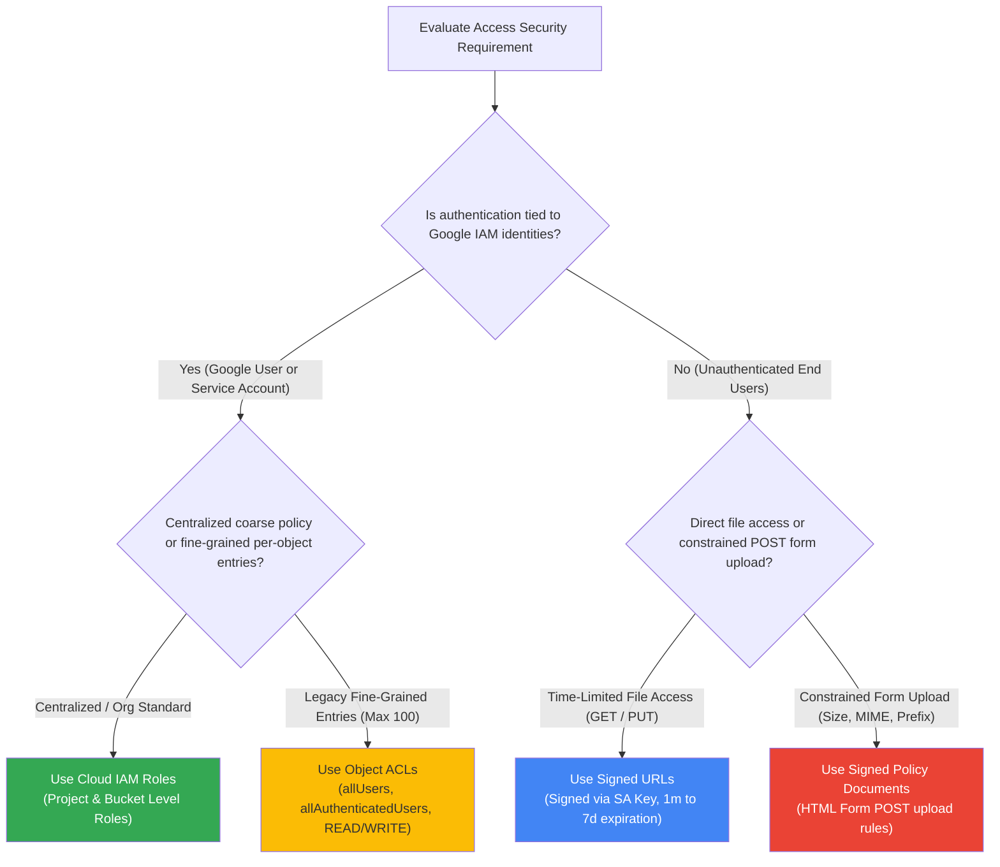
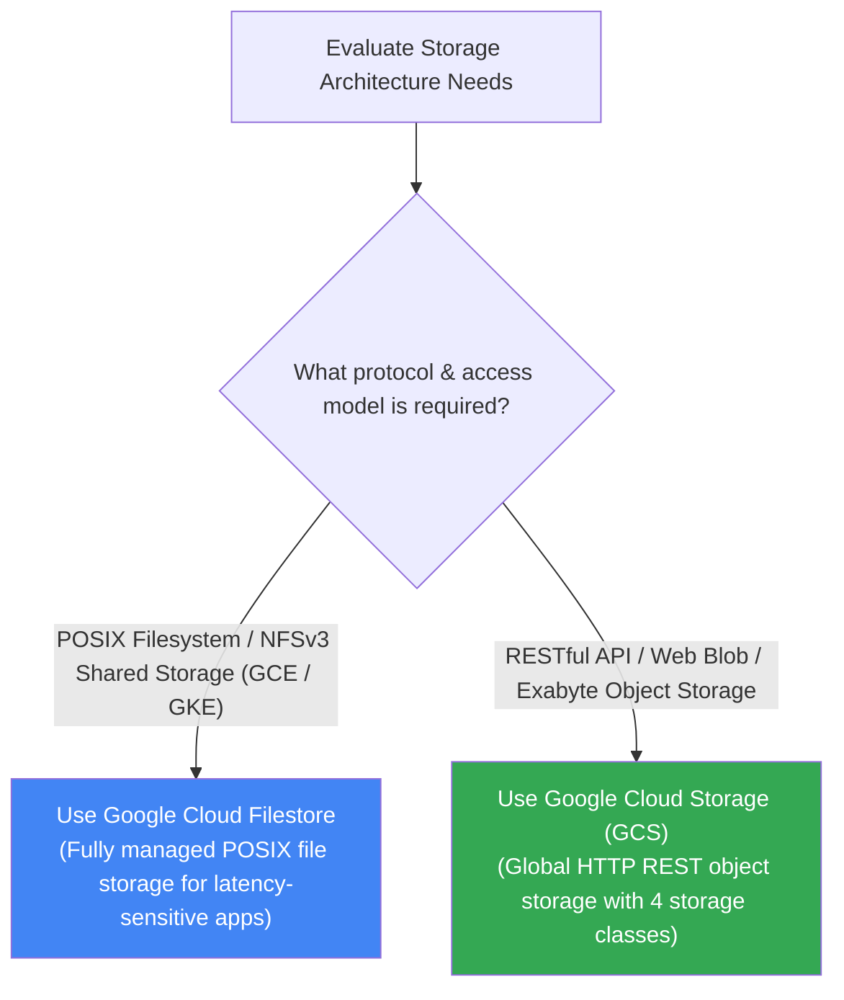

# Cloud Storage: Decision Trees (ASCII & Visual)

This document provides architectural decision trees for selecting Cloud Storage classes, location redundancy strategies, data protection/recovery models, access security frameworks, and data ingestion services.

---

## 1. Storage Class & Automation Strategy (ASCII Decision Tree)

```
================================================================================
                    CLOUD STORAGE CLASS DECISION TREE
================================================================================

                    How frequently is your object data accessed?
                                       │
        ┌──────────────────────────────┼──────────────────────────────┐
        ▼                              ▼                              ▼
 [ Multiple Times / Month ]    [ Once Per Month ]            [ Infrequent Access ]
  Active Web Assets, API Logs,  Monthly Backups,              Archival & Disaster Recovery
  Data Processing Input         Reporting Data
        │                              │                              │
        ▼                              ▼                              ├──────────────────────────────┐
 [ STANDARD CLASS ]            [ NEARLINE CLASS ]                     ▼                              ▼
  No retrieval fees             Low storage cost               [ Once per 90 Days ]           [ Once per Year ]
  Highest availability          30-day min charge              COLDLINE CLASS                 ARCHIVE CLASS
                                                               90-day min charge              365-day min charge

────────────────────────────────────────────────────────────────────────────────
                    STORAGE CLASS AUTOMATION DECISION
────────────────────────────────────────────────────────────────────────────────

               Do object access patterns change unpredictably?
                                       │
                   ┌───────────────────┴───────────────────┐
                   ▼                                       ▼
                 [ YES ]                                 [ NO ]
    Enable Autoclass on bucket              Configure Object Lifecycle Rules (OLM)
    (Managed automated tiering)             (Static age / date / versioning rules)
```

---

## 2. Location Strategy (ASCII Decision Tree)

```
================================================================================
                    BUCKET LOCATION STRATEGY DECISION TREE
================================================================================

                    What are your data distribution requirements?
                                       │
        ┌──────────────────────────────┼──────────────────────────────┐
        ▼                              ▼                              ▼
 [ Lowest Latency ]            [ High Availability ]          [ Global Content ]
  Single Region compute         Active-Active failover         Global web assets,
  e.g. us-central1              e.g. nam4 (us-central+east)    streaming, mobile/gaming
        │                              │                              │
        ▼                              ▼                              ▼
 [ REGIONAL BUCKET ]           [ DUAL-REGION BUCKET ]         [ MULTI-REGION BUCKET ]
```

---

## 3. Data Protection & Recovery Strategy (Soft Delete vs Versioning vs Lock)



---

## 4. Data Ingestion Service Decision Tree



---

## 5. Security & Access Control Model Decision Tree



---

## 6. Unstructured Storage Architecture: Filestore vs Cloud Storage



