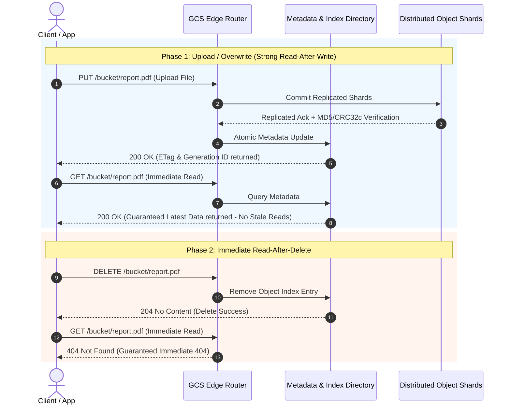
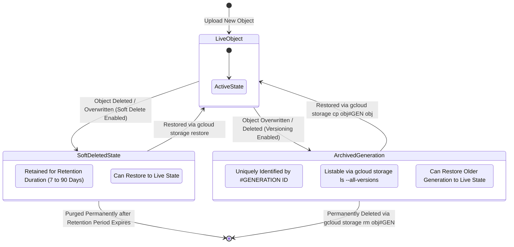
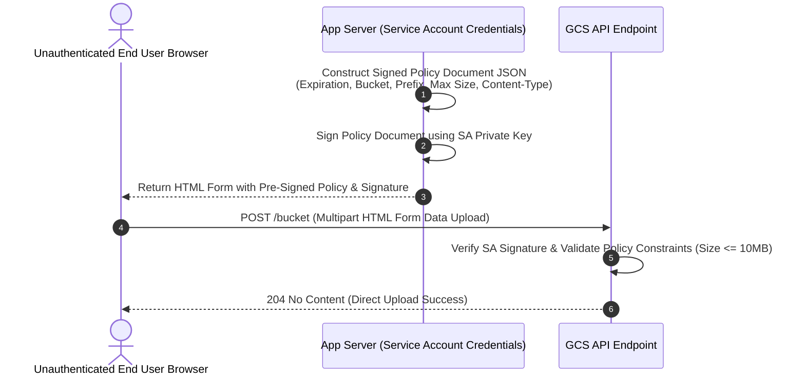
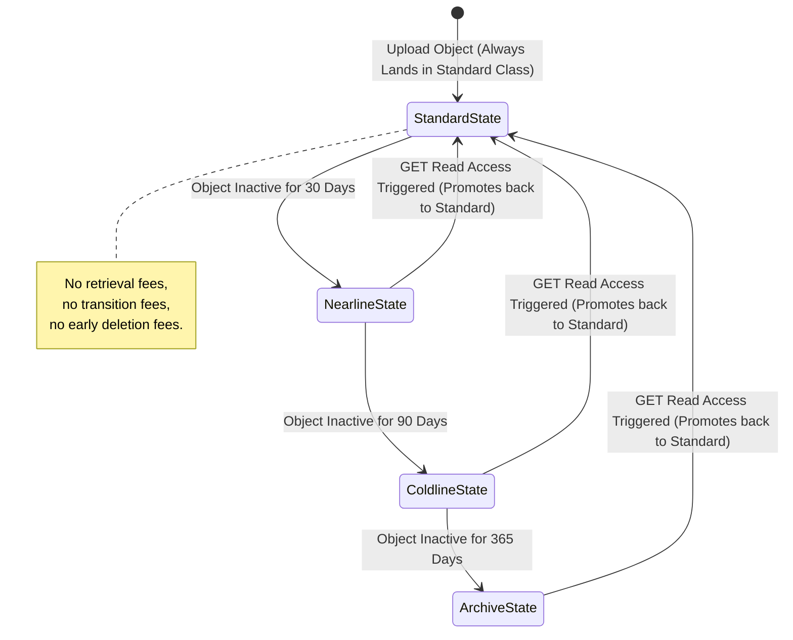

# Cloud Storage: High-Level Design (HLD) & Low-Level Design (LLD)

This document details the architectural design for **Google Cloud Storage (Buckets & Objects)**, covering storage classes, location strategies, data protection recovery primitives, security models, and data transfer engines.

---

## 1. High-Level Design (HLD)

The High-Level Architecture illustrates global bucket deployment, client access patterns, Object Lifecycle rules, IAM Security, KMS/CSEK encryption layers, and ingestion options:

```mermaid
graph TD
    Client["Client / Application"] -->|HTTPS / gcloud / API| GCSFront["GCS Global Anycast Edge Router"]
    
    subgraph Ingestion ["Data Ingestion Services"]
        STS["Storage Transfer Service<br/>(Online AWS S3 / HTTP / GCS Sync)"]
        TA["Transfer Appliance<br/>(100TB - 1PB Physical Hardware)"]
        OMI["Offline Media Import<br/>(3rd Party Physical Media)"]
    end
    
    STS --> GCSFront
    TA --> GCSFront
    OMI --> GCSFront

    subgraph GCS ["Google Cloud Storage Infrastructure"]
        GCSFront -->|Auth Check| IAM["IAM Policies & Fine-Grained ACLs"]
        IAM -->|Authorized| Bucket["Storage Bucket (gs://prod-app-data)"]
        
        subgraph Bucket ["Storage Bucket (Multi-Region / Dual-Region / Regional)"]
            Standard["Standard Class<br/>(Hot Data, 0-day Min Duration)"]
            Nearline["Nearline Class<br/>(Infrequent Data, 30-day Min)"]
            Coldline["Coldline Class<br/>(Cold Data, 90-day Min)"]
            Archive["Archive Class<br/>(Long-term Compliance, 365-day Min)"]
        end
        
        Lifecycle Engine["Lifecycle Engine / Autoclass"] -->|Rules / Access Patterns| Nearline
        Lifecycle Engine -->|Age / Access| Coldline
        Lifecycle Engine -->|Age / Access| Archive

        subgraph Protection ["Data Recovery & WORM Controls"]
            SoftDelete["Soft Delete Pool<br/>(Default 7d, Up to 90d Retention)"]
            Versioning["Object Versioning<br/>(Archived Generations #GEN)"]
            WORM["Object Retention Lock<br/>(Locked SEC/FINRA WORM Policy)"]
        end
        
        Bucket --> Protection
    end
    
    Bucket -->|Encryption at Rest| KMS["Cloud KMS (CMEK) / CSEK / Google Keys"]

    style GCSFront fill:#4285F4,stroke:#333,color:#fff
    style Bucket fill:#34A853,stroke:#333,color:#fff
    style Protection fill:#FBBC05,stroke:#333,color:#333
```

### Key HLD Architectural Components:
1. **Global Anycast Ingress**: Requests are automatically routed to the nearest Google Edge Point of Presence (PoP) for sub-second first-byte latency across all storage classes.
2. **Durability vs. Availability**:
   - **Durability**: All storage classes provide **11 nines ($99.999999999\%$) annual durability** (data loss prevention).
   - **Availability**: Availability varies by storage class and location type (e.g., Multi-region Standard $99.95\%$, Regional Nearline $99.0\%$).
3. **Storage Classes & Min Retention**:
   - **Standard**: Hot data, zero minimum retention, no retrieval fee.
   - **Nearline**: Backup data accessed $<1$ /month, 30-day min charge.
   - **Coldline**: Disaster recovery accessed $<1$ /90 days, 90-day min charge.
   - **Archive**: Compliance archives accessed $<1$ /year, 365-day min charge, sub-second availability.
4. **Data Ingestion Engines**:
   - **Storage Transfer Service**: Scale online transfers from AWS S3, Azure Blob, or HTTP sources into GCS.
   - **Transfer Appliance**: Secure hardware devices (100 TB to 1 PB) shipped for offline data center migration.

---

## 2. Low-Level Design (LLD)

### 2.1 Strong Global Consistency Read-After-Write & Read-After-Delete Timeline

GCS guarantees **Strong Global Consistency** across all upload, update, delete, object listing, and bucket listing operations:



---

### 2.2 Soft Delete vs Object Versioning State Engine



---

### 2.3 Access Control & Signed Policy Document Flow



---

### 2.5 Autoclass State Machine Engine



---

### 2.6 LLD Mechanics Summary:
* **In-Place Storage Class Mutation**: Mutating an object's storage class (e.g., Standard to Coldline) modifies the object metadata in place without changing its URL, generation key, or moving file bytes across buckets.
* **Autoclass Promotion**: Under Autoclass, all uploads land in Standard Storage regardless of request parameters. Reading an object automatically promotes it back to Standard Storage with zero retrieval or transition penalties.
* **WORM Retention Lock**: Enforces immutable storage rules (`retentionPeriod`) for SEC/FINRA compliance. Once locked, policies cannot be weakened or removed by any IAM identity.
* **CSEK Key Handling**: Customer-supplied keys (AES-256) are held in memory for the duration of the request and never stored on Google servers.

