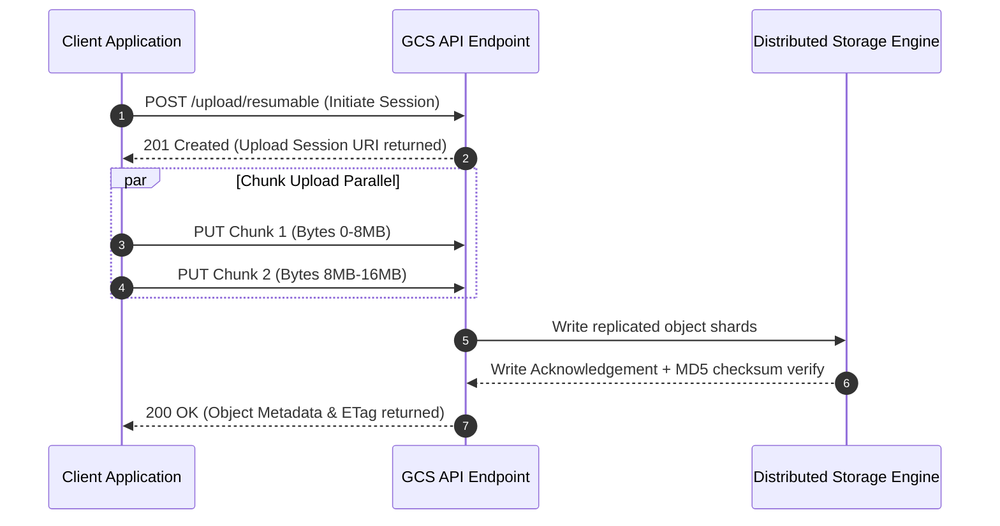

# Cloud Storage: High-Level Design (HLD) & Low-Level Design (LLD)

This document details the architectural design for **Google Cloud Storage (Buckets & Objects)**.

---

## 1. High-Level Design (HLD)

The High-Level Architecture illustrates global bucket deployment, client access patterns, Object Lifecycle rules, IAM Security, and KMS encryption layers:

```mermaid
graph TD
    Client["Client / Application"] -->|REST API / HTTPS| GCSFront["GCS Global Anycast Edge Router"]
    
    subgraph GCS ["Google Cloud Storage Infrastructure"]
        GCSFront -->|Authentication| IAM["Cloud IAM & Bucket Policy"]
        IAM -->|Authorized| Bucket["Storage Bucket (gs://prod-company-assets)"]
        
        subgraph Bucket ["Storage Bucket (Multi-Region US)"]
            Standard["Standard Storage Tier (Active Data)"]
            Nearline["Nearline Tier (30-day Backup)"]
            Coldline["Coldline Tier (90-day Backup)"]
            Archive["Archive Tier (1-year Compliance)"]
        end
        
        Lifecycle Engine["Lifecycle Auto-Tiering Engine"] -->|Age > 30 days| Nearline
        Lifecycle Engine -->|Age > 90 days| Coldline
        Lifecycle Engine -->|Age > 365 days| Archive
    end
    
    Bucket -->|Encryption at Rest| KMS["Cloud KMS (Customer Managed Keys)"]
```

### Key HLD Components:
1. **Global Anycast Ingress**: Requests are automatically routed to the nearest Google Edge Point of Presence (PoP) for minimum latency.
2. **Storage Classes**: Tiered storage models matching data access frequency to cost structure.
3. **Lifecycle Management**: Automated background jobs migrating or purging objects based on user-defined JSON rules.
4. **Security & Encryption**: 256-bit AES encryption applied at rest automatically, with optional Customer-Managed Encryption Keys (CMEK).

---

## 2. Low-Level Design (LLD)

### Multipart Chunked Parallel Upload Flow:



### LLD Internal Mechanics:
* **Strong Global Consistency**: GCS provides immediate read-after-write consistency for all upload, overwrite, and delete operations globally.
* **Uniform Bucket-Level Access**: Disables legacy per-object ACLs, enforcing centralized, auditable Cloud IAM policies across all objects in a bucket.
* **Checksum Verification**: GCS computes MD5 and CRC32c hashes during upload streams, rejecting corrupted uploads automatically.
