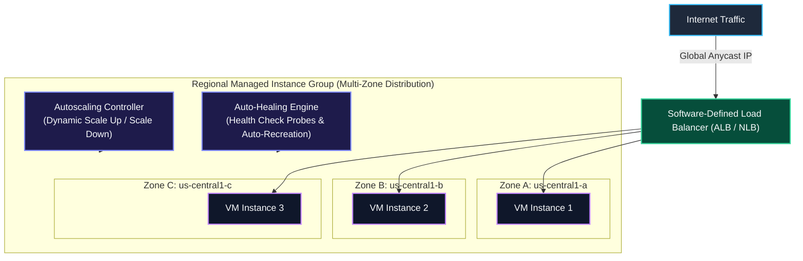

# GCP Compute Engine Case Study Index: Managed Instance Groups, Autoscaling & Load Balancing

Welcome to the **Google Cloud Compute Engine Deep-Dive Architecture & Case Study Index**. This module provides detailed architectural analysis, design patterns, lifecycle state machines, and step-by-step production command guides for Google Cloud Compute Engine virtual machine infrastructure, instance groups, dynamic autoscaling, and software-defined load balancing.

---

## Case Study Sitemap

| Document | Focus Area | Key Architectural Concepts Covered |
| :--- | :--- | :--- |
| [**1. Managed Instance Groups, Autoscaling & Load Balancing**](file:///home/btpl-lap-22/live/gcd/compute-engine/casestudy/mig-autoscaling-loadbalancing.md) | Fleet Management, Resiliency & Scale | Managed Instance Groups (MIGs), Instance Templates, Auto-Healing Health Checks, Zonal vs Regional MIGs (Zonal Outage Resilience), Stateless vs Stateful MIGs, Dynamic Autoscaling (CPU/RPS/Queue Metrics), Zero-Downtime Rolling Updates, Layer 4 NLB vs Layer 7 ALB Software-Defined Load Balancing. |

---

## Core System Architecture

---

## Summary of Key Learnings & Engineering Concepts

1. **Instance Templates**: Record VM configurations (machine shape, boot disk image, network interfaces, startup scripts, service account scopes) so they can be repeated deterministically across thousands of VM nodes.
2. **Auto-Healing**: Health checks continuously test VM responsiveness. If an instance crashes or becomes unhealthy, the Instance Group Manager (IGM) recreates it using the **same instance name** and **same instance template**.
3. **Regional High Availability**: Regional MIGs spread instances across multiple availability zones in a region, preventing single zonal outages from bringing down services.
4. **Software-Defined Load Balancing**: GCP Cloud Load Balancing handles over 1,000,000 QPS with global Anycast IPs without requiring physical appliances or device management.

---

## Related Workspace References

* [Compute Engine Documentation Index](file:///home/btpl-lap-22/live/gcd/compute-engine/README.md)
* [Compute Engine Architecture Design (HLD/LLD)](file:///home/btpl-lap-22/live/gcd/compute-engine/hld-lld-design.md)
* [Compute Engine Decision Tree Manual](file:///home/btpl-lap-22/live/gcd/compute-engine/decision-tree.md)
* [Compute Engine Shell Command Manual](file:///home/btpl-lap-22/live/gcd/compute-engine/shell-commands.md)
* [VPC Network Case Study Index](file:///home/btpl-lap-22/live/gcd/vpc-network/casestudy/README.md)
