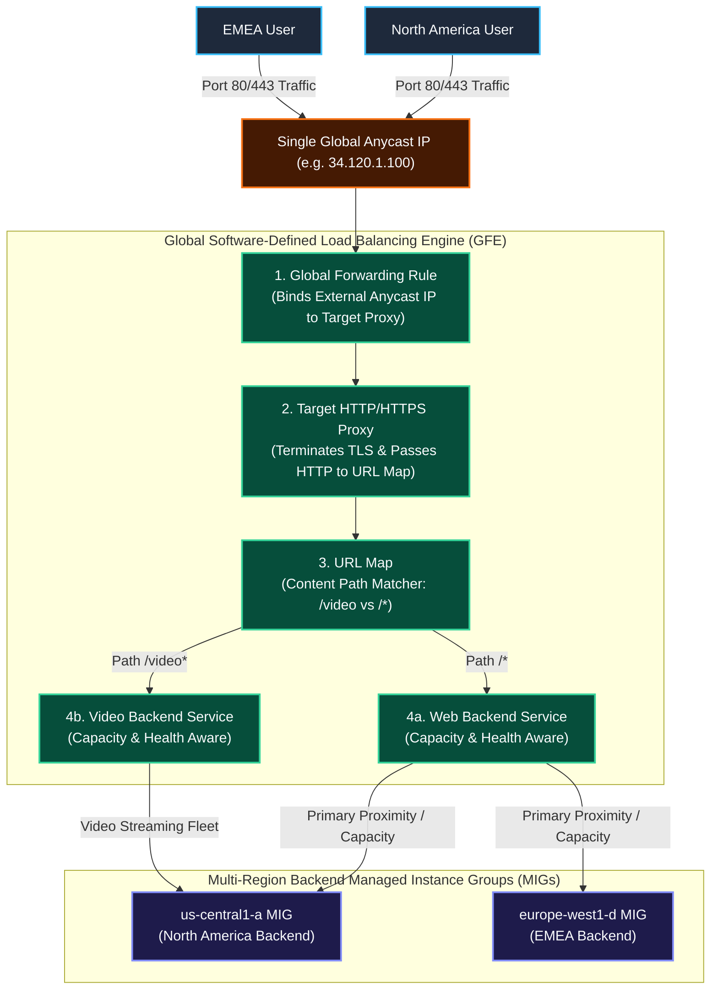
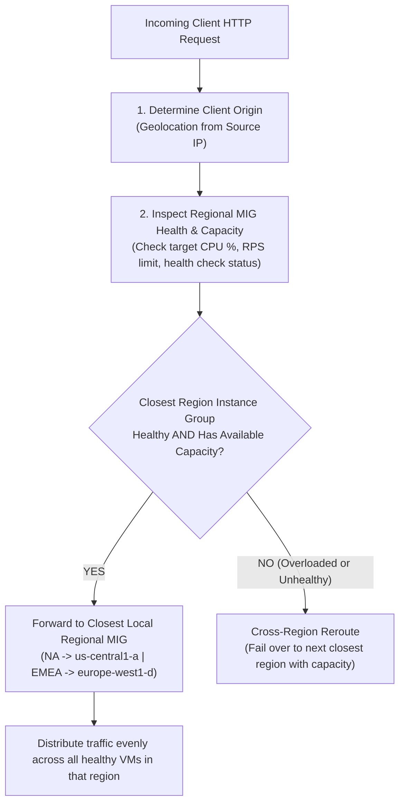
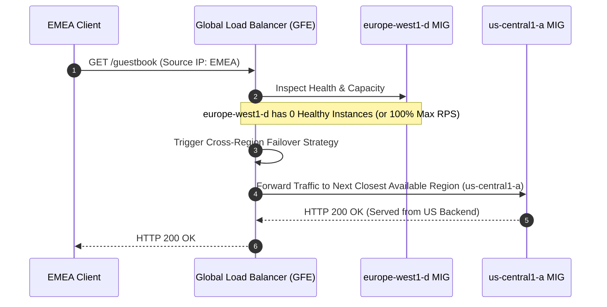

# Case Study: Global Application Load Balancer Request Lifecycle, Capacity Routing & Cross-Region Failover

This case study provides a deep-dive analysis of **Google Cloud Global Application Load Balancers (Layer 7 ALB)** operating in real-world production environments. It details the **5-Stage Request Lifecycle**, **Proximity & Capacity-Based Routing**, **Cross-Region Failover**, and **Content-Based (URL Path) Traffic Splitting** over a single Global Anycast IP address.

---

## 1. Global Request Traversal & Component Architecture

A Global Application Load Balancer uses Google Cloud's software-defined edge network to receive client traffic globally via a **single Anycast IPv4/IPv6 address**. Incoming packets enter the nearest Google Point of Presence (PoP) via **BGP Anycast** and pass through five logical control components:



### The 5-Stage Request Processing Pipeline

1. **Global Anycast IP Entry**: Clients in North America, EMEA, and APAC send requests to the same global external IP address.
2. **Global Forwarding Rule**: Matches incoming IP, protocol (HTTP/HTTPS), and port (80/443), and directs the packet to the target proxy.
3. **Target HTTP(S) Proxy**: Terminates client TCP/TLS connections, evaluates HTTP request headers, and passes the request to the URL Map.
4. **URL Map**: Evaluates request hostname and path (e.g., `/video` vs `/`). Selects the designated **Backend Service**.
5. **Backend Service & MIG Dispatch**: Evaluates client location (source IP), backend instance health, and current capacity, then forwards the request over Google's private B4/Jupiter fiber network to the optimal VM instance.

---

## 2. Proximity & Capacity-Based Routing Mechanics

When a request reaches a Backend Service containing backends in multiple regions (e.g., `us-central1-a` and `europe-west1-d`), the Load Balancing service executes an intelligent 3-step routing decision:



### Routing Parameters Monitored by GFE

* **Source IP Geolocation**: The load balancer estimates the client's geographic proximity to GCP regions.
* **Backend Health Status**: Active HTTP health checks probe all VMs every few seconds. Unhealthy VMs receive 0% traffic.
* **Configured Capacity Limit**: Defined per backend using **Utilisation** (e.g., 80% CPU) or **Rate** (e.g., 100 Requests Per Second per instance).
* **Current Load**: GFE continuously tracks live traffic metrics per backend instance.

---

## 3. Cross-Region Failover & Capacity Spillover Scenario

If an entire regional backend experiences an unexpected spike in traffic (over 100% capacity) or suffers an outage (0 healthy instances), the load balancer triggers **Cross-Region Load Balancing**:



### Cross-Region Overflow Matrix

| Scenario | EMEA User Traffic | NA User Traffic | Failover Trigger |
| :--- | :--- | :--- | :--- |
| **Normal State** | `europe-west1-d` MIG | `us-central1-a` MIG | Both regional backends healthy & under capacity limit. |
| **EMEA Over-Capacity** | `us-central1-a` MIG (Spillover) | `us-central1-a` MIG | EMEA traffic exceeds max RPS/Utilization threshold. |
| **EMEA Zone/Region Outage** | `us-central1-a` MIG (Failover) | `us-central1-a` MIG | Health checks report 0 healthy instances in `europe-west1-d`. |
| **All Regions Over-Capacity** | Distributed across all backends | Distributed across all backends | Load balancer sheds load or queuing kicks in; traffic distributed proportionally. |

---

## 4. Content-Based URL Path Routing (Single Global IP)

Application Load Balancers allow microservice architecture splitting over a **single Global Anycast IP** using **URL Map Path Matchers**:

```mermaid
graph LR
    classDef path fill:#1E293B,stroke:#38BDF8,stroke-width:2px,color:#F8FAFC;
    classDef svc fill:#064E3B,stroke:#34D399,stroke-width:2px,color:#F8FAFC;

    Req["Client Request to Global IP<br/>http://example.com"] --> Map{"URL Map Path Engine"}
    
    Map -->|Path: /video or /video/*| VideoPath["Path Rule: /video*"]:::path
    Map -->|Path: /* (Default)| DefaultPath["Default Rule: /*"]:::path

    VideoPath --> VideoSvc["video-backend-service<br/>(Video Streaming Fleet)"]:::svc
    DefaultPath --> WebSvc["web-backend-service<br/>(Web Application Fleet)"]:::svc
```

---

## 5. Step-by-Step gcloud Command Guide: Provisioning Global ALB with Multi-Region MIGs & URL Map

### Step 1: Reserve a Global Static External IPv4 Address

```bash
gcloud compute addresses create global-alb-ip \
    --ip-version=IPV4 \
    --global
```

### Step 2: Create Instance Templates & Regional MIGs (US & EMEA)

```bash
# Web App Instance Template
gcloud compute instance-templates create global-web-template \
    --machine-type=e2-medium \
    --network=custom-vpc \
    --subnet=app-subnet-us-central1 \
    --tags=allow-hc \
    --metadata=startup-script='#!/bin/bash
apt-get update && apt-get install -y nginx
echo "Web App - Zone: $(curl -s http://metadata.google.internal/computeMetadata/v1/instance/zone -H "Metadata-Flavor: Google")" > /var/www/html/index.html
systemctl start nginx'

# US Regional MIG
gcloud compute instance-groups managed create mig-us-central1 \
    --template=global-web-template \
    --size=2 \
    --region=us-central1

# EMEA Regional MIG
gcloud compute instance-groups managed create mig-europe-west1 \
    --template=global-web-template \
    --size=2 \
    --region=europe-west1

# Set Named Ports on both MIGs
gcloud compute instance-groups managed set-named-ports mig-us-central1 \
    --region=us-central1 --named-ports=http:80

gcloud compute instance-groups managed set-named-ports mig-europe-west1 \
    --region=europe-west1 --named-ports=http:80
```

### Step 3: Create HTTP Health Checks & Backend Services

```bash
# Global Health Check
gcloud compute health-checks create http global-http-hc \
    --port=80 \
    --request-path=/index.html

# Web Backend Service
gcloud compute backend-services create web-backend-service \
    --protocol=HTTP \
    --port-name=http \
    --health-checks=global-http-hc \
    --global

# Attach US & EMEA MIG Backends with Capacity Limits
gcloud compute backend-services add-backend web-backend-service \
    --instance-group=mig-us-central1 \
    --instance-group-region=us-central1 \
    --balancing-mode=RATE \
    --max-rate-per-instance=100 \
    --global

gcloud compute backend-services add-backend web-backend-service \
    --instance-group=mig-europe-west1 \
    --instance-group-region=europe-west1 \
    --balancing-mode=RATE \
    --max-rate-per-instance=100 \
    --global
```

### Step 4: Create Video Backend Service for Content-Based Routing

```bash
# Video Backend Service
gcloud compute backend-services create video-backend-service \
    --protocol=HTTP \
    --port-name=http \
    --health-checks=global-http-hc \
    --global

gcloud compute backend-services add-backend video-backend-service \
    --instance-group=mig-us-central1 \
    --instance-group-region=us-central1 \
    --balancing-mode=UTILIZATION \
    --max-utilization=0.8 \
    --global
```

### Step 5: Create URL Map with Content-Based Path Rules

```bash
# Create URL Map with default web backend
gcloud compute url-maps create global-alb-url-map \
    --default-service=web-backend-service

# Add Path Matcher rule for /video and /video/*
gcloud compute url-maps add-path-matcher global-alb-url-map \
    --path-matcher-name=video-matcher \
    --default-service=web-backend-service \
    --path-rules="/video=video-backend-service,/video/*=video-backend-service"
```

### Step 6: Create Target HTTP Proxy & Global Forwarding Rule

```bash
# Target HTTP Proxy
gcloud compute target-http-proxies create global-alb-target-proxy \
    --url-map=global-alb-url-map

# Global Forwarding Rule binding Static IP to Target Proxy
gcloud compute forwarding-rules create global-alb-forwarding-rule \
    --address=global-alb-ip \
    --global \
    --target-http-proxy=global-alb-target-proxy \
    --ports=80
```

---

## 6. Related Workspace References

* [Case Study 1: Managed Instance Groups & Load Balancing](file:///home/btpl-lap-22/live/gcd/compute-engine/casestudy/mig-autoscaling-loadbalancing.md)
* [Compute Engine Case Study Sitemap](file:///home/btpl-lap-22/live/gcd/compute-engine/casestudy/README.md)
* [Compute Engine Documentation Index](file:///home/btpl-lap-22/live/gcd/compute-engine/README.md)
* [Compute Engine High-Level & Low-Level Design](file:///home/btpl-lap-22/live/gcd/compute-engine/hld-lld-design.md)
