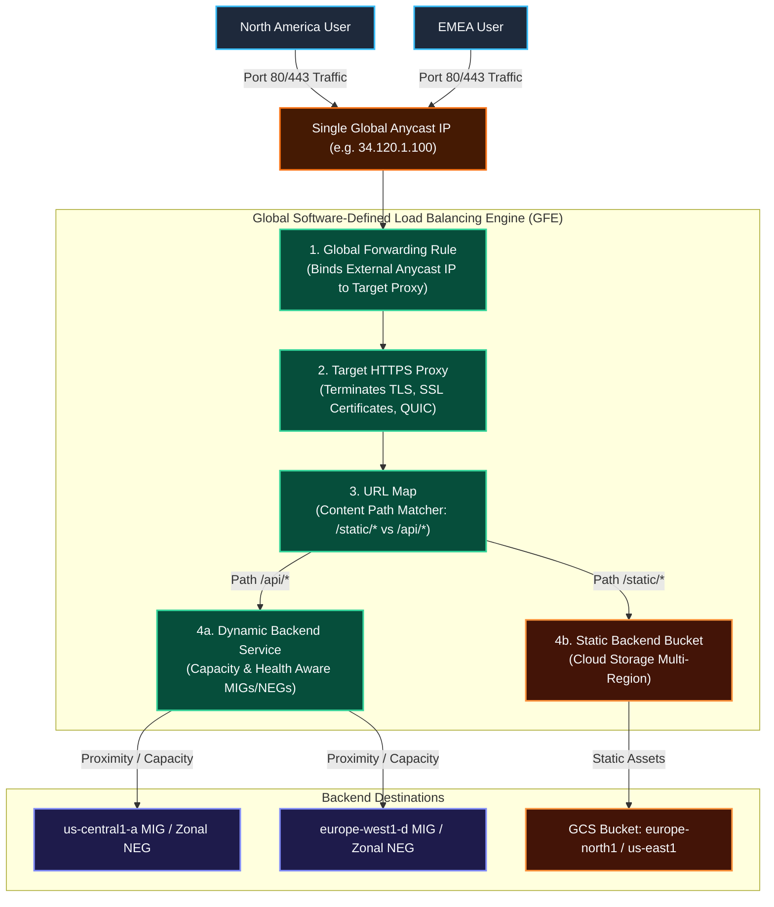
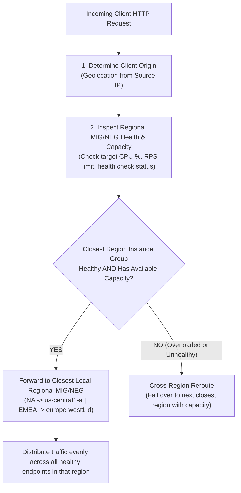
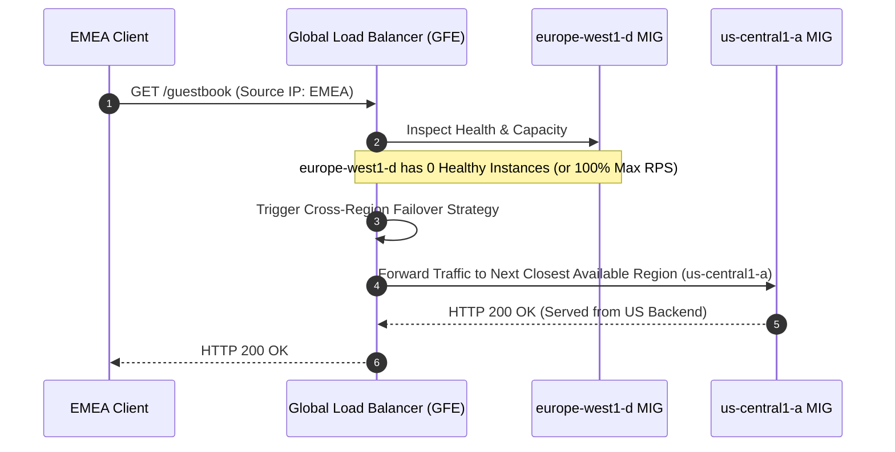
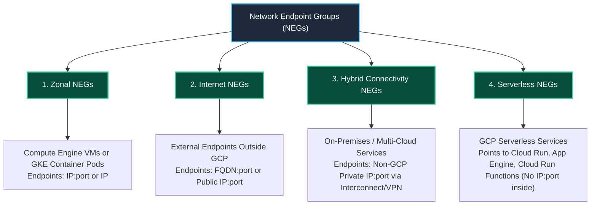

# Case Study: Global Application Load Balancer Request Lifecycle, Capacity Routing, HTTPS, Backend Buckets & NEGs

This case study provides a deep-dive analysis of **Google Cloud Global Application Load Balancers (Layer 7 ALB)** operating in real-world production environments. It details the **5-Stage Request Lifecycle**, **Proximity & Capacity-Based Routing**, **Cross-Region Failover**, **Content-Based (URL Path) Traffic Splitting**, **HTTPS & QUIC Protocols**, **Cloud Storage Backend Buckets**, and **Network Endpoint Groups (NEGs)**.

---

## 1. Global Request Traversal & Component Architecture

A Global Application Load Balancer uses Google Cloud's software-defined edge network to receive client traffic globally via a **single Anycast IPv4/IPv6 address**. Incoming packets enter the nearest Google Point of Presence (PoP) via **BGP Anycast** and pass through five logical control components:



### The 5-Stage Request Processing Pipeline

1. **Global Anycast IP Entry**: Clients in North America, EMEA, and APAC send requests to the same global external IP address.
2. **Global Forwarding Rule**: Matches incoming IP, protocol (HTTP/HTTPS), and port (80/443), and directs the packet to the target proxy.
3. **Target HTTP(S) Proxy**: Terminates client TCP/TLS connections, evaluates SSL certificates, enables QUIC protocol, and passes HTTP traffic to the URL Map.
4. **URL Map**: Evaluates request hostname and path (e.g., `/static/*` vs `/api/*`). Selects a **Backend Service** or **Backend Bucket**.
5. **Backend Dispatch**: Evaluates client location (source IP), backend health, and current capacity, forwarding the request over Google's private network to MIGs, NEGs, or Cloud Storage buckets.

---

## 2. Proximity & Capacity-Based Routing Mechanics

When a request reaches a Backend Service containing backends in multiple regions (e.g., `us-central1-a` and `europe-west1-d`), the Load Balancing service executes an intelligent 3-step routing decision:



### Routing Parameters Monitored by GFE

* **Source IP Geolocation**: The load balancer estimates the client's geographic proximity to GCP regions.
* **Backend Health Status**: Active HTTP health checks probe all VMs/endpoints every few seconds. Unhealthy endpoints receive 0% traffic.
* **Configured Capacity Limit**: Defined per backend using **Utilization** (e.g., 80% CPU) or **Rate** (e.g., 100 Requests Per Second per instance/endpoint).
* **Current Load**: GFE continuously tracks live traffic metrics per backend endpoint.

---

## 3. Cross-Region Failover & Capacity Spillover Scenario

If an entire regional backend experiences an unexpected spike in traffic (over 100% capacity) or suffers an outage (0 healthy instances), the load balancer triggers **Cross-Region Load Balancing**:



### Cross-Region Overflow Matrix

| Scenario | EMEA User Traffic | NA User Traffic | Failover Trigger |
| :--- | :--- | :--- | :--- |
| **Normal State** | `europe-west1-d` MIG | `us-central1-a` MIG | Both regional backends healthy & under capacity limit. |
| **EMEA Over-Capacity** | `us-central1-a` MIG (Spillover) | `us-central1-a` MIG | EMEA traffic exceeds max RPS/Utilization threshold. |
| **EMEA Zone/Region Outage** | `us-central1-a` MIG (Failover) | `us-central1-a` MIG | Health checks report 0 healthy instances in `europe-west1-d`. |
| **All Regions Over-Capacity** | Distributed across all backends | Distributed across all backends | Load balancer sheds load or queuing kicks in; traffic distributed proportionally. |

---

## 4. HTTPS Application Load Balancing, SSL Certificates & QUIC Protocol

An HTTPS Application Load Balancer enforces encrypted client-to-load-balancer communication and offloads cryptographic computation from backend VM instances.

```mermaid
graph LR
    classDef client fill:#1E293B,stroke:#38BDF8,stroke-width:2px,color:#F8FAFC;
    classDef tls fill:#064E3B,stroke:#34D399,stroke-width:2px,color:#F8FAFC;
    classDef backend fill:#1E1B4B,stroke:#818CF8,stroke-width:2px,color:#F8FAFC;

    Client["Client Browser / Mobile App"]:::client -->|HTTPS / TLS 1.3 or QUIC (UDP 443)| Proxy["Target HTTPS Proxy<br/>(Up to 15 SSL Cert Resources)"]:::tls
    Proxy -->|TLS Termination & Decryption| GFE["URL Map & Routing Engine"]:::tls
    GFE -->|HTTP or Internal TLS Egress| VMs["Backend MIGs / NEGs"]:::backend
```

### Core HTTPS Features

1. **Target HTTPS Proxy**: Replaces Target HTTP Proxy. Binds signed SSL certificates and handles TLS handshakes.
2. **SSL Certificate Resources**: Supports up to **15 SSL certificates** installed concurrently on a single Target HTTPS Proxy (allows multi-domain SNI matching).
3. **SSL Session Termination**: Cryptographic TLS processing terminates at the GFE edge, reducing CPU load on backend VM instances.
4. **QUIC Transport Layer Protocol**:
   * **Faster Connection Setup**: Achieves 0-RTT or 1-RTT connection handshakes over UDP (port 443).
   * **Eliminates Head-of-Line Blocking**: Multiplexed streams operate independently over UDP; packet loss on one stream does not block unrelated streams.
   * **Connection Migration**: Seamlessly maintains active sessions when client IP address changes (e.g. mobile device switching from WiFi to cellular network).

---

## 5. Backend Buckets: Cloud Storage Static Content Integration

**Backend Buckets** allow Google Cloud Storage (GCS) buckets to serve as direct load balancing backends alongside Compute Engine VM fleets or container services.

```mermaid
graph TD
    classDef client fill:#1E293B,stroke:#38BDF8,stroke-width:2px,color:#F8FAFC;
    classDef um fill:#064E3B,stroke:#34D399,stroke-width:2px,color:#F8FAFC;
    classDef gcs fill:#431407,stroke:#FB923C,stroke-width:2px,color:#F8FAFC;
    classDef mig fill:#1E1B4B,stroke:#818CF8,stroke-width:2px,color:#F8FAFC;

    Req["Client Request to Global IP"]:::client --> Map{"URL Map Path Rules"}:::um
    
    Map -->|Path: /love-to-fetch/*| BucketEU["Backend Bucket: Cloud Storage<br/>(region: europe-north1)"]:::gcs
    Map -->|Path: /* (Default)| BucketUS["Backend Bucket: Cloud Storage<br/>(region: us-east1)"]:::gcs
    Map -->|Path: /api/*| BackendMIG["Backend Service: Web Application MIG"]:::mig
```

### Dynamic vs Static Content Architecture Pattern

| Request Category | Content Type | Target Backend Type | Routing Mechanism |
| :--- | :--- | :--- | :--- |
| **Static Assets** | Images, CSS, JS, Video files, PDF reports | **Backend Bucket** (Cloud Storage) | Path rules (e.g. `/static/*`, `/images/*`, `/love-to-fetch/*`) |
| **Dynamic Workloads** | REST APIs, database queries, web app logic | **Backend Service** (MIGs or Zonal NEGs) | Default rule (`/*`) or API paths (`/api/*`) |

---

## 6. Network Endpoint Groups (NEGs) Deep Dive

A **Network Endpoint Group (NEG)** is a configuration object specifying a group of individual backend endpoints (IP:port combinations, FQDNs, or serverless services) rather than entire VM instances. NEGs enable container-native load balancing, hybrid cloud connectivity, and serverless routing.



### The 4 Core Architectural Types of NEGs

| NEG Type | Endpoint Specification | Core Use Case / Architectural Fit |
| :--- | :--- | :--- |
| **Zonal NEGs** | `IP:port` or `IP_address` within GCP subnets | **Container-Native Load Balancing (GKE Pods)** and fine-grained VM process routing. Traffic bypasses kube-proxy and routes directly to Pod network interfaces. |
| **Internet NEGs** | `FQDN:port` or Public `IP:port` outside GCP | Routing traffic to third-party SaaS, external HTTP endpoints, or legacy external infrastructure. |
| **Hybrid Connectivity NEGs** | Private `IP:port` outside GCP | Routing to on-premises datacenters or multi-cloud applications connected via Cloud Interconnect or Cloud VPN. |
| **Serverless NEGs** | Fully managed service name (No IP/port endpoints) | Routing load balancer traffic directly to **Cloud Run**, **Cloud Run Functions**, or **App Engine** services within the same region. |

---

## 7. Step-by-Step gcloud Command Guide: HTTPS, QUIC, Backend Buckets & NEGs

### Step 1: Create a Managed SSL Certificate & Target HTTPS Proxy with QUIC

```bash
# 1. Create a Google-managed SSL Certificate
gcloud compute ssl-certificates create production-ssl-cert \
    --domains=example.com,api.example.com \
    --global

# 2. Create Target HTTPS Proxy with SSL Certificate & QUIC enabled
gcloud compute target-https-proxies create global-alb-https-proxy \
    --url-map=global-alb-url-map \
    --ssl-certificates=production-ssl-cert \
    --quic-override=ENABLE

# 3. Create Global HTTPS Forwarding Rule on Port 443
gcloud compute forwarding-rules create global-alb-https-rule \
    --address=global-alb-ip \
    --global \
    --target-https-proxy=global-alb-https-proxy \
    --ports=443
```

### Step 2: Create Cloud Storage Backend Buckets & Path Rules

```bash
# 1. Create Cloud Storage Buckets
gcloud storage buckets create gs://static-assets-europe-north \
    --location=europe-north1

gcloud storage buckets create gs://static-assets-us-east \
    --location=us-east1

# 2. Create Backend Buckets in Load Balancer
gcloud compute backend-buckets create static-backend-eu \
    --gcs-bucket-name=static-assets-europe-north \
    --enable-cdn

gcloud compute backend-buckets create static-backend-us \
    --gcs-bucket-name=static-assets-us-east \
    --enable-cdn

# 3. Add Path Matcher Rules to URL Map
gcloud compute url-maps add-path-matcher global-alb-url-map \
    --path-matcher-name=static-content-matcher \
    --default-backend-bucket=static-backend-us \
    --path-rules="/love-to-fetch/*=static-backend-eu"
```

### Step 3: Create a Zonal Network Endpoint Group (Container-Native GKE)

```bash
# 1. Create Zonal NEG in us-central1-a
gcloud compute network-endpoint-groups create gke-pod-neg \
    --network-endpoint-type=GCE_VM_IP_PORT \
    --zone=us-central1-a \
    --network=custom-vpc \
    --subnet=app-subnet-us-central1

# 2. Attach Container Endpoints (Pod IP:port)
gcloud compute network-endpoint-groups update gke-pod-neg \
    --zone=us-central1-a \
    --add-endpoint="ip=10.128.0.15,port=8080" \
    --add-endpoint="ip=10.128.0.16,port=8080"

# 3. Attach Zonal NEG to Backend Service
gcloud compute backend-services add-backend web-backend-service \
    --network-endpoint-group=gke-pod-neg \
    --network-endpoint-group-zone=us-central1-a \
    --balancing-mode=RATE \
    --max-rate-per-endpoint=100 \
    --global
```

### Step 4: Create a Serverless Network Endpoint Group (Cloud Run Integration)

```bash
# 1. Create Serverless NEG pointing to a Cloud Run service
gcloud compute network-endpoint-groups create cloudrun-serverless-neg \
    --region=us-central1 \
    --network-endpoint-type=SERVERLESS \
    --cloud-run-service=microservice-api

# 2. Create Serverless Backend Service
gcloud compute backend-services create serverless-backend-service \
    --protocol=HTTPS \
    --global

# 3. Add Serverless NEG to Backend Service
gcloud compute backend-services add-backend serverless-backend-service \
    --network-endpoint-group=cloudrun-serverless-neg \
    --network-endpoint-group-region=us-central1 \
    --global
```

---

## 8. Related Workspace References

* [Case Study 1: Managed Instance Groups & Load Balancing](file:///home/btpl-lap-22/live/gcd/compute-engine/casestudy/mig-autoscaling-loadbalancing.md)
* [Compute Engine Case Study Sitemap](file:///home/btpl-lap-22/live/gcd/compute-engine/casestudy/README.md)
* [Compute Engine Documentation Index](file:///home/btpl-lap-22/live/gcd/compute-engine/README.md)
* [Compute Engine High-Level & Low-Level Design](file:///home/btpl-lap-22/live/gcd/compute-engine/hld-lld-design.md)
