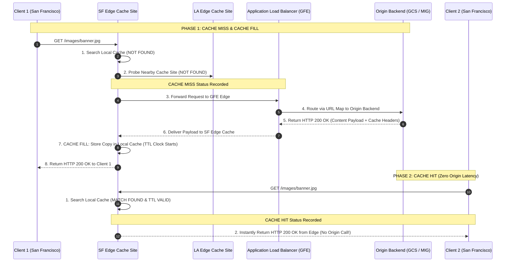
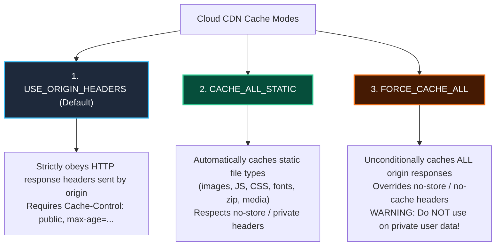

# Case Study: Google Cloud CDN Edge Caching, Request/Response Flow & Cache Modes

This case study details **Google Cloud CDN (Content Delivery Network)** integrated with **Global Application Load Balancers (Layer 7 ALB)**, **Backend Services**, and **Backend Buckets (Cloud Storage)**. It covers the global edge network architecture, **Cache Miss vs. Cache Hit vs. Cache Fill** response flows, **Cloud Logging Diagnostics**, and the three operational **Cache Modes**.

---

## 1. Cloud CDN Global Edge Network Architecture

Google Cloud CDN leverages Google's global network of **over 90+ Edge Points of Presence (PoPs)** distributed across metropolitan regions in the Americas, EMEA, and Asia Pacific.

```mermaid
graph TD
    classDef client fill:#1E293B,stroke:#38BDF8,stroke-width:2px,color:#F8FAFC;
    classDef edge fill:#451A03,stroke:#F97316,stroke-width:2px,color:#F8FAFC;
    classDef alb fill:#064E3B,stroke:#34D399,stroke-width:2px,color:#F8FAFC;
    classDef backend fill:#1E1B4B,stroke:#818CF8,stroke-width:2px,color:#F8FAFC;

    ClientSF["User in San Francisco"]:::client -->|HTTP GET /static/logo.png| EdgeSF["Google Edge Cache Site (San Francisco PoP)"]:::edge
    ClientLA["User in Los Angeles"]:::client -->|HTTP GET /static/logo.png| EdgeLA["Google Edge Cache Site (Los Angeles PoP)"]:::edge

    EdgeSF <-->|1. Primary Edge Check| EdgeSF
    EdgeSF <-->|2. Nearby Edge Probe| EdgeLA
    EdgeSF -->|3. Cache Miss (B4 Fiber Backbone)| ALB["Global Application Load Balancer (GFE)"]:::alb

    subgraph OriginBackends ["Origin Backends (Single Global Anycast IP)"]
        MIG_US["MIG Fleet: us-central1<br/>(Dynamic PHP / API Traffic)"]:::backend
        MIG_ASIA["MIG Fleet: asia-east1<br/>(Dynamic Regional Workloads)"]:::backend
        GCS_EAST["Cloud Storage Bucket: us-east1<br/>(Static Images & Assets)"]:::backend
    end

    ALB -->|URL Map Routing: /api/*| MIG_US
    ALB -->|URL Map Routing: /api/*| MIG_ASIA
    ALB -->|URL Map Routing: /static/*| GCS_EAST
```

### Core Value Proposition

1. **Reduced Round-Trip Time (RTT)**: Serves cached static assets directly from the nearest edge PoP, cutting latency from hundreds of milliseconds to under 10ms.
2. **Origin Load Offloading**: Prevents repetitive static requests from overwhelming Compute Engine MIG fleets or Cloud Storage egress bandwidth.
3. **Reduced Serving Costs**: Data served from edge cache incurs lower network egress rates compared to direct origin egress across regional boundaries.
4. **Simple One-Click Activation**: Enabled via a simple `--enable-cdn` flag on Backend Services or Backend Buckets attached to an Application Load Balancer.

---

## 2. Request & Response Lifecycle: Cache Miss vs. Cache Hit vs. Cache Fill



### Request Status Breakdown

* **Cache Miss**: The local edge cache site does not possess a valid copy of the requested object. The request is forwarded to nearby cache sites or to the origin backend.
* **Cache Fill**: Upon receiving a cacheable response from the origin, the edge cache site writes the object to its local storage, making it available for subsequent client requests.
* **Cache Hit**: A subsequent request for the same object is matched at the local edge cache site. The cached content is returned directly to the client with minimal round-trip latency.

---

## 3. Cloud CDN Cache Modes Deep Dive

Cloud CDN provides **three operational cache modes** that control how responses are cached, whether origin headers are respected, and how Time-To-Live (TTL) policies are enforced.



### Comprehensive Cache Modes Comparison Matrix

| Cache Mode | Behavior & Origin Directive Handling | Default TTL / Max TTL | Recommended Use Cases | Risk Level |
| :--- | :--- | :--- | :--- | :--- |
| **`USE_ORIGIN_HEADERS`** *(Default)* | Requires the origin server to explicitly send valid caching headers (e.g. `Cache-Control: public, max-age=3600`). Non-cacheable headers (`private`, `no-store`) prevent caching. | Defined by origin `max-age` header (Default: 3600s if unspecified). | Microservices, web apps with fine-grained HTTP header control at origin. | **Low** (Safe) |
| **`CACHE_ALL_STATIC`** | Automatically caches static content (based on common web extensions like `.jpg`, `.png`, `.js`, `.css`, `.mp4`, `.pdf`) even if origin headers are absent. Obeys explicit `no-store` or `private` directives. | 3600s default static TTL. | Content management systems, static blogs, mixed dynamic/static backends. | **Low-Medium** |
| **`FORCE_CACHE_ALL`** | **Unconditionally caches all responses** from the origin backend, ignoring and overriding any `no-store`, `no-cache`, or `private` headers set by the origin. | Forces fixed TTL across all HTTP status 200 responses. | Pure static asset buckets, public API documentation, read-heavy public catalogs. | **HIGH** (Danger of caching private user sessions!) |

> [!CAUTION]
> **Security Warning on `FORCE_CACHE_ALL`**: Never configure `FORCE_CACHE_ALL` on a shared backend service that serves authenticated per-user dynamic content (such as account dashboards, private user profiles, or shopping cart checkout APIs). Doing so will cause private user data to be cached at the edge and served to other users!

---

## 4. Cloud Logging Diagnostics & Observability

Every Cloud CDN request processed by the load balancer is automatically logged in **Cloud Logging** under the `requests` log stream.

### Key CDN Log Fields

```json
{
  "httpRequest": {
    "requestMethod": "GET",
    "requestUrl": "https://example.com/static/logo.png",
    "status": 200,
    "responseSize": "14250",
    "latency": "0.003120s",
    "cacheHit": true,
    "cacheLookup": true,
    "cacheFillBytes": "0"
  },
  "jsonPayload": {
    "@type": "type.googleapis.com/google.cloud.loadbalancing.type.LoadBalancerLogEntry",
    "statusDetails": "response_from_cache",
    "cacheStatus": "HIT"
  }
}
```

* `cacheStatus`: Can evaluate to **`HIT`**, **`MISS`**, **`FILL`**, **`REVALIDATED`**, or **`UNCACHEABLE`**.
* `latency`: Cache Hits return in $< 5\text{ms}$, whereas Cache Misses incur full RTT to the origin.

---

## 5. Step-by-Step gcloud Production Command Guide

### Step 1: Enable Cloud CDN on an Existing Backend Service with `CACHE_ALL_STATIC` Mode

```bash
gcloud compute backend-services update web-backend-service \
    --enable-cdn \
    --caching-mode=CACHE_ALL_STATIC \
    --default-ttl=3600 \
    --max-ttl=86400 \
    --client-ttl=3600 \
    --global
```

### Step 2: Enable Cloud CDN on a Backend Bucket with `USE_ORIGIN_HEADERS` Mode

```bash
gcloud compute backend-buckets update static-backend-eu \
    --enable-cdn \
    --caching-mode=USE_ORIGIN_HEADERS \
    --default-ttl=86400
```

### Step 3: Configure Cloud CDN with Custom Cache Keys

```bash
# Include query parameters in cache keys for dynamic image resizing
gcloud compute backend-services update web-backend-service \
    --cache-key-include-host \
    --cache-key-include-protocol \
    --cache-key-include-query-string \
    --global
```

### Step 4: Invalidate Cached Content (Force Cache Invalidation)

```bash
# Invalidate a single path across all global edge cache sites
gcloud compute url-maps invalidate-cdn-cache global-alb-url-map \
    --path="/images/banner.jpg"

# Invalidate a wildcard directory path
gcloud compute url-maps invalidate-cdn-cache global-alb-url-map \
    --path="/static/*"
```

---

## 6. Related Workspace References

* [Case Study 1: Managed Instance Groups & Load Balancing](file:///home/btpl-lap-22/live/gcd/compute-engine/casestudy/mig-autoscaling-loadbalancing.md)
* [Case Study 2: Global ALB Routing in Action](file:///home/btpl-lap-22/live/gcd/compute-engine/casestudy/alb-global-routing-in-action.md)
* [Compute Engine Case Study Sitemap](file:///home/btpl-lap-22/live/gcd/compute-engine/casestudy/README.md)
* [Compute Engine Documentation Index](file:///home/btpl-lap-22/live/gcd/compute-engine/README.md)
