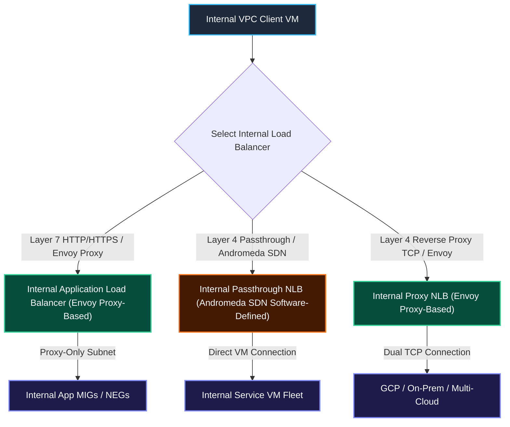
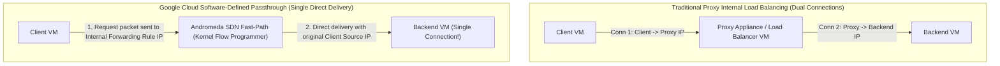
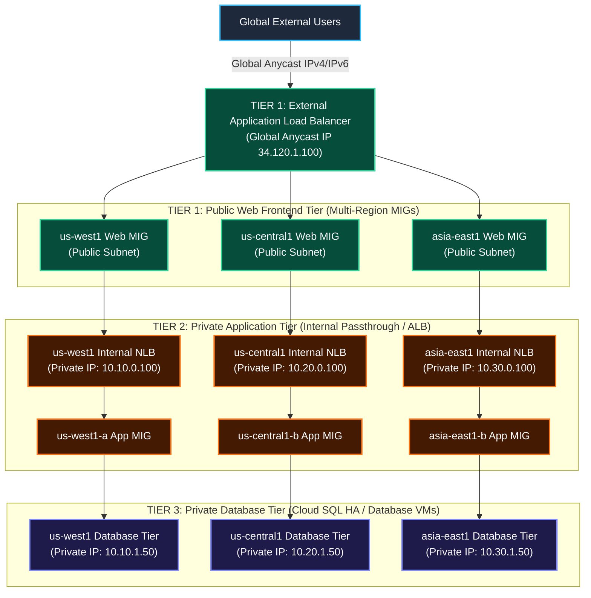
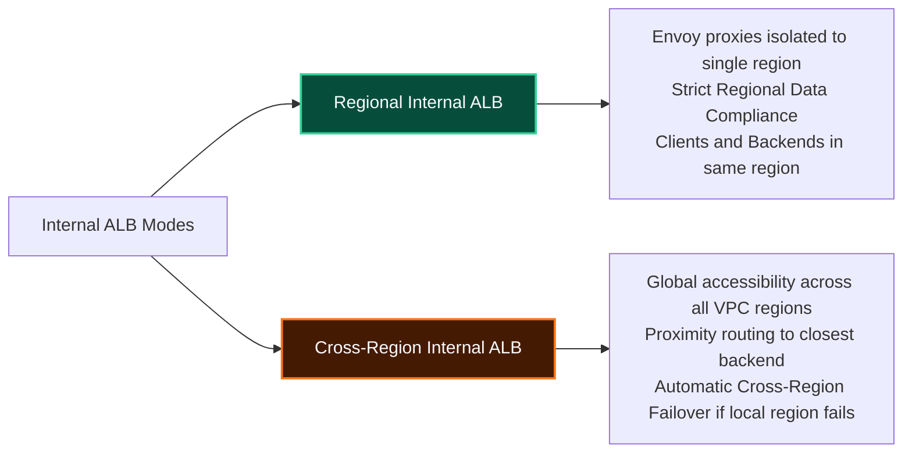

# Case Study: Internal Load Balancers & 3-Tier Enterprise Application Architecture

This case study provides a deep-dive technical architecture on **Google Cloud Internal Load Balancers**: **Internal Application Load Balancers (Internal ALB)**, **Internal Passthrough Network Load Balancers (Internal Passthrough NLB)**, **Internal Proxy Network Load Balancers (Internal Proxy NLB)**, and the industry-standard **Enterprise 3-Tier Microservices Architecture Blueprint**.

---

## 1. Internal Load Balancing Taxonomy & Component Comparison

Internal load balancers route traffic using **private RFC 1918 IPv4/IPv6 addresses** within your Google Cloud VPC network or connected networks (Cloud VPN, Dedicated Interconnect, VPC Peering).



### Comprehensive Internal Load Balancers Comparison Matrix

| Dimension | Internal Application Load Balancer (Internal ALB) | Internal Passthrough Network Load Balancer | Internal Proxy Network Load Balancer |
| :--- | :--- | :--- | :--- |
| **OSI Layer** | Layer 7 (HTTP, HTTPS, HTTP/2, gRPC) | Layer 4 (Transport Layer) | Layer 4 (Transport Layer) |
| **Protocols Supported** | HTTP, HTTPS, HTTP/2, gRPC | TCP, UDP, ICMP, ICMPv6, SCTP, ESP, AH, GRE | TCP (with or without SSL) |
| **Architecture Engine** | Managed **Envoy Proxies** (Requires Proxy-Only Subnet) | **Andromeda SDN** (Software-Defined, No Proxy VM) | Managed **Envoy Proxies** & Andromeda SDN |
| **Connection Model** | Dual TCP connections (Client $\rightarrow$ Envoy $\rightarrow$ Backend) | **Single Connection**: Direct packet delivery from Client to Backend VM | Dual TCP connections (Client $\rightarrow$ Envoy $\rightarrow$ Backend) |
| **Deployment Modes** | Regional Internal OR Cross-Region Internal | Regional Internal | Regional Internal OR Cross-Region Internal |
| **Client Source IP** | Replaced by Proxy-Only Subnet IP | **Preserved natively** in packet header | Replaced by Proxy-Only Subnet IP |
| **Key Use Cases** | Microservice-to-microservice REST APIs, URL path routing | Low-latency database clustering, internal TCP/UDP services | Non-HTTP TCP services needing cross-region failover or hybrid backends |

---

## 2. Deep Dive: Internal Passthrough NLB vs. Traditional Proxy Models

Traditional hardware or VM-based internal load balancers terminate connections at an intermediate proxy instance, creating a dual-connection bottleneck. Google Cloud Internal Passthrough NLB uses **Andromeda SDN software virtualization** to route traffic with zero proxy overhead.



### Key Advantages of Andromeda Software-Defined Passthrough

1. **Zero Proxy Latency Overhead**: Removes intermediate proxy hops; connections are established directly between client and backend VM sockets.
2. **Infinite Elastic Scale**: Load balancing capacity automatically scales with client traffic without needing to scale load balancer VM instances or proxy nodes.
3. **Internal IP Isolation**: Client requests remain strictly within Google's private VPC network and region, improving security posture and eliminating external egress costs.

---

## 3. Enterprise 3-Tier Microservices Architecture Blueprint

The 3-tier architecture decouples web frontends, application business logic, and database storage tiers, ensuring that internal application and database layers are never exposed to the public internet.



### Tier Isolation Security Model

* **Tier 1 (Public Web Tier)**: Serves public internet clients via an External ALB. VMs reside in subnets with internet ingress/egress.
* **Tier 2 (Internal Application Tier)**: Hidden behind Internal Passthrough or Internal ALBs with private RFC 1918 IPs. No public IP addresses assigned; reachable only from Tier 1 web instances.
* **Tier 3 (Private Database Tier)**: Databases (Cloud SQL, PostgreSQL/MySQL VM clusters) accept connections exclusively from Tier 2 application instances via strict internal firewall rules.

---

## 4. Regional vs. Cross-Region Internal Application Load Balancers



---

## 5. Step-by-Step gcloud Command Guide: 3-Tier Stack & Internal Load Balancers

### Step 1: Provision Proxy-Only Subnet for Envoy-Based Internal ALBs

```bash
gcloud compute networks subnets create proxy-only-subnet-us-central1 \
    --network=custom-vpc \
    --region=us-central1 \
    --range=10.128.240.0/23 \
    --purpose=REGIONAL_MANAGED_PROXY \
    --role=ACTIVE
```

### Step 2: Provision an Internal Passthrough Network Load Balancer (Tier 2 App Tier)

```bash
# 1. Create Regional Internal Health Check
gcloud compute health-checks create tcp app-tier-internal-hc \
    --region=us-central1 \
    --port=8080

# 2. Create Regional Internal Backend Service
gcloud compute backend-services create app-tier-backend-svc \
    --load-balancing-scheme=INTERNAL \
    --protocol=TCP \
    --region=us-central1 \
    --health-checks=app-tier-internal-hc \
    --health-checks-region=us-central1

# 3. Attach Internal Application MIG as backend
gcloud compute backend-services add-backend app-tier-backend-svc \
    --instance-group=app-mig-us-central1 \
    --instance-group-region=us-central1 \
    --region=us-central1

# 4. Create Internal Forwarding Rule with Private IP
gcloud compute forwarding-rules create app-tier-internal-nlb-rule \
    --region=us-central1 \
    --load-balancing-scheme=INTERNAL \
    --network=custom-vpc \
    --subnet=app-subnet-us-central1 \
    --address=10.20.0.100 \
    --backend-service=app-tier-backend-svc \
    --ports=8080
```

### Step 3: Provision a Regional Internal Application Load Balancer (Internal Layer 7 ALB)

```bash
# 1. Create HTTP Health Check
gcloud compute health-checks create http internal-alb-hc \
    --region=us-central1 \
    --port=80 \
    --request-path=/healthz

# 2. Create Regional Internal Backend Service
gcloud compute backend-services create internal-alb-backend-svc \
    --load-balancing-scheme=INTERNAL_MANAGED \
    --protocol=HTTP \
    --region=us-central1 \
    --health-checks=internal-alb-hc \
    --health-checks-region=us-central1

# 3. Attach Regional MIG to Backend Service
gcloud compute backend-services add-backend internal-alb-backend-svc \
    --instance-group=app-mig-us-central1 \
    --instance-group-region=us-central1 \
    --balancing-mode=UTILIZATION \
    --max-utilization=0.8 \
    --region=us-central1

# 4. Create Regional URL Map
gcloud compute url-maps create internal-alb-url-map \
    --default-service=internal-alb-backend-svc \
    --region=us-central1

# 5. Create Regional Target HTTP Proxy
gcloud compute target-http-proxies create internal-alb-target-proxy \
    --url-map=internal-alb-url-map \
    --region=us-central1

# 6. Create Regional Internal Forwarding Rule
gcloud compute forwarding-rules create internal-alb-forwarding-rule \
    --region=us-central1 \
    --load-balancing-scheme=INTERNAL_MANAGED \
    --network=custom-vpc \
    --subnet=app-subnet-us-central1 \
    --target-http-proxy=internal-alb-target-proxy \
    --target-http-proxy-region=us-central1 \
    --ports=80
```

### Step 4: Provision a Cross-Region Internal Application Load Balancer

```bash
# 1. Create Global Internal Backend Service
gcloud compute backend-services create cross-region-internal-alb-svc \
    --load-balancing-scheme=INTERNAL_MANAGED \
    --protocol=HTTP \
    --global \
    --health-checks=global-http-hc

# 2. Add Multi-Region Backends (US & EMEA)
gcloud compute backend-services add-backend cross-region-internal-alb-svc \
    --instance-group=mig-us-central1 \
    --instance-group-region=us-central1 \
    --balancing-mode=UTILIZATION \
    --max-utilization=0.8 \
    --global

gcloud compute backend-services add-backend cross-region-internal-alb-svc \
    --instance-group=mig-europe-west1 \
    --instance-group-region=europe-west1 \
    --balancing-mode=UTILIZATION \
    --max-utilization=0.8 \
    --global

# 3. Create Global URL Map & Target Proxy
gcloud compute url-maps create cross-region-internal-url-map \
    --default-service=cross-region-internal-alb-svc \
    --global

gcloud compute target-http-proxies create cross-region-internal-target-proxy \
    --url-map=cross-region-internal-url-map \
    --global

# 4. Create Global Forwarding Rule with Subnet Range Access
gcloud compute forwarding-rules create cross-region-internal-forwarding-rule \
    --global \
    --load-balancing-scheme=INTERNAL_MANAGED \
    --network=custom-vpc \
    --target-http-proxy=cross-region-internal-target-proxy \
    --ports=80
```

---

## 6. Related Workspace References

* [Case Study 1: Managed Instance Groups & Load Balancing](file:///home/btpl-lap-22/live/gcd/compute-engine/casestudy/mig-autoscaling-loadbalancing.md)
* [Case Study 2: Global Application Load Balancer in Action](file:///home/btpl-lap-22/live/gcd/compute-engine/casestudy/alb-global-routing-in-action.md)
* [Case Study 3: Cloud CDN Edge Caching & Cache Modes](file:///home/btpl-lap-22/live/gcd/compute-engine/casestudy/cloud-cdn-edge-caching.md)
* [Case Study 4: Layer 4 Network Load Balancers](file:///home/btpl-lap-22/live/gcd/compute-engine/casestudy/layer4-network-load-balancers.md)
* [Compute Engine Case Study Sitemap](file:///home/btpl-lap-22/live/gcd/compute-engine/casestudy/README.md)
* [Compute Engine Documentation Index](file:///home/btpl-lap-22/live/gcd/compute-engine/README.md)
