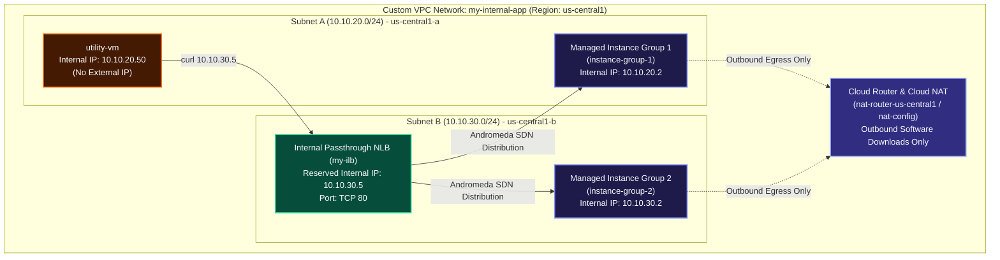

# Case Study: Multi-Zone Internal Passthrough Network Load Balancer Deployment & Hands-On Blueprint

This case study provides a complete hands-on engineering guide and architectural analysis for deploying a **Private Multi-Zone Internal Passthrough Network Load Balancer (Internal NLB)** on Google Cloud Platform. It details the **VPC Subnet Topology**, **Zero-Trust Firewall Rules**, **Outbound Cloud NAT Gateway**, **Dual-Zone Managed Instance Group (MIG) Backends**, **Static Internal IP Reservation**, and **End-to-End Traffic Verification**.

---

## 1. System Architecture & Component Design

The application consists of a private 2-tier microservice architecture deployed across two availability zones (`Zone 1` and `Zone 2`) within a single GCP region. All VM instances are unexposed to the internet (no external IP addresses). Outbound software updates and package installations pass through a **Cloud NAT Gateway**, while incoming internal client traffic is distributed by an **Internal Passthrough Network Load Balancer (`my-ilb`)**.



---

## 2. Key Architecture Pillars & Deployment Objectives

1. **Zero Public IP Exposure**: Backend instances (`instance-group-1` and `instance-group-2`) and the test client (`utility-vm`) are provisioned without external IP addresses, preventing unauthorized internet ingress.
2. **Outbound Cloud NAT Connectivity**: A Cloud Router and Cloud NAT Gateway enable private backend VMs to download Nginx web server packages and execute metadata startup scripts outbound securely.
3. **Multi-Zone High Availability**: Instance groups are distributed across two availability zones (`us-central1-a` and `us-central1-b`). If an entire zone fails, the internal load balancer automatically forwards all traffic to the healthy instance group in the remaining zone.
4. **Andromeda SDN Software Load Balancing**: Built on Google Andromeda SDN, traffic is directly delivered from `utility-vm` to the target backend VM without intermediate proxy VM hops or dual-connection latency.

---

## 3. Network Topology & Resource Matrix

| Component Name | Resource Type | Location / Scope | Configuration Details |
| :--- | :--- | :--- | :--- |
| `my-internal-app` | Custom VPC Network | Global | Isolated private network domain. |
| `subnet-a` | Subnetwork | `us-central1` (`10.10.20.0/24`) | Host subnetwork for `utility-vm` and `instance-group-1`. |
| `subnet-b` | Subnetwork | `us-central1` (`10.10.30.0/24`) | Host subnetwork for `instance-group-2` and `my-ilb` frontend IP. |
| `fw-allow-lb-access` | Firewall Rule | Ingress (`0-65535`) | Source: `10.10.0.0/16` $\rightarrow$ Target Tag: `backend-service` (Allows all internal subnet traffic). |
| `fw-allow-health-checks` | Firewall Rule | Ingress (TCP 80) | Source: `130.211.0.0/22`, `35.191.0.0/16` $\rightarrow$ Target Tag: `backend-service` (Allows GCP Health Probes). |
| `nat-config` | Cloud NAT Gateway | `us-central1` | Outbound NAT for private backend instances. |
| `instance-group-1` | Zonal MIG | `us-central1-a` (`subnet-a`) | 1 VM instance (`10.10.20.2`) running web server startup script. |
| `instance-group-2` | Zonal MIG | `us-central1-b` (`subnet-b`) | 1 VM instance (`10.10.30.2`) running web server startup script. |
| `utility-vm` | Compute Engine VM | `us-central1-a` (`subnet-a`) | Test client VM with static internal IP `10.10.20.50` (No external IP). |
| `my-ilb` | Internal Passthrough NLB | `us-central1` (`subnet-b`) | Reserved static internal IP `10.10.30.5`, TCP Port 80, Health Check: TCP 80 every 10s. |

---

## 4. End-to-End Production `gcloud` Execution Blueprint

### Step 1: Create Custom VPC Network and Subnets

```bash
# 1. Create Custom VPC Network
gcloud compute networks create my-internal-app \
    --subnet-mode=custom

# 2. Create Subnet A in Zone 1
gcloud compute networks subnets create subnet-a \
    --network=my-internal-app \
    --region=us-central1 \
    --range=10.10.20.0/24

# 3. Create Subnet B in Zone 2
gcloud compute networks subnets create subnet-b \
    --network=my-internal-app \
    --region=us-central1 \
    --range=10.10.30.0/24
```

### Step 2: Configure Internal Traffic and Health Check Firewall Rules

```bash
# 1. Allow Internal VPC Traffic (10.10.0.0/16)
gcloud compute firewall-rules create fw-allow-lb-access \
    --network=my-internal-app \
    --action=ALLOW \
    --direction=INGRESS \
    --rules=all \
    --source-ranges=10.10.0.0/16 \
    --target-tags=backend-service

# 2. Allow GCP Health Check Probes (130.211.0.0/22 and 35.191.0.0/16)
gcloud compute firewall-rules create fw-allow-health-checks \
    --network=my-internal-app \
    --action=ALLOW \
    --direction=INGRESS \
    --rules=tcp:80 \
    --source-ranges=130.211.0.0/22,35.191.0.0/16 \
    --target-tags=backend-service
```

### Step 3: Configure Cloud Router and Cloud NAT Gateway

```bash
# 1. Create Cloud Router
gcloud compute routers create nat-router-us-central1 \
    --network=my-internal-app \
    --region=us-central1

# 2. Create Cloud NAT Gateway
gcloud compute routers nats create nat-config \
    --router=nat-router-us-central1 \
    --region=us-central1 \
    --auto-allocate-nat-external-ips \
    --nat-all-subnet-ip-ranges
```

### Step 4: Create Instance Template and Managed Instance Groups

```bash
# 1. Create Instance Template with Web Server Startup Script
gcloud compute instance-templates create my-internal-app-template \
    --machine-type=e2-medium \
    --network=my-internal-app \
    --subnet=subnet-a \
    --tags=backend-service \
    --no-address \
    --metadata=startup-script='#!/bin/bash
apt-get update && apt-get install -y apache2
cat <<EOF > /var/www/html/index.html
<h1>Internal Load Balancing Lab</h1>
<h2>Client IP</h2>Your IP address : \$REMOTE_ADDR
<h2>Hostname</h2>Server Hostname: $(hostname)
<h2>Server Location</h2>Region and Zone: $(curl -s http://metadata.google.internal/computeMetadata/v1/instance/zone -H "Metadata-Flavor: Google")
EOF
systemctl restart apache2'

# 2. Create Managed Instance Group 1 in Zone 1 (us-central1-a)
gcloud compute instance-groups managed create instance-group-1 \
    --template=my-internal-app-template \
    --size=1 \
    --zone=us-central1-a

# 3. Create Managed Instance Group 2 in Zone 2 (us-central1-b)
gcloud compute instance-groups managed create instance-group-2 \
    --template=my-internal-app-template \
    --size=1 \
    --zone=us-central1-b
```

### Step 5: Provision Test Utility VM (utility-vm)

```bash
gcloud compute instances create utility-vm \
    --zone=us-central1-a \
    --machine-type=e2-medium \
    --network=my-internal-app \
    --subnet=subnet-a \
    --private-network-ip=10.10.20.50 \
    --no-address \
    --image-family=debian-12 \
    --image-project=debian-cloud
```

### Step 6: Configure the Internal Passthrough Network Load Balancer

```bash
# 1. Create Regional TCP Health Check
gcloud compute health-checks create tcp my-ilb-health-check \
    --region=us-central1 \
    --port=80 \
    --check-interval=10s \
    --timeout=5s \
    --healthy-threshold=2 \
    --unhealthy-threshold=3

# 2. Create Regional Internal Backend Service
gcloud compute backend-services create my-ilb-backend-service \
    --load-balancing-scheme=INTERNAL \
    --protocol=TCP \
    --region=us-central1 \
    --health-checks=my-ilb-health-check \
    --health-checks-region=us-central1

# 3. Add Managed Instance Group 1 and 2 to Backend Service
gcloud compute backend-services add-backend my-ilb-backend-service \
    --instance-group=instance-group-1 \
    --instance-group-zone=us-central1-a \
    --region=us-central1

gcloud compute backend-services add-backend my-ilb-backend-service \
    --instance-group=instance-group-2 \
    --instance-group-zone=us-central1-b \
    --region=us-central1

# 4. Reserve Static Internal IP for Load Balancer Frontend (10.10.30.5)
gcloud compute addresses create my-ilb-ip \
    --region=us-central1 \
    --subnet=subnet-b \
    --addresses=10.10.30.5

# 5. Create Regional Internal Forwarding Rule
gcloud compute forwarding-rules create my-ilb \
    --region=us-central1 \
    --load-balancing-scheme=INTERNAL \
    --network=my-internal-app \
    --subnet=subnet-b \
    --address=my-ilb-ip \
    --backend-service=my-ilb-backend-service \
    --ports=80
```

### Step 7: Verify Traffic Distribution via Utility VM

```bash
# SSH into utility-vm via IAP Tunnel and test load balancing
gcloud compute ssh utility-vm --zone=us-central1-a --tunnel-through-iap --command="
echo '=== TEST 1: Direct Internal IP Probes ==='
curl -s 10.10.20.2 | grep Hostname
curl -s 10.10.30.2 | grep Hostname

echo '=== TEST 2: Load Balancer (10.10.30.5) Traffic Distribution ==='
for i in {1..10}; do
    curl -s 10.10.30.5 | grep -E 'Hostname|Location'
    sleep 1
done
"
```

---

## 5. Related Workspace References

* [Case Study 1: Managed Instance Groups & Load Balancing](file:///home/btpl-lap-22/live/gcd/compute-engine/casestudy/mig-autoscaling-loadbalancing.md)
* [Case Study 2: Global Application Load Balancer in Action](file:///home/btpl-lap-22/live/gcd/compute-engine/casestudy/alb-global-routing-in-action.md)
* [Case Study 3: Cloud CDN Edge Caching & Cache Modes](file:///home/btpl-lap-22/live/gcd/compute-engine/casestudy/cloud-cdn-edge-caching.md)
* [Case Study 4: Layer 4 Network Load Balancers](file:///home/btpl-lap-22/live/gcd/compute-engine/casestudy/layer4-network-load-balancers.md)
* [Case Study 5: Internal Load Balancers & 3-Tier Architecture](file:///home/btpl-lap-22/live/gcd/compute-engine/casestudy/internal-load-balancers-3tier-architecture.md)
* [Compute Engine Case Study Sitemap](file:///home/btpl-lap-22/live/gcd/compute-engine/casestudy/README.md)
* [Compute Engine Documentation Index](file:///home/btpl-lap-22/live/gcd/compute-engine/README.md)
