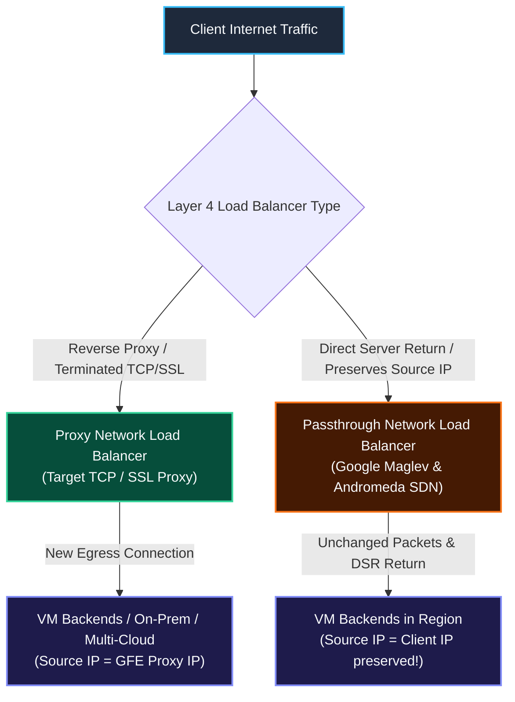
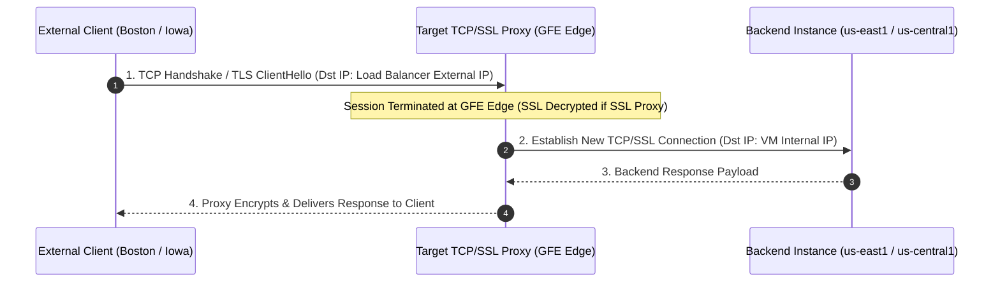
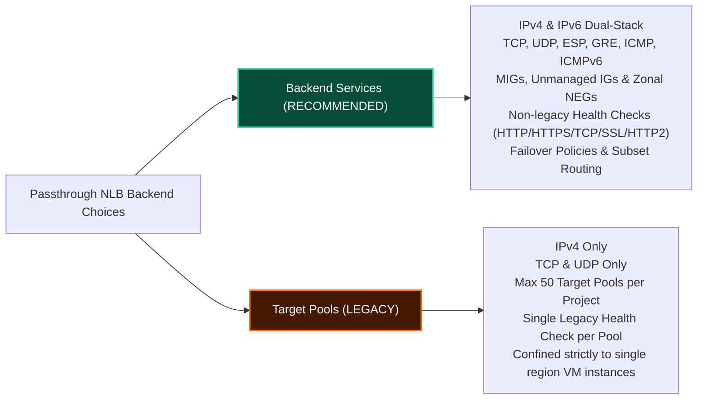

# Case Study: Layer 4 Network Load Balancers — Proxy vs Passthrough, Maglev & Direct Server Return (DSR)

This case study provides a deep-dive technical analysis of **Google Cloud Layer 4 Network Load Balancers (NLB)**. It contrasts **Proxy Network Load Balancers** (Target TCP / Target SSL Proxy) against **Passthrough Network Load Balancers** (Google Maglev, Andromeda SDN & Direct Server Return), and evaluates **Regional Backend Services** versus **Legacy Target Pools**.

---

## 1. Architectural Taxonomy: Proxy NLB vs Passthrough NLB

Layer 4 Network Load Balancers operate at the transport layer, handling non-HTTP protocols (TCP, UDP, ESP, GRE, ICMP, ICMPv6). GCP offers two fundamentally distinct Layer 4 load balancer architectures:



### Proxy vs Passthrough Architectural Matrix

| Metric / Dimension | Proxy Network Load Balancer | Passthrough Network Load Balancer |
| :--- | :--- | :--- |
| **OSI Layer & Scope** | Layer 4 Reverse Proxy (Global / Regional) | Layer 4 Passthrough (Regional) |
| **Protocols Supported** | TCP, SSL / TLS | TCP, UDP, ESP, GRE, ICMP, ICMPv6 |
| **Connection Termination** | Connection **terminates at proxy layer** (GFE/Envoy). Proxy opens a new TCP connection to backend. | Connections **terminate directly at backend VMs**. |
| **Client Source IP** | Replaced by GFE proxy IP (Requires `PROXY` protocol header to preserve client IP). | **Preserved natively** in packet header (`src_ip` = Client IP). |
| **Response Traffic Path** | Responses return back through the GFE/Envoy proxy. | **Direct Server Return (DSR)**: Responses bypass load balancer and return directly to client. |
| **Underlying Tech** | Google Front Ends (GFEs) / Envoy | Google **Maglev** software load balancer & **Andromeda** SDN |
| **Backend Scope** | GCP VMs, On-Premises, Multi-cloud via Hybrid NEGs | GCP VMs (MIGs/Unmanaged) and Zonal NEGs in the same region |

---

## 2. Proxy Network Load Balancers: Target TCP Proxy vs Target SSL Proxy

Proxy Network Load Balancers receive TCP/SSL traffic on external IP addresses, terminate client sessions at the GFE edge, and forward decrypted or re-encrypted TCP/SSL streams to backend instances.



### Target TCP Proxy vs Target SSL Proxy

1. **Target TCP Proxy**: Used for unencrypted non-HTTP TCP traffic (e.g. database connections, custom binary protocols).
2. **Target SSL Proxy**: Used for SSL/TLS encrypted TCP traffic. Terminates client TLS certificates at the edge (up to 15 SSL certificates per target proxy), offloading cryptographic CPU overhead from backend instances. Traffic between proxy and backend can use plaintext TCP or backend SSL.

---

## 3. Passthrough Network Load Balancers, Maglev & Direct Server Return (DSR)

Passthrough Network Load Balancers are **non-proxy** regional load balancers built on **Google Maglev** (Google's custom software network load balancer) and **Andromeda SDN**.

```mermaid
graph TD
    classDef client fill:#1E293B,stroke:#38BDF8,stroke-width:2px,color:#F8FAFC;
    classDef maglev fill:#451A03,stroke:#F97316,stroke-width:2px,color:#F8FAFC;
    classDef vm fill:#1E1B4B,stroke:#818CF8,stroke-width:2px,color:#F8FAFC;

    Client["Client IP: 203.0.113.5"]:::client -->|1. Ingress Packet: Src 203.0.113.5 -> Dst 34.100.1.1| Maglev["Google Maglev Load Balancer<br/>(Consistent Hashing & Health Checking)"]:::maglev
    
    Maglev -->|2. Encapsulated Geneve Packet (Headers UNCHANGED)| VM["Backend Compute Engine VM<br/>(Kernel interface nic0 receives packet with Src 203.0.113.5)"]:::vm
    
    VM -->|3. DIRECT SERVER RETURN (DSR): Response sent directly over Internet Gateway| Client
```

### Direct Server Return (DSR) Mechanics

1. **Header Preservation**: Ingress packets reach backend VMs with unchanged 5-tuples (`src_ip`, `src_port`, `dst_ip`, `dst_port`, `protocol`).
2. **Asymmetric Flow Efficiency**: Ingress traffic flows through Maglev for distribution, but egress response traffic flows **directly from the backend VM to the internet gateway**, bypassing the load balancer completely.
3. **Multi-Protocol Flexibility**: Supports non-port-based IP protocols including **ESP** (IPsec VPNs), **GRE** (tunneling), **ICMP**, and **ICMPv6**.

---

## 4. Regional Backend Services vs Legacy Target Pools

When configuring an External Passthrough Network Load Balancer, backends can be defined using **Regional Backend Services** (Modern) or **Target Pools** (Legacy).



### Architectural Feature Matrix

| Capability | Regional Backend Service (Recommended) | Legacy Target Pool |
| :--- | :--- | :--- |
| **Protocol Support** | TCP, UDP, ESP, GRE, ICMP, ICMPv6 | TCP, UDP only |
| **IP Version Support** | Dual-Stack IPv4 and IPv6 | IPv4 only |
| **Backend Types** | Managed & Unmanaged Instance Groups, Zonal NEGs (`GCE_VM_IP`) | VM instances directly |
| **Health Checks** | Modern Health Checks (TCP, SSL, HTTP, HTTPS, HTTP/2) | Single legacy HTTP/TCP Health Check per pool |
| **Traffic Control & Resiliency** | Failover Policies, Weighted Pod/Node distribution, Connection Draining | Basic 5-tuple hash distribution |
| **Limits** | Standard GCP quota limits | Max 50 target pools per project |

---

## 5. Step-by-Step gcloud Command Guide

### Step 1: Provision an External Proxy Network Load Balancer (Target TCP Proxy)

```bash
# 1. Create Health Check
gcloud compute health-checks create tcp tcp-proxy-hc \
    --port=11211

# 2. Create Global Backend Service for TCP Proxy
gcloud compute backend-services create tcp-proxy-backend-svc \
    --protocol=TCP \
    --health-checks=tcp-proxy-hc \
    --global

# 3. Add Regional MIG Backend
gcloud compute backend-services add-backend tcp-proxy-backend-svc \
    --instance-group=regional-web-mig \
    --instance-group-region=us-central1 \
    --global

# 4. Create Target TCP Proxy
gcloud compute target-tcp-proxies create global-tcp-proxy \
    --backend-service=tcp-proxy-backend-svc

# 5. Create Global Forwarding Rule
gcloud compute forwarding-rules create global-tcp-proxy-rule \
    --global \
    --target-tcp-proxy=global-tcp-proxy \
    --ports=11211
```

### Step 2: Provision an External Proxy Network Load Balancer (Target SSL Proxy)

```bash
# 1. Create Target SSL Proxy with SSL Certificate
gcloud compute target-ssl-proxies create global-ssl-proxy \
    --backend-service=tcp-proxy-backend-svc \
    --ssl-certificates=production-ssl-cert

# 2. Create Global Forwarding Rule for SSL (Port 8443)
gcloud compute forwarding-rules create global-ssl-proxy-rule \
    --global \
    --target-ssl-proxy=global-ssl-proxy \
    --ports=8443
```

### Step 3: Provision an External Passthrough Network Load Balancer (Regional Backend Service)

```bash
# 1. Create Regional Health Check
gcloud compute health-checks create tcp passthrough-hc \
    --region=us-central1 \
    --port=8080

# 2. Create Regional Backend Service (Multi-Protocol: TCP/UDP/ESP/GRE/ICMP)
gcloud compute backend-services create passthrough-backend-svc \
    --protocol=TCP \
    --region=us-central1 \
    --health-checks=passthrough-hc \
    --health-checks-region=us-central1

# 3. Add Regional MIG Backend
gcloud compute backend-services add-backend passthrough-backend-svc \
    --instance-group=regional-web-mig \
    --instance-group-region=us-central1 \
    --region=us-central1

# 4. Create Regional Forwarding Rule for Passthrough NLB
gcloud compute forwarding-rules create passthrough-nlb-rule \
    --region=us-central1 \
    --load-balancing-scheme=EXTERNAL \
    --backend-service=passthrough-backend-svc \
    --ports=8080
```

### Step 4: Provision a Legacy Target Pool-Based Passthrough NLB (Migration Reference)

```bash
# 1. Create Legacy Http Health Check
gcloud compute http-health-checks create legacy-hc \
    --port=80

# 2. Create Legacy Target Pool
gcloud compute target-pools create legacy-target-pool \
    --region=us-central1 \
    --http-health-check=legacy-hc

# 3. Create Forwarding Rule for Target Pool
gcloud compute forwarding-rules create legacy-target-pool-rule \
    --region=us-central1 \
    --target-pool=legacy-target-pool \
    --ports=80
```

---

## 6. Related Workspace References

* [Case Study 1: Managed Instance Groups & Load Balancing](file:///home/btpl-lap-22/live/gcd/compute-engine/casestudy/mig-autoscaling-loadbalancing.md)
* [Case Study 2: Global Application Load Balancer in Action](file:///home/btpl-lap-22/live/gcd/compute-engine/casestudy/alb-global-routing-in-action.md)
* [Case Study 3: Cloud CDN Edge Caching & Cache Modes](file:///home/btpl-lap-22/live/gcd/compute-engine/casestudy/cloud-cdn-edge-caching.md)
* [Compute Engine Case Study Sitemap](file:///home/btpl-lap-22/live/gcd/compute-engine/casestudy/README.md)
* [Compute Engine Documentation Index](file:///home/btpl-lap-22/live/gcd/compute-engine/README.md)
