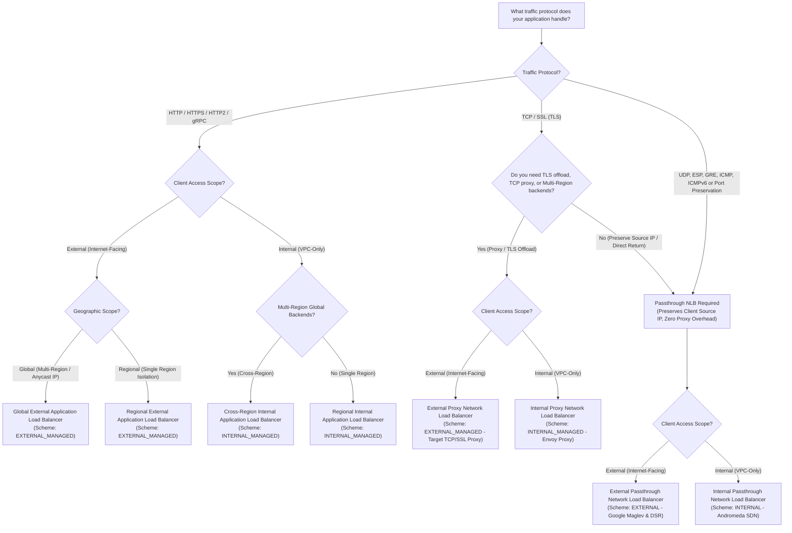
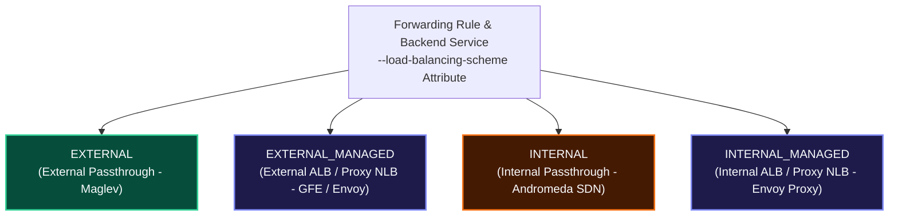

# Case Study: Google Cloud Load Balancer Selection Decision Tree & Scheme Matrix

This case study provides an executive engineering framework for selecting the optimal **Google Cloud Load Balancer**. It includes a **Multi-Tier Architectural Decision Tree**, a **Master Load Balancer Comparison Matrix**, a deep-dive analysis of **Load-Balancing Schemes (`--load-balancing-scheme`)**, and the architectural definition of **`MANAGED` (GFE vs Envoy Proxy)** services.

---

## 1. Multi-Tier Architectural Decision Tree

When architecting applications on Google Cloud, selecting the correct load balancer depends on four core architectural vectors: **Traffic Protocol**, **Client Access Scope (External vs. Internal)**, **Geographic Scope (Global vs. Regional)**, and **Source IP Preservation / Proxy Overhead Requirements**.



---

## 2. Load-Balancing Scheme (`--load-balancing-scheme`) Deep Dive

The `load-balancing-scheme` attribute is configured on forwarding rules and backend services. It dictates network visibility (external vs. internal) and architecture implementation (managed proxy vs. software passthrough).



### Architectural Meaning of `MANAGED`

> [!IMPORTANT]
> The term **`MANAGED`** in a load-balancing scheme (`EXTERNAL_MANAGED` or `INTERNAL_MANAGED`) signifies that the load balancer is implemented as a fully managed proxy service running on either **Google Front Ends (GFEs)** or open-source **Envoy proxies**.
> 
> * In `MANAGED` schemes, client connections are **terminated at the proxy layer** (GFE or Envoy), and a second connection is opened from the proxy to backend instances.
> * In non-`MANAGED` schemes (`EXTERNAL` or `INTERNAL`), the load balancer operates as a **passthrough service** (Maglev or Andromeda SDN). Connections terminate directly at backend VM sockets, and client source IPs are preserved natively.

---

## 3. Master Google Cloud Load Balancing Selection Matrix

| Load Balancer Product | Traffic Protocol | Access Scope | Geographic Scope | Load-Balancing Scheme | Underlying Technology | Primary Decision Criteria / Best Fit |
| :--- | :--- | :--- | :--- | :--- | :--- | :--- |
| **Global External Application Load Balancer** | HTTP, HTTPS, HTTP/2, gRPC | External | Global (Anycast IP) | `EXTERNAL_MANAGED` | Google Front Ends (GFEs) | Flexible L7 HTTP(S) routing, global Anycast IP, Cloud Armor WAF, Cloud CDN, URL path maps. |
| **Regional External Application Load Balancer** | HTTP, HTTPS, HTTP/2, gRPC | External | Regional | `EXTERNAL_MANAGED` | Envoy Proxies | Regional compliance/residency requirements for external HTTP(S) web apps. |
| **Regional Internal Application Load Balancer** | HTTP, HTTPS, HTTP/2, gRPC | Internal | Regional | `INTERNAL_MANAGED` | Envoy Proxies (Proxy-Only Subnet) | Microservice-to-microservice REST APIs within a single region and VPC. |
| **Cross-Region Internal Application Load Balancer** | HTTP, HTTPS, HTTP/2, gRPC | Internal | Global (Multi-Region) | `INTERNAL_MANAGED` | Envoy Proxies (Proxy-Only Subnet) | Private microservices distributed across multiple GCP regions with cross-region failover. |
| **External Proxy Network Load Balancer** | TCP, SSL (TLS) | External | Global or Regional | `EXTERNAL_MANAGED` | GFEs / Envoy Proxies | Non-HTTP TCP services needing TLS offloading, TCP proxying, or multi-region backends. |
| **Internal Proxy Network Load Balancer** | TCP (with/without SSL) | Internal | Regional or Cross-Region | `INTERNAL_MANAGED` | Envoy Proxies | Private non-HTTP TCP traffic needing proxy features, cross-region failover, or hybrid backends. |
| **External Passthrough Network Load Balancer** | TCP, UDP, ESP, GRE, ICMP, ICMPv6 | External | Regional (Internet-facing) | `EXTERNAL` | Google Maglev & DSR | Preserving client source IP, Direct Server Return (DSR), non-TCP/UDP protocols, zero proxy overhead. |
| **Internal Passthrough Network Load Balancer** | TCP, UDP, ESP, GRE, ICMP, ICMPv6, SCTP | Internal | Regional (Private VPC) | `INTERNAL` | Andromeda SDN | Private internal IP load balancing, ultra-low latency, zero proxy VM overhead, source IP preservation. |

---

## 4. Step-by-Step gcloud Command Reference: Configuring Load-Balancing Schemes

### 1. Provision External Application Load Balancer (`EXTERNAL_MANAGED`)

```bash
# Global External Forwarding Rule
gcloud compute forwarding-rules create global-alb-forwarding-rule \
    --load-balancing-scheme=EXTERNAL_MANAGED \
    --address=global-alb-ip \
    --global \
    --target-http-proxy=global-alb-target-proxy \
    --ports=80
```

### 2. Provision Regional Internal Application Load Balancer (`INTERNAL_MANAGED`)

```bash
# Regional Internal Backend Service
gcloud compute backend-services create internal-alb-backend-svc \
    --load-balancing-scheme=INTERNAL_MANAGED \
    --protocol=HTTP \
    --region=us-central1 \
    --health-checks=internal-alb-hc \
    --health-checks-region=us-central1
```

### 3. Provision External Passthrough Network Load Balancer (`EXTERNAL`)

```bash
# Regional External Passthrough Forwarding Rule
gcloud compute forwarding-rules create ext-passthrough-rule \
    --region=us-central1 \
    --load-balancing-scheme=EXTERNAL \
    --backend-service=ext-passthrough-backend-svc \
    --ports=80
```

### 4. Provision Internal Passthrough Network Load Balancer (`INTERNAL`)

```bash
# Regional Internal Passthrough Backend Service
gcloud compute backend-services create int-passthrough-backend-svc \
    --load-balancing-scheme=INTERNAL \
    --protocol=TCP \
    --region=us-central1 \
    --health-checks=int-passthrough-hc \
    --health-checks-region=us-central1
```

---

## 5. Related Workspace References

* [Case Study 1: Managed Instance Groups & Load Balancing](file:///home/btpl-lap-22/live/gcd/compute-engine/casestudy/mig-autoscaling-loadbalancing.md)
* [Case Study 2: Global ALB Routing in Action](file:///home/btpl-lap-22/live/gcd/compute-engine/casestudy/alb-global-routing-in-action.md)
* [Case Study 3: Cloud CDN Edge Caching & Cache Modes](file:///home/btpl-lap-22/live/gcd/compute-engine/casestudy/cloud-cdn-edge-caching.md)
* [Case Study 4: Layer 4 Network Load Balancers](file:///home/btpl-lap-22/live/gcd/compute-engine/casestudy/layer4-network-load-balancers.md)
* [Case Study 5: Internal Load Balancers & 3-Tier Architecture](file:///home/btpl-lap-22/live/gcd/compute-engine/casestudy/internal-load-balancers-3tier-architecture.md)
* [Case Study 6: Multi-Zone Internal Passthrough NLB Blueprint](file:///home/btpl-lap-22/live/gcd/compute-engine/casestudy/internal-passthrough-nlb-hands-on-lab.md)
* [Compute Engine Case Study Sitemap](file:///home/btpl-lap-22/live/gcd/compute-engine/casestudy/README.md)
* [Compute Engine Documentation Index](file:///home/btpl-lap-22/live/gcd/compute-engine/README.md)
