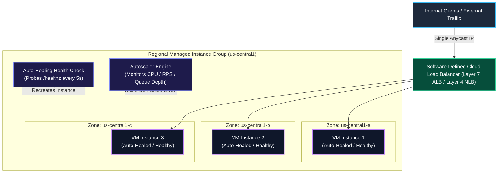
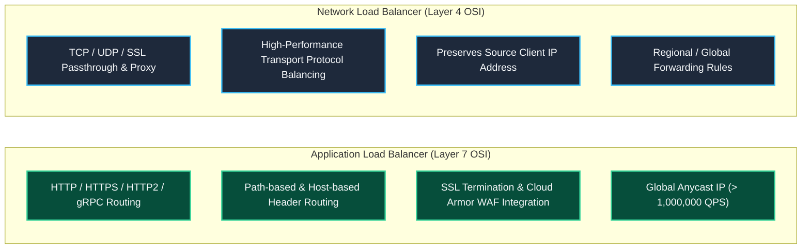
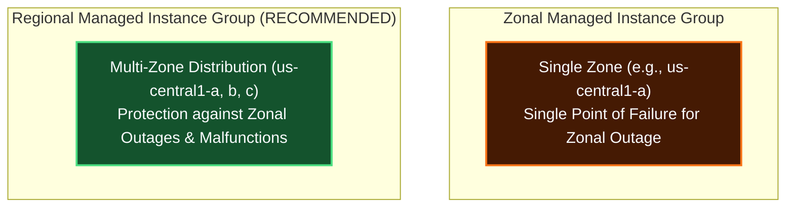
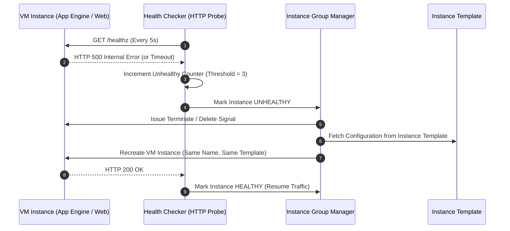
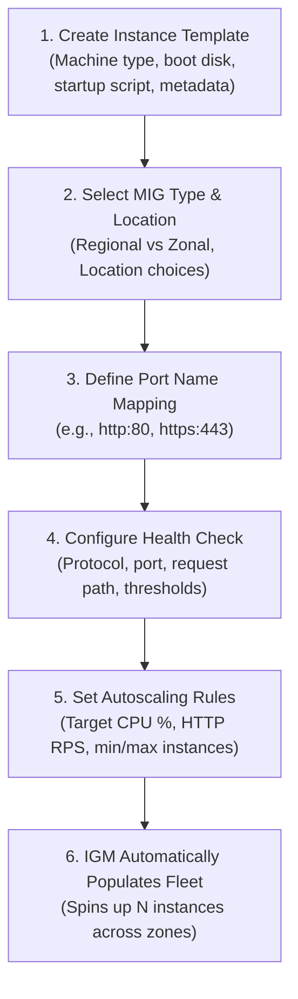

# Case Study: Compute Engine Managed Instance Groups (MIGs), Autoscaling & Load Balancing Integration

This deep-dive case study explores **Google Cloud Compute Engine Managed Instance Groups (MIGs)**, **Dynamic Autoscaling**, **Auto-Healing & Health Checking**, **Rolling Updates**, and **Cloud Load Balancing Integration (Layer 4 & Layer 7)**.

---

## 1. Executive Summary & Core Architectural Definitions

A **Managed Instance Group (MIG)** is a collection of identical Virtual Machine (VM) instances that you manage as a single logical entity based on an **Instance Template**. MIGs form the backbone of scalable, high-availability infrastructure on Google Cloud Platform (GCP).



### Key Pillars of Managed Instance Groups

1. **Automated High Availability & Auto-Healing**: Health checks continuously probe instances. If an instance crashes, stops, fails health checks, or is deleted outside of instance group commands, the instance group manager automatically recreates the instance using the exact same name and instance template.
2. **Dynamic Autoscaling**: Automatically increases or decreases the number of instances in response to actual workload demand (CPU load, HTTP traffic rate, or custom Cloud Monitoring metrics).
3. **Rolling Updates**: Upgrade entire fleet software versions without downtime by specifying a new instance template in a rolling update policy.
4. **Load Balancing Integration**: Seamlessly integrates with Google Cloud Software-Defined Load Balancers (Application Load Balancers and Network Load Balancers) to distribute incoming traffic across all healthy backend instances.

---

## 2. Cloud Load Balancing Architecture: Layer 4 vs Layer 7

Google Cloud Load Balancing is a **fully distributed, software-defined managed service**. It is not instance- or device-based—there are no physical load balancing hardware appliances to provision, configure, or bottleneck network throughput.



### Layer 4 NLB vs Layer 7 ALB Architectural Comparison

| Dimension | Application Load Balancers (ALB) | Network Load Balancers (NLB) |
| :--- | :--- | :--- |
| **OSI Layer** | Layer 7 (Application Layer) | Layer 4 (Transport Layer) |
| **Protocols Supported** | HTTP, HTTPS, HTTP/2, gRPC, WebSocket | TCP, UDP, ESP, ICMP, GRE |
| **Traffic Routing Basis** | URL paths (`/api/*`), HTTP headers, Hostnames | IP 5-tuple (`src_ip`, `src_port`, `dst_ip`, `dst_port`, `proto`) |
| **Anycast Global Capability** | Yes (Single global Anycast IP across all regions) | Regional or Global Anycast options |
| **Throughput & QPS Scale** | > 1,000,000 Queries Per Second (QPS) globally | Multi-million connections per second |
| **Key Use Cases** | Microservices, web application frontends, API gateways | Non-HTTP TCP/UDP apps, gaming servers, raw databases |

---

## 3. Managed Instance Group Taxonomy: Zonal vs Regional & Stateless vs Stateful



### 1. Zonal vs Regional Deployment

* **Zonal Managed Instance Groups**: All VM instances are deployed within a single zone (e.g., `us-central1-a`). If that zone experiences an outage or localized malfunction, the entire instance group is impacted.
* **Regional Managed Instance Groups (Recommended)**: VM instances are automatically distributed across multiple zones within a single region (e.g., `us-central1-a`, `us-central1-b`, `us-central1-c`).
  * **Resilience**: Protects against zonal failures. If an entire zone malfunctions, your application continues serving traffic from instances running in the remaining active zones.
  * **Traffic Balance**: Integrates with regional and global load balancers to balance load across zones gracefully.

### 2. Stateless vs Stateful Workloads

| Feature | Stateless Managed Instance Groups | Stateful Managed Instance Groups |
| :--- | :--- | :--- |
| **Workload Type** | Web frontends, API servers, batch processing queues | Relational databases, legacy monoliths, stateful queues |
| **Instance Mutability** | Instances are completely disposable and ephemeral | Instances retain persistent data, disk state, and IP identities |
| **Auto-Healing Behavior** | Replaces failed instances with fresh blank VMs | Re-attaches existing persistent disks and static internal IPs |
| **State Storage** | Externalized (e.g. Cloud Storage, Redis, Cloud SQL) | Local Persistent Disks bound to specific instance names |

---

## 4. Lifecycle & Auto-Healing Mechanics

When a VM instance in a MIG stops, crashes, fails a health check, or is deleted outside of instance group commands, the **Instance Group Manager (IGM)** triggers an automatic auto-healing lifecycle event:



1. **Detection**: Health check probes detect `UNHEALTHY` status or hypervisor detects VM process termination.
2. **Deletion**: IGM safely drains traffic from the load balancer backend and terminates the failed VM.
3. **Recreation**: IGM provisions a replacement VM using the **same instance name** and the **same instance template**.
4. **Validation**: replacement VM executes startup scripts, passes health checks, and resumes processing tasks.

---

## 5. End-to-End MIG Provisioning & Lifecycle Workflow

Creating and managing a production MIG follows a strict 6-step lifecycle workflow:



---

## 6. Step-by-Step gcloud Production Command Guide

### Step 1: Create an Instance Template

```bash
gcloud compute instance-templates create web-app-template-v1 \
    --machine-type=e2-medium \
    --network=custom-vpc \
    --subnet=app-subnet-us-central1 \
    --tags=http-server,allow-health-checks \
    --image-family=debian-11 \
    --image-project=debian-cloud \
    --metadata=startup-script='#!/bin/bash
apt-get update && apt-get install -y nginx
echo "Hello from $(hostname)" > /var/www/html/index.html
systemctl start nginx' \
    --scopes=cloud-platform
```

### Step 2: Create an HTTP Health Check

```bash
gcloud compute health-checks create http web-app-health-check \
    --port=80 \
    --request-path=/index.html \
    --check-interval=5s \
    --timeout=5s \
    --unhealthy-threshold=3 \
    --healthy-threshold=2
```

### Step 3: Create a Regional Managed Instance Group (Regional MIG)

```bash
gcloud compute instance-groups managed create regional-web-mig \
    --template=web-app-template-v1 \
    --size=3 \
    --region=us-central1 \
    --health-check=web-app-health-check \
    --initial-delay=300s
```

### Step 4: Configure Named Ports for Load Balancing Integration

```bash
gcloud compute instance-groups managed set-named-ports regional-web-mig \
    --region=us-central1 \
    --named-ports=http:80,https:443
```

### Step 5: Configure Dynamic Autoscaling Policy

```bash
gcloud compute instance-groups managed set-autoscaling regional-web-mig \
    --region=us-central1 \
    --max-num-replicas=10 \
    --min-num-replicas=3 \
    --target-cpu-utilization=0.75 \
    --cool-down-period=60
```

### Step 6: Execute Zero-Downtime Rolling Update to New Template

```bash
# First create the v2 instance template
gcloud compute instance-templates create web-app-template-v2 \
    --machine-type=e2-standard-2 \
    --network=custom-vpc \
    --subnet=app-subnet-us-central1 \
    --tags=http-server,allow-health-checks \
    --image-family=debian-11 \
    --image-project=debian-cloud \
    --metadata=startup-script='#!/bin/bash
apt-get update && apt-get install -y nginx
echo "Hello from v2 $(hostname)" > /var/www/html/index.html
systemctl start nginx' \
    --scopes=cloud-platform

# Initiate rolling update across the MIG fleet
gcloud compute instance-groups managed rolling-action start-update regional-web-mig \
    --region=us-central1 \
    --version=template=web-app-template-v2 \
    --max-unavailable=1 \
    --max-surge=1 \
    --replacement-method=substitute
```

### Step 7: Attach Regional MIG to Application Load Balancer Backend Service

```bash
# Create Backend Service
gcloud compute backend-services create web-backend-service \
    --protocol=HTTP \
    --port-name=http \
    --health-checks=web-app-health-check \
    --global

# Attach Regional MIG as backend
gcloud compute backend-services add-backend web-backend-service \
    --instance-group=regional-web-mig \
    --instance-group-region=us-central1 \
    --balancing-mode=UTILIZATION \
    --max-utilization=0.8 \
    --capacity-scaler=1.0 \
    --global
```

---

## 7. Related Workspace Links

* [Compute Engine Architectural Index](file:///home/btpl-lap-22/live/gcd/compute-engine/README.md)
* [Compute Engine High-Level & Low-Level Design](file:///home/btpl-lap-22/live/gcd/compute-engine/hld-lld-design.md)
* [Compute Engine Decision Trees](file:///home/btpl-lap-22/live/gcd/compute-engine/decision-tree.md)
* [Compute Engine Command Reference](file:///home/btpl-lap-22/live/gcd/compute-engine/shell-commands.md)
* [VPC Compute & Network Integration Case Study](file:///home/btpl-lap-22/live/gcd/vpc-network/casestudy/compute-network-integration.md)
