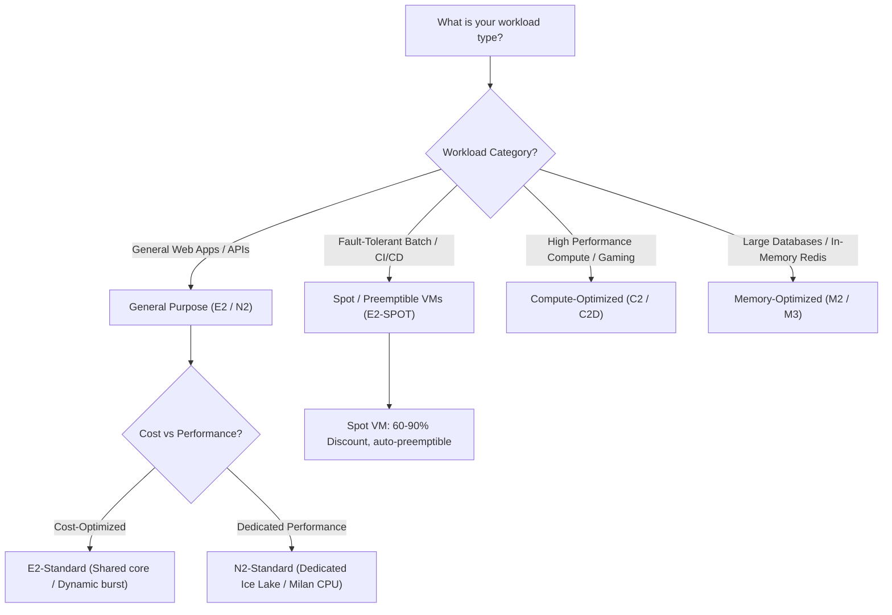

# Compute Engine: Decision Trees (ASCII & Visual)

This document provides decision logic trees for selecting Compute Engine machine types, workload classes, and remote SSH access strategies.

---

## 1. Machine Type & Workload Selection (ASCII Decision Tree)

```
================================================================================
                    COMPUTE ENGINE MACHINE TYPE DECISION TREE
================================================================================

                         What is your workload category?
                                       │
        ┌──────────────────────────────┼──────────────────────────────┐
        ▼                              ▼                              ▼
 [ General Purpose ]          [ Fault-Tolerant Batch ]      [ Specialized Workloads ]
  Web Apps, Microservices,     CI/CD Workers, Rendering,     High Compute or RAM
  Dev/Test Environments        Stateless Job Queues           Databases & Analytics
        │                              │                              │
        │                              │                              ├──────────────────────────────┐
        ▼                              ▼                              ▼                              ▼
  Cost vs Dedicated?            USE SPOT INSTANCE             [ High Compute / Gaming ]      [ Large RAM Databases ]
        │                       (--provisioning-model=SPOT)    C2 / C2D Machine Series        M2 / M3 Machine Series
        ├───────────────┐       Savings: 60% - 90%             Highest Clock Speeds           Up to 12TB Memory
        ▼               ▼
 [ Cost-Optimized ]  [ Dedicated ]
  E2 Series           N2 / N2D Series
  Shared Core /       Dedicated CPU
  Dynamic Burst       Ice Lake / Milan
```

---

## 2. Remote Access & SSH Strategy (ASCII Decision Tree)

```
================================================================================
                    REMOTE SSH & ACCESS STRATEGY DECISION TREE
================================================================================

                  How do you need to access the VM instance?
                                       │
                    Does the VM have a Public IPv4 Address?
                                       │
                        ┌──────────────┴──────────────┐
                        ▼                             ▼
                    [ YES ]                        [ NO ]
                        │                     Is IAP Enabled?
                        ▼                             │
            Direct SSH Connection              ┌──────┴──────┐
            gcloud compute ssh VM              ▼             ▼
                                            [ YES ]        [ NO ]
                                               │             │
                                               ▼             ▼
                                        Use IAP Tunnel   Use VPN / Bastion
                                        --tunnel-through-iap
```

---

## 3. Visual Mermaid Decision Flowcharts

### Machine Selection Flowchart:


### Remote SSH Access Flowchart:
```mermaid
graph TD
    SSHStart["How to access VM securely?"] --> CheckIP{"Does VM have External Public IP?"}
    
    CheckIP -->|Yes| DirectSSH["Direct SSH via gcloud compute ssh"]
    CheckIP -->|No (Private Subnet)| CheckIAP{"Use Identity-Aware Proxy (IAP)?"}
    
    CheckIAP -->|Yes (Recommended)| IAP["gcloud compute ssh --tunnel-through-iap"]
    CheckIAP -->|No| Bastion["Connect via Bastion Host / VPN Jump Server"]
```
