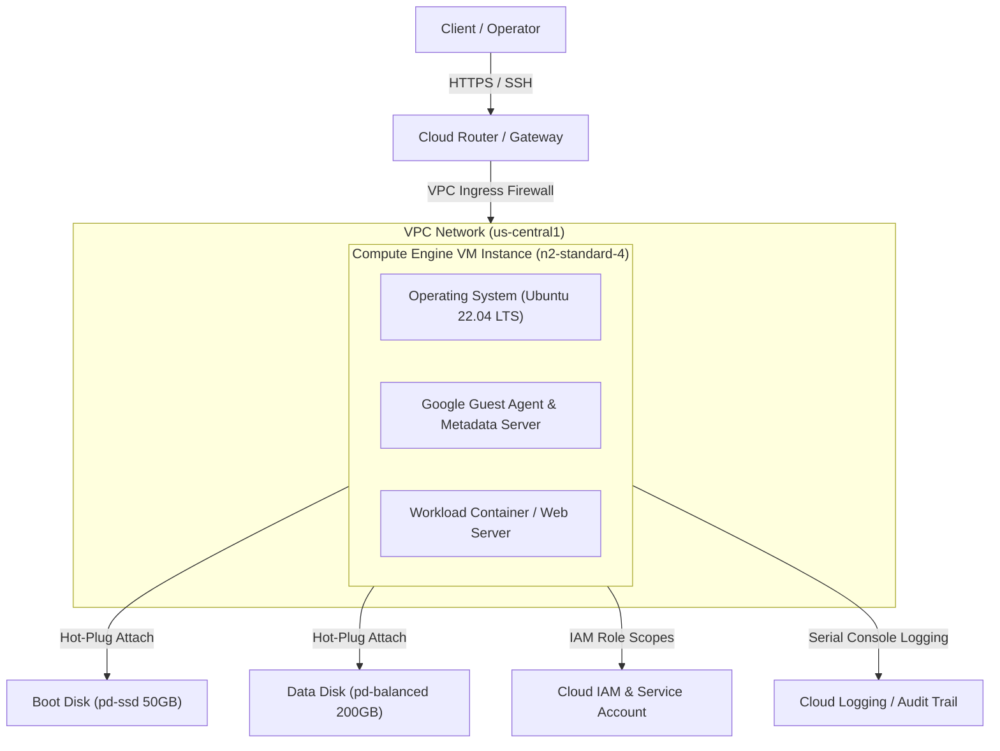
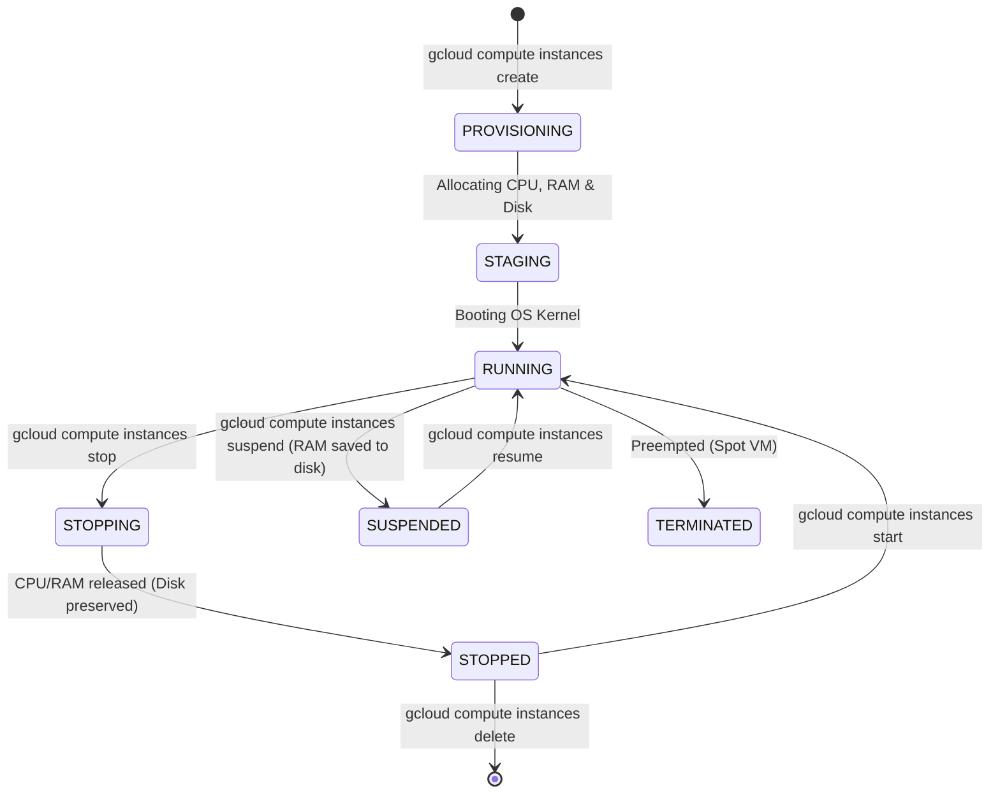

# Compute Engine: High-Level Design (HLD) & Low-Level Design (LLD)

This document details the architectural design for **Google Cloud Compute Engine (Virtual Machines)**.

---

## 1. High-Level Design (HLD)

The High-Level Architecture illustrates how Compute Engine VM instances interact with Google Cloud Virtual Private Cloud (VPC), IAM Access Controls, Storage Volume Layers, and Cloud Security perimeters:

### Key HLD Components:
1. **Network Layer (VPC Subnet)**: Isolates VM instances inside custom subnets, controlling ingress/egress via Stateful Firewall Rules and Network Tags.
2. **Compute Layer**: KVM-based virtualized compute resources (`e2`, `n2`, `c2`, `t2d` families) running custom Linux/Windows distributions.
3. **Storage Layer**: Block storage volumes (Persistent Disks) attached over Google's high-speed internal NVMe network fabric.
4. **Identity & Access Layer**: IAM Service Accounts attached to VM instances, enforcing Least Privilege via OAuth2 scopes.

---

## 2. Low-Level Design (LLD)

### Compute Instance Lifecycle State Machine:

### LLD Internal Mechanics:
* **Metadata Server Interaction**: Inside every VM, the local metadata server runs at `169.254.169.254:80`. The Google Guest Agent queries this IP to fetch SSH keys, startup scripts, and OAuth2 access tokens dynamically.
* **Live Migration**: GCP live-migrates running VM instances to alternative hardware nodes during host maintenance without interrupting workload execution or network connections.
* **Block Storage Detachment/Attachment**: Persistent Disks are decoupled block devices. When a VM stops, disk contents persist in regional storage and can be attached to new instances instantly.
