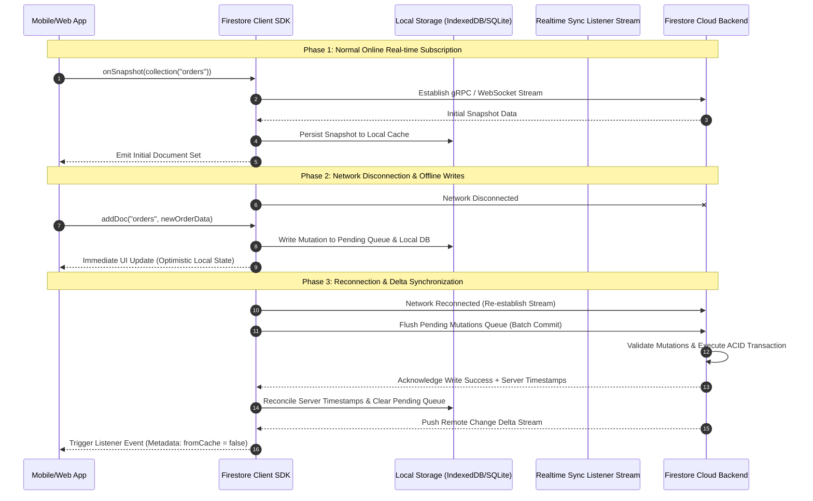
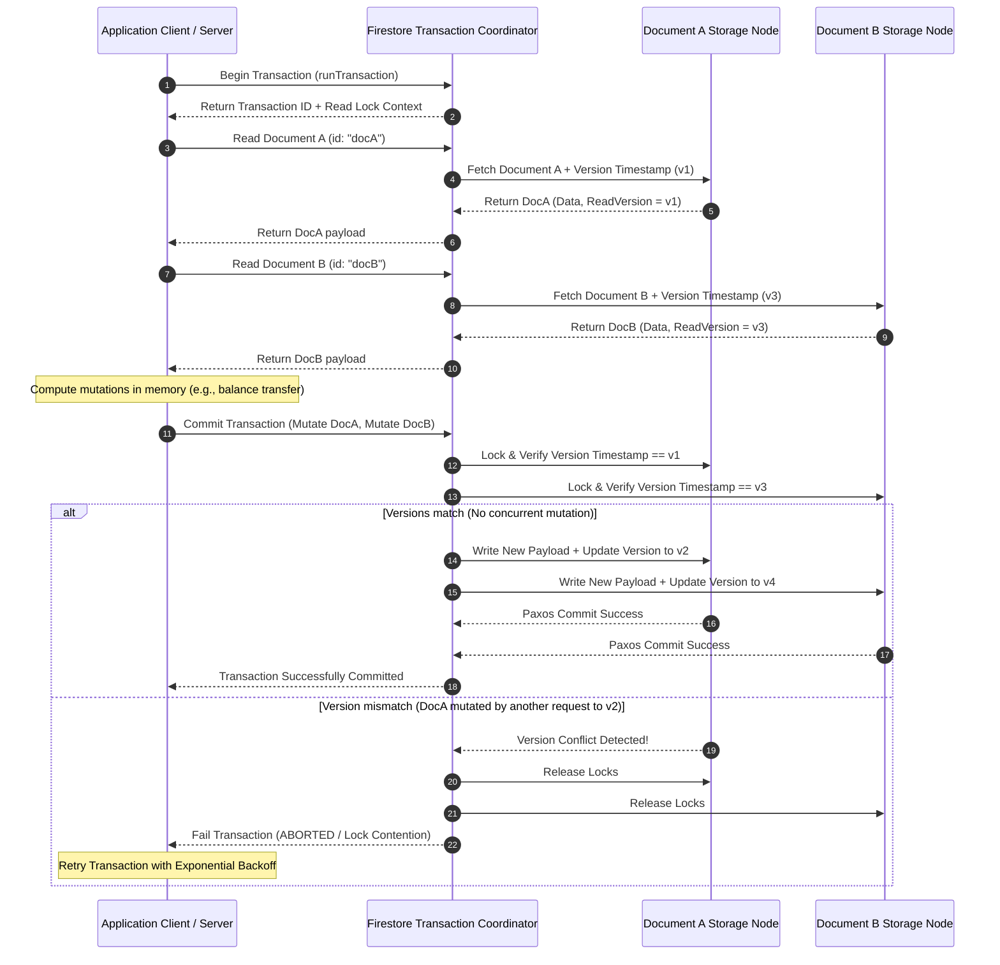

# High-Level & Low-Level Design: Google Cloud Firestore

This document details the architectural design for **Google Cloud Firestore**, covering both its High-Level System Architecture (HLD) and Low-Level Component Dynamics (LLD).

---

## 1. High-Level Design (HLD)

Firestore is built on Google's globally distributed storage infrastructure (derived from Cloud Spanner and Colossus), utilizing Paxos consensus algorithms to deliver strong consistency, multi-region data replication, and high availability.

### System Architecture Diagram

```
+-----------------------------------------------------------------------------------+
|                                 CLIENT ACCESS TIER                                |
|  +---------------------------+  +--------------------------+  +----------------+  |
|  | Mobile / Web / Unity SDKs |  | Server SDKs (Node, Py)   |  | Datastore APIs |  |
|  | (Live Sync + Local Cache) |  | (gRPC / HTTP REST)       |  | (Legacy/Compat)|  |
|  +-------------+-------------+  +------------+-------------+  +-------+--------+  |
+----------------|-----------------------------|------------------------|-----------+
                 |                             |                        |
+----------------v-----------------------------v------------------------v-----------+
|                            SECURITY & GATEWAY TIER                                |
|  +-----------------------------------------------------------------------------+  |
|  | Firebase Security Rules Engine | Google Cloud IAM Authorization | App Check |  |
|  +-------------------------------------+---------------------------------------+  |
+----------------------------------------|------------------------------------------+
                                         |
+----------------------------------------v------------------------------------------+
|                              TRANSACTION & ROUTING TIER                           |
|  +-----------------------------------------------------------------------------+  |
|  | Query Router & Optimizer | Index Evaluator | Transaction Coordinator (ACID) |  |
|  +-------------------------------------+---------------------------------------+  |
+----------------------------------------|------------------------------------------+
                                         |
+----------------------------------------v------------------------------------------+
|                              STORAGE & REPLICATION TIER                           |
|  +-----------------------------------------------------------------------------+  |
|  | Primary Paxos Leader Node (Region A)                                         |  |
|  |  +-----------------------------------------------------------------------+  |  |
|  |  | Distributed B-Tree Document Store | Automatic Multi-Field Index Engine  |  |  |
|  |  +-----------------------------------------------------------------------+  |  |
|  +-------------------------------------+---------------------------------------+  |
|                                        | Synchronous Paxos Replication            |
|       +--------------------------------+--------------------------------+         |
|       |                                                                 |         |
|  +----v--------------------------------+  +-----------------------------v------+  |
|  | Paxos Replica Node (Region B)       |  | Paxos Replica Node (Region C)      |  |
|  | (Strongly Consistent Read Replica)  |  | (Witness / Failover Read Replica)  |  |
|  +-------------------------------------+  +------------------------------------+  |
+-----------------------------------------------------------------------------------+
```

### Core Components Description

1. **Client Access Tier**:
   - **Mobile/Web SDKs**: Maintain persistent WebSockets/gRPC streams for real-time data listeners and manage an embedded local persistent store (IndexedDB/SQLite) for offline read/write queueing.
   - **Server SDKs**: Low-latency, high-throughput gRPC connections utilizing IAM credentials for backend services.
2. **Security & Gateway Tier**:
   - Evaluates client requests against dynamic **Firebase Security Rules** (checking authentication, authorization token claims, and document schema validations) or **IAM Policies**.
3. **Transaction & Routing Tier**:
   - Manages distributed transaction isolation, query execution plans, and coordinates optimistic lock checks across document mutations.
4. **Storage & Replication Tier**:
   - Utilizes Google's internal Paxos consensus engine to synchronously replicate mutations across multiple data centers or regions prior to acknowledging writes, delivering zero data loss (RPO=0) and automatic high availability (RTO < 30s).

---

## 2. Low-Level Design (LLD)

### Sequence Flow 1: Real-Time Live Sync & Offline Local Caching

This sequence illustrates how Native Mode SDKs handle local optimistic UI updates, local cache persistence during network disconnection, and stream synchronization upon reconnection.



---

### Sequence Flow 2: Multi-Document ACID Transaction Flow

This sequence demonstrates multi-document transactional guarantees using optimistic concurrency control (OCC).



---

### State Diagram: Firestore Operating Mode Lifecycle & Database Creation

```mermaid
stateDiagram-v2
    [*] --> UninitializedProject: New Google Cloud / Firebase Project

    state UninitializedProject {
        [*] --> NoDatabaseInstance: Project Created
    }

    NoDatabaseInstance --> ModeSelection: Provision Firestore Database Command

    state ModeSelection {
        [*] --> ChoicePending
        ChoicePending --> NativeModeSelected: Select --type=firestore-native
        ChoicePending --> DatastoreModeSelected: Select --type=datastore-mode
    }

    state NativeModeSelected {
        [*] --> ProvisioningNative
        ProvisioningNative --> NativeModeActive: Datacenter Provisioning Complete
        note right of NativeModeActive
            Features Enabled:
            - Collections & Subcollections
            - Real-time Listeners
            - Offline Caching
            - Mobile / Web SDKs
            - Firebase Security Rules
        end note
    }

    state DatastoreModeSelected {
        [*] --> ProvisioningDatastore
        ProvisioningDatastore --> DatastoreModeActive: Datacenter Provisioning Complete
        note right of DatastoreModeActive
            Features Enabled:
            - Entities & Keys Data Model
            - Legacy Datastore API Compatibility
            - Removes 1 Write/sec Limit
            - Removes 25 Entity Group Limit
            - Strongly Consistent Queries
        end note
    }

    NativeModeActive --> ModeLocked: Operating Mode Permanent
    DatastoreModeActive --> ModeLocked: Operating Mode Permanent

    note bottom of ModeLocked
        CRITICAL ARCHITECTURAL BOUNDARY:
        Mode selection cannot be changed after creation.
        Migrating between Native and Datastore modes requires
        creating a new database instance and running a managed export/import pipeline.
    end note
```
