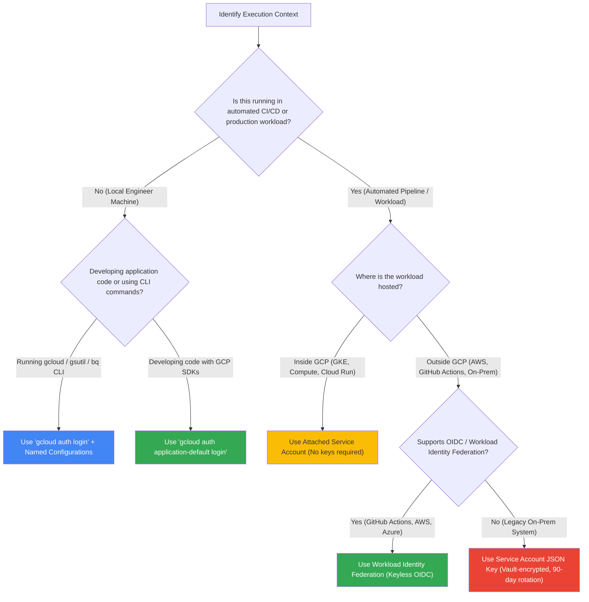
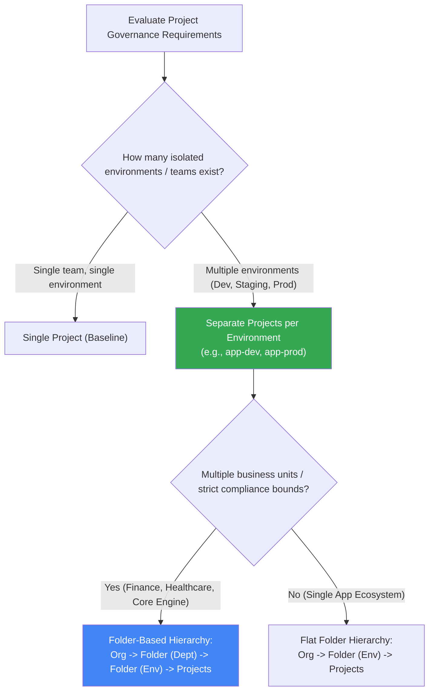
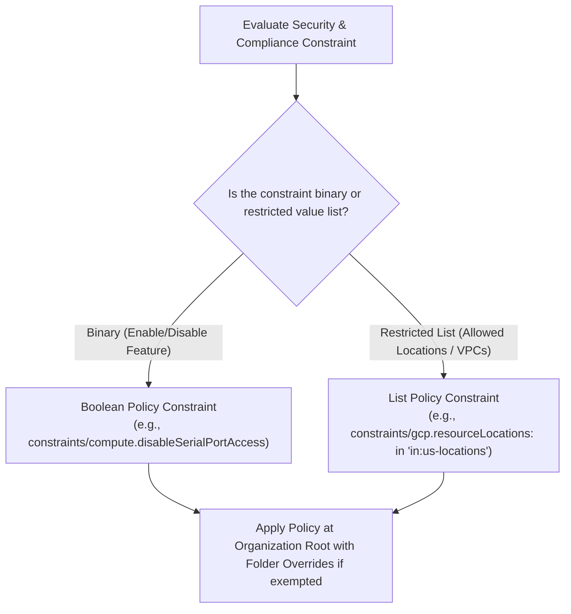

# GCP Core Configuration & Project Management: Decision Trees

This guide provides visual decision trees (Mermaid diagrams & text decision paths) for selecting GCP authentication strategies, project hierarchy structures, and organization policy guardrails.

---

## 1. Authentication Strategy Decision Tree

### ASCII Text Breakdown:
* **CLI User Workflows**: `gcloud auth login` $\rightarrow$ Named Profiles (`~/.config/gcloud/configurations/`).
* **Local SDK Code Execution**: `gcloud auth application-default login` $\rightarrow$ ADC file (`~/.config/gcloud/application_default_credentials.json`).
* **CI/CD Security (GitHub / AWS)**: Workload Identity Federation (WIF) $\rightarrow$ Short-lived STS tokens.
* **Privileged Actions**: Service Account Impersonation (`--impersonate-service-account`) $\rightarrow$ Zero persistent keys.

---

## 2. Project Hierarchy & Isolation Decision Tree

---

## 3. Organization Policy Enforcement Decision Tree

