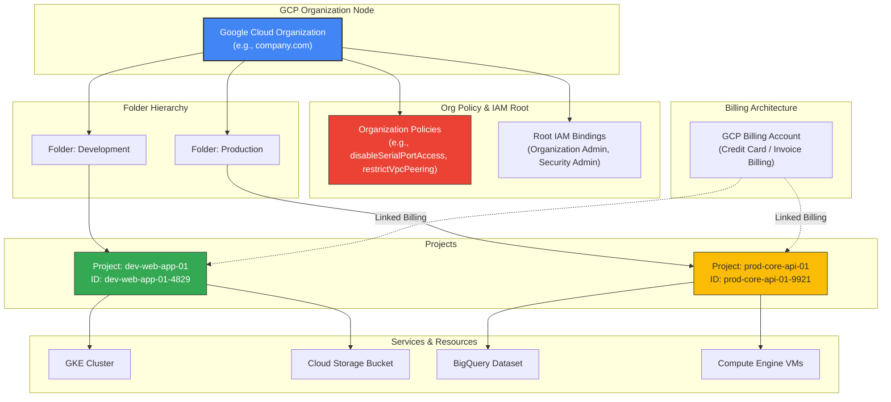
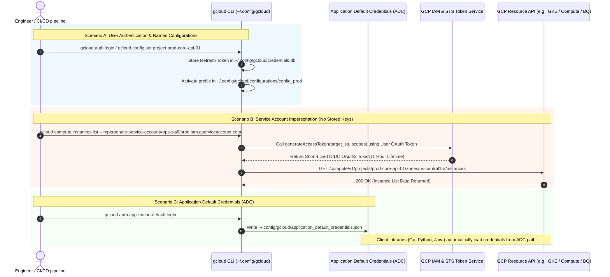

# GCP Core Configuration & Project Management: High-Level & Low-Level Design Architecture

This document presents the **High-Level Design (HLD)** and **Low-Level Design (LLD)** for Google Cloud Platform (GCP) Organization Resource Hierarchy, Authentication Mechanics, Named SDK Configurations, and Policy Inheritance.

---

## 1. High-Level Design (HLD) Architecture

The GCP Resource Hierarchy governs how cloud resources are organized, how security policies (IAM) inherit downward, and how billing accounts aggregate infrastructure costs.

---

## 2. Low-Level Design (LLD) Architecture: Authentication & `gcloud` Profiles

The LLD illustrates how local SDK authentication, named configurations, Application Default Credentials (ADC), and Service Account Impersonation interact with Google APIs.

---

## 3. Key Architecture Components

1. **GCP Resource Hierarchy**:
   - **Organization**: Root node tied to Google Workspace or Cloud Identity domain. Sets baseline organization policies and root IAM guardrails.
   - **Folders**: Organizational units (e.g., by environment `dev/prod` or department `finance/engineering`). Permissions applied at folder level inherit down to all contained projects.
   - **Projects**: The fundamental quota, billing, and resource isolation boundary. Every GCP resource belongs to exactly one project.

2. **`gcloud` Named Configuration Engine**:
   - Manages isolated SDK profiles stored under `~/.config/gcloud/configurations/`.
   - Allows instant context switching (`gcloud config configurations activate dev-profile`) without re-authenticating.

3. **Authentication Mechanics**:
   - **User Credentials**: Short-lived OAuth2 tokens generated via browser login (`gcloud auth login`).
   - **Application Default Credentials (ADC)**: Credential fallback standard used by code SDKs (`google-cloud-storage`, `google-cloud-bigquery`) during local development.
   - **Service Account Impersonation**: Enterprise security standard where users assume short-lived SA identities via `iam.serviceAccounts.getAccessToken` without creating or leaking persistent `.json` key files.
