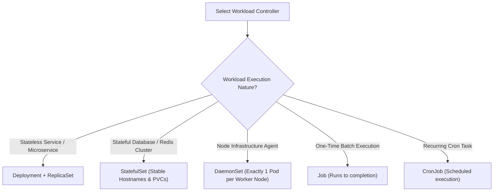
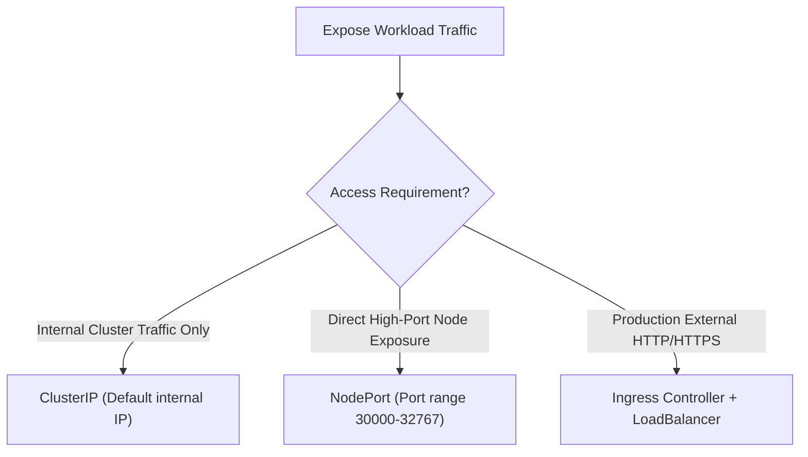

# Kubernetes: Decision Trees (ASCII & Visual)

This document provides decision logic trees for selecting Kubernetes Workload APIs, Service Types, and Persistent Storage strategies.

---

## 1. Workload API Selection (ASCII Decision Tree)

```
================================================================================
                    KUBERNETES WORKLOAD API DECISION TREE
================================================================================

                    What type of application are you deploying?
                                       │
        ┌──────────────────────────────┼──────────────────────────────┐
        ▼                              ▼                              ▼
 [ Long-Running Workload ]      [ Batch / Task Execution ]    [ Node Infrastructure ]
  APIs, Web Servers, Workers    Data Processing, Migrations    Log Collectors, Monitoring
        │                              │                       (Fluentd, Promtail, NodeExporter)
        │                              │                              │
        ▼                              ▼                              ▼
  Stateless or Stateful?        One-time or Scheduled?         USE DAEMONSET
        │                              │                       Runs 1 Pod per Node
        ├───────────────┐              ├───────────────┐
        ▼               ▼              ▼               ▼
 [ Stateless ]     [ Stateful ]     [ One-Time ]    [ Scheduled ]
  DEPLOYMENT        STATEFULSET      JOB             CRONJOB
  Replicas can      Unique Network   Runs to         Runs on cron
  restart anywhere   ID & Persistent  Completion     schedule
                    Storage (PVC)
```

---

## 2. Kubernetes Service Type Selection (ASCII Decision Tree)

```
================================================================================
                    KUBERNETES SERVICE TYPE DECISION TREE
================================================================================

                 How should your Pods be exposed to traffic?
                                       │
        ┌──────────────────────────────┼──────────────────────────────┐
        ▼                              ▼                              ▼
 [ Cluster Internal Only ]      [ External via Node Port ]    [ External via Cloud LB ]
  Inter-pod microservice         Testing / Dev environments   Production Web App / Traffic
  communication                  (Ports 30000-32767)          Exposed to Internet
        │                              │                              │
        ▼                              ▼                              ▼
  ClusterIP                      NodePort                       LoadBalancer / Ingress
  Internal Virtual IP            Exposes port on Node IP        Provisions Cloud L7/L4 LB
```

---

## 3. Visual Mermaid Decision Flowcharts

### Workload Selection Flowchart:


### Service Exposure Flowchart:

