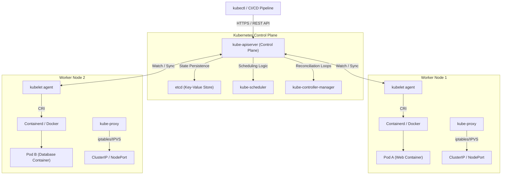
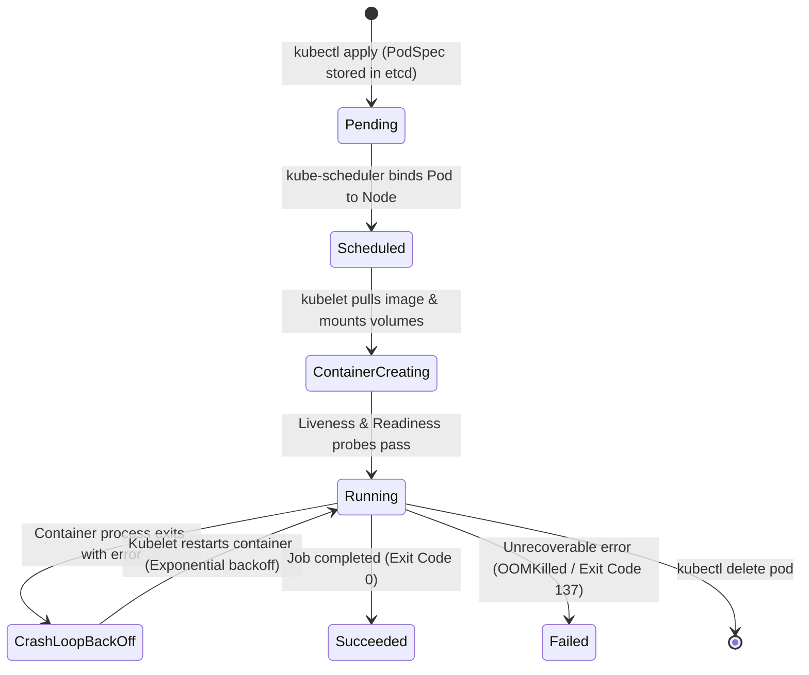

# Feature 3: Kubernetes (k8s) & kubectl — High-Level Design (HLD) & Low-Level Design (LLD)

This document details the architectural design for **Kubernetes Container Orchestration** and **`kubectl` Control Plane Interaction**.

---

## 1. High-Level Design (HLD)

The High-Level Architecture illustrates how the Kubernetes Control Plane orchestrates containerized workloads across worker nodes in a cluster:

### Key HLD Components:
1. **`kube-apiserver`**: Central front-end REST API endpoint. Authenticates, authorizes, and validates all cluster requests.
2. **`etcd`**: Consistent, fault-tolerant key-value store holding the complete state of the Kubernetes cluster.
3. **`kube-scheduler`**: Assigns newly created Pods to optimal worker nodes based on resource availability and constraints.
4. **`kube-controller-manager`**: Runs background controller loops (DeploymentController, ReplicaSetController, NodeController) driving current state toward desired state.
5. **`kubelet`**: Primary node agent running on every worker node, ensuring containers specified in `PodSpecs` are running and healthy.

---

## 2. Low-Level Design (LLD)

### Pod Lifecycle & Reconciliation Loop State Machine:

### LLD Internal Mechanics:
* **Reconciliation Loop Pattern**: The core loop continuously computes: `Delta = Desired State (etcd) - Actual State (Cluster)`. If `Delta != 0`, controllers trigger corrective actions (e.g. launching missing pods).
* **Probes (Health Checks)**:
  * **Startup Probe**: Determines if container application has booted.
  * **Liveness Probe**: Determines if container needs a restart (`kubelet` kills un-healthy containers).
  * **Readiness Probe**: Determines if container is ready to accept network traffic (Service endpoints remove non-ready pods).
* **Resource Limits & Requests**:
  * **`requests`**: Guaranteed CPU/RAM reserved during scheduling.
  * **`limits`**: Maximum CPU/RAM allowed. Exceeding RAM limit triggers `OOMKilled` (Signal 9).
