# Unified Infrastructure Networking Manual: Docker, Kubernetes & Google Cloud VPC

A comprehensive, annotated manual connecting **Container Networking (Docker)**, **Pod/Service Orchestration (Kubernetes)**, and **Cloud Underlay Infrastructure (Google Cloud VPC, Subnets, Firewalls, Peering, NAT, Routes, VPN & DNS)**.

Every command is written in modular sections (`# ── SECTION ──`) with explicit breakdowns of valid parameters, allowed enums, IP address calculations, and production trade-offs.

---

## High-Level Networking Architecture: How the 3 Layers Connect

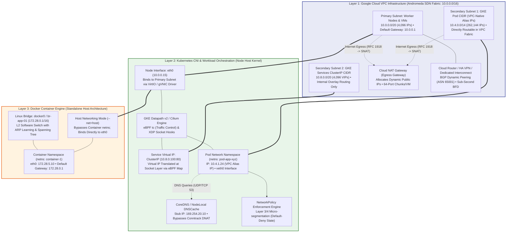

### Internal Architectural Datapath: How Docker, CNI, and VPC Underlay Bind Together

1. **VPC-Native IP Allocation (Eliminating Overlay Encapsulation Overhead)**:
   - In legacy Kubernetes, pods run in an isolated VXLAN or Geneve overlay network. Every packet leaving a pod is encapsulated inside an outer UDP header, creating a 50-byte MTU overhead and consuming significant CPU cycles for encapsulation/decapsulation.
   - In Google Cloud VPC-Native GKE, **Secondary Subnet Ranges** (`10.4.0.0/14`) are programmed directly into Google's **Andromeda SDN** virtual switches. Every Pod receives a real, first-class VPC Alias IP. When Pod A (`10.4.1.24`) communicates with a VM or Pod B (`10.4.2.50`) on another node, packets travel natively across the VPC physical fabric with zero packet encapsulation.
2. **Linux Virtual Ethernet (`veth`) Pair & Kernel Datapath**:
   - Every Pod or Docker container is isolated inside its own Linux Network Namespace (`netns`).
   - The link between the container namespace and the host root namespace is established by a **`veth` pair** (a virtual full-duplex Ethernet cable). Packets transmitted into `veth0` inside the container instantly emerge from the corresponding peer interface on the host.
3. **eBPF Socket-Layer Redirect vs Netfilter Bridge**:
   - Under standard Docker, traffic crosses a Linux software bridge (`br-app-01`) and is translated using Linux `iptables` NAT (`MASQUERADE`).
   - Under modern GKE Datapath v2 (Cilium), eBPF programs attached to the `tc` (traffic control) and socket layer intercept packets immediately upon transmission. If destination is another Pod on the same node, eBPF redirects the packet directly from container A's socket buffer (`sk_buff`) to container B's socket buffer, achieving near-zero latency by completely bypassing the TCP/IP stack.

---

## Detailed Traffic Flow Architecture

### 1. Ingress Flow: Public Internet → Cloud Armor WAF → Global Load Balancer → GKE Pod

```mermaid
sequenceDiagram
    autonumber
    actor Client as External User (203.0.113.19)
    participant Edge as Google Anycast Edge PoP (BGP Anycast VIP)
    participant Armor as Cloud Armor Enterprise WAF
    participant GLB as Google Front End (GFE) / Envoy Proxy
    participant NEG as Network Endpoint Group (NEG Controller)
    participant NodeKernel as Worker Node Kernel (10.0.0.15)
    participant NetPol as Cilium eBPF NetworkPolicy
    participant Pod as Backend Pod (10.4.1.24:8080)

    Client->>Edge: 1. TCP SYN to 34.120.50.10:443 [Src: 203.0.113.19:54321]
    Note over Edge: Terminated at nearest Google Edge Point of Presence<br/>Routed across Google Global Fiber Backbone
    Edge->>Armor: 2. Layer 7 HTTP/2 Request Inspection
    Note over Armor: Evaluates Rate Limits (Token Bucket: 100 req/min)<br/>Scans OWASP ModSecurity Rules (SQLi, XSS, Log4j)<br/>Validates Geo-IP & reCAPTCHA Enterprise Score
    alt Threat Detected / Quota Breached
        Armor-->>Client: HTTP 403 Forbidden / HTTP 429 Too Many Requests
    else Verified Clean Request
        Armor->>GLB: 3. Forward to Google Front End (GFE) L7 Proxy
        Note over GLB: Terminates Client TLS (ECDHE-RSA-AES128-GCM-SHA256)<br/>Evaluates Gateway API HTTPRoute hostnames & URL prefixes<br/>Appends "X-Forwarded-For: 203.0.113.19" & Client TLS Cert Fingerprint
        GLB->>NEG: 4. Route directly to Pod IP via Network Endpoint Group
        Note over NEG: Bypasses kube-proxy, NodePort & Host SNAT!<br/>Lookup table resolves healthy Pod IP: 10.4.1.24:8080
        NEG->>NodeKernel: 5. Transmit Packet across VPC [Src: 35.191.10.5, Dst: 10.4.1.24:8080]
        Note over NodeKernel: VirtIO NIC receives packet; VPC firewall verifies<br/>health-check probes from 35.191.0.0/16 & 130.211.0.0/22
        NodeKernel->>NetPol: 6. Inspect Ingress Policy at eBPF tc Hook
        alt Blocked by NetworkPolicy Spec
            NetPol--xPod: Silent Drop (Kernel tc DROP action; logs to Hubble)
        else Ingress Policy Match (app: backend-api)
            NetPol->>Pod: 7. Socket-level delivery to Pod veth interface
            Note over Pod: Backend container processes HTTP request on port 8080
            Pod-->>Client: 8. HTTP 200 OK Response (End-to-End Low Latency)
        end
    end
```

#### Internal Ingress Packet Lifecycle Breakdown (Step-by-Step)

- **Step 1: Anycast Edge Termination**: External clients connect to a single Anycast IP (`34.120.50.10`). Google's edge routers advertise this IP globally via BGP from over 100 Points of Presence (PoPs). TCP handshake terminates at the nearest edge PoP, transferring packets onto Google's private, congestion-free SDN backbone.
- **Step 2: Cloud Armor Deep Packet Inspection**: Cloud Armor runs inside the Google Front End (GFE). Before routing to application backends, it compares the request against rule priorities (0–2147483647). It token-buckets client IP requests to mitigate Layer 7 DDoS and inspects URI, query strings, and payloads against OWASP Core Rule Set (CRS) v3.3 regex filters.
- **Step 3: SSL Termination & Gateway API Routing**: The GFE decrypts TLS using Google-managed certificates or Cloud Certificate Manager. It evaluates Gateway API `HTTPRoute` rules (host matches, path prefixes, headers). If path rewriting or canary header-matching is configured, it transforms the request URL before choosing a backend service.
- **Step 4: Container-Native Load Balancing via NEG**: Traditional Kubernetes Services rely on `NodePort` and `kube-proxy`, which forwards traffic to a random worker node, which in turn performs a second internal SNAT/DNAT hop to reach the actual Pod. With **GKE NEGs (Network Endpoint Groups)**, the Google Cloud Load Balancer directly tracks individual Pod IPs (`10.4.1.24:8080`). Traffic is sent straight from the load balancer to the target pod's node with zero intermediate hops, cutting latency by up to 50% and preserving the authentic client IP.
- **Step 5: eBPF Ingress NetworkPolicy Filtering**: Once the packet reaches the target node's physical interface (`eth0`), the Cilium/Datapath v2 eBPF hook at `tc` (traffic control) inspects the source IP, destination pod label identity, and destination port. If no NetworkPolicy explicitly allows the traffic, the packet is discarded at the kernel boundary before it can consume container CPU cycles.

---

### 2. Egress Flow: Pod → VPC Firewall → Cloud NAT / Cloud Router / Interconnect

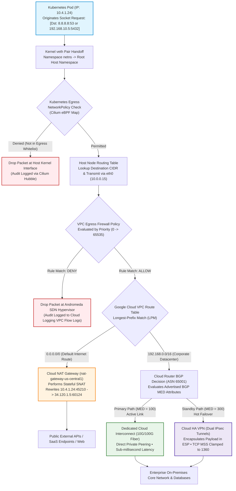

#### Internal Egress Packet Lifecycle Breakdown (Step-by-Step)

- **Step 1: Linux Namespace Egress & veth Traversal**: The container application issues a `connect()` or `sendto()` syscall. The kernel creates an `sk_buff` socket buffer and transmits it across the container `eth0` interface, arriving instantly on the peer `veth-xyz` interface in the host's root network namespace.
- **Step 2: Micro-Segmentation Egress Policy Check**: GKE Datapath v2 evaluates egress NetworkPolicies via eBPF hash tables. If the Pod has an egress restriction (e.g. allowed only to `10.0.0.0/8` and `169.254.20.10:53`), any packet targeting unauthorized destinations (e.g., public internet IP `198.51.100.1`) is dropped before entering the VPC underlay.
- **Step 3: VPC Andromeda Route Lookup (Longest Prefix Match)**: Once the packet reaches the node's physical NIC (`eth0`), Google Cloud's Andromeda SDN hypervisor inspects the destination IP. It evaluates all VPC subnet routes, static routes, and dynamic BGP routes using **Longest Prefix Matching (LPM)**:
  - If the destination matches an on-premises enterprise range (e.g. `192.168.10.5/32` matching route `192.168.0.0/16`), it directs the packet toward the Cloud Router gateway.
  - If no specific private route matches, it falls back to the default gateway route (`0.0.0.0/0`).
- **Step 4: Cloud NAT Port Allocation & SNAT Rewriting**: Since private GKE nodes and pods do not possess public external IP addresses, outbound internet packets are directed to Cloud NAT. Cloud NAT performs stateful **Source Network Address Translation (SNAT)**:
  - It rewrites the packet source header from Pod IP `10.4.1.24:45210` to a reserved external public NAT IP and port (e.g., `34.120.1.5:60124`).
  - It registers the connection in its distributed connection tracking table. When the remote server responds, Cloud NAT reverses the translation and forwards return packets back to the exact pod IP.
- **Step 5: Hybrid BGP Multi-Exit Discriminator (MED) Routing**: For traffic destined for on-premises datacenters, the Cloud Router evaluates BGP routing metrics:
  - The **Dedicated Interconnect** attachment advertises routes with a lower MED (`100`), making it the primary, active path.
  - The **HA VPN** tunnel advertises the same subnet with a higher MED (`300`), keeping it in hot standby.
  - If the physical fiber link is severed, Cloud Router detects the failure within 900ms via **Bidirectional Forwarding Detection (BFD)** and automatically redirects all datacenter packets over the encrypted IPsec HA VPN tunnels without application downtime.

---

## Table of Contents

1. [Docker Container Networking (Local & Host Bridge)](#1-docker-container-networking-local--host-bridge)
2. [GCP VPC Network & Custom Subnet Provisioning](#2-gcp-vpc-network--custom-subnet-provisioning)
3. [Cloud NAT & Egress Internet Gateway](#3-cloud-nat--egress-internet-gateway)
4. [VPC Firewall Rules for Kubernetes Clusters & Microservices](#4-vpc-firewall-rules-for-kubernetes-clusters--microservices)
5. [Kubernetes CNI & Micro-Segmentation Network Policies](#5-kubernetes-cni--micro-segmentation-network-policies)
6. [Kubernetes Service Traffic & Cloud Load Balancer Wiring](#6-kubernetes-service-traffic--cloud-load-balancer-wiring)
7. [VPC Network Peering (Inter-VPC Interconnection)](#7-vpc-network-peering-inter-vpc-interconnection)
8. [VPC Custom Routes & Virtual Gateway Routing](#8-vpc-custom-routes--virtual-gateway-routing)
9. [Enterprise Cloud HA VPN (Hybrid & Cross-Cloud Transit)](#9-enterprise-cloud-ha-vpn-hybrid--cross-cloud-transit)
10. [Cloud DNS & Internal CoreDNS Resolution](#10-cloud-dns--internal-coredns-resolution)
11. [Multi-Zone High Availability (HA) & Workload Anti-Affinity](#11-multi-zone-high-availability-ha--workload-anti-affinity)
12. [Sub-Second BGP Failover via BFD & HA Routing Policies](#12-sub-second-bgp-failover-via-bfd--ha-routing-policies)
13. [Private Service Connect (PSC) — Zero-Egress Perimeter Security](#13-private-service-connect-psc--zero-egress-perimeter-security)
14. [Cloud Armor Enterprise WAF & Layer 7 DDoS Mitigation](#14-cloud-armor-enterprise-waf--layer-7-ddos-mitigation)
15. [Zero-Trust Service Mesh & Kernel-Level WireGuard Encryption](#15-zero-trust-service-mesh--kernel-level-wireguard-encryption)
16. [Multi-Cluster High Availability & Global Ingress](#16-multi-cluster-high-availability--global-ingress)
17. [Cloud Interconnect (Dedicated/Partner 10G/100G) & 99.99% VPN Failover](#17-cloud-interconnect-dedicatedpartner-10g100g--9999-vpn-failover)
18. [Network Connectivity Center (NCC) — Hub-and-Spoke Transit](#18-network-connectivity-center-ncc--hub-and-spoke-transit)
19. [Shared VPC Architecture (Host & Service Project Multi-Team Isolation)](#19-shared-vpc-architecture-host--service-project-multi-team-isolation)
20. [Workload Identity Federation for GKE (GCP IAM ↔ Kubernetes SA)](#20-workload-identity-federation-for-gke-gcp-iam--kubernetes-sa)
21. [VPC Service Controls (VPC-SC) — Data Exfiltration Perimeter Security](#21-vpc-service-controls-vpc-sc--data-exfiltration-perimeter-security)
22. [Organization Policy Constraints & Enterprise Network Guardrails](#22-organization-policy-constraints--enterprise-network-guardrails)
23. [Kubernetes Gateway API (Modern L7 Routing) vs Legacy Ingress](#23-kubernetes-gateway-api-modern-l7-routing-vs-legacy-ingress)
24. [NodeLocal DNSCache & Dynamic Secondary Range Capacity Planning](#24-nodelocal-dnscache--dynamic-secondary-range-capacity-planning)
25. [Pod Security Standards (PSA), Binary Authorization & Envelope Encryption](#25-pod-security-standards-psa-binary-authorization--envelope-encryption)
26. [Enterprise Scale Quotas, Limits Governance & MTU/MSS Clamping](#26-enterprise-scale-quotas-limits-governance--mtumss-clamping)
27. [Cross-Layer Diagnostic & Troubleshooting Playbook](#27-cross-layer-diagnostic--troubleshooting-playbook)

---

## 1. Docker Container Networking (Local & Host Bridge)

Controls standalone container isolation, user-defined subnets, DNS alias discovery, and port binding.

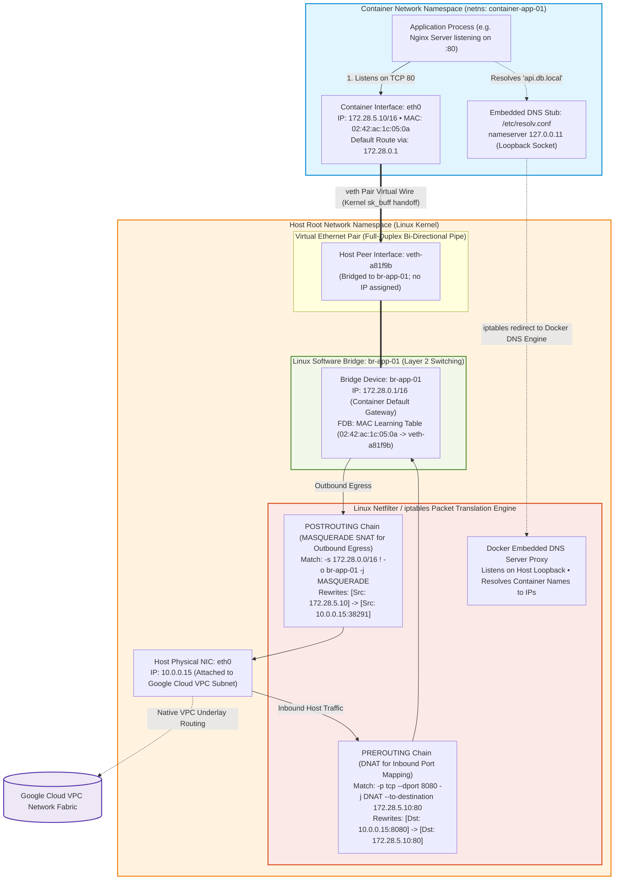

#### Step-by-Step Docker Datapath & Linux Kernel Mechanics

1. **Namespace Isolation via Linux `clone()` & `CLONE_NEWNET`**:
   - When Docker creates a container (`docker run`), the Linux kernel creates an isolated network namespace (`netns`). This namespace possesses its own loopback interface (`lo`), network interfaces, routing table, ARP cache, and Netfilter firewall rules, completely segregated from the host and other containers.
2. **The Virtual Ethernet (`veth`) Pair**:
   - The kernel creates a linked `veth` pair (`veth0` inside container netns and `veth-xyz` in root netns). Think of this as a virtual Ethernet patch cord. Any Ethernet frame written into one end instantly emerges from the other end via an internal `sk_buff` kernel pointer swap with zero network latency.
3. **Layer 2 Bridge Forwarding & MAC Learning**:
   - The host-side interface (`veth-xyz`) is attached to a Linux software bridge (`br-app-01`). The bridge operates as an unmanaged Layer 2 Ethernet switch. It inspects the source MAC of incoming Ethernet frames and populates its Forwarding Database (FDB). When containers on the same bridge communicate, the bridge switches frames between `veth` interfaces directly without touching host routing tables or IP firewalls.
4. **Inbound Traffic via Destination NAT (`DNAT`)**:
   - When external traffic hits `10.0.0.15:8080` (e.g. from `-p 8080:80`), the packet triggers the Netfilter `PREROUTING` chain.
   - The kernel matches Docker's `DOCKER` iptables chain rule and performs **DNAT**, rewriting the destination IP from `10.0.0.15:8080` to container IP `172.28.5.10:80`.
   - The kernel routing table then identifies that `172.28.5.10` is reachable via bridge `br-app-01`, which forwards the frame through `veth-xyz` into container `eth0`.
5. **Outbound Internet Egress via Source NAT (`SNAT / MASQUERADE`)**:
   - When a container requests an external endpoint (e.g. `curl https://api.stripe.com`), the container routing table routes the packet to its default gateway (`172.28.0.1` on `br-app-01`).
   - The host kernel forwards the packet to physical interface `eth0`.
   - In the Netfilter `POSTROUTING` chain, the kernel matches the `MASQUERADE` rule and rewrites the source IP from private container IP `172.28.5.10` to host NIC IP `10.0.0.15`, allocating an ephemeral port.
   - The connection tracking table (`conntrack`) records the tuple `[Src: 172.28.5.10:49152, Dst: API_IP:443] <-> [Src: 10.0.0.15:38291, Dst: API_IP:443]`, ensuring return packets are de-NATed back to the container.
6. **Embedded DNS Discovery (`127.0.0.11:53`)**:
   - In custom Docker networks, `/etc/resolv.conf` points to loopback IP `127.0.0.11`.
   - Docker's Netfilter rules redirect DNS UDP packets sent to `127.0.0.11:53` to Docker's internal DNS daemon thread. The daemon inspects its container name registry to resolve service names (e.g. `db -> 172.28.5.11`) or forwards external domain queries upstream to the host's DNS servers.

### A. Create Custom User-Defined Docker Network (`docker network create`)

```bash
docker network create my-application-net \
  # ── NETWORK DRIVER ───────────────────────────────────────────────────────
  --driver=bridge \
  # Enum: "bridge" | "host" | "overlay" | "macvlan" | "none"
  #   bridge: Standard software bridge on single host (recommended for microservices).
  #   host: Bypasses container network virtualization; uses host network directly (fastest).
  #   overlay: Multi-host networking across Swarm or daemon-to-daemon mesh.
  #   macvlan: Assigns physical MAC address directly to container (appears as physical host).
  #   none: Complete isolation; disables all networking interfaces inside container.

  # ── IP ADDRESS MANAGEMENT (IPAM) ─────────────────────────────────────────
  --subnet=172.28.0.0/16 \
  # CIDR string: Private IPv4 range allocated to this bridge.
  # Valid values: Standard RFC 1918 blocks (10.0.0.0/8, 172.16.0.0/12, 192.168.0.0/16).
  --gateway=172.28.0.1 \
  # IPv4 address: Default gateway for containers in this network (must reside within --subnet).
  --ip-range=172.28.5.0/24 \
  # CIDR string: Sub-pool within --subnet from which Docker dynamically leases container IPs.

  # ── SCOPE & SECURITY OPTIONS ─────────────────────────────────────────────
  --internal=false \
  # Boolean: "true" | "false".
  # If true, restricts traffic strictly to internal containers; blocks external egress/NAT to internet.
  --attachable=true \
  # Boolean: "true" | "false". Allows standalone manual containers to attach dynamically.

  # ── MTU & NETWORK DRIVER OPTIONS ─────────────────────────────────────────
  --opt com.docker.network.bridge.name=br-app-01 \
  # String: Linux bridge interface name on host OS (visible in `ip link show`).
  --opt com.docker.network.driver.mtu=1460 \
  # Integer: Maximum Transmission Unit.
  # Critical rule: Must match cloud provider underlying network MTU (GCP uses 1460; AWS uses 9001/1500).

  # ── METADATA ─────────────────────────────────────────────────────────────
  --label="environment=production" \
  --label="owner=devops"
```

### B. Launch Container Attached to Custom Network (`docker run`)

```bash
docker run -d \
  # ── CONTAINER IDENTITY & NETWORK ATTACHMENT ──────────────────────────────
  --name=api-gateway \
  --network=my-application-net \
  # String: Name or ID of Docker network created above.
  --network-alias=api.internal.local \
  # String: Embedded Docker DNS record. Other containers on same network resolve this alias!
  --ip=172.28.5.10 \
  # Static IP string: Explicitly assigns static IP from network's --ip-range.

  # ── PORT BINDING & NAT PUBLISHING ────────────────────────────────────────
  --publish=127.0.0.1:8080:80/tcp \
  # Syntax: [HOST_IP:][HOST_PORT:]CONTAINER_PORT[/PROTOCOL]
  # Examples:
  #   "127.0.0.1:8080:80": Binds host loopback only (secure, requires reverse proxy).
  #   "0.0.0.0:8080:80": Binds on all host interfaces (accessible from VPC/internet).
  #   "8080:80/udp": Binds UDP traffic instead of default TCP.

  # ── DNS & HOST OVERRIDES ─────────────────────────────────────────────────
  --dns=10.0.0.10 \
  # IP string: Custom upstream DNS resolver (e.g., Cloud DNS or corporate internal resolver).
  --add-host=database.legacy.corp:10.0.1.50 \
  # Syntax: "HOSTNAME:IP". Appends custom entries directly into container's /etc/hosts.

  # ── IMAGE ────────────────────────────────────────────────────────────────
  nginx:1.26-alpine
```

### C. Connect Running Container to Second Network (`docker network connect`)

```bash
docker network connect \
  # ── NETWORK & TARGET CONTAINER ───────────────────────────────────────────
  database-backend-net \
  api-gateway \
  # Allows api-gateway to talk to both frontend and backend networks without bridge routing.
  --ip=172.29.0.15 \
  --alias=api-internal
```

---

## 2. GCP VPC Network & Custom Subnet Provisioning

Defines the global virtual network and regional subnets. In Kubernetes/GKE, subnets require **Primary CIDRs** (for worker nodes) and **Secondary CIDRs** (for Pods and ClusterIP Services).

### A. Create Custom Mode VPC Network (`gcloud compute networks create`)

```bash
gcloud compute networks create enterprise-production-vpc \
  # ── SUBNET MODE ──────────────────────────────────────────────────────────
  --subnet-mode=custom \
  # Enum: "custom" | "auto"
  #   custom: Production standard! Only explicitly created subnets exist.
  #   auto: Creates /20 subnets in every single GCP region (never use in enterprise production).

  # ── BGP ROUTING MODE ─────────────────────────────────────────────────────
  --bgp-routing-mode=global \
  # Enum: "regional" | "global"
  #   global: Cloud Routers dynamically share routes across ALL GCP regions worldwide.
  #   regional: Cloud Routers only propagate routes within their local GCP region.

  # ── MAXIMUM TRANSMISSION UNIT (MTU) ──────────────────────────────────────
  --mtu=1460 \
  # Integer: 1300, 1460, 1500, or 8896 (Jumbo Frames).
  #   1460: Standard GCP default.
  #   1500: Standard Ethernet (requires 1500 MTU on all connected nodes and peers).
  #   8896: Jumbo frames (only supported inside same VPC/subnet).

  # ── PROJECT IDENTIFIER ───────────────────────────────────────────────────
  --project=my-gcp-project-id
```

### B. Create Regional Subnet with GKE Secondary Ranges (`gcloud compute networks subnets create`)

```bash
gcloud compute networks subnets create gke-us-central1-subnet \
  # ── VPC & LOCATION ───────────────────────────────────────────────────────
  --network=enterprise-production-vpc \
  --region=us-central1 \
  # String: Target GCP region (e.g., us-central1, europe-west1, asia-east1).

  # ── PRIMARY CIDR (WORKER NODES & COMPUTE VMs) ────────────────────────────
  --range=10.0.0.0/20 \
  # CIDR: 4,096 total host IP addresses (10.0.0.1 to 10.0.15.254).
  # Used for GKE Worker Node OS interfaces (eth0) and standard Compute Engine VMs.

  # ── SECONDARY CIDRS (KUBERNETES PODS & SERVICES) ─────────────────────────
  --secondary-range=gke-pods-range=10.4.0.0/14 \
  # CIDR: 262,144 total Pod IPs (10.4.0.0 to 10.7.255.255).
  # GKE assigns a /24 (256 Pod IPs) to each worker node by default.
  # A /14 supports up to 1,024 GKE worker nodes!
  --secondary-range=gke-services-range=10.8.0.0/20 \
  # CIDR: 4,096 ClusterIP addresses (10.8.0.0 to 10.8.15.255).
  # Allocated strictly to Kubernetes internal Service Virtual IPs (ClusterIP).

  # ── PRIVATE GOOGLE ACCESS (PGA) ──────────────────────────────────────────
  --enable-private-ip-google-access \
  # Boolean flag: Enables VMs and Pods without public IPs to access Google APIs
  # (Cloud Storage, Artifact Registry, BigQuery) via private internal routing!

  # ── VPC FLOW LOGGING (SECURITY & TRAFFIC TELEMETRY) ──────────────────────
  --enable-flow-logs \
  --logging-aggregation-interval=interval-5-sec \
  # Enum: "interval-5-sec" | "interval-30-sec" | "interval-1-min" | "interval-5-min"
  --logging-flow-sampling=0.5 \
  # Float: 0.0 to 1.0 (0.5 = 50% packet sampling rate; 1.0 = 100% full capture).
  --logging-metadata=include-all \
  # Enum: "include-all" | "exclude-all" | "custom"
  # Captures pod name, pod namespace, source/destination instance names in Cloud Logging.
  --project=my-gcp-project-id
```

---

## 3. Cloud NAT & Egress Internet Gateway

Private Kubernetes worker nodes and containers must never have public external IP addresses. **Cloud NAT** grants outbound internet access (for downloading OS updates, pulling third-party packages, or calling external APIs) while blocking all unsolicited inbound connections.

### A. Create Cloud Router for NAT Engine (`gcloud compute routers create`)

```bash
gcloud compute routers create nat-router-us-central1 \
  # ── LOCATION & NETWORK ───────────────────────────────────────────────────
  --network=enterprise-production-vpc \
  --region=us-central1 \

  # ── BGP AUTONOMOUS SYSTEM NUMBER (ASN) ───────────────────────────────────
  --asn=65001 \
  # Integer: Private ASN for BGP routing.
  # Valid private ASN ranges: 64512 to 65534, or 4200000000 to 4294967294.
  --project=my-gcp-project-id
```

### B. Deploy Cloud NAT Gateway (`gcloud compute routers nats create`)

```bash
gcloud compute routers nats create production-cloud-nat \
  # ── ROUTER & LOCATION ────────────────────────────────────────────────────
  --router=nat-router-us-central1 \
  --region=us-central1 \

  # ── SUBNET IP MAPPING SPECIFICATION ──────────────────────────────────────
  --nat-all-subnet-ip-ranges \
  # Enum / Choice:
  #   --nat-all-subnet-ip-ranges: NATs Primary ranges AND all GKE Pod Secondary ranges!
  #   --nat-custom-subnet-ip-ranges: Selectively NATs specific subnets or secondary ranges.

  # ── EXTERNAL IP ALLOCATION (NAT EGRESS IPS) ──────────────────────────────
  --auto-allocate-nat-external-ips \
  # Alternatives:
  #   --auto-allocate-nat-external-ips: GCP automatically scales pool of static external IPs.
  #   --nat-external-ip-pool=IP_NAME1,IP_NAME2: Uses specific pre-reserved static IPs
  #   (critical when external vendors require IP-whitelisting!).

  # ── PORT ALLOCATION & CONNECTION TIMEOUTS ────────────────────────────────
  --min-ports-per-vm=64 \
  # Integer: Minimum TCP/UDP ports reserved per node/VM. Default: 64. Max: 65536.
  --max-ports-per-vm=512 \
  # Integer: Maximum ports VM can dynamically consume under high socket usage.
  --enable-dynamic-port-allocation \
  # Boolean: Automatically scales ports per node without dropping connections.
  --tcp-established-idle-timeout=1200s \
  # Duration: Timeout before killing established TCP connections (default: 1200s / 20m).
  --tcp-transitory-idle-timeout=30s \
  # Duration: Timeout for half-closed or SYN TCP connections (default: 30s).
  --udp-idle-timeout=30s
```

---

## 4. VPC Firewall Rules for Kubernetes Clusters & Microservices

Google Cloud VPC firewalls are **stateful** (return traffic is automatically permitted by the connection tracking engine). Default VPC posture blocks all inbound ingress.

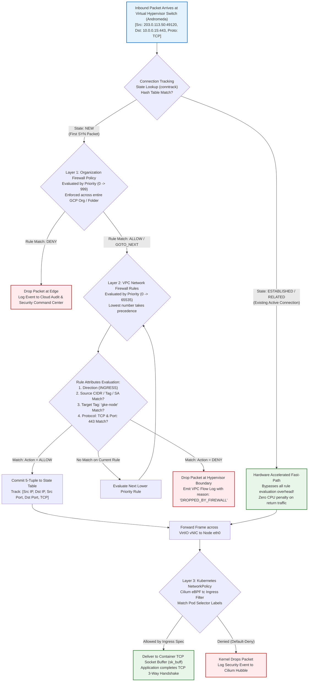

#### Internal Stateful Firewall Pipeline Mechanics (Step-by-Step)

1. **Andromeda Hypervisor Intercept & Conntrack Fast-Path**:
   - Google Cloud VPC firewalls do not run on a physical appliance or inside the guest operating system. They are executed directly inside Google's **Andromeda SDN virtual switch** on the host hypervisor before the packet reaches the VM's virtual NIC (`VirtIO` / `gVNIC`).
   - For every arriving packet, Andromeda extracts the 5-tuple (`Source IP, Destination IP, Protocol, Source Port, Destination Port`).
   - It checks the distributed connection tracking table. If the packet belongs to an existing `ESTABLISHED` connection (e.g. response packets from an outbound request), it is instantly forwarded to the guest VM via hardware-assisted fast-path. **Return traffic never incurs rule evaluation latency**.
2. **Hierarchical Org Firewall Policy Precedence (Priority 0–999)**:
   - For `NEW` connections (e.g., initial TCP `SYN`), evaluation begins at the Organization or Folder level. Central SecOps teams configure immutable security rules (such as blocking all ingress on port 22/3389 from the public internet, or blocking unauthorized external IP ranges).
   - If an Org Policy matches `DENY`, the packet is terminated immediately; VPC administrators cannot override this decision.
3. **VPC Rule Evaluation & Priority-Order Matching (Priority 0–65535)**:
   - If Org policies delegate evaluation, Andromeda evaluates the VPC's custom firewall rules in strict ascending numerical order (e.g. Priority `100` before Priority `1000`).
   - The first rule whose attributes match all conditions (direction, source range/tag, target tag/service account, and protocol/port) determines the verdict:
     - **ALLOW**: Evaluation terminates immediately; the connection is registered in the state table and forwarded to the node.
     - **DENY**: Evaluation terminates; the packet is discarded and an audit record is dispatched to VPC Flow Logs.
   - If no custom rule matches, the packet hits the implicit default rules: Priority `65534` (Allow all internal egress) or Priority `65535` (Deny all unsolicited ingress).
4. **Target Tags vs Secure Service Accounts**:
   - Network tags (e.g., `gke-node`) are strings attached to VM instances. However, anyone with Compute Instance Admin permissions can edit tags.
   - For zero-trust enterprise isolation, firewall rules filter by **Target Service Accounts** (`--target-service-accounts`). Service account identity is cryptographically tied to the VM instance metadata and cannot be modified without IAM security administrator rights.
5. **Worker Node & eBPF NetworkPolicy Second-Line Defense**:
   - Once the hypervisor passes the packet to the worker node, the packet enters the host kernel.
   - While VPC firewalls secure nodes at Layer 3/4, they have no visibility into Kubernetes Pod labels, namespaces, or container identities.
   - Modern GKE Datapath v2 utilizes **Cilium eBPF programs** hooked into Linux `tc` (traffic control). The eBPF program inspects the destination Pod identity in memory. If a Kubernetes `NetworkPolicy` isolates the Pod and does not contain an ingress rule matching the sender, the packet is silently dropped at the container socket boundary.

### A. Allow Internal Cluster East-West Traffic (Node-to-Node & Pod-to-Pod)

```bash
gcloud compute firewall-rules create allow-gke-internal-all \
  # ── NETWORK SCOPE ────────────────────────────────────────────────────────
  --network=enterprise-production-vpc \
  --direction=INGRESS \
  # Enum: "INGRESS" (incoming) | "EGRESS" (outgoing). Default: INGRESS.
  --priority=1000 \
  # Integer: 0 to 65535 (lower numbers evaluated first). Default: 1000.

  # ── ACTION & PROTOCOLS ───────────────────────────────────────────────────
  --action=ALLOW \
  # Enum: "ALLOW" | "DENY"
  --rules=tcp:1-65535,udp:1-65535,icmp \
  # Syntax: PROTOCOL[:PORT[-PORT]]. E.g., "tcp:80,tcp:443", "udp", "icmp", "all".

  # ── SOURCE IP RANGES ─────────────────────────────────────────────────────
  --source-ranges=10.0.0.0/20,10.4.0.0/14,10.8.0.0/20 \
  # CIDR list: Allows traffic originating from Nodes (10.0.0.0/20),
  # Pods (10.4.0.0/14), and Services (10.8.0.0/20).

  # ── TARGET INSTANCE FILTER ───────────────────────────────────────────────
  --target-tags=gke-node,k8s-worker \
  # Tag list: Applies this firewall strictly to VMs matching these network tags.
  --description="Allow intra-cluster node, pod, and service communication"
```

### B. Allow Google Cloud Load Balancer Health Checks

```bash
gcloud compute firewall-rules create allow-gcp-health-checks \
  --network=enterprise-production-vpc \
  --direction=INGRESS \
  --priority=1000 \
  --action=ALLOW \
  --rules=tcp:80,tcp:443,tcp:8080,tcp:10256 \
  # Port 10256 is default kube-proxy health check; other ports are app targets.
  --source-ranges=35.191.0.0/16,130.211.0.0/22 \
  # REQUIRED IP RANGES: These exact two CIDRs are hardcoded Google Cloud Load Balancers
  # and Google health check prober source IPs. NEVER block these ranges!
  --target-tags=gke-node,k8s-worker \
  --description="Allow Google Cloud LB health check probers to verify backend pod health"
```

### C. Allow Managed GKE Control Plane to Worker Node Webhooks

```bash
gcloud compute firewall-rules create allow-gke-master-to-nodes \
  --network=enterprise-production-vpc \
  --direction=INGRESS \
  --priority=1000 \
  --action=ALLOW \
  --rules=tcp:443,tcp:10250,tcp:8443,tcp:9443 \
  # 443/8443/9443: Mutating/validating admission webhooks (Cert-Manager, Argo, Istio).
  # 10250: Kubelet API for `kubectl logs` and `kubectl exec`.
  # ── TARGET INSTANCE FILTER ───────────────────────────────────────────────
  --source-ranges=172.16.0.0/28 \
  # CIDR: Private Control Plane master CIDR block allocated during GKE cluster creation.
  --target-tags=gke-node

> [!NOTE]
> **Health Check CIDR Verification**: The source ranges `35.191.0.0/16` and `130.211.0.0/22` apply to Classic LBs and Global External Application LBs. Regional LBs and Envoy proxy-based load balancers may probe backends from dedicated regional proxy-only subnets (`--purpose=REGIONAL_MANAGED_PROXY`). Always verify active health check sources against current Google documentation.

### D. Default-Deny Outbound Egress & Granular Allowlisting

Production enterprise security requires shifting from open egress to **default-deny egress**, explicitly permitting only approved destinations.

```bash
# 1. Base Default-Deny Egress Firewall Rule
gcloud compute firewall-rules create deny-all-egress \
  --network=enterprise-production-vpc \
  --direction=EGRESS \
  --priority=65534 \
  # Lowest priority before GCP default allow (65535).
  --action=DENY \
  --rules=all \
  --destination-ranges=0.0.0.0/0 \
  --description="Block all outbound traffic by default across the entire VPC"

# 2. Granular Egress Rule: Allow Strictly Internal RFC 1918 & Cloud NAT Ports
gcloud compute firewall-rules create allow-egress-internal-and-web \
  --network=enterprise-production-vpc \
  --direction=EGRESS \
  --priority=1000 \
  --action=ALLOW \
  --rules=tcp:80,tcp:443,udp:53,tcp:53 \
  # Permitted egress: Web outbound via Cloud NAT, and internal DNS queries.
  --destination-ranges=10.0.0.0/8,172.16.0.0/12,192.168.0.0/16,0.0.0.0/0 \
  --target-tags=gke-node,k8s-worker
```

---

## 5. Kubernetes CNI & Micro-Segmentation Network Policies

Kubernetes NetworkPolicies enforce **Layer 3 and Layer 4 micro-segmentation** between Pods. By default, any Pod in a cluster can talk to any other Pod. Applying a NetworkPolicy shifts the Pod into **Default-Deny** mode.

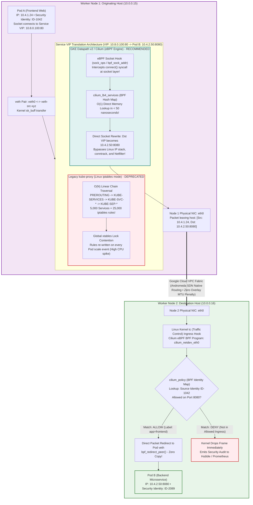

#### Internal CNI Datapath: eBPF vs iptables Packet Mechanics

1. **Socket-Level Translation vs Packet-Level DNAT**:
   - In legacy `kube-proxy` iptables mode, Pod A forms an IP packet with destination `10.8.0.100:80` (the ClusterIP Service VIP). That packet travels through the container networking stack into the host kernel, where Netfilter intercepts it in the `PREROUTING` chain, traverses sequential iptables chains, performs Destination NAT (`DNAT`) to replace the VIP with the chosen Pod endpoint IP (`10.4.2.50:8080`), and records the connection in `nf_conntrack`.
   - In **GKE Datapath v2 (eBPF)**, Cilium hooks directly into the Linux socket layer using the `sock_ops` and `bpf_sock_addr` programs. When the application issues the `connect()` system call, eBPF intercepts the socket buffer *before* the IP packet is even constructed. It performs an immediate lookup in the `cilium_lb4_services` BPF hash table and modifies the socket's destination IP in place. The kernel emits packets addressed directly to `10.4.2.50:8080` from the outset, eliminating DNAT overhead and Netfilter connection tracking entirely.
2. **$O(1)$ Hash Table Scaling vs $O(N)$ Linear Rule Search**:
   - As Kubernetes clusters scale to hundreds of microservices and tens of thousands of endpoints, `kube-proxy` generates tens of thousands of sequential iptables rules. Every single packet must linearly traverse this rule chain until a match is found ($O(N)$ computational complexity). Furthermore, whenever any Pod dies or scales, the entire iptables rule set must be rebuilt and reloaded under a kernel-wide lock (`xtables_lock`), causing CPU throttling spikes.
   - eBPF stores all Services and EndpointSlices in fixed-time BPF Hash Maps. Looking up a service among 100,000 endpoints executes in **$O(1)$ constant time** (sub-50 nanoseconds). Endpoint updates are committed atomically via BPF map entry updates with zero kernel lock contention.
3. **Cilium Security Identities (Micro-Segmentation Without IP Matching)**:
   - In traditional firewalls, every policy requires parsing source and destination IP addresses. But in Kubernetes, Pod IPs churn constantly as pods scale and restart.
   - Datapath v2 assigns every unique set of Pod labels a **Numeric Security Identity** (e.g. Pods with `app=frontend, tier=web` receive Identity `ID-1042`).
   - When Pod A transmits a packet to Pod B across nodes, Cilium stamps this numeric identity into the packet metadata (or retains it in eBPF context).
   - On Node 2, the ingress eBPF program at the `tc` hook checks whether Identity `ID-1042` is permitted to connect to Pod B's port `8080` in the `cilium_policy` map. If unauthorized, eBPF executes `TC_ACT_SHOT` to drop the packet instantly at the NIC driver level before it can consume any guest host resources.

### A. Micro-Segmentation NetworkPolicy (Ingress & Egress)
kubectl apply -f - <<'EOF'
apiVersion: networking.k8s.io/v1
kind: NetworkPolicy
metadata:
  name: isolate-backend-microservice
  namespace: production
spec:
  # ── TARGET POD SELECTION ─────────────────────────────────────────────────
  podSelector:
    matchLabels:
      app: backend-api
      tier: application
  # Policy applies strictly to pods possessing these exact labels.

  # ── POLICY ENFORCEMENT TYPES ─────────────────────────────────────────────
  policyTypes:
    - Ingress
    - Egress
  # Declares that both incoming and outgoing traffic will be filtered.

  # ── INGRESS RULES (WHO CAN TALK TO THIS POD) ─────────────────────────────
  ingress:
    - from:
        # Source Rule 1: Allow strictly Frontend pods within production namespace
        - podSelector:
            matchLabels:
              app: web-frontend
              tier: frontend
        # Source Rule 2: Allow monitoring system from dedicated telemetry namespace
        - namespaceSelector:
            matchLabels:
              kubernetes.io/metadata.name: monitoring
          podSelector:
            matchLabels:
              app: prometheus
        # Source Rule 3: Allow external corporate subnet CIDR block
        - ipBlock:
            cidr: 10.100.0.0/16
            except:
              - 10.100.5.0/24  # Blocks untrusted contractor subnet inside CIDR
      ports:
        - protocol: TCP
          port: 8080
        - protocol: TCP
          port: 9090  # Prometheus metrics port

  # ── EGRESS RULES (WHERE THIS POD CAN INITIATE TRAFFIC TO) ────────────────
  egress:
    # Egress Rule 1: Allow CoreDNS resolution (MANDATORY or DNS lookups fail!)
    - to:
        - namespaceSelector:
            matchLabels:
              kubernetes.io/metadata.name: kube-system
          podSelector:
            matchLabels:
              k8s-app: kube-dns
      ports:
        - protocol: UDP
          port: 53
        - protocol: TCP
          port: 53

    # Egress Rule 2: Allow reaching PostgreSQL database in database namespace
    - to:
        - namespaceSelector:
            matchLabels:
              kubernetes.io/metadata.name: database
          podSelector:
            matchLabels:
              app: postgres
      ports:
        - protocol: TCP
          port: 5432
EOF
```

---

## 6. Kubernetes Service Traffic & Cloud Load Balancer Wiring

Binds Kubernetes Pods to cloud networking. Specifying annotations triggers Google Cloud to automatically provision **Internal Passthrough Network Load Balancers** or **External Application Load Balancers**.

```bash
kubectl apply -f - <<'EOF'
apiVersion: v1
kind: Service
metadata:
  name: internal-microservice-lb
  namespace: production
  annotations:
    # ── GOOGLE CLOUD LOAD BALANCER ANNOTATIONS ─────────────────────────────
    networking.gke.io/load-balancer-type: "Internal"
    # Enum: "Internal" | "External"
    #   "Internal": Provisions internal VPC Passthrough LB (no public internet access).
    #   "External": Provisions public-facing Google Cloud Load Balancer.
    networking.gke.io/internal-load-balancer-subnet: "gke-us-central1-subnet"
    # String: Subnet where the LoadBalancer private IP will be leased.
    networking.gke.io/internal-load-balancer-allow-global-access: "true"
    # Boolean: "true" | "false".
    # If true, allows clients in ALL GCP regions (and on-prem via VPN) to reach this internal LB!
spec:
  # ── TRAFFIC POLICY & SOURCE IP PRESERVATION ──────────────────────────────
  externalTrafficPolicy: Local
  # Enum: "Cluster" | "Local"
  #   Local: Bypasses kube-proxy SNAT; PRESERVES true client IP on packet!
  #          Only routes to pods residing on the receiving node (eliminates extra hop).
  #   Cluster: Balances across all nodes; client IP is masked by node IP (extra hop).

  type: LoadBalancer
  selector:
    app: backend-api
  ports:
    - name: http
      protocol: TCP
      port: 80
      targetPort: 8080
EOF
```

---

## 7. VPC Network Peering (Inter-VPC Interconnection)

Connects two separate VPC networks (e.g., `production-vpc` and `shared-services-vpc` or `database-vpc`) with zero gateway hops, ultra-low latency, and internal pricing.

```bash
# STEP 1: Request Peering from Production VPC to Shared Services VPC
gcloud compute networks peerings create prod-to-shared-peering \
  # ── SOURCE & TARGET VPC NETWORKS ─────────────────────────────────────────
  --network=enterprise-production-vpc \
  --peer-network=shared-services-vpc \
  --peer-project=shared-services-project-id \

  # ── CUSTOM ROUTE EXPORT & IMPORT (BGP TRANSIT) ───────────────────────────
  --export-custom-routes \
  # Boolean flag: Shares custom static and dynamic BGP routes from this VPC to peer.
  --import-custom-routes \
  # Boolean flag: Accepts custom routes exported by the peer network.

  # ── GKE POD CIDR SHARING (CRITICAL FOR K8S PEERING!) ─────────────────────
  --export-subnet-routes-with-public-ip \
  --import-subnet-routes-with-public-ip \
  # If GKE Pod secondary CIDRs use non-RFC1918 space (Class E / public IP ranges),
  # this flag MUST be enabled to exchange Pod routes across the peering link!
  --project=my-gcp-project-id

# STEP 2: Complete Peering from Shared Services VPC back to Production VPC
# (Peering is bilateral; connection remains INACTIVE until configured on both sides!)
gcloud compute networks peerings create shared-to-prod-peering \
  --network=shared-services-vpc \
  --peer-network=enterprise-production-vpc \
  --peer-project=my-gcp-project-id \
  --export-custom-routes \
  --import-custom-routes \
  --project=shared-services-project-id
```

> [!CAUTION]
> **VPC Peering Non-Transitivity Landmine**: VPC Peering is strictly **non-transitive**. If `VPC-A` peers with `VPC-B`, and `VPC-B` peers with `VPC-C`, workloads in `VPC-A` **CANNOT** reach `VPC-C` through `VPC-B`! Google Cloud drops transit packets at the hypervisor. For transit hub topologies connecting dozens of VPCs and on-premises sites without full pairwise mesh limits, deploy **Network Connectivity Center (NCC)** (see Section 19).

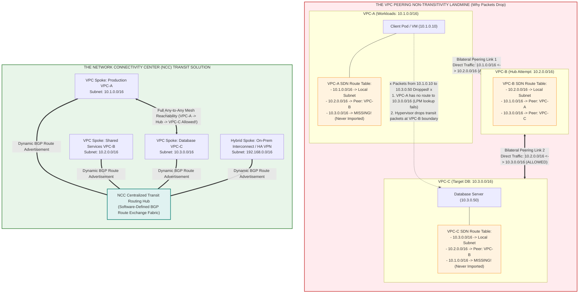

#### Why VPC Peering Is Non-Transitive & How NCC Hub Solves It

1. **The Hypervisor Route Table Isolation Mechanism**:
   - Google Cloud VPC Peering creates direct, pairwise SDN mappings between two VPCs. In Andromeda, peering simply maps the peer's subnet CIDRs directly into your VPC's route table.
   - However, **peering routes do not re-advertise**. When VPC-B peers with VPC-C, VPC-B learns `10.3.0.0/16`. But VPC-B is prohibited by Google Cloud architecture from exporting those learned peer routes across its other peering link to VPC-A.
   - Consequently, VPC-A's routing table has **zero knowledge** of `10.3.0.0/16`. When a container in VPC-A transmits a packet addressed to `10.3.0.50`, the virtual switch performs a Longest Prefix Match (LPM) lookup, finds no matching route, and discards the packet or dumps it to the default internet gateway (`0.0.0.0/0`).
2. **Hypervisor Transit Packet Drop**:
   - Even if you configure an intermediate VM in VPC-B with IP forwarding (`net.ipv4.ip_forward=1`) to act as a router, the Andromeda hypervisor inspects every packet entering VPC-B's virtual NICs. If a packet enters VPC-B with source IP `10.1.0.10` and destination `10.3.0.50`, Andromeda identifies that the source IP belongs to a foreign peered VPC and drops the packet at the hypervisor boundary.
3. **The NCC Hub-and-Spoke Solution**:
   - **Network Connectivity Center (NCC)** eliminates the need for full $N \times (N-1) / 2$ pairwise peering meshes.
   - You create a central **NCC Hub**. Each VPC network is attached as a **VPC Spoke**.
   - NCC acts as an automated route broker: It dynamically propagates subnet routes from each spoke VPC into all other member spokes. Workloads in VPC-A can seamlessly communicate with VPC-C and hybrid on-premises endpoints through the central hub fabric with zero transit drops and zero proxy virtual machines.

---

## 8. VPC Custom Routes & Virtual Gateway Routing

Routes determine where packets destined for specific IP CIDRs are forwarded (e.g. Next-Hop VM, Next-Hop VPN Tunnel, or Next-Hop Internal Load Balancer).

```bash
gcloud compute routes create route-to-onprem-datacenter \
  # ── NETWORK SCOPE ────────────────────────────────────────────────────────
  --network=enterprise-production-vpc \

  # ── DESTINATION CIDR BLOCK ───────────────────────────────────────────────
  --destination-range=192.168.0.0/16 \
  # CIDR string: Destination IP block matching on-prem enterprise datacenter.

  # ── PRIORITY & PRECEDENCE ────────────────────────────────────────────────
  --priority=100 \
  # Integer: 0 to 65535 (lower values take precedence). Default: 1000.

  # ── NEXT-HOP DESTINATION SELECTION (MUTUALLY EXCLUSIVE) ───────────────────
  --next-hop-vpn-tunnel=us-central1-vpn-tunnel-1 \
  --next-hop-vpn-tunnel-region=us-central1 \
  # Options:
  #   --next-hop-gateway=default-internet-gateway (default route 0.0.0.0/0)
  #   --next-hop-instance=firewall-vm-instance --next-hop-instance-zone=us-central1-a
  #   --next-hop-ilb=internal-firewall-lb-ip
  #   --next-hop-vpn-tunnel=vpn-tunnel-name

  # ── TAG FILTERING (POLICY-BASED ROUTING) ──────────────────────────────────
  --tags=needs-onprem-access \
  # If set, route ONLY applies to VMs possessing this network tag.
  --description="Route corporate datacenter traffic over encrypted VPN tunnel" \
  --project=my-gcp-project-id
```

---

## 9. Enterprise Cloud HA VPN (Hybrid & Cross-Cloud Transit)

High Availability (HA) VPN delivers a **99.99% service availability SLA** using two active IPsec tunnels over BGP routing.

### A. Create Cloud HA VPN Gateway (`gcloud compute vpn-gateways create`)

```bash
gcloud compute vpn-gateways create corp-ha-vpn-gw \
  --network=enterprise-production-vpc \
  --region=us-central1 \
  --project=my-gcp-project-id
# Automatically allocates TWO public IPv4 interface IPs (interface 0 and interface 1).
```

### B. Define External Peer Gateway (On-Premises Cisco / AWS / Azure VPN)

```bash
gcloud compute external-vpn-gateways create onprem-cisco-gw \
  # ── PEER REDUNDANCY TYPE ─────────────────────────────────────────────────
  --interfaces=0=203.0.113.1,1=203.0.113.2 \
  # Syntax: 0=IP,1=IP.
  # Represents physical WAN public IP addresses of remote customer gateway.
  --project=my-gcp-project-id
```

### C. Create Encrypted IPsec Tunnel 0 with BGP Session

```bash
# 1. Provision VPN Tunnel 0
gcloud compute vpn-tunnels create vpn-tunnel-0 \
  --region=us-central1 \
  --vpn-gateway=corp-ha-vpn-gw \
  --interface=0 \
  # Integer: 0 or 1. Associates tunnel to local HA VPN gateway interface.
  --peer-external-gateway=onprem-cisco-gw \
  --peer-external-gateway-interface=0 \
  --shared-secret='MyComplexSharedKeySecret123!' \
  # String: Pre-shared IKE key (must match remote router secret exactly).
  --ike-version=2 \
  # Enum: 1 | 2. Production standard: IKEv2.
  --router=nat-router-us-central1 \
  # Cloud Router managing BGP peering for this tunnel.
  --project=my-gcp-project-id

# 2. Add Virtual BGP Interface to Cloud Router
gcloud compute routers add-interface nat-router-us-central1 \
  --region=us-central1 \
  --interface-name=bgp-if-0 \
  --ip-address=169.254.0.1 \
  # RFC 3927 Link-Local IP: Local BGP endpoint. Subnet mask must be /30.
  --mask-length=30 \
  --vpn-tunnel=vpn-tunnel-0 \
  --project=my-gcp-project-id

# 3. Establish BGP Peer Session
gcloud compute routers add-bgp-peer nat-router-us-central1 \
  --region=us-central1 \
  --peer-name=onprem-bgp-peer-0 \
  --interface=bgp-if-0 \
  --peer-ip-address=169.254.0.2 \
  # Link-Local IP of remote on-premises BGP neighbor.
  --peer-asn=65002 \
  # Remote Autonomous System Number (ASN) of corporate router.
  --advertised-route-priority=100 \
  --project=my-gcp-project-id
```

---

## 10. Cloud DNS & Internal CoreDNS Resolution

Enables split-horizon DNS where Kubernetes Pods, VMs, and on-premises infrastructure resolve each other via private zones.

### A. Create Private Cloud DNS Zone Bound to VPC

```bash
gcloud dns managed-zones create corp-internal-zone \
  # ── DNS DOMAIN NAME & DESCRIPTION ────────────────────────────────────────
  --dns-name=internal.corp. \
  # DNS root format: MUST end with trailing dot "." (e.g. "internal.corp.").
  --description="Private corporate internal DNS zone" \

  # ── VISIBILITY & VPC BINDING ─────────────────────────────────────────────
  --visibility=private \
  # Enum: "public" | "private"
  #   private: Records only resolvable within authorized VPC networks.
  #   public: Globally queryable on public internet.
  --networks=enterprise-production-vpc,shared-services-vpc \
  # Comma-delimited list: All VPC networks permitted to resolve this zone!
  --project=my-gcp-project-id
```

### B. Register DNS Record Sets (`gcloud dns record-sets transaction`)

```bash
# 1. Initialize Record Transaction
gcloud dns record-sets transaction start --zone=corp-internal-zone

# 2. Append A Record (Mapping hostname to internal IP)
gcloud dns record-sets transaction add 10.0.1.50 \
  --name=database.internal.corp. \
  --ttl=300 \
  # Integer: Time-To-Live in seconds (e.g., 60, 300, 3600).
  --type=A \
  # Enum: "A" | "AAAA" | "CNAME" | "MX" | "TXT" | "SRV" | "PTR"
  --zone=corp-internal-zone

# 3. Commit Transaction to DNS Servers
gcloud dns record-sets transaction execute --zone=corp-internal-zone
```

---

## 11. Multi-Zone High Availability (HA) & Workload Anti-Affinity

Guarantees 99.99% workload availability by spreading compute nodes and Pod replicas across distinct geographical failure domains (zones), protected by admission disruption budgets.

### A. Regional Private GKE Cluster Creation (`gcloud container clusters create`)

```bash
gcloud container clusters create enterprise-ha-cluster \
  # ── REGIONAL CONTROL PLANE & WORKER TOPOLOGY ─────────────────────────────
  --region=us-central1 \
  # Region string: Creates multi-zone replicated master control planes across 3 zones!
  # (Zonal clusters fail if one zone goes down; Regional clusters survive zone loss).
  --node-locations=us-central1-a,us-central1-b,us-central1-c \
  # Comma-delimited zones: Worker node pools are distributed equally across all 3 zones.
  --num-nodes=2 \
  # Integer: Nodes per zone (2 nodes * 3 zones = 6 total worker nodes).

  # ── VPC SUBNET & IP ALIAS INTEGRATION ────────────────────────────────────
  --network=enterprise-production-vpc \
  --subnetwork=gke-us-central1-subnet \
  --enable-ip-alias \
  # Boolean flag: Enables VPC-native routing (Pods receive native VPC secondary IPs).
  --cluster-secondary-range-name=gke-pods-range \
  --services-secondary-range-name=gke-services-range \

  # ── ZERO-TRUST PRIVATE CONTROL PLANE & NODES ─────────────────────────────
  --enable-private-nodes \
  # Boolean: Worker nodes receive ZERO public external IPs; accessible only internally.
  --enable-private-endpoint \
  # Boolean: Disables public internet access to the Kubernetes API server!
  --master-ipv4-cidr=172.16.0.0/28 \
  # CIDR: Dedicated /28 block (16 IPs) for Google-managed Kubernetes master VMs.
  --enable-master-global-access \
  # Boolean: Allows reaching master endpoint from any GCP region or on-prem via VPN.

  # ── HIGH-PERFORMANCE eBPF DATAPATH & SECURITY ────────────────────────────
  --enable-dataplane-v2 \
  # Cilium eBPF datapath: Replaces slow iptables with direct kernel eBPF packet routing!
  --shielded-secure-boot \
  --shielded-integrity-monitoring \
  --project=my-gcp-project-id
```

### B. Kubernetes Multi-Zone Topology Spread Constraints & Anti-Affinity

Spreads application replicas across zones so that losing an entire Google Cloud data center does not impact availability.

```bash
kubectl apply -f - <<'EOF'
apiVersion: apps/v1
kind: Deployment
metadata:
  name: resilient-backend-api
  namespace: production
spec:
  replicas: 6
  selector:
    matchLabels:
      app: resilient-backend
  template:
    metadata:
      labels:
        app: resilient-backend
    spec:
      # ── TOPOLOGY SPREAD CONSTRAINTS (ZONE & NODE BALANCING) ──────────────
      topologySpreadConstraints:
        # Constraint 1: Strict distribution across availability zones
        - maxSkew: 1
          # Max difference in replica count allowed between any two zones.
          topologyKey: topology.kubernetes.io/zone
          # Standard k8s node label representing GCP zone (e.g. us-central1-a).
          whenUnsatisfiable: DoNotSchedule
          # Enum: "DoNotSchedule" (hard constraint) | "ScheduleAnyway" (soft/best-effort).
          labelSelector:
            matchLabels:
              app: resilient-backend

        # Constraint 2: Anti-colocation on the exact same physical node
        - maxSkew: 1
          topologyKey: kubernetes.io/hostname
          whenUnsatisfiable: ScheduleAnyway
          labelSelector:
            matchLabels:
              app: resilient-backend

      containers:
        - name: api
          image: us-central1-docker.pkg.dev/company-gcp-prod/apps/api:v1.2.0
          resources:
            requests:
              cpu: 250m
              memory: 256Mi
            limits:
              cpu: 500m
              memory: 512Mi
---
# ── POD DISRUPTION BUDGET (PROTECTING RUNNING REPLICAS DURING MAINTENANCE) ─
apiVersion: policy/v1
kind: PodDisruptionBudget
metadata:
  name: api-ha-pdb
  namespace: production
spec:
  minAvailable: 4
  # Integer or Percentage (e.g. "75%"): Guarantees at least 4 pods are online
  # during voluntary disruptions (node drains, cluster upgrades, auto-repairs).
  selector:
    matchLabels:
      app: resilient-backend
EOF
```

---

## 12. Sub-Second BGP Failover via BFD & HA Routing Policies

Standard BGP detects peer failure through keepalive timers (typically taking 60 to 180 seconds). **Bidirectional Forwarding Detection (BFD)** provides hardware-assisted microsecond health checks, triggering failover routes in **under 900 milliseconds**.

### A. Enable BFD on Cloud Router BGP Peer (`gcloud compute routers update-bgp-peer`)

```bash
gcloud compute routers update-bgp-peer nat-router-us-central1 \
  # ── ROUTER & LOCATION ────────────────────────────────────────────────────
  --region=us-central1 \
  --peer-name=onprem-bgp-peer-0 \

  # ── BFD PROBING TIMERS & MULTIPLIER ──────────────────────────────────────
  --bfd-min-receive-interval=300 \
  # Integer: Milliseconds between receiving BFD control packets. Min: 300ms.
  --bfd-min-transmit-interval=300 \
  # Integer: Milliseconds between transmitting BFD control packets. Min: 300ms.
  --bfd-multiplier=3 \
  # Integer: Number of consecutive missed packets before declaring link dead.
  # Failover calculation: 300ms * 3 = 900ms link down detection!
  --bfd-session-initialization-mode=ACTIVE \
  # Enum: "ACTIVE" | "PASSIVE" | "DISABLED"
  #   ACTIVE: Cloud Router actively negotiates BFD session with on-prem peer.
  #   PASSIVE: Waits for peer router to initiate.
  --project=my-gcp-project-id
```

### B. Deterministic Active-Passive HA Routing (BGP AS-Path Prepending & MED)

Controls which link receives production traffic by advertising custom BGP priorities (Multi-Exit Discriminator - MED).

```bash
# Set PRIMARY VPN Tunnel (Lowest MED Priority = Active)
gcloud compute routers update-bgp-peer nat-router-us-central1 \
  --region=us-central1 \
  --peer-name=onprem-bgp-peer-primary \
  --advertised-route-priority=100 \
  # Integer: Lower number = higher BGP preference.
  --project=my-gcp-project-id

# Set SECONDARY VPN Tunnel (Higher MED Priority = Standby Backup)
gcloud compute routers update-bgp-peer nat-router-us-central1 \
  --region=us-central1 \
  --peer-name=onprem-bgp-peer-secondary \
  --advertised-route-priority=300 \
  # If primary fails, traffic fails over to this secondary peer in < 1 second.
  --project=my-gcp-project-id
```

---

## 13. Private Service Connect (PSC) — Zero-Egress Perimeter Security

Replaces VPC Peering with a **unidirectional private endpoint**. Prevents IP CIDR overlapping collisions, eliminates shared routing table risks, and isolates services completely behind a Layer 4 proxy.

```mermaid
graph LR
    subgraph ConsumerVPC["Consumer VPC (Subnet: 10.200.0.0/16 - Can overlap with Producer!)"]
        direction TB
        ConsumerApp["Consumer Pod / VM<br/>IP: 10.200.1.10"]
        ConsumerApp -->|1. Transmits Socket Packet<br/>[Src: 10.200.1.10:51240, Dst: 10.200.1.50:443]| ConsumerEndpoint
        ConsumerEndpoint["PSC Endpoint (Forwarding Rule)<br/>Allocated from Consumer Subnet: 10.200.1.50"]
    end

    ConsumerEndpoint == "2. Google Andromeda SDN Fabric (Geneve Encapsulation)<br/>Zero VPC Peering • Zero Shared Routes • Unidirectional Only" ==> PSCAttachment

    subgraph ProducerVPC["Producer Enterprise VPC (Subnet: 10.0.0.0/16)"]
        direction TB
        PSCAttachment["Service Attachment<br/>psc-backend-service-attachment<br/>Projects Whitelist Filter (Accept Automatic)"]
        
        PSCNATSubnet["Dedicated PSC NAT Subnet (purpose=PRIVATE_SERVICE_CONNECT)<br/>IP Pool: 10.90.0.0/24<br/>3. SNAT: Rewrites [Src: 10.200.1.10] -> [Src: 10.90.0.15:39102]"]
        
        ProducerILB["Internal Passthrough Load Balancer (ILB)<br/>VIP: 10.0.5.100:443 • Optional: PROXY Protocol v2"]
        ProducerPods["GKE Target Pod Replicas (10.4.1.24:8080)<br/>4. Receives Packet: [Src: 10.90.0.15, Dst: 10.4.1.24:8080]"]

        PSCAttachment --> PSCNATSubnet
        PSCNATSubnet --> ProducerILB
        ProducerILB --> ProducerPods
    end

    style ConsumerVPC fill:#e3f2fd,stroke:#1565c0,stroke-width:2px
    style ProducerVPC fill:#e8f5e9,stroke:#2e7d32,stroke-width:2px
    style PSCAttachment fill:#fff9c4,stroke:#fbc02d,stroke-width:2px
    style PSCNATSubnet fill:#ffe0b2,stroke:#f57c00,stroke-width:2px
```

#### Internal PSC Datapath & Address Translation Mechanics

1. **Complete Decoupling of IP Address Spaces**:
   - In traditional VPC Peering, IP address spaces must be 100% mutually exclusive. If both consumer and producer networks use `10.0.0.0/16` or `172.16.0.0/12`, peering fails immediately.
   - **Private Service Connect (PSC)** completely eliminates this limitation. The consumer connects to a local IP inside its own subnet (`10.200.1.50`). The consumer application has no knowledge of the producer's internal IP ranges, and both networks can use the exact same RFC 1918 CIDR blocks without collisions.
2. **Andromeda SDN Tunneling & Forwarding**:
   - When the consumer sends a packet to `10.200.1.50`, Andromeda intercepts it at the consumer VM's hypervisor.
   - Instead of routing via standard VPC routing tables, Andromeda encapsulates the L4 payload into an internal SDN transport frame and delivers it directly to the producer's Service Attachment gateway.
3. **Producer PSC NAT Subnet Translation (`purpose=PRIVATE_SERVICE_CONNECT`)**:
   - A dedicated producer subnet created with `--purpose=PRIVATE_SERVICE_CONNECT` is mandatory.
   - When the packet arrives at the Service Attachment, Andromeda performs **Source NAT (SNAT)**: It replaces the consumer's IP (`10.200.1.10`) with an available IP leased from the PSC NAT subnet (`10.90.0.15`).
   - This ensures that the producer's Internal Load Balancer and backend Pods receive packets originating from an address they already recognize and know how to route back to.
4. **Strictly Unidirectional Perimeter Isolation**:
   - PSC is strictly **unidirectional**: Only the consumer can initiate connections to the producer. The producer has zero network paths to reach into the consumer's VPC, preventing lateral threat movement.
5. **Client IP Preservation via PROXY Protocol v2**:
   - Because PSC performs SNAT at the producer boundary, the backend Pod sees the source IP as `10.90.0.15`.
   - To preserve the authentic consumer IP for auditing, rate limiting, and compliance, enable **PROXY Protocol v2** on the producer Internal Load Balancer. The load balancer prepends a binary PROXY v2 header containing the original client IP (`10.200.1.10`) before forwarding the TCP stream to the container.

### A. Producer Side: Publish Service via Service Attachment

```bash
# 1. Create Dedicated NAT Subnet for Private Service Connect
gcloud compute networks subnets create psc-producer-nat-subnet \
  --network=enterprise-production-vpc \
  --region=us-central1 \
  --range=10.90.0.0/24 \
  --purpose=PRIVATE_SERVICE_CONNECT \
  # Enum: Mandatory purpose flag for PSC translation.
  --project=my-gcp-project-id

# 2. Expose Internal Load Balancer as a Published Service Attachment
gcloud compute service-attachments create psc-backend-service-attachment \
  --region=us-central1 \
  --producer-forwarding-rule=internal-microservice-lb-forwarding-rule \
  # Name of internal passthrough or proxy LB forwarding rule to expose.
  --connection-preference=ACCEPT_AUTOMATIC \
  # Enum: "ACCEPT_AUTOMATIC" | "ACCEPT_MANUAL"
  #   ACCEPT_MANUAL requires approving every consumer project ID explicitly.
  --nat-subnets=psc-producer-nat-subnet \
  --description="Private Service Connect attachment for backend API" \
  --project=my-gcp-project-id
```

### B. Consumer Side: Create Private Endpoint Inside Consumer VPC

```bash
# 1. Reserve Static Internal IP in Consumer Subnet
gcloud compute addresses create psc-consumer-ip \
  --region=us-central1 \
  --subnet=consumer-subnet \
  --addresses=10.200.1.50 \
  --project=consumer-project-id

# 2. Bind Consumer Forwarding Rule to Producer Attachment URI
gcloud compute forwarding-rules create psc-consumer-endpoint \
  --region=us-central1 \
  --network=consumer-vpc \
  --address=psc-consumer-ip \
  --target-service-attachment=projects/my-gcp-project-id/regions/us-central1/serviceAttachments/psc-backend-service-attachment \
  # URI: Canonical resource path to producer's Service Attachment.
  --project=consumer-project-id
# Now any container/pod in consumer-vpc reaches backend API simply by calling 10.200.1.50!
```

---

## 14. Cloud Armor Enterprise WAF & Layer 7 DDoS Mitigation

Protects container workloads and Ingress endpoints from Layer 7 attacks, HTTP floods, and OWASP Top 10 exploits directly at Google's global edge infrastructure.

### A. Provision Cloud Armor Security Policy (`gcloud compute security-policies create`)

```bash
gcloud compute security-policies create edge-waf-security-policy \
  --description="Enterprise Layer 7 WAF policy with OWASP rules and rate limiting" \
  --type=CLOUD_ARMOR \
  --project=my-gcp-project-id
```

### B. Enforce Rate Limiting (Prevent Brute Force & HTTP Flood Attacks)

```bash
gcloud compute security-policies rules create 1000 \
  # ── RULE PRIORITY & POLICY BINDING ───────────────────────────────────────
  --security-policy=edge-waf-security-policy \
  --priority=1000 \
  # Integer: 0 to 2147483647 (evaluated lowest to highest).

  # ── RATE LIMITING ALGORITHM ──────────────────────────────────────────────
  --action=rate-based-ban \
  # Enum: "rate-based-ban" | "throttle"
  --rate-limit-threshold-count=100 \
  # Integer: Max allowed requests per client within the time interval.
  --rate-limit-threshold-interval-sec=60 \
  # Integer: 10, 20, 30, 60, 120, 180, 240, 300 seconds.
  --ban-duration-sec=600 \
  # Integer: Seconds client IP is banned once threshold is exceeded (600s = 10 minutes).
  --conform-action=allow \
  --exceed-action=deny-429 \
  # Enum: "deny-403" | "deny-404" | "deny-429" | "deny-502"
  --enforce-on-key=IP \
  # Enum: "IP" | "ALL" | "HTTP-HEADER" | "X-FORWARDED-FOR-IP"
  --project=my-gcp-project-id
```

### C. Enable Preconfigured OWASP Top 10 Core Rules (SQLi, XSS, RCE, LFI)

```bash
gcloud compute security-policies rules create 2000 \
  --security-policy=edge-waf-security-policy \
  --priority=2000 \
  --action=deny-403 \
  # Expression syntax: Evaluates Google-maintained ModSecurity Core Rule Sets (CRS).
  --expression="evaluatePreconfiguredExpr('sqli-v33-stable') || evaluatePreconfiguredExpr('xss-v33-stable') || evaluatePreconfiguredExpr('rce-v33-stable') || evaluatePreconfiguredExpr('lfi-v33-stable')" \
  --description="Block SQL Injection, Cross-Site Scripting, Remote Code Execution & Local File Inclusion" \
  --project=my-gcp-project-id
```

### D. Bind Cloud Armor Policy to Kubernetes Ingress via `BackendConfig` CRD

```bash
kubectl apply -f - <<'EOF'
apiVersion: cloud.google.com/v1
kind: BackendConfig
metadata:
  name: api-backend-security-config
  namespace: production
spec:
  # ── CLOUD ARMOR INTEGRATION ──────────────────────────────────────────────
  securityPolicy:
    name: "edge-waf-security-policy"
  # ── CLOUD CDN CACHE SETTINGS ─────────────────────────────────────────────
  cdn:
    enabled: true
    cachePolicy:
      includeHost: true
      includeProtocol: true
      includeQueryString: false
  # ── CONNECTION DRAINING (ZERO-DROPPED CONNECTIONS ON POD TERMINATION) ────
  timeoutSec: 30
  connectionDraining:
    drainingTimeoutSec: 60
---
# Annotate Kubernetes Service to attach BackendConfig:
apiVersion: v1
kind: Service
metadata:
  name: backend-api-service
  namespace: production
  annotations:
    beta.cloud.google.com/backend-config: '{"default": "api-backend-security-config"}'
spec:
  type: NodePort
  selector:
    app: resilient-backend
  ports:
    - protocol: TCP
      port: 80
      targetPort: 8080
EOF
```

---

## 15. Zero-Trust Service Mesh & Kernel-Level WireGuard Encryption

Enforces end-to-end cryptographic confidentiality and cryptographic workload identities across the container mesh.

```mermaid
graph LR
    subgraph SrcNode["Source Worker Node (10.0.0.15)"]
        direction TB
        App1["Frontend Pod (10.4.1.24)<br/>Originates Plaintext Request<br/>GET /api/v1/invoices HTTP/1.1"]
        
        Envoy1["Envoy Sidecar Proxy (User-Space)<br/>1. Enforces Layer 7 mTLS Encryption<br/>- Injects SPIFFE Cert: spiffe://cluster.local/ns/prod/sa/frontend-sa<br/>- Encrypts via TLS 1.3 (TLS_AES_256_GCM_SHA384)"]
        
        Kernel1["Linux Kernel Datapath v2 (Kernel-Space)<br/>2. Enforces Layer 3 WireGuard Encryption<br/>- Intercepts packet via eBPF tc egress hook<br/>- Encapsulates in ChaCha20-Poly1305 over UDP/51820"]
        
        Eth0_1["Node Physical NIC: eth0<br/>Emits Opaque UDP WireGuard Datagram"]

        App1 -->|Plaintext Socket| Envoy1
        Envoy1 -->|TLS Encrypted TCP Stream| Kernel1
        Kernel1 -->|Encrypted UDP Packet| Eth0_1
    end

    Eth0_1 == "Google Cloud VPC Fabric<br/>All Cross-Node Traffic Encrypted at Line Rate (Zero Sniffing Risk)" ==> Eth0_2

    subgraph DstNode["Destination Worker Node (10.0.0.16)"]
        direction TB
        Eth0_2["Node Physical NIC: eth0<br/>Receives UDP Port 51820 Datagram"]
        
        Kernel2["Linux Kernel Datapath v2 (Kernel-Space)<br/>3. Kernel WireGuard Decryption<br/>- Validates Peer Public Cryptokey<br/>- Decrypts WireGuard envelope in kernel (Zero-Copy)"]
        
        Envoy2["Envoy Sidecar Proxy (User-Space)<br/>4. Layer 7 mTLS Termination & Authorization<br/>- Validates Client SPIFFE Certificate SAN<br/>- Checks Istio AuthorizationPolicy (RBAC Whitelist)"]
        
        App2["Backend API Pod (10.4.2.50:8080)<br/>5. Receives Authorized Cleartext Request<br/>200 OK Response Emitted"]

        Eth0_2 -->|UDP Datagram| Kernel2
        Kernel2 -->|Decrypted TLS Stream| Envoy2
        Envoy2 -->|Plaintext HTTP Socket| App2
    end

    style SrcNode fill:#e8eaf6,stroke:#3f51b5,stroke-width:2px
    style DstNode fill:#e8f5e9,stroke:#2e7d32,stroke-width:2px
    style Envoy1 fill:#fff3e0,stroke:#e65100,stroke-width:2px
    style Envoy2 fill:#fff3e0,stroke:#e65100,stroke-width:2px
    style Kernel1 fill:#ede7f6,stroke:#512da8,stroke-width:2px
    style Kernel2 fill:#ede7f6,stroke:#512da8,stroke-width:2px
```

#### Internal Dual-Layer Cryptographic Pipeline Mechanics

1. **Layer 7: Workload Cryptographic Identity via SPIFFE & mTLS**:
   - Application containers never hold static passwords or long-lived API tokens. The Istio control plane (`istiod`) acts as an automated Certificate Authority. It issues short-lived, automatically rotated x509 certificates to Envoy proxies via the Secret Discovery Service (SDS).
   - The certificate encodes a **SPIFFE ID** into the Subject Alternative Name (SAN): `spiffe://cluster.local/ns/production/sa/frontend-service-account`.
   - When the frontend container calls the backend, Envoy initiates a TLS 1.3 mutual handshake. It cryptographically proves the caller's identity and checks the destination's `AuthorizationPolicy`. If an unauthorized service account calls the endpoint, the TLS connection is rejected immediately.
2. **Layer 3: Kernel-Space WireGuard Encryption (eBPF Datapath v2)**:
   - While sidecar proxies secure Layer 7 HTTP/gRPC traffic, they do not encrypt non-mesh UDP, ICMP, or node-level administrative traffic.
   - **GKE Datapath v2 WireGuard encryption** operates entirely inside the Linux kernel. Cilium assigns each worker node a WireGuard public/private keypair and builds a full-mesh Cryptokey Routing table.
   - When any packet leaves the node's physical NIC (`eth0`), the kernel's eBPF hook routes the packet through virtual interface `wg0`, encrypting the entire payload using **ChaCha20-Poly1305** at line rate with minimal CPU overhead.
3. **Defense-in-Depth Protection**:
   - This dual-layer architecture guarantees that even if an attacker achieves root access to a node or captures raw packets on the VPC network, all cross-node traffic is double-encrypted (Layer 7 TLS inside Layer 3 WireGuard).

### A. Kernel-Level Transparent WireGuard Encryption (eBPF / Cilium Datapath v2)

All node-to-node and pod-to-pod packet payloads across the VPC are encrypted in transit with ChaCha20-Poly1305 at the Linux kernel layer:

```bash
# Enable WireGuard encryption transparently on GKE Datapath v2
gcloud container clusters update enterprise-ha-cluster \
  --region=us-central1 \
  --enable-dataplane-v2-encryption \
  --project=my-gcp-project-id
# Zero sidecar proxies needed! Packets leaving worker node eth0 are automatically encrypted.
```

### B. Strict Mutual TLS (mTLS) Mesh Enforcement (`PeerAuthentication`)

Ensures that any plaintext connection between microservices is immediately dropped at the socket layer.

```bash
kubectl apply -f - <<'EOF'
apiVersion: security.istio.io/v1beta1
kind: PeerAuthentication
metadata:
  name: default-strict-mtls
  namespace: production
spec:
  # ── MUTUAL TLS MODE ──────────────────────────────────────────────────────
  mtls:
    mode: STRICT
    # Enum: "STRICT" | "PERMISSIVE" | "DISABLE"
    #   STRICT: Workload accepts ONLY TLS connections with cryptographically valid SPIFFE x509 certs.
    #   PERMISSIVE: Accepts both plaintext and mTLS (use only during migration phases).
    #   DISABLE: Disables mTLS.
---
# ── ZERO-TRUST AUTHORIZATION POLICY (LEAST PRIVILEGE) ────────────────────
apiVersion: security.istio.io/v1beta1
kind: AuthorizationPolicy
metadata:
  name: billing-api-access-control
  namespace: production
spec:
  selector:
    matchLabels:
      app: billing-api
  action: ALLOW
  rules:
    # Explicitly allow ONLY frontend service account to call GET /invoices
    - from:
        - source:
            principals: ["cluster.local/ns/production/sa/frontend-service-account"]
      to:
        - operation:
            methods: ["GET"]
            paths: ["/api/v1/invoices/*"]
EOF
```

---

## 16. Multi-Cluster High Availability & Global Ingress

For multi-region disaster recovery, Multi-Cluster Ingress (MCI) and Multi-Cluster Services (MCS) route incoming user traffic across active clusters in `us-central1` and `europe-west1` via a single global Anycast VIP.

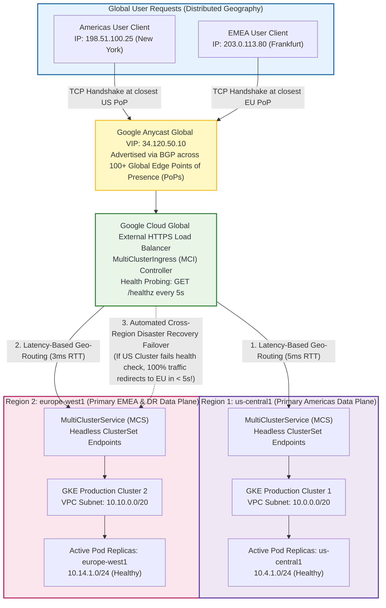

#### Multi-Cluster Ingress Anycast & Automatic Failover Mechanics

1. **Global Anycast IP BGP Routing (Zero DNS TTL Lag)**:
   - Traditional cross-region disaster recovery relies on GeoDNS (e.g. Route53 or Cloud DNS latency routing). When a regional outage occurs, DNS records must be updated, but ISP and browser DNS caching (TTL) delays client traffic migration for minutes or hours.
   - **MultiClusterIngress (MCI)** utilizes a single **Google Anycast VIP** (`34.120.50.10`). Google's edge routers advertise this exact same IP prefix globally via BGP from over 100 Edge PoPs. User requests enter Google's private fiber network at the physically closest PoP, routing traffic across Google's backbone rather than the public internet.
2. **Dynamic Proximity & Health-Based Load Balancing**:
   - The Global Application Load Balancer continuously measures Round Trip Time (RTT) from client edges to backend cluster regions.
   - Americas clients are dynamically routed to `us-central1`, while European users hit `europe-west1`.
   - Google Front Ends (GFEs) run proactive health probes against backend Pods (via Network Endpoint Groups). If a regional cluster or zone fails, the load balancer stops dispatching new TCP connections to that region within **seconds**, seamlessly shedding traffic to the remaining healthy region without dropping active user sessions.
3. **MultiClusterService (MCS) East-West Pod Federation**:
   - Inside the clusters, **Multi-Cluster Services (MCS)** synchronizes endpoints between clusters joined to the same Google Cloud Anthos/GKE Fleet.
   - Workloads in `us-central1` can communicate directly with services in `europe-west1` using the standardized fleet DNS domain:
     `<service-name>.<namespace>.svc.clusterset.local`.
   - GKE automatically exports EndpointSlices across clusters, enabling multi-region service discovery without public internet exposure.

### A. Deploy MultiClusterService (MCS) Across All Member Clusters

```bash
kubectl apply -f - <<'EOF'
apiVersion: net.gke.io/v1
kind: MultiClusterService
metadata:
  name: global-resilient-service
  namespace: production
spec:
  template:
    spec:
      selector:
        app: resilient-backend
      ports:
        - name: http
          protocol: TCP
          port: 80
          targetPort: 8080
---
# ── MULTI-CLUSTER INGRESS (GLOBAL ANYCAST VIP WITH AUTOMATIC FAILOVER) ────
apiVersion: networking.gke.io/v1
kind: MultiClusterIngress
metadata:
  name: global-application-mci
  namespace: production
  annotations:
    networking.gke.io/static-ip: "34.120.50.10"
    # Pre-reserved Google Global Anycast static IP address.
spec:
  template:
    spec:
      backend:
        serviceName: global-resilient-service
        servicePort: 80
EOF
```

---

## 17. Cloud Interconnect (Dedicated/Partner 10G/100G) & 99.99% VPN Failover

When enterprise workloads require guaranteed private bandwidth (10 Gbps or 100 Gbps circuits), predictable single-digit millisecond latency, and physical isolation, **Cloud Interconnect** replaces IPsec over public internet. Combining Interconnect with Cloud HA VPN delivers an active-passive **99.99% availability topology**.

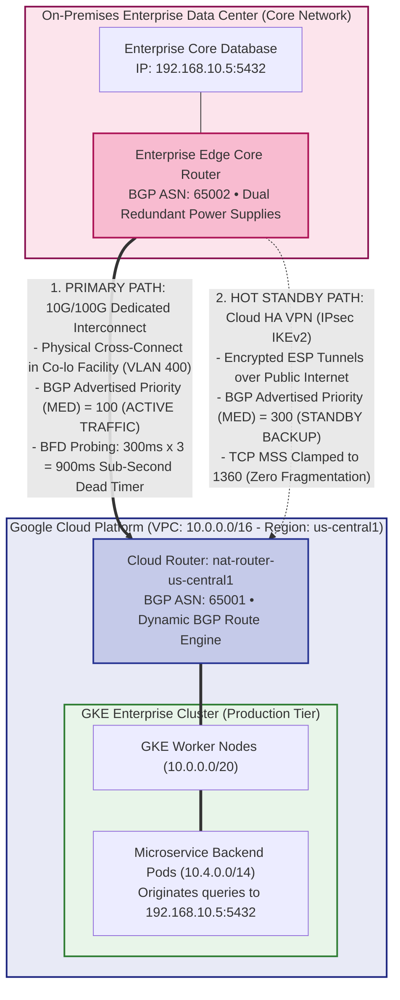

#### Internal BGP Failover & BFD Heartbeat Mechanics

1. **Deterministic Path Selection via BGP Multi-Exit Discriminator (MED)**:
   - Both the Dedicated Interconnect VLAN attachment and the Cloud HA VPN tunnel peer with the same on-premises BGP router and advertise reachability to the exact same enterprise subnet (`192.168.0.0/16`).
   - Path selection is governed deterministically by the **BGP MED (Multi-Exit Discriminator)** metric:
     - Cloud Router advertises a MED of `100` over Interconnect.
     - Cloud Router advertises a MED of `300` over the HA VPN tunnel.
   - Because lower MED values take strict precedence in the BGP decision algorithm, 100% of production traffic flows through the Dedicated Interconnect fiber circuit during normal operations.
2. **Sub-Second Link Failure Detection with BFD (Bidirectional Forwarding Detection)**:
   - Standard BGP relies on keepalive packets sent every 60 seconds with a 180-second hold timer. If an optical fiber cross-connect is severed, standard BGP can take **up to 3 minutes** to declare the route dead, dropping user traffic during that entire window.
   - Enabling **BFD** on the BGP session activates microsecond-level hardware/kernel probing:
     - Transmit & Receive intervals: **300 ms**.
     - Detection Multiplier: **3**.
   - If 3 consecutive control packets are missed ($300\text{ ms} \times 3 = 900\text{ ms}$), BFD immediately notifies the BGP daemon that the peer is down.
3. **Automated Instantaneous Failover to IPsec HA VPN**:
   - The instant BFD trips at 900ms, Cloud Router withdraws the Interconnect route from its forwarding information base (FIB).
   - Traffic automatically and seamlessly falls back to the standby HA VPN path (MED `300`).
   - Because HA VPN is pre-established and authenticated via IKEv2 in hot-standby, failover completes with sub-second convergence, preventing database connection drops or transaction timeouts.

### A. Create Interconnect VLAN Attachment (`gcloud compute interconnects attachments dedicated create`)

```bash
gcloud compute interconnects attachments dedicated create prod-vlan-attachment-zone1 \
  # ── REGION & ROUTER ATTACHMENT ───────────────────────────────────────────
  --region=us-central1 \
  --router=nat-router-us-central1 \
  # BGP Cloud Router managing route advertisements for this circuit.

  # ── PHYSICAL INTERCONNECT CIRCUIT & AVAILABILITY DOMAIN ──────────────────
  --interconnect=dedicated-cross-connect-1 \
  # String: Name of the physical 10G/100G port pre-ordered in colocation facility.
  --edge-availability-domain=AVAILABILITY_DOMAIN_1 \
  # Enum: "AVAILABILITY_DOMAIN_1" | "AVAILABILITY_DOMAIN_2"
  # Production requirement: Redundant attachments MUST use separate domains for 99.99% SLA.

  # ── BANDWIDTH ALLOCATION ─────────────────────────────────────────────────
  --bandwidth=10G \
  # Enum: "50M" | "100M" | "200M" | "500M" | "1G" | "2G" | "5G" | "10G" | "20G" | "50G" | "100G"
  --vlan=400 \
  # Integer: 2 to 4094. 802.1Q VLAN ID negotiated with network engineering team.
  --mtu=1440 \
  # Integer: 1440 or 1500. Standard Interconnect MTU.
  --project=my-gcp-project-id
```

### B. Configure Active-Passive HA Interconnect + HA VPN Failover

```bash
# 1. Primary Circuit: Interconnect BGP Peer (Highest Preference: Priority = 100)
gcloud compute routers update-bgp-peer nat-router-us-central1 \
  --region=us-central1 \
  --peer-name=interconnect-bgp-peer \
  --advertised-route-priority=100 \
  --project=my-gcp-project-id

# 2. Standby Backup: Cloud HA VPN BGP Peer (Lower Preference: Priority = 300)
gcloud compute routers update-bgp-peer nat-router-us-central1 \
  --region=us-central1 \
  --peer-name=ha-vpn-standby-peer \
  --advertised-route-priority=300 \
  --project=my-gcp-project-id
# Under normal operations, 100% of traffic flows over the high-speed 10G/100G circuit.
# If a fiber cut occurs, Cloud Router automatically redirects traffic to the encrypted HA VPN tunnel in < 1s!
```

---

## 18. Network Connectivity Center (NCC) — Hub-and-Spoke Transit

VPC Peering does not scale past a handful of connections due to **strict non-transitivity** and peering quotas (default 25 peerings per VPC). **Network Connectivity Center (NCC)** provides centralized transit, allowing hundreds of VPCs, hybrid routers, and third-party SD-WAN virtual appliances to communicate through a single hub.

```bash
# STEP 1: Create Centralized Transit Hub
gcloud network-connectivity hubs create enterprise-global-hub \
  --description="Global Enterprise Hub-and-Spoke Transit Fabric" \
  --project=my-gcp-project-id

# STEP 2: Attach Production VPC as a Spoke
gcloud network-connectivity spokes linked-vpc-network create prod-vpc-spoke \
  --hub=enterprise-global-hub \
  --global \
  --vpc-network=enterprise-production-vpc \
  --exclude-export-ranges="" \
  # CIDR list: Allows selectively suppressing certain subnets from being exported to the hub.
  --project=my-gcp-project-id

# STEP 3: Attach Cloud Router Hybrid Spoke (Propagates On-Prem Routes to All Spokes)
gcloud network-connectivity spokes linked-router-appliances create onprem-router-spoke \
  --hub=enterprise-global-hub \
  --region=us-central1 \
  --router=nat-router-us-central1 \
  --project=my-gcp-project-id
```

---

## 19. Shared VPC Architecture (Host & Service Project Multi-Team Isolation)

In enterprise organizations, network infrastructure is governed centrally by Platform/NetOps in a **Host Project**, while autonomous developer teams deploy GKE clusters in **Service Projects** consuming centralized subnets without permissions to alter firewall rules or routing.

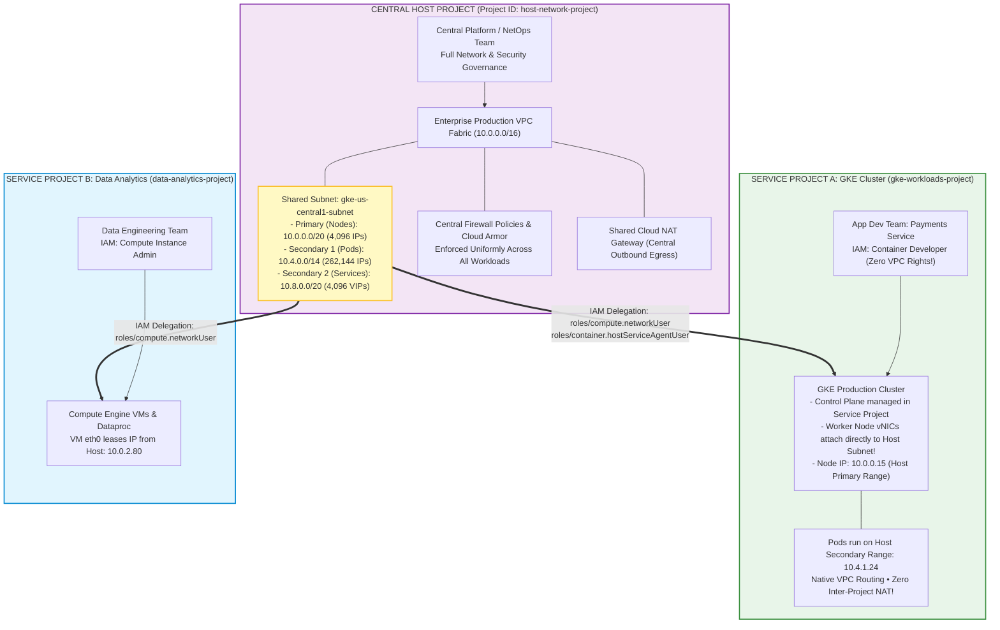

#### Shared VPC Internal Provisioning & Permission Boundary Mechanics

1. **Strict Separation of Duties (Platform Security vs App Developers)**:
   - In enterprise Google Cloud organizations, granting application developers network admin permissions creates catastrophic security and cost risks (misconfigured firewalls, unintended public IPs, conflicting routes).
   - **Shared VPC** enforces a clean security boundary: The central NetOps team manages the network, subnets, firewalls, and routing tables in a **Host Project**. Developers operate within isolated **Service Projects** where they have permissions to build and deploy GKE clusters and VMs, but zero permissions to modify the underlying network topology.
2. **Cross-Project Virtual NIC (vNIC) Attachment**:
   - When a GKE cluster is created in Service Project A, its worker nodes are Compute Engine instances physically belonging to Project A.
   - However, during VM creation, Google Cloud's hypervisor attaches the VM's virtual NIC (`eth0`) directly to the **Host Project's subnet**.
   - The worker node leases its primary IP (`10.0.0.15`) from the Host Project's primary range, and GKE assigns Pod CIDRs (`10.4.0.0/14`) from the Host Project's secondary range.
3. **Mandatory IAM Bindings for GKE Shared VPC**:
   - For GKE in a Service Project to configure VPC resources in the Host Project, two specific IAM roles are required:
     - `roles/compute.networkUser` granted to the developer group on the specific subnet (enables provisioning VMs and ILBs on that subnet).
     - `roles/container.hostServiceAgentUser` granted to the **GKE Service Robot** account (`service-SERVICE_PROJECT_NUM@container-engine-robot.iam.gserviceaccount.com`) on the Host Project. This robot account configures VPC firewall rules and routes for load balancers and pod CIDRs on behalf of the GKE cluster.
4. **Zero-Latency Cross-Project Private Communication**:
   - Workloads in Service Project A (GKE Pods) and Service Project B (Dataproc VMs) communicate with each other over private RFC 1918 IP addresses as if they resided within the same local network. Traffic traverses Google Cloud's high-speed SDN fabric with zero intermediate gateways, zero NAT, and zero VPC peering limits.

### A. Shared VPC Host & Service Project Configuration Sequence
# STEP 1: Enable Host Project (Run by Network Security Team)
gcloud compute shared-vpc enable host-network-project-id

# STEP 2: Associate Developer/Workload Project as a Service Project
gcloud compute shared-vpc associate-service-project gke-workloads-project-id \
  --host-project=host-network-project-id

# STEP 3: Delegate Subnet Permissions to Service Project Developer Group
gcloud compute networks subnets add-iam-policy-binding gke-us-central1-subnet \
  --project=host-network-project-id \
  --region=us-central1 \
  --member="group:gke-platform-admins@company.com" \
  --role="roles/compute.networkUser"
  # Grants permission to provision GKE nodes, VMs, and internal LBs inside this specific subnet.

# STEP 4: Grant GKE Robot Account Permission on Host Subnet (MANDATORY for GKE)
gcloud compute networks subnets add-iam-policy-binding gke-us-central1-subnet \
  --project=host-network-project-id \
  --region=us-central1 \
  --member="serviceAccount:service-GKE_SERVICE_PROJECT_NUM@container-engine-robot.iam.gserviceaccount.com" \
  --role="roles/container.hostServiceAgentUser"
```

---

## 20. Workload Identity Federation for GKE (GCP IAM ↔ Kubernetes SA)

Eliminates dangerous, exportable Google Cloud service account JSON private keys. Workload Identity binds a **Kubernetes ServiceAccount (KSA)** directly to a **Google Cloud IAM ServiceAccount (GSA)** using short-lived OIDC tokens.

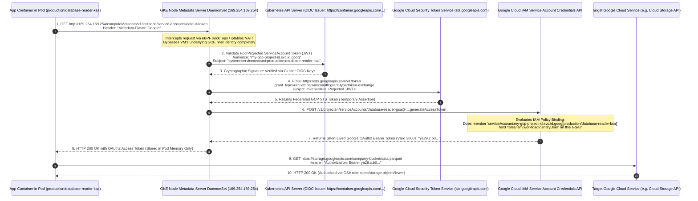

#### Internal Workload Identity Authentication Flow (Step-by-Step)

1. **The Legacy Risk: Static Service Account Keys (`sa-key.json`)**:
   - In legacy deployments, developers generated static JSON private keys and stored them in Kubernetes Secrets or environment variables. These keys never expired, were frequently committed to source code repositories or leaked via logs, and presented massive security liabilities.
2. **The Metadata Server Interception Mechanism**:
   - Every worker node runs the **GKE Node Metadata Server** as a privileged DaemonSet.
   - eBPF and Netfilter rules on the node intercept all requests directed to link-local IP `169.254.169.254:80`.
   - Instead of returning the Compute Engine VM's host service account credentials, the Node Metadata Server identifies the calling Pod based on its network namespace and socket metadata.
3. **Projected ServiceAccount Tokens (RFC 7519 OIDC JWT)**:
   - When a Pod runs with `serviceAccountName: database-reader-ksa`, the kubelet mounts a projected OIDC token volume at `/var/run/secrets/tokens/gcp-ksa/token`.
   - This token is a digitally signed JWT containing specific claims:
     - `iss`: Cluster OIDC Provider (`https://container.googleapis.com/v1/projects/...`).
     - `sub`: `system:serviceaccount:production:database-reader-ksa`.
     - `aud`: Workload Identity Pool (`my-gcp-project-id.svc.id.goog`).
     - `exp`: Short expiration time (typically 1 hour, continuously refreshed by kubelet).
4. **Two-Stage Exchange: STS Federation & IAM Credential Minting**:
   - The Node Metadata Server sends the K8s JWT to Google's **Security Token Service (STS)**. STS validates the signature against the cluster's public keys.
   - STS returns a federated GCP token. The metadata server immediately submits this federated token to the **IAM Service Account Credentials API**, requesting an impersonated access token for the target Google Service Account (`database-reader-gsa`).
   - IAM validates that the KSA is explicitly granted the `roles/iam.workloadIdentityUser` role on that GSA.
5. **Short-Lived Ephemeral Bearer Token Injection**:
   - IAM mints an ephemeral OAuth2 Bearer token valid for 3,600 seconds (1 hour).
   - The token is delivered to the container's SDK client in memory and is automatically refreshed before expiration. No credentials ever touch disk, eliminating exfiltration risks completely.

### A. Workload Identity Configuration & Binding Sequence
# STEP 1: Create Google IAM Service Account (GSA) with Least Privilege
gcloud iam service-accounts create database-reader-gsa \
  --display-name="GSA for Production Backend Database Reader" \
  --project=my-gcp-project-id

# STEP 2: Grant GSA Specific Resource Permissions (e.g. Cloud Storage Read)
gcloud projects add-iam-policy-binding my-gcp-project-id \
  --member="serviceAccount:database-reader-gsa@my-gcp-project-id.iam.gserviceaccount.com" \
  --role="roles/storage.objectViewer"

# STEP 3: Bind KSA to GSA via workloadIdentityUser Role
gcloud iam service-accounts add-iam-policy-binding \
  database-reader-gsa@my-gcp-project-id.iam.gserviceaccount.com \
  --role="roles/iam.workloadIdentityUser" \
  --member="serviceAccount:my-gcp-project-id.svc.id.goog[production/database-reader-ksa]" \
  # Format: serviceAccount:PROJECT_ID.svc.id.goog[K8S_NAMESPACE/KSA_NAME]
  --project=my-gcp-project-id

# STEP 4: Create & Annotate Kubernetes ServiceAccount
kubectl apply -f - <<'EOF'
apiVersion: v1
kind: ServiceAccount
metadata:
  name: database-reader-ksa
  namespace: production
  annotations:
    # ── WORKLOAD IDENTITY BINDING ANNOTATION ───────────────────────────────
    iam.gke.io/gcp-service-account: database-reader-gsa@my-gcp-project-id.iam.gserviceaccount.com
EOF
# Any Pod running with "serviceAccountName: database-reader-ksa" automatically
# authenticates to Google Cloud APIs seamlessly with zero credentials in code!
```

---

## 21. VPC Service Controls (VPC-SC) — Data Exfiltration Perimeter Security

> [!IMPORTANT]
> **VPC-SC vs Private Service Connect (PSC)**:
> - **PSC** (Section 13) provides *private network transport* (Layer 4 IP connectivity) to services.
> - **VPC-SC** creates an *authorization firewall perimeter* around Google multi-tenant managed APIs (Cloud Storage, BigQuery, KMS) preventing malicious insiders or compromised pods from exfiltrating data to an unapproved external GCP bucket!

```bash
# 1. Create Access Policy in Google Cloud Access Context Manager
gcloud access-context-manager policies create \
  --organization=123456789012 \
  --title="Enterprise Security Policy"

# 2. Define Authorized Ingress Access Level (IP-based whitelist)
gcloud access-context-manager levels create corp-trusted-perimeter \
  --policy=ACCESS_POLICY_ID \
  --title="Corporate Trusted Range" \
  --basic-level-spec=<(cat <<'EOF'
ipSubnetworks:
  - 10.0.0.0/8
  - 172.16.0.0/12
EOF
)

# 3. Create Security Perimeter Enclosing Protected Projects
gcloud access-context-manager perimeters create production-data-perimeter \
  --policy=ACCESS_POLICY_ID \
  --title="Production Data Shield" \
  --resources=projects/112233445566,projects/998877665544 \
  --restricted-services=storage.googleapis.com,bigquery.googleapis.com,container.googleapis.com \
  --access-levels=corp-trusted-perimeter
# Any API call to BigQuery/Storage originating from outside this perimeter is instantly rejected!
```

---

## 22. Organization Policy Constraints & Enterprise Network Guardrails

Organization Policies enforce unbypassable guardrails at the organization root, preventing teams from inadvertently exposing clusters or creating vulnerable configurations.

```bash
# 1. Enforce Private-Only Compute & GKE Worker Nodes (No Public IPs)
gcloud org-policies set-policy - <<'EOF'
constraint: constraints/compute.vmExternalIpAccess
listPolicy:
  allValues: DENY
EOF

# 2. Block Default VPC Auto-Creation on New Projects (Forces Custom VPC Architecture)
gcloud org-policies set-policy - <<'EOF'
constraint: constraints/compute.skipDefaultNetworkCreation
booleanPolicy:
  enforced: true
EOF

# 3. Restrict VPC Peering (Prevents Shadow Interconnections Without Security Review)
gcloud org-policies set-policy - <<'EOF'
constraint: constraints/compute.restrictVpcPeering
listPolicy:
  allValues: DENY
EOF

# 4. Mandatory Shielded VMs (Hardware-Rooted vTPM & Kernel Integrity Verification)
gcloud org-policies set-policy - <<'EOF'
constraint: constraints/compute.requireShieldedVm
booleanPolicy:
  enforced: true
EOF
```

---

## 23. Kubernetes Gateway API (Modern L7 Routing) vs Legacy Ingress

The **Gateway API** replaces legacy `Ingress` and `BackendConfig` CRDs with an expressive, role-oriented standard for Layer 7 traffic routing, cross-namespace routing, and security policy attachment.

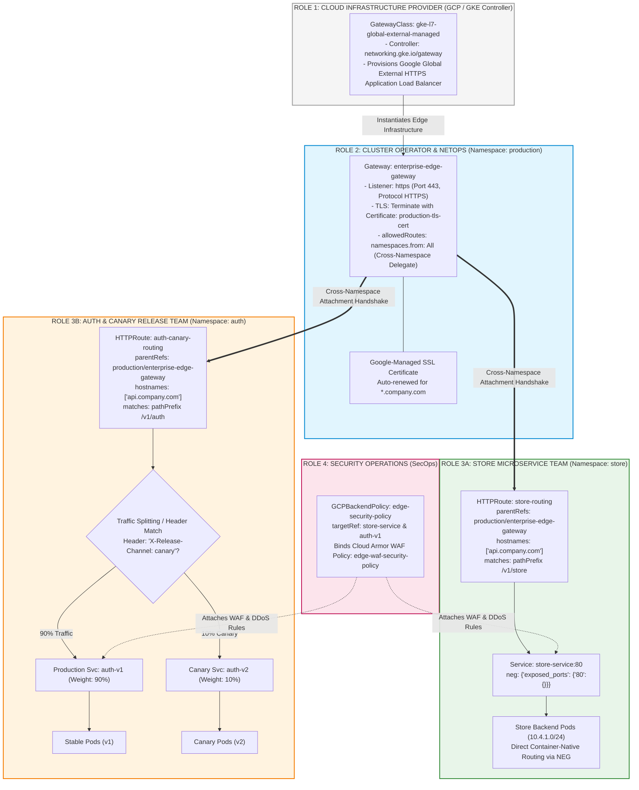

#### Gateway API Internal Object Resolution & Traffic Splitting Mechanics

1. **Role-Oriented Multi-Tenant Architecture**:
   - Legacy Kubernetes `Ingress` is a monolithic resource where a single developer manifest combines edge IP provisioning, TLS termination, path routing, and upstream service configuration. In multi-team enterprise clusters, this created severe configuration conflicts and required broad RBAC privileges.
   - **Gateway API** cleanly separates concerns into four distinct organizational roles:
     - **Platform / Infrastructure Provider**: Maintains `GatewayClass` definitions.
     - **Cluster Operator / NetOps**: Owns the `Gateway` resource, managing edge Anycast IPs, VIP allocation, TLS certificates, and allowed route namespaces.
     - **Application Developer**: Owns `HTTPRoute` resources in their own namespaces, managing URI path prefixes, header rewrites, and traffic splits without needing cluster-level permissions.
     - **Security Ops**: Attaches `GCPBackendPolicy` CRDs to bind Cloud Armor WAF rules directly to target services.
2. **Cross-Namespace Route Attachment Handshake**:
   - The `Gateway` in the `production` namespace specifies `allowedRoutes.namespaces.from: All` (or a selected list of namespaces).
   - The developer's `HTTPRoute` in the `store` namespace specifies `parentRefs.name: enterprise-edge-gateway` and `parentRefs.namespace: production`.
   - The GKE Gateway Controller reconciles this two-way handshake, automatically adding the `/v1/store/*` path rule to the central Google Cloud Load Balancer URL map.
3. **Advanced L7 Traffic Splitting & Canary Deployment**:
   - Unlike legacy Ingress (which required external service meshes or complex Nginx annotations for canaries), Gateway API natively supports weight-based splitting (`weight: 90` vs `weight: 10`) and HTTP header matching (`X-Release-Channel: canary`).
   - The load balancer splits requests at the Google Front End proxy layer before packets even reach the cluster nodes.

### A. Declarative Gateway & HTTPRoute Manifests
kubectl apply -f - <<'EOF'
# ── GATEWAY (INFRASTRUCTURE DEFINITION - MANAGED BY NETOPS) ───────────────
apiVersion: gateway.networking.k8s.io/v1
kind: Gateway
metadata:
  name: enterprise-edge-gateway
  namespace: production
spec:
  gatewayClassName: gke-l7-global-external-managed
  # Standard GKE GatewayClasses:
  #   - "gke-l7-global-external-managed" (Global External Application LB with Cloud Armor)
  #   - "gke-l7-regional-internal" (Internal Application Load Balancer inside VPC)
  listeners:
    - name: https
      protocol: HTTPS
      port: 443
      tls:
        mode: Terminate
        certificateRefs:
          - name: production-tls-cert
      allowedRoutes:
        namespaces:
          from: All
          # Allows microservice teams in any namespace to attach their HTTPRoutes!
---
# ── HTTPROUTE (APPLICATION ROUTING - MANAGED BY DEVELOPER TEAMS) ───────────
apiVersion: gateway.networking.k8s.io/v1
kind: HTTPRoute
metadata:
  name: api-routing-rules
  namespace: production
spec:
  parentRefs:
    - name: enterprise-edge-gateway
      namespace: production
  hostnames:
    - "api.company.com"
  rules:
    # Rule 1: High-priority Canary Traffic (Header-based Routing)
    - matches:
        - headers:
            - type: Exact
              name: X-Release-Channel
              value: canary
      backendRefs:
        - name: backend-api-canary
          port: 8080

    # Rule 2: Standard Production Traffic with URL Rewrite
    - matches:
        - path:
            type: PathPrefix
            value: /v2/users
      filters:
        - type: URLRewrite
          urlRewrite:
            path:
              type: ReplacePrefixMatch
              replacePrefixMatch: /users
      backendRefs:
        - name: backend-api-production
          port: 8080
---
# ── SECURITY ATTACHMENT (BINDING CLOUD ARMOR DIRECTLY TO GATEWAY) ──────────
apiVersion: networking.gke.io/v1
kind: GCPBackendPolicy
metadata:
  name: gateway-security-policy
  namespace: production
spec:
  targetRef:
    group: ""
    kind: Service
    name: backend-api-production
  default:
    securityPolicy: "edge-waf-security-policy"
    # Links Cloud Armor WAF defined in Section 14 directly to the Gateway backend!
EOF
```

---

## 24. NodeLocal DNSCache & Dynamic Secondary Range Capacity Planning

High-throughput container platforms frequently face **DNS throttling** and **IP exhaustion**. These two mechanisms protect large-scale production clusters.

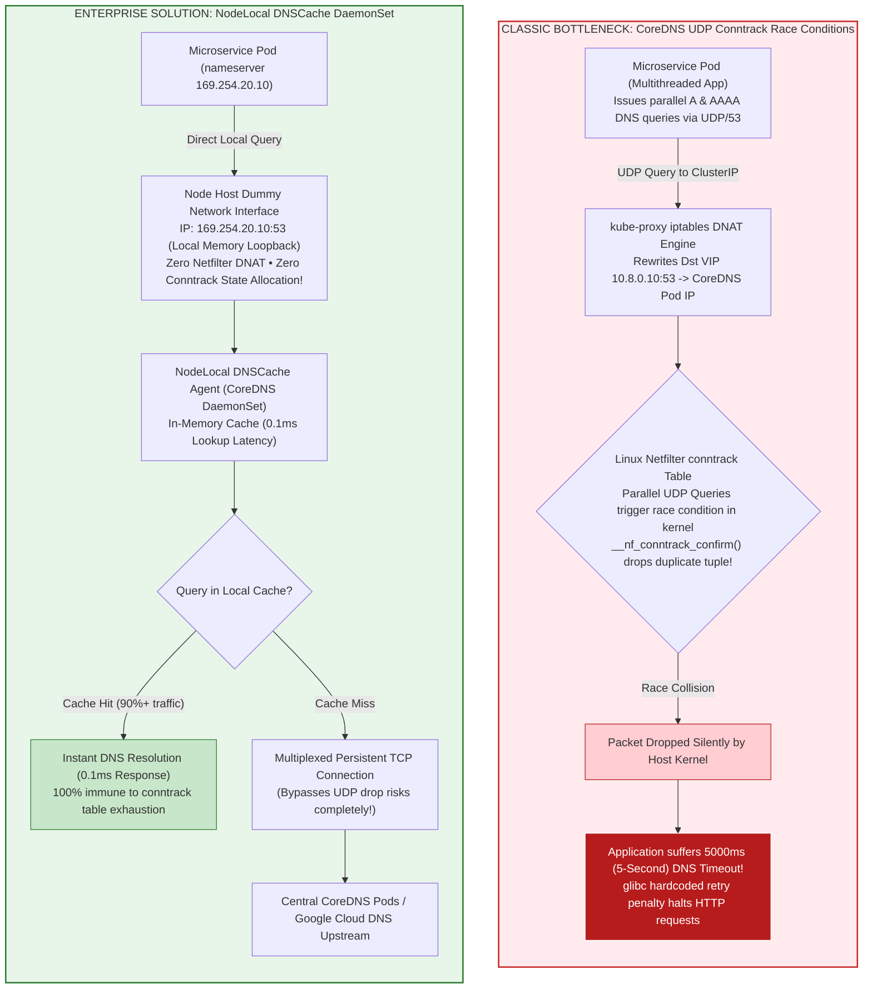

#### Internal DNS Resolution Datapath & Conntrack Race Condition Breakdown

1. **The Infamous 5-Second DNS Timeout in Kubernetes**:
   - In standard Kubernetes, `/etc/resolv.conf` configures Pods to use the CoreDNS ClusterIP virtual IP (`10.8.0.10`).
   - Applications making HTTP calls typically perform two DNS queries in parallel: one for IPv4 (`A` record) and one for IPv6 (`AAAA` record).
   - Both UDP packets arrive almost simultaneously at the host's Netfilter stack. `kube-proxy` performs DNAT to translate the VIP to a CoreDNS Pod IP.
   - When two threads on the same socket transmit parallel UDP packets that get DNAT'd to the same destination, a well-documented Linux kernel race condition occurs inside `__nf_conntrack_confirm()`.
   - The kernel rejects the second packet as an `INVALID` conntrack state and drops it silently. Because UDP has no acknowledgement mechanism, the application's C standard library (`glibc`) waits for its hardcoded timeout of **5 seconds** before issuing a retransmission.
2. **How NodeLocal DNSCache Fixes the Root Cause**:
   - GKE deploys a lightweight CoreDNS caching agent on every single worker node as a DaemonSet.
   - The agent binds to a local dummy network interface (`nodelocaldns`) with link-local IP `169.254.20.10`.
   - GKE configures the kubelet to populate `/etc/resolv.conf` in every Pod with `nameserver 169.254.20.10`.
   - Because `169.254.20.10` is a local address on the same node, DNS queries are answered directly over host memory without traversing `kube-proxy` iptables DNAT or Netfilter connection tracking.
3. **TCP Connection Multiplexing for Cache Misses**:
   - When a cache miss occurs, the NodeLocal agent forwards the request to the upstream CoreDNS deployment or Google Cloud DNS over a single, persistent **TCP connection**.
   - TCP uses sequence numbers, retransmission timers, and stateful acknowledgements, completely immunizing the cluster from UDP packet drops and eliminating DNS tail latencies across the fleet.

### A. Deploy NodeLocal DNSCache DaemonSet (Eliminating Conntrack Bottlenecks)

Standard Kubernetes pods route DNS queries to CoreDNS pods over UDP. Under high connection churn, Linux `conntrack` table limits are reached, resulting in silent packet drops and **5-second DNS timeouts**. NodeLocal DNSCache runs a local cache instance on node IP `169.254.20.10`:

```bash
# Enable NodeLocal DNSCache on GKE Cluster
gcloud container clusters update enterprise-ha-cluster \
  --region=us-central1 \
  --enable-dns-cache \
  --project=my-gcp-project-id
# Pod DNS requests now hit the node local memory cache directly over loopback!
# Result: 0% conntrack table overhead, sub-millisecond response latency.
```

### B. Dynamic Secondary Range Capacity & Autoscaling Sizing Math

> [!WARNING]
> **Autoscaling IP Exhaustion Gotcha**:
> By default, GKE allocates a `/24` (256 IP addresses) to *every single worker node* for its Pods, regardless of whether that node runs 5 pods or 110 pods!
> - A `/14` secondary Pod range contains **262,144 IPs**.
> - When Cluster Autoscaler and Node Auto-Provisioning (NAP) scale up, 1,024 nodes consume the ENTIRE `/14` block!
>
> **Best Practice Solution**:
> Create node pools with reduced max pods per node to preserve secondary range space:
> ```bash
> gcloud container node-pools create high-density-pool \
>   --cluster=enterprise-ha-cluster \
>   --region=us-central1 \
>   --max-pods-per-node=32 \
>   # Reduces node Pod CIDR reservation from /24 (256 IPs) down to /26 (64 IPs)!
>   # Instantly yields 4x more node scaling capacity from the exact same subnet!
> ```

---

## 25. Pod Security Standards (PSA), Binary Authorization & Envelope Encryption

Secures the workload supply chain, host runtime privileges, and encryption at rest.

### A. Enforce Pod Security Standards (PSA) at Namespace Level

PodSecurityPolicies (PSP) are dead; modern Kubernetes mandates **Pod Security Admission (PSA)** labels:

```bash
kubectl label --overwrite namespace production \
  # ── ENFORCEMENT LEVEL ────────────────────────────────────────────────────
  pod-security.kubernetes.io/enforce=restricted \
  # Enum: "privileged" | "baseline" | "restricted"
  #   privileged: Completely unconstrained (root, host network, capabilities).
  #   baseline: Prevents known privilege escalations (default Docker profile).
  #   restricted: Hardened zero-trust! Disallows root, host namespaces, and privilege escalation.
  pod-security.kubernetes.io/enforce-version=latest \
  pod-security.kubernetes.io/warn=restricted \
  pod-security.kubernetes.io/audit=restricted
```

### B. Supply Chain Security: Binary Authorization Attestation Policy

Ensures only cryptographically signed, vulnerability-scanned container images can be scheduled:

```bash
# 1. Enable Binary Authorization on Cluster
gcloud container clusters update enterprise-ha-cluster \
  --region=us-central1 \
  --enable-binauthz \
  --project=my-gcp-project-id

# 2. Apply Strict Policy Requiring Attestation Signatures
gcloud container binauthz policy import - <<'EOF'
defaultAdmissionRule:
  evaluationMode: REQUIRE_ATTESTATION
  # Requires cryptographic signature from approved security pipeline before scheduling!
  enforcementMode: ENFORCED_BLOCK_AND_AUDIT_LOG
  requireAttestationsBy:
    - projects/my-gcp-project-id/attestors/vuln-scan-attestor
EOF
```

### C. Application-Layer Envelope Encryption for Secrets at Rest (Cloud KMS)

Protects `etcd` secrets using a Customer-Managed Encryption Key (CMEK), so stolen disk backups or compromised storage cannot expose plaintext credentials:

```bash
gcloud container clusters update enterprise-ha-cluster \
  --region=us-central1 \
  --database-encryption-key=projects/my-gcp-project-id/locations/us-central1/keyRings/k8s-security-ring/cryptoKeys/etcd-secrets-key \
  --project=my-gcp-project-id
```

---

## 26. Enterprise Scale Quotas, Limits Governance & MTU/MSS Clamping

### A. The MTU Chain & IPsec TCP MSS Clamping Breakdown

A classic enterprise networking failure: Packets pass fine under small pings, but **hang or drop under high payloads**. This is caused by MTU mismatch across encapsulating tunnels:

| Network Layer | Maximum Transmission Unit (MTU) | Encapsulation Overhead | Maximum Segment Size (MSS) |
| :--- | :--- | :--- | :--- |
| **Standard Ethernet / Docker Host** | 1500 bytes | None | 1460 bytes |
| **Google Cloud VPC Network** | **1460 bytes** | None | 1420 bytes |
| **Cloud Interconnect (VLAN Attachment)**| **1440 or 1500 bytes** | 802.1Q tag (4 bytes) | 1400 / 1460 bytes |
| **Cloud HA VPN (IPsec ESP Encapsulation)**| **1460 bytes link** | **ESP / IV / Auth: ~60 bytes** | **Clamp to 1360 bytes!** |

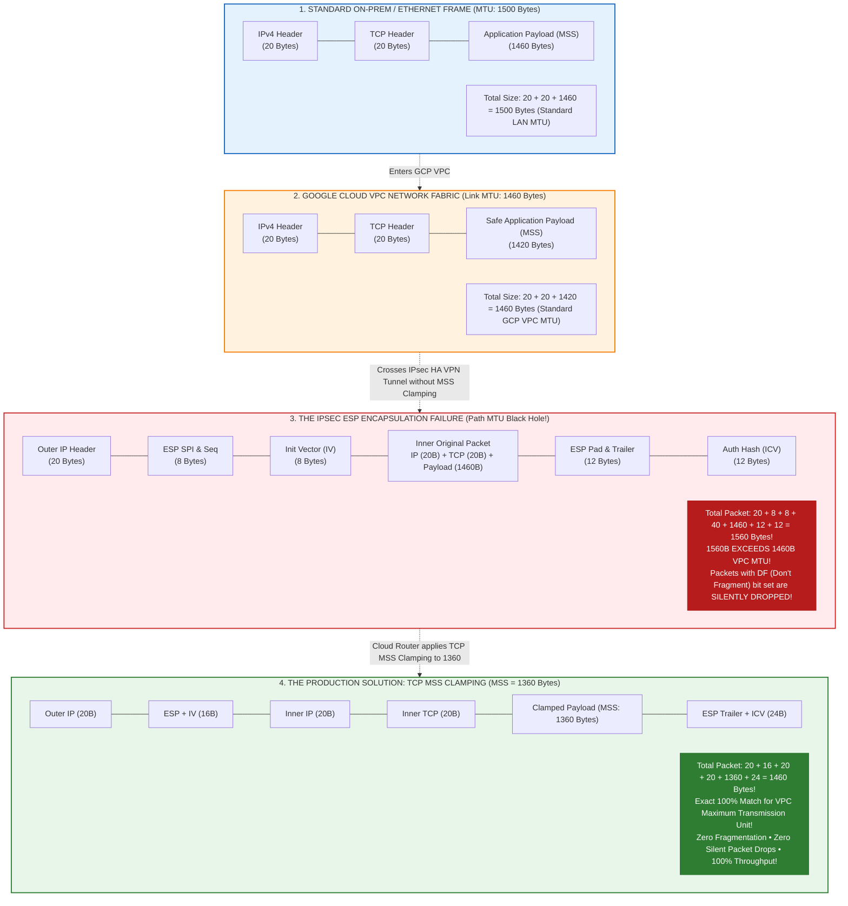

#### Internal MTU Discovery, DF Bit Handling & MSS Clamping Mechanics

1. **Path MTU Discovery (PMTUD) and the Black Hole Phenomenon**:
   - In modern TCP/IP, almost all operating systems (Linux, Windows, macOS) set the **DF (Don't Fragment)** bit in the IPv4 header. This instructs intermediate routers never to fragment the packet.
   - When a packet exceeds a router's outgoing link MTU, the router drops the packet and is supposed to send an ICMP message back to the sender: `ICMP Type 3, Code 4 (Fragmentation Needed and DF set)`, advertising the lower Next-Hop MTU.
   - However, in enterprise environments, security firewalls almost universally block ICMP traffic. The sender never receives the ICMP error and continues to retransmit the large packet. Small packets (like `ping` or TCP handshake `SYN`) pass with zero issues, but as soon as bulk data (TLS certificates, database query results, or file uploads) begins, the TCP connection **hangs indefinitely**. This failure mode is known as a **Path MTU Black Hole**.
2. **Why Cloud HA VPN Adds ~60–80 Bytes of Overhead**:
   - IPsec Encapsulating Security Payload (ESP) does not simply forward the packet; it encrypts the original packet and wraps it in new transport headers:
     - Outer IPv4 Header: **20 bytes**.
     - ESP Header (SPI + Sequence Number): **8 bytes**.
     - Initialization Vector (IV): **8–16 bytes** (AES-GCM or ChaCha20).
     - Original Inner IP + TCP Headers: **40 bytes**.
     - ESP Padding & Pad Length: **0–15 bytes**.
     - Integrity Check Value (ICV / HMAC): **12–16 bytes**.
   - Wrapping a standard 1500-byte frame creates a 1560-to-1580 byte packet. Because the Google Cloud VPC network has a hard maximum MTU of **1460 bytes**, oversized packets cannot cross the tunnel.
3. **The Solution: TCP MSS Clamping at the Gateway**:
   - **Maximum Segment Size (MSS)** is a TCP option negotiated during the initial 3-way handshake (`SYN` / `SYN-ACK`) that specifies the maximum payload a host can receive:
     $$\text{MSS} = \text{MTU} - \text{IP Header (20B)} - \text{TCP Header (20B)}$$
   - To eliminate fragmentation and packet drops without having to reconfigure every client machine on the network, Cloud Router and on-premises routers perform **TCP MSS Clamping**:
   - The router intercepts TCP `SYN` packets passing through its interface. If the advertised MSS in the TCP options header is greater than **1360 bytes**, the router rewrites the option in place to `1360` and recalculates the TCP checksum.
   - Both client and server now agree to send data payloads no larger than 1360 bytes. The resulting encapsulated IPsec packet measures exactly $1360 + 40 + 60 = 1460\text{ bytes}$, perfectly traversing the Google Cloud VPC fabric with zero packet drops.

**How to Enforce MSS Clamping on Cloud Router**:
```bash
# Clamp TCP MSS to prevent packet fragmentation over IPsec tunnels
gcloud compute routers update-bgp-peer nat-router-us-central1 \
  --region=us-central1 \
  --peer-name=onprem-bgp-peer-0 \
  --advertised-route-priority=100
# Ensure on-premise firewall/router applies: `iptables -t mangle -A POSTROUTING -p tcp --tcp-flags SYN,RST SYN -j TCPMSS --clamp-mss-to-pmtu`
```

### B. Enterprise Hard Scale Quotas Cheat Sheet

Monitor these hard thresholds in Cloud Monitoring before launching massive multi-cluster migrations:

| Component | Default GCP Quota / Limit | Mitigation When Approaching Cap |
| :--- | :--- | :--- |
| **VPC Peering Connections per VPC** | **25 peerings** | Migrate to **Network Connectivity Center (NCC)** (Section 18). |
| **Dynamic BGP Routes per Cloud Router** | **100 routes** | Summarize BGP prefixes on on-premises edge routers into larger CIDRs. |
| **Internal Load Balancer Backends** | **250 backends** | Use GKE NEG (Network Endpoint Groups) with GKE Datapath v2. |
| **VPC Firewall Rules per Network** | **1000 rules** | Consolidate into hierarchical firewall policies and service accounts. |
| **Pods per Service (kube-proxy)** | **1000 endpoints** | Automatically resolved by **EndpointSlice** in modern Kubernetes. |

---

## 27. Cross-Layer Diagnostic & Troubleshooting Playbook

When communication fails between Docker containers, Kubernetes Pods, and Cloud VPC resources, follow this systematic multi-layer diagnostic sequence:

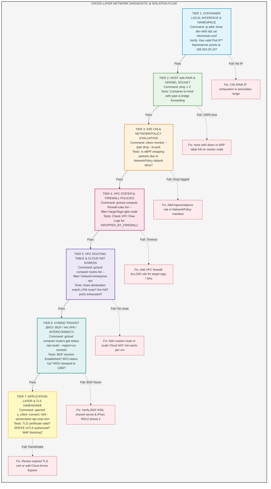

#### Systematic Cross-Layer Troubleshooting Decision Flow

1. **Rule Out Local Pod & DNS Configuration (Tier 1)**:
   - Check if the pod actually received an IP: `kubectl get pod <pod_name> -o wide`. If the pod is stuck in `ContainerCreating`, the node pool may have exhausted its `/24` secondary Pod CIDR block.
   - Inspect `/etc/resolv.conf`: Ensure nameserver points to `169.254.20.10` (NodeLocal DNSCache) and `ndots:5` is configured.
2. **Verify Host Kernel & Virtual Wire (Tier 2)**:
   - Ping the host node IP (`10.0.0.15`). If ping fails from inside the container, the local Linux `veth` pair or bridge interface is down or experiencing driver queue drops.
3. **Inspect CNI NetworkPolicy Drops via Hubble (Tier 3)**:
   - Run `cilium monitor --type drop` on the worker node. If packets are being dropped with reason `Policy denied by NetworkPolicy`, examine the target Pod's `ingress` or `egress` label selectors. Remember: Once any NetworkPolicy selects a Pod, it enters **default-deny** mode.
4. **Audit VPC Stateful Firewalls & Hypervisor (Tier 4)**:
   - Enable VPC Flow Logs on the subnet and query Cloud Logging with filter: `jsonPayload.reporter="SRC" AND jsonPayload.disposition="DENY"`.
   - Ensure the Google Cloud health check IP ranges (`35.191.0.0/16` and `130.211.0.0/22`) are explicitly allowed inbound.
5. **Trace Routes & Cloud NAT Port Saturation (Tier 5)**:
   - For public internet drops, check Cloud Monitoring metric `compute.googleapis.com/nat/nat_allocation_failed`. If VMs exhaust their allocated ports (`min-ports-per-vm`), outbound TCP connections will hang or time out. Enable `--enable-dynamic-port-allocation` on the Cloud NAT gateway.
6. **Validate Hybrid BGP & IPsec Tunnels (Tier 6)**:
   - Check Cloud Router status: `gcloud compute routers get-status <router_name>`. Verify the BFD session is `UP`.
   - If large payloads stall over VPN while small pings succeed, verify that **TCP MSS Clamping** (`MSS = 1360`) is enabled on the router peer.
7. **Simulate End-to-End Datapath with Google Cloud Connectivity Tests (Tier 7)**:
   - Use Google Cloud Network Intelligence Center: `gcloud compute network-management connectivity-tests run ...`. This simulates the entire Andromeda SDN packet walk (VPC firewalls, route tables, peering, and GKE secondary ranges) directly against Google Cloud's live hypervisor model, identifying the exact line number of the failing configuration rule in seconds!

### Diagnostic One-Liners:

```bash
# 1. Test Layer 3 Node-to-Node Reachability from inside a Kubernetes Pod
kubectl exec -it pod/web-app-74b89-x8q2z -n production -- ping -c 4 10.0.0.15

# 2. Verify Layer 4 Port Availability & TLS Handshake
kubectl exec -it pod/web-app-74b89-x8q2z -n production -- nc -zvw3 postgres.internal.corp 5432

# 3. Trace Network Route Hops to Detect Routing Loops or VPN Dropouts
kubectl exec -it pod/web-app-74b89-x8q2z -n production -- traceroute -n 192.168.10.5

# 4. Verify Internal CoreDNS Resolution & Upstream Response
kubectl exec -it pod/web-app-74b89-x8q2z -n production -- dig +short database.internal.corp

# 5. Live Packet Capture on Worker Node Interface (Detecting Dropped Packets)
sudo tcpdump -i any -nn "host 10.4.1.24 and port 8080" -vv

# 6. GCP Cloud VPC Simulated Packet Tracer (Tests Firewalls, Routes & Peering in API)
gcloud compute network-management connectivity-tests run test-pod-to-onprem \
  --source-ip=10.4.1.24 \
  --destination-ip=192.168.10.5 \
  --destination-port=5432 \
  --protocol=TCP \
  --network=enterprise-production-vpc
```
