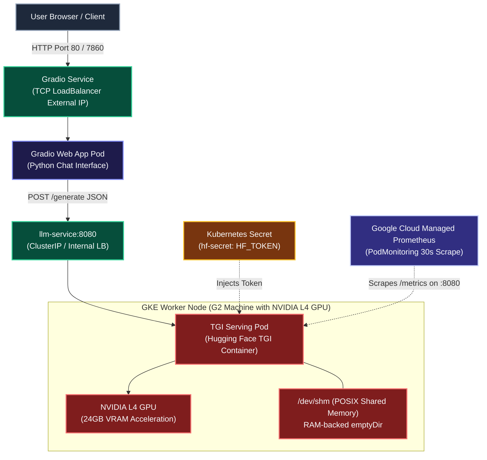

# Kubernetes CLI (`kubectl`) Production Command Reference

A comprehensive, annotated reference for mission-critical `kubectl` commands. Each command is structured into logical architectural sections (`# ── SECTION ──`), with explicit breakdowns of valid values, data formats, enums, units, and production trade-offs.

---

## 1. Global Flags & Connection Context

Global parameters can be appended to virtually any `kubectl` command to route to specific clusters, authenticate as different identities, or control output verbosity.

```bash
kubectl get pods \
  # ── CONTEXT & CLUSTER TARGETING ──────────────────────────────────────────
  --kubeconfig=/home/user/.kube/config \
  # File path: Absolute path to kubeconfig file.
  # Default: "$HOME/.kube/config" or value of KUBECONFIG environment variable.
  --context=gke_production_us-central1_prod-cluster \
  # String: Name of context defined in kubeconfig (combines cluster, user, namespace).
  # Available values: Run "kubectl config get-contexts -o name" to list all.
  --cluster=prod-cluster \
  # String: Name of specific cluster stanza in kubeconfig.
  # Overrides context cluster configuration.
  --user=cluster-admin-sa \
  # String: Name of user credentials stanza in kubeconfig.
  # Overrides context authentication credentials.

  # ── NAMESPACE SCOPING ────────────────────────────────────────────────────
  --namespace=production \
  # String: Target Kubernetes namespace.
  # Valid values: Any existing namespace (e.g., default, kube-system, staging, production).
  # Alternatives:
  #   -A or --all-namespaces (Boolean: queries across all namespaces simultaneously)
  # Default: Context namespace or "default".

  # ── SECURITY & IMPERSONATION ─────────────────────────────────────────────
  --as=developer@company.com \
  # String: Username or email to impersonate for RBAC auditing.
  # Valid values: Any user string; requires "impersonate" RBAC permission on "users".
  --as-group=system:masters \
  # String: Group name to impersonate. Can be repeated multiple times.
  # Valid values: E.g., system:authenticated, system:masters, developers, devops-team.
  --as-uid=10001 \
  # String: UID to impersonate. Useful when testing UID-specific PSP/admission policies.

  # ── TLS & CLIENT ENCRYPTION ──────────────────────────────────────────────
  --client-certificate=/etc/kubernetes/pki/client.crt \
  # File path: Path to PEM-encoded X.509 client certificate for TLS mutual auth.
  --client-key=/etc/kubernetes/pki/client.key \
  # File path: Path to client private key corresponding to client certificate.
  --certificate-authority=/etc/kubernetes/pki/ca.crt \
  # File path: Path to PEM-encoded CA certificate validating the API server certificate.
  --insecure-skip-tls-verify=false \
  # Boolean: "true" | "false".
  # Default: false. CAUTION: "true" disables TLS verification (strictly testing only).

  # ── API OUTPUT & PROTOCOL ENGINE ─────────────────────────────────────────
  --request-timeout=30s \
  # Time string: Timeout duration before client aborts HTTP request.
  # Format: Number followed by unit: "10s", "1m", "2h". "0" means no timeout.
  -v=2
  # Integer: Logging verbosity level:
  #   0 = Only errors
  #   2 = Useful general info (HTTP method, status code, response length)
  #   4 = Detailed HTTP request/response headers
  #   6 = HTTP request headers + raw response body
  #   8 = Full HTTP request body + full response body
  #   9 = Maximum curl-reproducible raw traces
```

---

## 2. Ad-Hoc Pod Execution & Debugging (`kubectl run`)

Spawns a standalone Pod directly on the cluster. Essential for troubleshooting network reachability, DNS queries, and storage tests.

```bash
kubectl run network-debugger \
  # ── CONTAINER IMAGE & REGISTRY ───────────────────────────────────────────
  --image=nicolaka/netshoot:v0.13 \
  # Image reference string: [REGISTRY/][REPOSITORY/]IMAGE[:TAG|@DIGEST]
  # Common debugging images:
  #   - "nicolaka/netshoot:v0.13" (TCP dump, curl, dig, iperf, mtr, ngrep, socat)
  #   - "curlimages/curl:8.6.0" (lightweight HTTP client)
  #   - "busybox:1.36" (minimal coreutils)
  #   - "alpine:3.19" (package-installable minimal OS)
  # Production practice: Always pin immutable digest (e.g., @sha256:...) or semantic tag.
  --image-pull-policy=IfNotPresent \
  # Enum: "Always" | "IfNotPresent" | "Never"
  #   Always: Pulls image from remote registry on every pod launch.
  #   IfNotPresent: Uses cached image on worker node if available (saves bandwidth).
  #   Never: Fails if image is not pre-baked on node host.

  # ── NAMESPACE & IDENTITY ─────────────────────────────────────────────────
  --namespace=production \
  # String: Target namespace where pod is scheduled.
  --serviceaccount=diagnostic-runner-sa \
  # String: ServiceAccount name granting Pod specific Kubernetes API tokens.
  # Valid values: Must match an existing "ServiceAccount" in the target namespace.
  # Default: "default".

  # ── PROCESS LIFECYCLE & RESTART POLICY ───────────────────────────────────
  --restart=Never \
  # Enum: "Always" | "OnFailure" | "Never"
  #   Never: Pod runs once and transitions to Completed/Error (ideal for ad-hoc scripts).
  #   OnFailure: Restarts container only if exit code != 0 (ideal for batch jobs).
  #   Always: Restarts container continuously regardless of exit code (daemon-like).

  # ── RESOURCE RESERVATIONS & QUOTAS ───────────────────────────────────────
  --requests='cpu=100m,memory=128Mi' \
  # Comma-delimited key-value string: Minimum guaranteed node capacity.
  # Valid units:
  #   cpu: Millicores ("100m" = 0.1 core) or whole numbers ("1", "2.5").
  #   memory: Bytes with suffixes: "E", "P", "T", "G", "M", "K" (power of 10)
  #           or "Ei", "Pi", "Ti", "Gi", "Mi", "Ki" (binary powers, e.g. "128Mi", "1Gi").
  --limits='cpu=500m,memory=512Mi' \
  # Comma-delimited key-value string: Hard threshold before throttling/OOMKill.
  # Note: If memory usage exceeds limit, container is terminated with exit code 137.

  # ── ENVIRONMENT VARIABLES ────────────────────────────────────────────────
  --env="ENVIRONMENT=staging" \
  --env="DEBUG=true" \
  --env="LOG_LEVEL=verbose" \
  # String: "KEY=VALUE". Repeat flag for multiple variables.
  # Valid values: Any string key and string value. Cannot bind Secrets directly here.

  # ── METADATA LABELS & ANNOTATIONS ────────────────────────────────────────
  --labels="app=diagnostic,tier=ops,troubleshoot=dns-check" \
  # Comma-delimited string: "key=value,key2=value2"
  # Label constraints: Keys and values <= 63 characters; alphanumeric, dashes, dots.
  --annotations="description=Temporary debug pod,owner=sre-team@company.com" \
  # Comma-delimited string: "key=value,key2=value2"
  # No character limit; used for telemetry, GitOps metadata, and audit logs.

  # ── INTERACTIVE TERMINAL ATTACHMENT ──────────────────────────────────────
  --stdin=true \
  # Boolean: "true" | "false" (shorthand: -i). Keeps standard input open to container.
  --tty=true \
  # Boolean: "true" | "false" (shorthand: -t). Allocates a pseudo-TTY shell.
  --rm=true \
  # Boolean: "true" | "false". Automatically deletes Pod from cluster upon container exit.
  # Recommended for one-off debug sessions to prevent orphan pods.

  # ── EXECUTION & DRY-RUN VERIFICATION ─────────────────────────────────────
  --port=8080 \
  # Integer: 1 to 65535. Container port exposed internally on Pod IP.
  --privileged=false \
  # Boolean: "true" | "false". If true, gives container root privileges on host node kernel.
  # CAUTION: Security risk; avoid in production unless troubleshooting host eBPF/networking.
  --dry-run=client \
  # Enum: "none" | "client" | "server"
  #   client: Validates command syntax locally and produces generated manifest without API request.
  #   server: Sends to API server for schema and admission webhook validation without persisting.
  #   none: Directly applies change to cluster.
  -o yaml \
  # Enum: "yaml" | "json" | "wide" | "name"
  # Dumps generated specification to stdout (pipe to file: > pod.yaml).
  -- /bin/bash
  # Command arguments: Separated by "--". Overrides image ENTRYPOINT/CMD.
  # Examples:
  #   -- sh -c "curl -Iv https://backend-service:443"
  #   -- nslookup kubernetes.default.svc.cluster.local
```

---

## 3. Workload Deployment Creation (`kubectl create deployment`)

Creates a managed `Deployment` resource maintaining a scalable, self-healing replica set.

```bash
kubectl create deployment web-app \
  # ── CONTAINER IMAGE SPECIFICATION ────────────────────────────────────────
  --image=us-central1-docker.pkg.dev/company-gcp-prod/apps/web-app:v2.4.1 \
  # Container image path:
  # Examples:
  #   - DockerHub: "nginx:1.26-alpine"
  #   - GCR / Artifact Registry: "us-central1-docker.pkg.dev/my-proj/repo/app:tag"
  #   - AWS ECR: "123456789012.dkr.ecr.us-east-1.amazonaws.com/app:tag"
  #   - Azure ACR: "myregistry.azurecr.io/app:tag"

  # ── REPLICA SCALING & TOPOLOGY ───────────────────────────────────────────
  --replicas=3 \
  # Integer: Count of desired identical Pod replicas (e.g., 1, 3, 10, 50).
  # Production best practice: Minimum 3 replicas spread across availability zones.

  # ── PORT EXPOSURE ────────────────────────────────────────────────────────
  --port=8080 \
  # Integer: 1 to 65535. Container listening port inside the Pod network namespace.

  # ── TARGET SCOPING & IDENTIFIERS ─────────────────────────────────────────
  --namespace=production \
  # String: Target namespace (e.g., "production", "staging").

  # ── DRY-RUN & TEMPLATE GENERATION ────────────────────────────────────────
  --dry-run=client \
  # Enum: "none" | "client" | "server"
  # Use "client" to generate clean GitOps YAML manifests without mutating the cluster.
  -o yaml
  # Enum: "yaml" | "json"
  # Generates boilerplate manifest to standard output.
```

---

## 4. Network Service Exposure (`kubectl expose`)

Exposes a Deployment, ReplicaSet, or Pod as a network endpoint across cluster nodes or to the public internet.

```bash
kubectl expose deployment web-app \
  # ── SERVICE TYPE & TRAFFIC REACHABILITY ──────────────────────────────────
  --type=LoadBalancer \
  # Enum: "ClusterIP" | "NodePort" | "LoadBalancer" | "ExternalName"
  #   ClusterIP: Internal only; accessible only within the cluster network (default).
  #   NodePort: Exposes service on each worker node IP at a static port (30000-32767).
  #   LoadBalancer: Provisions cloud provider load balancer (GCP Cloud LB, AWS NLB/ALB).
  #   ExternalName: Maps service to external CNAME record (no proxying).

  # ── PORT & PROTOCOL MAPPING ──────────────────────────────────────────────
  --name=web-service \
  # String: DNS name assigned to the Service resource.
  # Becomes accessible at: <service-name>.<namespace>.svc.cluster.local
  --port=80 \
  # Integer: 1 to 65535. The front-facing port on which the Service listens.
  --target-port=8080 \
  # Integer or String:
  #   Integer: Port number container is listening on (e.g., 8080).
  #   String: Named port declared on container spec (e.g., "http-web").
  --protocol=TCP \
  # Enum: "TCP" | "UDP" | "SCTP"
  # Default: TCP. Use UDP for DNS, media streams, or gaming servers.

  # ── SESSION PERSISTENCE & IP AFFINITY ────────────────────────────────────
  --session-affinity=ClientIP \
  # Enum: "None" | "ClientIP"
  #   None: Load balances connections randomly/round-robin across active endpoints.
  #   ClientIP: Directs connections from same client IP to same Pod replica.

  # ── CLOUD PROVIDER LOAD BALANCER INTEGRATION ─────────────────────────────
  --load-balancer-ip=35.202.110.42 \
  # IPv4 / IPv6 address string: Static external IP pre-reserved in Cloud provider (GCP/AWS/Azure).
  # If omitted, cloud provider dynamically allocates an ephemeral external IP.

  # ── NAMESPACE & DRY-RUN ──────────────────────────────────────────────────
  --namespace=production \
  --dry-run=client \
  # Enum: "client" | "server" | "none"
  -o yaml
```

---

## 5. Querying, Filtering, Sorting & JSONPath Extraction (`kubectl get`)

Queries the Kubernetes API for object states. Combining field selectors, labels, and JSONPath enables automated script integration.

```bash
kubectl get pods \
  # ── NAMESPACE SELECTION ──────────────────────────────────────────────────
  --namespace=production \
  # Alternatives:
  #   -n <namespace>  (Scoped to single namespace)
  #   -A or --all-namespaces  (Scans every namespace in the cluster)

  # ── LABEL SELECTORS (METADATA FILTERING) ─────────────────────────────────
  --selector='app=web-app,tier in (frontend,gateway),env!=dev' \
  # Label query string (shorthand: -l):
  # Formats supported:
  #   - Equality: "key=value", "key!=value"
  #   - Set-based: "key in (val1, val2)", "key notin (val1, val2)"
  #   - Existence: "key" (must have label), "!key" (must not have label)

  # ── FIELD SELECTORS (STATUS & ATTRIBUTE FILTERING) ───────────────────────
  --field-selector='status.phase=Running,spec.restartPolicy=Always' \
  # Field query string: Filters on core object fields supported by API server.
  # Valid status.phase values for Pods:
  #   "Pending" | "Running" | "Succeeded" | "Failed" | "Unknown"
  # Common field selectors:
  #   - "metadata.name=my-pod-name"
  #   - "spec.nodeName=worker-node-pool-1-zone-a"
  #   - "status.podIP=10.244.2.15"

  # ── OUTPUT FORMATTING & PROJECTION ───────────────────────────────────────
  --output=jsonpath='{range .items[*]}{.metadata.name}{"\t"}{.status.podIP}{"\t"}{.status.phase}{"\n"}{end}' \
  # Enum or Custom format (shorthand: -o):
  #   "wide": Adds node name, pod IP, readystatus, and nomad IP.
  #   "yaml": Complete raw Kubernetes object manifest in YAML.
  #   "json": Complete raw object in JSON (pipeable to jq).
  #   "name": Only output resource identifier (e.g., "pod/web-app-7d84b8").
  #   "custom-columns": Custom table headers (e.g., 'NAME:.metadata.name,IP:.status.podIP').
  #   "jsonpath": Extracts exact keys using JSONPath syntax.
  #   "go-template": Powerful Go text template rendering.

  # ── SORTING ALGORITHMS ───────────────────────────────────────────────────
  --sort-by='{.metadata.creationTimestamp}' \
  # JSONPath string: Sorts output table by any valid timestamp or numerical field.
  # Common examples:
  #   - '{.metadata.creationTimestamp}' (chronological order)
  #   - '{.status.startTime}' (pod startup order)
  #   - '{.status.containerStatuses[0].restartCount}' (highest crash count)

  # ── STREAMING & LABELS ───────────────────────────────────────────────────
  --show-labels=true \
  # Boolean: "true" | "false". Appends all attached key-value labels as last column.
  --watch=false
  # Boolean: "true" | "false" (shorthand: -w).
  # If true, streams live change events continuously until Ctrl+C.
```

---

## 6. Rolling Updates & Deployment Rollout Management

Controls progressive delivery, canary transitions, status verification, and rollback operations.

### A. Updating Container Images In-Place (`kubectl set image`)

```bash
kubectl set image deployment/web-app \
  # ── CONTAINER-TO-IMAGE SPECIFICATION ────────────────────────────────────
  web=us-central1-docker.pkg.dev/company-gcp-prod/apps/web-app:v2.5.0 \
  # Syntax: <container-name>=<image-repository>:<new-tag|@digest>
  #   "web": Name of the container defined in deployment spec.template.spec.containers[].name.
  #   Image: Target image to roll out.
  # Note: Can specify multiple containers: "container1=image1:tag container2=image2:tag"

  # ── NAMESPACE ────────────────────────────────────────────────────────────
  --namespace=production \

  # ── ROLLOUT AUDIT TRAIL ──────────────────────────────────────────────────
  --record=false
  # Boolean: "true" | "false". Deprecated in recent k8s; prefer annotating deployments
  # with "kubernetes.io/change-cause" for GitOps auditing.
```

### B. Rollout Status, History & Undo Operations (`kubectl rollout`)

```bash
# 1. Watch rollout progression until complete or timed out
kubectl rollout status deployment/web-app \
  # ── MONITORING SCOPE ────────────────────────────────────────────────────
  --namespace=production \
  --watch=true \
  # Boolean: "true" | "false". Blocks shell and streams replica health transitions.
  --timeout=180s
  # Duration: Timeout before returning non-zero exit code (e.g., "60s", "5m", "10m").
  # Exit code 0 = Success; Exit code 1 = Stalled / Deadline exceeded.

# 2. View revision change history
kubectl rollout history deployment/web-app \
  --namespace=production \
  --revision=3
  # Integer: Specific revision number to view detailed Pod template diff.
  # If omitted, lists all recorded rollout revisions.

# 3. Pause rollout (canary deployment inspection)
kubectl rollout pause deployment/web-app \
  --namespace=production
  # Halts further replica upgrades, freezing current canary pod ratio.

# 4. Resume paused rollout
kubectl rollout resume deployment/web-app \
  --namespace=production

# 5. Immediate rollback to previous revision
kubectl rollout undo deployment/web-app \
  --namespace=production \
  --to-revision=2
  # Integer: Target revision number to revert back to.
  # Default: If omitted, rolls back to immediate predecessor (revision - 1).

# 6. Force immediate restart of all pods (zero-downtime rolling restart)
kubectl rollout restart deployment/web-app \
  --namespace=production
  # Injects/updates timestamp annotation in pod template, triggering rolling replacement.
```

---

## 7. Scaling Workloads Manually & Autoscale (HPA)

Adjusts capacity statically or configures the Horizontal Pod Autoscaler (HPA) based on resource utilization metrics.

### A. Manual Scale (`kubectl scale`)

```bash
kubectl scale deployment/web-app \
  # ── TARGET CAPACITY ──────────────────────────────────────────────────────
  --replicas=10 \
  # Integer: Desired replica count (e.g. 0 to shut down workload, 10 for peak load).

  # ── OPTIMISTIC CONCURRENCY GUARD ─────────────────────────────────────────
  --current-replicas=3 \
  # Integer: Conditional safety check. Scale operation ONLY succeeds if current
  # replica count matches this number exactly. Prevents race conditions with other operators.

  # ── SCOPE & TIMEOUT ──────────────────────────────────────────────────────
  --namespace=production \
  --timeout=60s
  # Duration: Time to wait for scaling operation to register with API server.
```

### B. Horizontal Pod Autoscaler (`kubectl autoscale`)

```bash
kubectl autoscale deployment/web-app \
  # ── CAPACITY BOUNDARIES ──────────────────────────────────────────────────
  --min=3 \
  # Integer: Minimum floor of pods running during lowest traffic periods.
  --max=30 \
  # Integer: Maximum ceiling of pods allowed to run during traffic spikes.

  # ── METRICS THRESHOLDS ───────────────────────────────────────────────────
  --cpu-percent=75 \
  # Integer: 1 to 100. Target average CPU utilization percentage across all pods.
  # Calculation: (Current CPU usage / requests.cpu) * 100.
  # Note: Pods MUST have "resources.requests.cpu" defined in manifest for HPA to calculate this.

  # ── NAMESPACE & MANIFEST ─────────────────────────────────────────────────
  --namespace=production \
  --dry-run=client \
  -o yaml
```

---

## 8. Log Inspection & Output Tailing (`kubectl logs`)

Streams or dumps stdout and stderr streams from running, crashed, or terminated containers.

```bash
kubectl logs deployment/web-app \
  # ── TARGET CONTAINER SELECTION ───────────────────────────────────────────
  --container=web \
  # String: Name of specific container inside Pod (shorthand: -c).
  # Required when Pod runs multiple containers (e.g., web + envoy-sidecar).
  --all-containers=false \
  # Boolean: "true" | "false". If true, aggregates logs across all containers in the Pod.

  # ── NAMESPACE SCOPE ──────────────────────────────────────────────────────
  --namespace=production \

  # ── LOG STREAMING & TAILING ──────────────────────────────────────────────
  --follow=true \
  # Boolean: "true" | "false" (shorthand: -f).
  # If true, keeps connection open and streams new log lines in real-time.
  --tail=100 \
  # Integer: Number of most recent lines to display (e.g., 10, 50, 500). "-1" outputs all.

  # ── TIME-BASED FILTERING ─────────────────────────────────────────────────
  --since=15m \
  # Duration string: Show logs newer than relative duration.
  # Units: "s" (seconds), "m" (minutes), "h" (hours), "d" (days).
  # Examples: "30s", "15m", "2h". Mutually exclusive with --since-time.
  --since-time=2026-09-20T10:30:00Z \
  # RFC3339 timestamp string: Show logs written after this exact UTC timestamp.

  # ── POST-MORTEM & CRASH INSPECTION ───────────────────────────────────────
  --previous=false \
  # Boolean: "true" | "false" (shorthand: -p).
  # Critical for CrashLoopBackOff!
  # If true, prints logs for the PREVIOUS instance of the container that died/crashed.

  # ── FORMATTING & METRIC ENRICHMENT ───────────────────────────────────────
  --timestamps=true \
  # Boolean: "true" | "false". Prepends RFC3339 timestamp to each log entry.
  --prefix=true \
  # Boolean: "true" | "false". Prepends pod and container names to each line (useful with multi-pods).
  --limit-bytes=1048576
  # Integer: Maximum bytes of log data to read before terminating stream (e.g., 1048576 = 1MB).
```

---

## 9. Interactive Exec & Ephemeral Container Debugging

Provides runtime access to investigate network namespaces, running processes, and filesystem state.

### A. Execute Command in Running Container (`kubectl exec`)

```bash
kubectl exec pod/web-app-74b89-x8q2z \
  # ── NAMESPACE & CONTAINER ────────────────────────────────────────────────
  --namespace=production \
  --container=web \
  # String: Target container name. Omit if Pod has only one container.

  # ── TERMINAL INTERACTION ─────────────────────────────────────────────────
  --stdin=true \
  # Boolean: "true" | "false" (shorthand: -i). Passes stdin from local terminal to process.
  --tty=true \
  # Boolean: "true" | "false" (shorthand: -t). Allocates a TTY shell screen buffer.

  # ── COMMAND DELIMITER & ARGUMENTS ────────────────────────────────────────
  -- /bin/sh -c "netstat -tuln && curl -Iv http://localhost:8080/healthz"
  # Syntax: Everything following "--" is passed directly as command arguments inside container.
  # Shell options:
  #   - "/bin/bash" (full bash shell)
  #   - "/bin/sh" (POSIX shell for Alpine/busybox)
  #   - Custom executable: e.g. "cat /etc/resolv.conf"
```

### B. Ephemeral Container Injection (`kubectl debug`)

Used to inspect **distroless** or **read-only root filesystem** containers where no shell or debugging binaries exist in the production image.

```bash
kubectl debug pod/web-app-74b89-x8q2z \
  # ── NAMESPACE & DEBUG IMAGE ──────────────────────────────────────────────
  --namespace=production \
  --image=nicolaka/netshoot:v0.13 \
  # Image: Diagnostic image injected into pod without restarting the existing application.
  # Valid values: "nicolaka/netshoot", "busybox", "alpine".

  # ── PROCESS & NETWORK NAMESPACE SHARING ──────────────────────────────────
  --target=web \
  # Container name: Injects ephemeral container into the exact same PID namespace as "web".
  # Allows inspecting target process in /proc, tracing with gdb/strace, and reading files.

  # ── INTERACTIVE ATTACHMENT ───────────────────────────────────────────────
  --stdin=true \
  --tty=true \

  # ── ALTERNATIVE: CLONE POD FOR DESTRUCTIVE TESTING ───────────────────────
  --copy-to=web-app-investigation-copy \
  # String: Clones target Pod into a completely new standalone Pod instance.
  # Leaves production Pod serving traffic completely untouched.
  --share-processes=true
  # Boolean: Enables process sharing across all containers in the cloned Pod.
```

---

## 10. Secrets & ConfigMaps Creation

Generates secure credential stores and runtime configuration sources.

### A. Generic Secret Creation (`kubectl create secret generic`)

```bash
kubectl create secret generic database-credentials \
  # ── NAMESPACE ────────────────────────────────────────────────────────────
  --namespace=production \

  # ── DATA SOURCES & ENCODING ──────────────────────────────────────────────
  --from-literal=DB_USER=postgres_admin \
  --from-literal=DB_PASSWORD='Production$Password!99#' \
  # Syntax: --from-literal=KEY=VALUE. Repeat flag for each key-value pair.
  --from-file=ca.crt=/path/to/certs/db-ca.pem \
  # Syntax: --from-file=[KEY=]FILE_PATH. If KEY= is omitted, filename becomes key.
  --from-env-file=/path/to/.env.production \
  # Syntax: Reads all KEY=VALUE lines from environment file automatically.

  # ── IMMUTABILITY & DRY-RUN (GITOPS PIPELINES) ────────────────────────────
  --dry-run=client \
  # Enum: "client" | "server" | "none"
  -o yaml
  # Outputs base64-encoded Secret manifest without writing to etcd.
```

### B. TLS Secret Creation (`kubectl create secret tls`)

```bash
kubectl create secret tls tls-ingress-cert \
  --namespace=production \
  --cert=/etc/letsencrypt/live/example.com/fullchain.pem \
  # File path: Path to PEM-encoded certificate chain file.
  --key=/etc/letsencrypt/live/example.com/privkey.pem \
  # File path: Path to PEM-encoded private key file.
  --dry-run=client \
  -o yaml
```

### C. Docker Registry Authentication (`kubectl create secret docker-registry`)

```bash
kubectl create secret docker-registry private-registry-cred \
  --namespace=production \
  --docker-server=us-central1-docker.pkg.dev \
  # Domain string: Registry domain (e.g., https://index.docker.io/v1/, us-central1-docker.pkg.dev).
  --docker-username=_json_key \
  # String: Service account username or OAuth identifier.
  --docker-password='{"type": "service_account", ...}' \
  # String: Password, token, or service account JSON key.
  --docker-email=ops@company.com \
  # String: Account contact email.
  --dry-run=client \
  -o yaml
```

---

## 11. Resource Patching (`kubectl patch`)

Applies granular JSON or strategic merge modifications to live resources without needing complete manifest files.

```bash
kubectl patch deployment web-app \
  # ── NAMESPACE ────────────────────────────────────────────────────────────
  --namespace=production \

  # ── PATCH TYPE SPECIFICATION ─────────────────────────────────────────────
  --type=strategic \
  # Enum: "strategic" | "merge" | "json"
  #   strategic: Kubernetes-native strategic merge (replaces keys, intelligently merges lists).
  #   merge: Standard RFC-7386 JSON Merge Patch (replaces arrays entirely).
  #   json: RFC-6902 JSON Patch operations array (explicit "add", "remove", "replace" operations).

  # ── PATCH PAYLOAD CONTENT ────────────────────────────────────────────────
  --patch='{
    "spec": {
      "template": {
        "spec": {
          "containers": [
            {
              "name": "web",
              "resources": {
                "limits": {
                  "memory": "1Gi"
                }
              }
            }
          ]
        }
      }
    }
  }'
  # JSON/YAML payload matching patch specification.
```

### RFC-6902 Exact Path Patch Example:

```bash
kubectl patch deployment web-app \
  --namespace=production \
  --type=json \
  -p='[
    {"op": "replace", "path": "/spec/replicas", "value": 5},
    {"op": "add", "path": "/metadata/labels/release-tag", "value": "2026.09"}
  ]'
```

---

## 12. Declarative Apply & Server-Side Apply (`kubectl apply`)

Manages the GitOps lifecycle, state synchronization, and Server-Side field management.

```bash
kubectl apply \
  # ── TARGET MANIFESTS OR DIRECTORIES ──────────────────────────────────────
  --filename=./k8s/production/ \
  # File path or directory (shorthand: -f):
  #   - File: "./deployment.yaml"
  #   - Directory: "./manifests/" (processes all YAML files inside)
  #   - URL: "https://raw.githubusercontent.com/org/repo/main/deploy.yaml"
  #   - Stdin: "-" (reads from pipe: cat file.yaml | kubectl apply -f -)
  --recursive=true \
  # Boolean: "true" | "false" (shorthand: -R). Recurses into subdirectories.
  --kustomize=./k8s/overlays/production/ \
  # Directory path (shorthand: -k): Path containing kustomization.yaml.

  # ── SERVER-SIDE APPLY & FIELD OWNERSHIP ──────────────────────────────────
  --server-side=true \
  # Boolean: "true" | "false". Executes reconciliation on API server instead of client.
  # Eliminates client-side annotation size limits ("last-applied-configuration" > 256KB error).
  --field-manager=argo-cd-sync-engine \
  # String: Name of actor claiming ownership of applied fields (e.g. "gitops-runner", "terraform").
  --force-conflicts=false \
  # Boolean: "true" | "false".
  #   false: Aborts if another field manager already owns modified attributes.
  #   true: Overrides conflicting field managers and takes over ownership.

  # ── DECLARATIVE PRUNING (REMOVING DELETED OBJECTS) ───────────────────────
  --prune=false \
  # Boolean: "true" | "false". Automatically deletes cluster resources that were
  # removed from the source manifest directory.
  --prune-allowlist=core/v1/ConfigMap \
  # Array: Groups/versions/kinds permitted to be safely pruned.

  # ── DRY-RUN VERIFICATION ─────────────────────────────────────────────────
  --dry-run=server
  # Enum: "none" | "client" | "server"
  # "server" runs through admission controllers, validating webhooks and schemas without persisting.
```

---

## 13. Node Maintenance, Eviction & Taints (`kubectl drain` / `taint`)

Used for safely preparing cluster nodes for host kernel updates, OS patches, or decommissioning.

### A. Cordon & Drain Node (`kubectl drain`)

```bash
kubectl drain gke-prod-pool-1-a87f4c \
  # ── DAEMONSET & REPLICA SAFEGUARDS ───────────────────────────────────────
  --ignore-daemonsets=true \
  # Boolean: "true" | "false".
  # Required! DaemonSets run on all nodes; ignoring allows drain to succeed without
  # attempting to evict system agents (Calico, kube-proxy, fluentd).

  # ── LOCAL EPHEMERAL STORAGE CONFIRMATION ─────────────────────────────────
  --delete-emptydir-data=true \
  # Boolean: "true" | "false".
  # Required if pods use "emptyDir" volumes.
  # WARNING: Deleting emptydir pods permanently erases local scratch data!

  # ── FORCE EVICTION OVERRIDES ─────────────────────────────────────────────
  --force=false \
  # Boolean: "true" | "false". Forces eviction of standalone Pods not managed by
  # a Deployment, StatefulSet, or Job (orphan pods).

  # ── GRACE PERIOD & DEADLINE TIMEOUTS ─────────────────────────────────────
  --grace-period=60 \
  # Integer: Seconds granted to pods for SIGTERM graceful shutdown before SIGKILL.
  # Defaults to pod's "terminationGracePeriodSeconds".
  --timeout=300s \
  # Duration: Total wait duration before drain fails if pods are blocked by PodDisruptionBudgets (PDB).
  --skip-wait-for-delete-timeout=30
  # Integer: Seconds to wait for deleted pods before skipping.
```

### B. Mark Node Schedulable Again (`kubectl uncordon`)

```bash
kubectl uncordon gke-prod-pool-1-a87f4c
# Removes "node.kubernetes.io/unschedulable:NoSchedule" mark, allowing new pods to land on node.
```

### C. Apply & Remove Node Taints (`kubectl taint`)

```bash
kubectl taint nodes gke-prod-pool-1-a87f4c \
  # ── TAINT KEY, VALUE & EFFECT ────────────────────────────────────────────
  dedicated=gpu-workload:NoSchedule
  # Syntax: <key>=<value>:<effect>
  # Available Effects:
  #   NoSchedule: Pods without matching toleration CANNOT be scheduled on this node.
  #               Existing running pods are left unaffected.
  #   PreferNoSchedule: Scheduler avoids placing untolerated pods on node if possible.
  #   NoExecute: Untolerated pods CANNOT schedule, and ANY running untolerated pods
  #              are IMMEDIATELY EVICTED from the node!
  #
  # To REMOVE taint, append a minus sign ("-") to effect:
  #   kubectl taint nodes gke-prod-pool-1-a87f4c dedicated=gpu-workload:NoSchedule-
```

---

## 14. RBAC Authorization & Policy Auditing (`kubectl auth can-i`)

Tests whether an active credential or service account can perform specific verbs on Kubernetes resources.

```bash
kubectl auth can-i \
  # ── VERB (ACTION TO TEST) ────────────────────────────────────────────────
  delete \
  # String: Action verb being tested.
  # Standard CRUD verbs:
  #   "get" | "list" | "watch" | "create" | "update" | "patch" | "delete" | "deletecollection"
  # Special administrative verbs:
  #   "use" (for PodSecurityPolicies) | "impersonate" (for users/groups) | "bind" | "escalate"

  # ── RESOURCE OR API GROUP ────────────────────────────────────────────────
  secrets \
  # String: Target Kubernetes resource type.
  # Examples: "pods", "services", "deployments.apps", "nodes", "certificates.cert-manager.io"
  # Subresource syntax: "pods/log", "pods/exec", "pods/portforward", "pods/status"

  # ── NAMESPACE SCOPE ──────────────────────────────────────────────────────
  --namespace=production \
  # String: Namespace context.
  # Or test cluster-wide: --all-namespaces

  # ── IMPERSONATION TARGETS ────────────────────────────────────────────────
  --as=system:serviceaccount:production:app-runner-sa \
  # String: ServiceAccount or user identity being evaluated.
  # Format for Service Accounts: "system:serviceaccount:<namespace>:<serviceaccount-name>"
  --as-group=dev-engineers \
  # String: RBAC group identifier.

  # ── OUTPUT ───────────────────────────────────────────────────────────────
  # Returns exit code 0 and outputs "yes" if authorized.
  # Returns exit code 1 and outputs "no" if unauthorized.
```

---

## 15. Port Forwarding & API Proxying (`kubectl port-forward` / `proxy`)

Enables direct TCP tunneling from a local development workstation to private cluster endpoints without needing public Ingress or LoadBalancer exposure.

### A. Local Port Forwarding (`kubectl port-forward`)

```bash
kubectl port-forward service/postgres-service \
  # ── TARGET TYPE & RESOURCE IDENTIFIER ────────────────────────────────────
  # Target syntax options:
  #   - "service/my-service" (proxies to an active Pod backing the Service)
  #   - "pod/my-pod-74b89-x8q2z" (proxies directly to specific Pod)
  #   - "deployment/my-deployment" (selects first ready Pod replica)

  # ── PORT MAPPING SPECIFICATION ───────────────────────────────────────────
  5432:5432 \
  # Syntax: [LOCAL_PORT:]REMOTE_PORT
  #   "5432:5432": Binds local port 5432 to container port 5432.
  #   "8080:80": Binds local port 8080 to remote port 80.
  #   ":5432": Random unused local port assigned automatically (prints assigned port).
  # Can specify multiple mappings: "8080:80 8443:443"

  # ── LOCAL LISTEN ADDRESS BINDING ─────────────────────────────────────────
  --address=127.0.0.1 \
  # IP address or comma-delimited list:
  #   "127.0.0.1": Binds strictly to local loopback (secure, default).
  #   "0.0.0.0": Binds to all network interfaces (allows LAN/Docker container access).
  #   "localhost,10.0.1.5": Binds to specific host network interfaces.

  # ── NAMESPACE & TIMEOUTS ─────────────────────────────────────────────────
  --namespace=production \
  --pod-running-timeout=1m
  # Duration: Max wait time for target Pod to enter "Running" phase before aborting.
  # Format: "30s", "1m", "5m". Default: 1m.
```

### B. Kubernetes API Proxy (`kubectl proxy`)

Runs a local HTTP proxy server authenticated to the Kubernetes API server, enabling local scripts/browsers to access REST endpoints.

```bash
kubectl proxy \
  # ── LOCAL BINDING & LISTENER ─────────────────────────────────────────────
  --port=8001 \
  # Integer: 1 to 65535. Local port to listen on. Default: 8001. "0" assigns random port.
  --address=127.0.0.1 \
  # IP string: "127.0.0.1" (local only) or "0.0.0.0" (all interfaces).

  # ── ACCESS CONTROL & URL FILTERING ───────────────────────────────────────
  --accept-hosts='^localhost$,^127\.0\.0\.1$' \
  # Regular expression: Whitelist of Host headers permitted through proxy.
  # Prevents DNS rebinding vulnerabilities when running browser dashboards.
  --accept-paths='^.*' \
  # Regular expression: Allowed URL path prefix patterns.
  --reject-paths='^/api/.*/pods/.*/exec,^/api/.*/pods/.*/attach' \
  # Regular expression: Explicitly blocked URL patterns to prevent unauthorized shell sessions.
  --api-prefix=/
  # String: Path prefix under which the Kubernetes API is served. Default: "/".
```

---

## 16. Real-Time Resource Consumption (`kubectl top pods` / `nodes`)

Requires Metrics Server to be deployed in the cluster. Essential for detecting memory leaks, CPU throttling, and scheduling headroom.

### A. Pod Resource Metrics (`kubectl top pod`)

```bash
kubectl top pod \
  # ── NAMESPACE SCOPING ────────────────────────────────────────────────────
  --namespace=production \
  # Alternatives:
  #   -n production  (Single namespace)
  #   -A or --all-namespaces  (Scans entire cluster)

  # ── METADATA FILTERING ───────────────────────────────────────────────────
  --selector='app=web-app' \
  # Label query string: Filters pods by label keys and values.

  # ── GRANULARITY & PER-CONTAINER BREAKDOWN ────────────────────────────────
  --containers=true \
  # Boolean: "true" | "false".
  # If true, breaks down CPU/memory usage per container inside multi-container Pods
  # (invaluable for isolating sidecar overhead like Envoy, Istio, or Cloud SQL Proxy).

  # ── SORTING ATTRIBUTES ───────────────────────────────────────────────────
  --sort-by=memory \
  # Enum: "cpu" | "memory"
  #   "cpu": Sorts descending by millicores consumed.
  #   "memory": Sorts descending by bytes consumed (fastest way to find OOMKill candidates).

  # ── OUTPUT SANITIZATION ──────────────────────────────────────────────────
  --no-headers=false
  # Boolean: "true" | "false". If true, strips table headers (useful for piping into awk/cut).
```

### B. Node Resource Capacity (`kubectl top node`)

```bash
kubectl top node \
  # ── NODE SELECTION ───────────────────────────────────────────────────────
  --selector='node-role.kubernetes.io/worker=' \
  # Label selector: Filters specific node pools (e.g. GPU nodes, compute nodes).

  # ── SORTING ──────────────────────────────────────────────────────────────
  --sort-by=cpu
  # Enum: "cpu" | "memory"
  # Outputs: Cores used, CPU %, Bytes used, Memory %.
```

---

## 17. Deep Object Inspection & Event Auditing (`kubectl describe`)

Returns detailed operational metadata, controller state, volume bindings, and crucially, the **Events** log detailing why pods fail, restart, or stall.

```bash
kubectl describe pod web-app-74b89-x8q2z \
  # ── NAMESPACE ────────────────────────────────────────────────────────────
  --namespace=production \

  # ── EVENT LOGGING FILTER ─────────────────────────────────────────────────
  --show-events=true
  # Boolean: "true" | "false". Default: true.
  # Displays chronological cluster events at the bottom of the output:
  #   - "Scheduled": Node placement event.
  #   - "Pulling" / "Pulled" / "Failed": Container image retrieval state.
  #   - "Created" / "Started": Container initialization.
  #   - "Unhealthy": Liveness / readiness / startup probe failure descriptions.
  #   - "BackOff": Container restart backoff reason and exit code.
  #   - "FailedScheduling": Insufficient CPU/RAM, node taints, or volume affinity errors.
```

---

## 18. Container File & Diagnostic Dump Transfer (`kubectl cp`)

Copies files, certificates, memory dumps, or configuration artifacts between the local filesystem and a container.

```bash
# A. Download Java Heap Dump / Core Dump from Container to Local Workstation
kubectl cp production/web-app-74b89-x8q2z:/tmp/heapdump.hprof ./heapdump.hprof \
  # ── CONTAINER SELECTION ──────────────────────────────────────────────────
  --container=web \
  # String: Target container name (required if Pod contains multiple containers).

  # ── TRANSFER RETRIES & ARCHIVE FLAGS ─────────────────────────────────────
  --retries=3 \
  # Integer: Number of reconnect retries if connection drops mid-transfer.
  --no-preserve=true
  # Boolean: "true" | "false". If true, does not preserve original ownership & permissions.

# B. Upload Hotfix Configuration or Script from Local Workstation to Container
kubectl cp ./debug-script.sh production/web-app-74b89-x8q2z:/tmp/debug-script.sh \
  --container=web
```

---

## 19. Batch Processing & Ad-Hoc Job Execution (`kubectl create job`)

Used during production maintenance to trigger immediate database migrations, data backfills, or manual backups derived from an existing CronJob definition.

```bash
kubectl create job manual-db-backup-20260920 \
  # ── CRONJOB TEMPLATE INHERITANCE ─────────────────────────────────────────
  --from=cronjob/nightly-backup \
  # String: "cronjob/<cronjob-name>".
  # Copies Pod template, environment variables, secrets, and volumes from CronJob.

  # ── NAMESPACE ────────────────────────────────────────────────────────────
  --namespace=production \

  # ── DRY-RUN & PIPELINE INSPECTION ────────────────────────────────────────
  --dry-run=client \
  # Enum: "client" | "server" | "none"
  -o yaml
```

---

## 20. API Resource & Schema Discovery (`kubectl api-resources` / `explain`)

Inspects installed API types, Custom Resource Definitions (CRDs), short names, and retrieves inline schema field documentation.

### A. Discover API Resources & CRDs (`kubectl api-resources`)

```bash
kubectl api-resources \
  # ── NAMESPACE SCOPING FILTER ─────────────────────────────────────────────
  --namespaced=true \
  # Boolean: "true" | "false".
  #   true: Returns only namespace-scoped resources (Pods, Deployments, Secrets).
  #   false: Returns only cluster-scoped resources (Nodes, Namespaces, PVs, ClusterRoles).

  # ── API GROUP FILTER ─────────────────────────────────────────────────────
  --api-group=networking.k8s.io \
  # String: Filters resources belonging to specific API group.
  # Examples: "apps", "batch", "cert-manager.io", "monitoring.coreos.com".

  # ── SUPPORTED VERBS FILTER ───────────────────────────────────────────────
  --verbs=list,create \
  # Comma-delimited strings: Filters resources supporting specific API operations.

  # ── COLUMN DISPLAY ───────────────────────────────────────────────────────
  -o wide
  # Outputs: NAME, SHORTNAMES, APIVERSION, NAMESPACED, KIND, VERBS, CATEGORIES.
```

### B. Interactive Schema Documentation (`kubectl explain`)

```bash
kubectl explain pod.spec.containers.resources \
  # ── RECURSIVE FIELD DRILLDOWN ────────────────────────────────────────────
  --recursive=true \
  # Boolean: "true" | "false".
  # If true, prints full hierarchical tree of all child fields and sub-attributes.

  # ── API VERSION OVERRIDE ─────────────────────────────────────────────────
  --api-version=v1
  # String: Target API version (e.g., "apps/v1", "batch/v1").
```

---

## 21. Multi-Cluster Context & Kubeconfig Management (`kubectl config`)

Switches clusters, manages authentication credentials, and inspects active configurations safely without editing YAML files manually.

```bash
# 1. List all configured cluster contexts
kubectl config get-contexts -o name

# 2. Switch active cluster context
kubectl config use-context gke_production_us-central1_prod-cluster

# 3. Permanently set the default namespace for the current context
kubectl config set-context --current --namespace=production
# Prevents accidentally running commands against "default" instead of target namespace!

# 4. View currently active minified configuration (strips all other cluster noise)
kubectl config view --minify --flatten
# Flag "--flatten" embeds certificate data directly instead of file paths (ideal for CI/CD envs).
```

---

## 22. Exhaustive Production Error Resolution Matrix

When workloads fail, use this quick reference to identify root causes and run direct diagnostic and recovery commands:

| Phase | Error State / Status | Root Cause | Diagnosis Command | Immediate Professional Resolution Command |
| :--- | :--- | :--- | :--- | :--- |
| **Deploy** | **`CrashLoopBackOff`** | Process exits with non-zero code immediately upon startup | `kubectl logs pod/POD -n NS --previous --tail=50` | Check exit code (`1`, `127`, `137`); fix missing config/entrypoint or env variables. |
| **Deploy** | **`ImagePullBackOff` / `ErrImagePull`** | Incorrect image tag, non-existent repo, or registry auth missing | `kubectl describe pod/POD -n NS \| grep -A 5 Events` | Verify image tag or create image pull secret: `kubectl create secret docker-registry reg-cred ...` and bind to `imagePullSecrets`. |
| **Runtime**| **`OOMKilled` (Exit Code 137)** | Container RAM exceeded `resources.limits.memory` | `kubectl describe pod/POD -n NS \| grep -i oom` AND `kubectl top pod/POD` | Increase memory limit in manifest: `resources.limits.memory: "2Gi"`. |
| **Deploy** | **`Pending` (Unscheduled)** | Insufficient CPU/memory on nodes, or taints/affinity mismatch | `kubectl describe pod/POD -n NS \| grep -A 8 Events` | Scale worker node pool, add missing toleration, or reduce `resources.requests`. |
| **Config** | **`CreateContainerConfigError`** | Referenced ConfigMap or Secret does not exist or has key typo | `kubectl describe pod/POD -n NS \| grep -i config` | Create missing Secret or ConfigMap: `kubectl create secret generic SEC --from-literal=KEY=VAL -n NS`. |
| **Cluster**| **`Evicted`** | Worker node disk (`DiskPressure`) or node memory pressure | `kubectl describe node NODE \| grep -A 6 Conditions` | Purge failed pods: `kubectl delete pods --field-selector status.phase=Failed -A` and clean node disk. |
| **Cluster**| **`NodeNotReady`** | `kubelet` agent crashed or container runtime (containerd) offline | `kubectl describe node NODE` AND `journalctl -u kubelet -f` | Restart kubelet on node: `sudo systemctl restart kubelet containerd`. |
| **Storage**| **`PersistentVolumeClaimPending`** | StorageClass does not exist or storage quota exhausted | `kubectl describe pvc PVC -n NS` | Verify StorageClass (`kubectl get sc`) or provision matching PV. |
| **Network**| **`DNS Lookup Timeout (SERVFAIL)`** | CoreDNS deployment overloaded or upstream DNS unreachable | `kubectl logs -n kube-system -l k8s-app=kube-dns --tail=100` | Scale CoreDNS replicas: `kubectl scale deployment/coredns -n kube-system --replicas=3`. |
| **Rollout**| **`Rollout Stalled / DeadlineExceeded`** | New replica pods failing readiness probes | `kubectl rollout status deployment/APP -n NS` | Immediate rollback: `kubectl rollout undo deployment/APP -n NS`. |
| **RBAC**   | **`403 Forbidden (API Server)`** | Kubeconfig token expired or missing Role / RoleBinding | `kubectl auth can-i VERB RESOURCE -n NS` | Grant missing RBAC permission via RoleBinding or refresh cloud credentials. |
| **Drain**  | **`Cannot evict pod: PDB violation`** | PodDisruptionBudget minimum available pods violated | `kubectl get pdb -A` | Safe force drain: `kubectl drain NODE --ignore-daemonsets --delete-emptydir-data --force`. |
| **Taint**  | **`TaintTolerationMismatch`** | Pod lacks toleration matching the node's taint | `kubectl describe node NODE \| grep Taints` | Add matching `tolerations:` block in Pod YAML. |

---

## 23. Generative AI & LLM Inference on GKE (NVIDIA L4 GPU, Hugging Face TGI & Gradio)

This section details the complete enterprise operational workflow for deploying and serving open-source Large Language Models (such as **Google Gemma 2B**, **Gemma 7B**, and **Falcon 7B/40B**) on Google Kubernetes Engine (GKE) accelerated by **NVIDIA L4 Tensor Core GPUs** using the **Hugging Face Text Generation Inference (TGI)** toolkit and an interactive **Gradio** web chat interface.



---

### 23.1 Authentication & Environment Setup

```bash
# 1. Verify active Google Cloud identity
gcloud auth list

# 2. Verify active project ID
gcloud config list project

# 3. Export target region and Hugging Face API access token
# Obtain read-access token from: https://huggingface.co/settings/tokens
export REGION="us-central1"
export CLUSTER_NAME="ml-cluster"
export HF_TOKEN="hf_xxxxxxxxxxxxxxxxxxxxxxxxxxxxxxxxx"

# 4. Clone reference repository
git clone https://github.com/gke-demos/serving-gemma-2b.git
cd serving-gemma-2b
ls -la *.yaml
```

---

### 23.2 GKE Cluster Provisioning with NVIDIA L4 GPUs

#### Option A: GKE Autopilot (Zero-Touch GPU Driver Management — Recommended)
In GKE Autopilot, requesting `nvidia.com/gpu: 1` automatically provisions a G2 machine type with NVIDIA L4 and injects the proprietary NVIDIA driver daemon automatically.

```bash
gcloud container clusters create-auto ${CLUSTER_NAME} \
  --region=${REGION} \
  --release-channel=rapid
```

#### Option B: GKE Standard Cluster with Dedicated G2/L4 Node Pool

```bash
# 1. Create standard GKE cluster control plane
gcloud container clusters create ${CLUSTER_NAME} \
  --region=${REGION} \
  --release-channel=rapid \
  --num-nodes=1

# 2. Provision dedicated GPU node pool with NVIDIA L4
gcloud container node-pools create l4-gpu-pool \
  --cluster=${CLUSTER_NAME} \
  --region=${REGION} \
  --machine-type=g2-standard-4 \
  --accelerator=type=nvidia-l4,count=1,gpu-driver-version=default \
  --num-nodes=1 \
  --min-nodes=0 \
  --max-nodes=3 \
  --enable-autoscaling
```

```bash
# 3. Connect kubectl to cluster
gcloud container clusters get-credentials ${CLUSTER_NAME} --region=${REGION}
```

---

### 23.3 Hugging Face Secret Provisioning

Gemma and gated open models require an authenticated Hugging Face token to download model weights from the Hugging Face Hub during container initialization.

```bash
# Create Kubernetes secret securely using client-side dry run
kubectl create secret generic hf-secret \
  --from-literal=hf_api_token=${HF_TOKEN} \
  --dry-run=client -o yaml | kubectl apply -f -
```

---

### 23.4 Declarative Manifests

#### 1. TGI LLM Serving Deployment (`gemma-2b-deployment.yaml`)

```yaml
apiVersion: apps/v1
kind: Deployment
metadata:
  name: gemma-2b-deployment
  labels:
    app: gemma-2b
spec:
  replicas: 1
  selector:
    matchLabels:
      app: gemma-2b
  template:
    metadata:
      labels:
        app: gemma-2b
    spec:
      containers:
        - name: tgi-server
          image: ghcr.io/huggingface/text-generation-inference:2.4.0
          env:
            - name: MODEL_ID
              value: google/gemma-2b
            - name: NUM_SHARD
              value: "1" # Set to "2" or higher when sharding larger models across multiple GPUs
            - name: PORT
              value: "8080"
            - name: HUGGING_FACE_HUB_TOKEN
              valueFrom:
                secretKeyRef:
                  name: hf-secret
                  key: hf_api_token
          resources:
            requests:
              cpu: "2"
              memory: "10Gi"
              nvidia.com/gpu: "1"
            limits:
              cpu: "4"
              memory: "14Gi"
              nvidia.com/gpu: "1" # Mandatory: requests must equal limits for GPUs
          volumeMounts:
            - mountPath: /dev/shm
              name: dshm
          ports:
            - containerPort: 8080
              name: http
          readinessProbe:
            httpGet:
              path: /health
              port: 8080
            initialDelaySeconds: 120
            periodSeconds: 10
            failureThreshold: 10
      volumes:
        - name: dshm
          emptyDir:
            medium: Memory
            sizeLimit: 2Gi
      nodeSelector:
        cloud.google.com/gke-accelerator: nvidia-l4
```

> **Multi-GPU Sharding Note**: For models requiring more than 24GB VRAM (such as **Falcon 40B** or **Llama 70B**), change `nvidia.com/gpu: "2"`, update machine type to `g2-standard-24` (2x L4 GPUs), and set `NUM_SHARD: "2"`. TGI will automatically divide model layers across the GPUs using PyTorch Tensor Parallelism.

#### 2. LLM Serving Service (`gemma-2b-service.yaml`)

```yaml
apiVersion: v1
kind: Service
metadata:
  name: llm-service
  labels:
    app: gemma-2b
spec:
  type: ClusterIP
  selector:
    app: gemma-2b
  ports:
    - name: http
      port: 8080
      targetPort: 8080
```

#### 3. Google Cloud Managed Prometheus Monitoring (`gemma-2b-monitoring.yaml`)

```yaml
apiVersion: monitoring.googleapis.com/v1
kind: PodMonitoring
metadata:
  name: gemma-2b-monitoring
spec:
  selector:
    matchLabels:
      app: gemma-2b
  endpoints:
    - port: http
      interval: 30s
      path: /metrics
```

#### 4. Gradio Web Chat Frontend Application (`gradio.yaml`)

```yaml
apiVersion: apps/v1
kind: Deployment
metadata:
  name: gradio
  labels:
    app: gradio
spec:
  replicas: 1
  selector:
    matchLabels:
      app: gradio
  template:
    metadata:
      labels:
        app: gradio
    spec:
      containers:
        - name: gradio-app
          image: us-docker.pkg.dev/google-samples/containers/gke/gradio-chat:v1.0.0
          env:
            - name: LLM_URL
              value: "http://llm-service:8080"
          ports:
            - containerPort: 7860
          resources:
            requests:
              cpu: "500m"
              memory: "512Mi"
            limits:
              cpu: "1"
              memory: "1Gi"
---
apiVersion: v1
kind: Service
metadata:
  name: gradio
  labels:
    app: gradio
spec:
  type: LoadBalancer
  selector:
    app: gradio
  ports:
    - port: 80
      targetPort: 7860
      protocol: TCP
```

---

### 23.5 Deployment, Streaming Verification & Health Probes

```bash
# 1. Deploy TGI Gemma 2B model server
kubectl apply -f gemma-2b-deployment.yaml
kubectl apply -f gemma-2b-service.yaml
kubectl apply -f gemma-2b-monitoring.yaml

# 2. Watch Pod startup and container image / model weight download
# Note: Initial pull of TGI image (~10GB) and model weights (~4GB) takes 3-7 minutes.
watch kubectl get pods -l app=gemma-2b

# 3. Stream real-time TGI initialization logs (Wait until you see 'Connected' and 'Ready')
kubectl logs -f deployment/gemma-2b-deployment -c tgi-server

# 4. Deploy Gradio Chat Frontend
kubectl apply -f gradio.yaml
watch kubectl get deployment gradio

# 5. Extract External IP address of Gradio Web Application
kubectl get service gradio -o jsonpath='{.status.loadBalancer.ingress[0].ip}'
# Open in browser: http://<EXTERNAL_IP>

# 6. Test direct inference endpoint via curl inside the cluster
kubectl run curl-test --image=curlimages/curl --rm -it --restart=Never -- \
  curl -s -X POST http://llm-service:8080/generate \
  -H 'Content-Type: application/json' \
  -d '{"inputs":"What are the advantages of GKE for AI workloads?","parameters":{"max_new_tokens":100}}'
```

