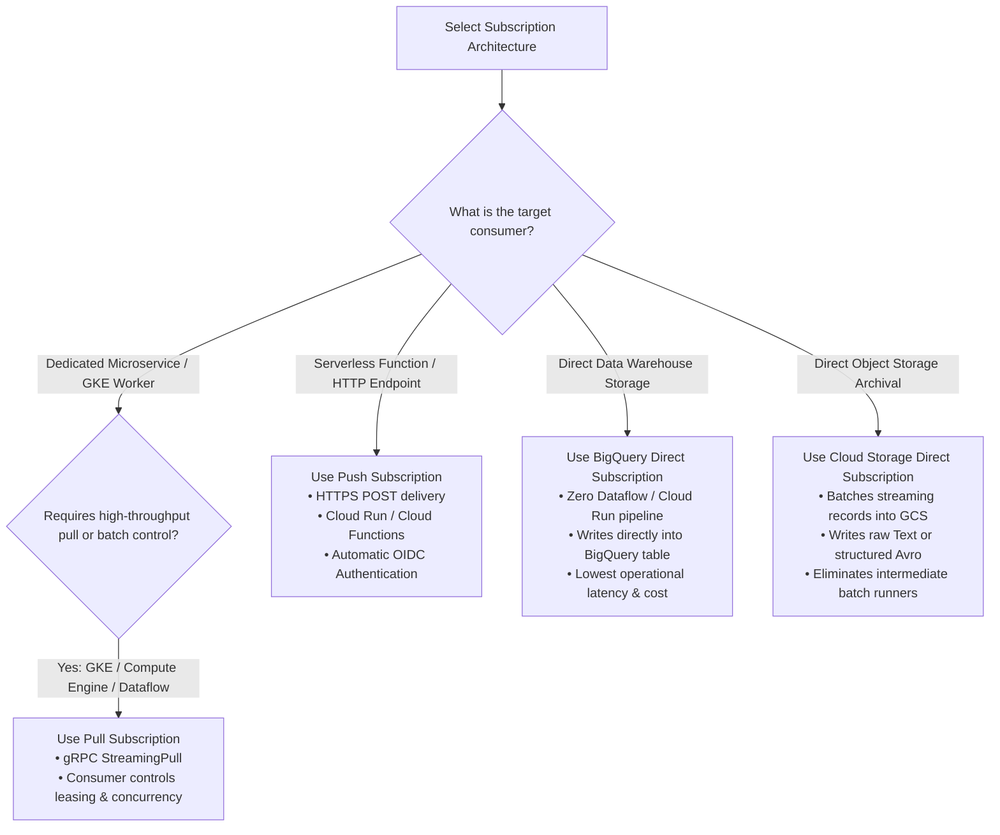
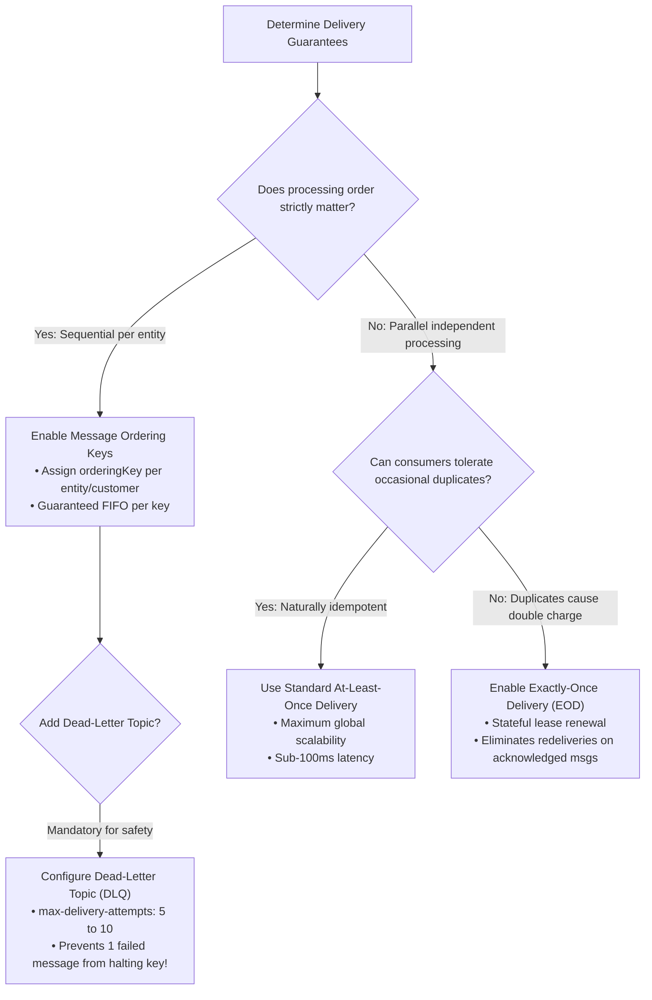
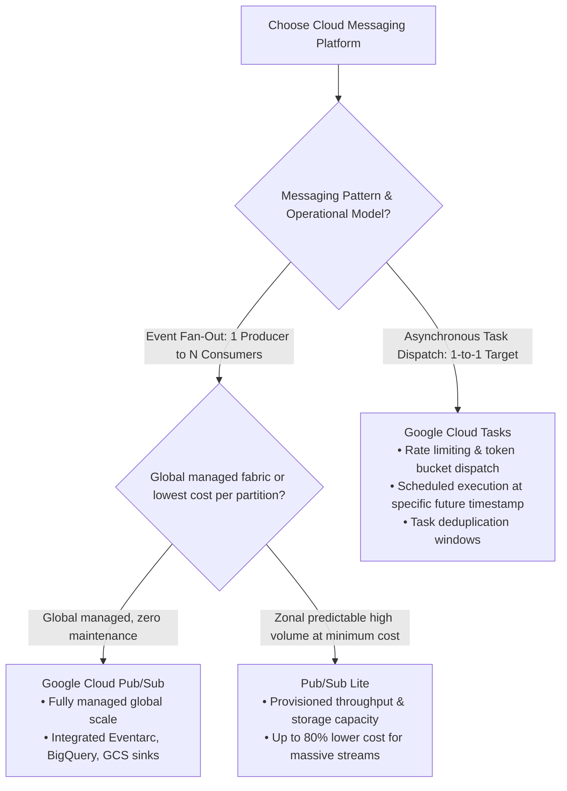

# Google Cloud Pub/Sub: Decision Trees (ASCII & Visual)

This document provides structured decision logic trees for selecting Pub/Sub subscription architectures, delivery guarantees, message ordering strategies, and enterprise messaging platform choices.

---

## 1. Subscription Type Selection (ASCII Decision Tree)

```
================================================================================
               PUB/SUB SUBSCRIPTION TYPE DECISION TREE
================================================================================

              Where is your message consumer running and what is its workload?
                                       │
        ┌──────────────────────────────┼──────────────────────────────┐
        ▼                              ▼                              ▼
  [ Compute Cluster / Pods ]    [ Serverless / Webhook ]       [ Analytics / Storage Sink ]
  GKE, Compute Engine,          Cloud Run, Cloud Run           Data Lake, Warehouse,
  Dataflow streaming            Functions, Third-Party URL     Long-term Archival
        │                              │                              │
        ▼                              ▼                              ├───────────────────────┐
  USE PULL SUBSCRIPTION         USE PUSH SUBSCRIPTION                 ▼                       ▼
  - High throughput             - Event-driven autoscaling     Destination: BigQuery?  Destination: GCS?
  - Bidirectional gRPC stream   - HTTPS POST endpoint                 │                       │
  - Client controls batch rate  - Automatic OIDC token auth           ▼                       ▼
  - Custom ack management       - Zero idle consumer costs     USE BIGQUERY DIRECT     USE CLOUD STORAGE
                                                               SUBSCRIPTION            DIRECT SUBSCRIPTION
                                                               - Zero pipeline code    - Direct batching
                                                               - Auto table routing    - Text / Avro output
```

---

## 2. Delivery Guarantees & Reliability Strategy (ASCII Decision Tree)

```
================================================================================
           PUB/SUB DELIVERY GUARANTEES & RELIABILITY DECISION TREE
================================================================================

                 What are your consistency & ordering requirements?
                                       │
        ┌──────────────────────────────┼──────────────────────────────┐
        ▼                              ▼                              ▼
  [ Standard Throughput ]       [ Strict Idempotency ]         [ Sequential Processing ]
  Idempotent consumers          Duplicate messages             Financial transactions,
  tolerating redeliveries       cause corrupt state            CDC changelogs, audit logs
        │                              │                              │
        ▼                              ▼                              ▼
  STANDARD AT-LEAST-ONCE        USE EXACTLY-ONCE               ENABLE ORDERING KEYS
  - Default high performance    DELIVERY (EOD)                 - Publish with `orderingKey`
  - Sub-100ms latency           - Stateful lease tracking      - Sequential delivery per key
  - Minimal overhead            - Server-side deduplication    - Failures block key until acked
                                                                      │
                                                                      ▼
                                                               CRITICAL SAFETY:
                                                               Pair with Dead-Letter Topic
                                                               (DLQ) to avoid pipeline stalls!
```

---

## 3. GCP Messaging Service Selection (ASCII Decision Tree)

```
================================================================================
         GCP MESSAGING & STREAMING SERVICE SELECTION DECISION TREE
================================================================================

               What is your primary architectural communication pattern?
                                       │
        ┌──────────────────────────────┼──────────────────────────────┐
        ▼                              ▼                              ▼
  [ Event-Driven Pub/Sub ]      [ Point-to-Point Task Queue ]  [ Partitioned Streaming Log ]
  1-to-N fan-out, independent   1-to-1 dispatch, rate limiting, High throughput, low cost,
  subscribers, global fabric    scheduled future execution     manual partition management
        │                              │                              │
        ▼                              ▼                              ▼
  USE CLOUD PUB/SUB             USE CLOUD TASKS                USE PUB/SUB LITE / KAFKA
  - Fully managed, autoscaling  - Explicit rate limiting       - Zonal partition capacity
  - Global Anycast ingestion    - Task deduplication & delays  - Lowest cost per GB throughput
  - Rich GCP ecosystem bindings - HTTP webhook targets only    - Custom offset cursors
```

---

## 4. Visual Mermaid Decision Flowcharts

### 4.1 Subscription Architecture Flowchart:



---

### 4.2 Delivery Guarantees & Error Handling Flowchart:



---

### 4.3 Messaging Platform Selector Flowchart:


