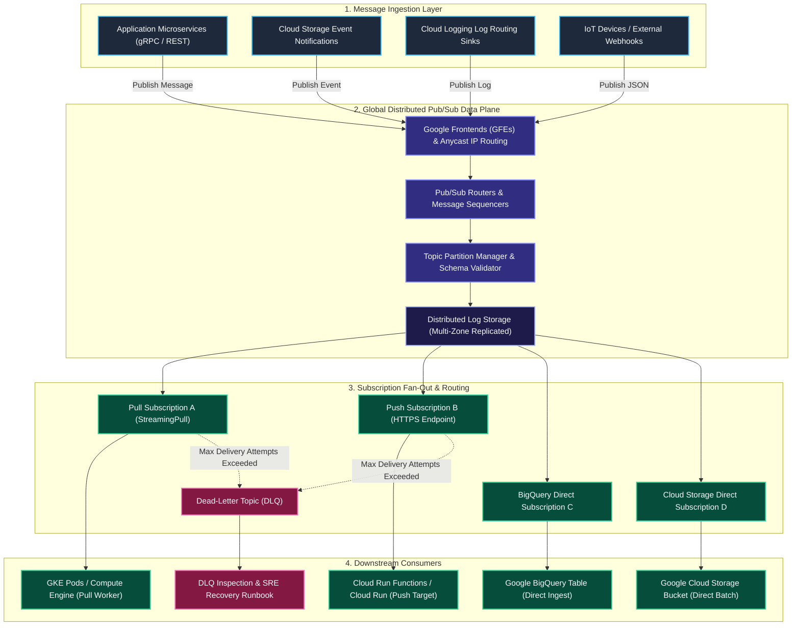
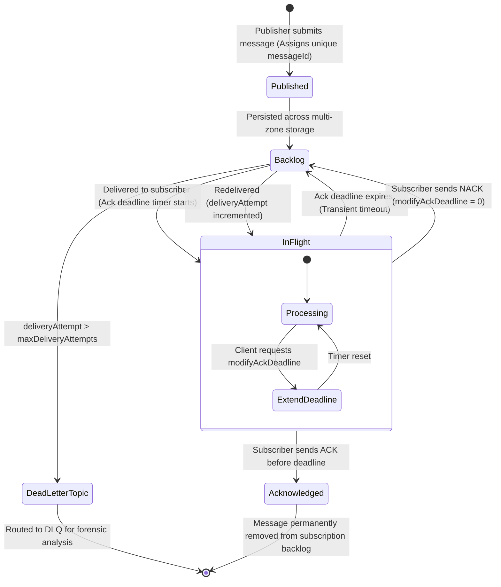
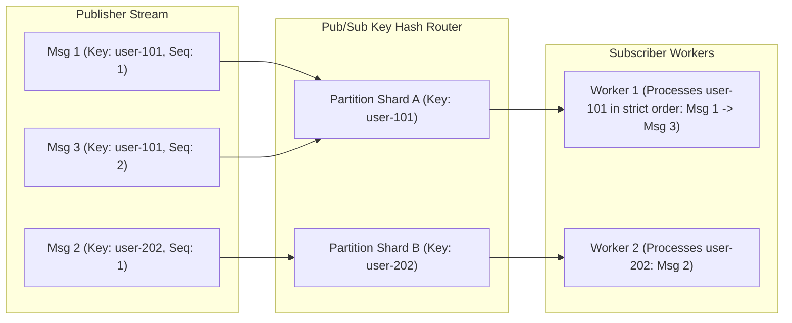
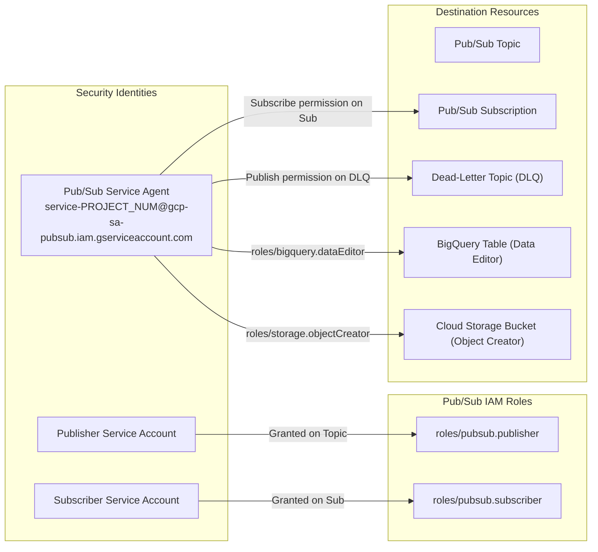

# Feature 10: Google Cloud Pub/Sub — High-Level Design (HLD) & Low-Level Design (LLD)

This document details the distributed systems architecture, storage mechanics, message lifecycle state machines, ordering partitions, and delivery guarantees of **Google Cloud Pub/Sub**.

---

## 1. High-Level Design (HLD)

Google Cloud Pub/Sub is a globally distributed, horizontal-scaling asynchronous messaging fabric designed to provide sub-100-millisecond latency, massive multi-terabyte per second throughput, and strict high availability without server provisioning or partition rebalancing.



### Key HLD Architectural Pillars:

1. **Global Anycast Frontends**:
   - Publishers connect to the closest geographic Google Frontend (GFE) using Google's global Anycast network, reducing network round-trip latency.
2. **Decoupled Stateless Routers & Storage Separation**:
   - Stateless **Forwarder/Router** servers handle client connections, authentication, schema validation, and routing.
   - Persistent message storage is decoupled and replicated across multiple availability zones, ensuring zero data loss even during complete zonal datacenter outages.
3. **Multi-Subscription 1-to-N Fan-Out**:
   - A single message published to a topic is independently duplicated and persisted into every active subscription attached to that topic. Each subscription maintains its own cursor, backlog state, and acknowledgment lifecycle.
4. **Four Subscription Ingestion Models**:
   - **Pull**: High-performance worker clusters pull messages via bi-directional gRPC `StreamingPull`.
   - **Push**: Pub/Sub automatically dispatches HTTPS POST requests to HTTP webhooks, Cloud Run, or Cloud Run functions with OIDC authentication.
   - **BigQuery Direct**: Automatically writes streaming messages directly into BigQuery tables without requiring Cloud Dataflow or Cloud Run pipelines.
   - **Cloud Storage Direct**: Batches and writes streaming records directly to Cloud Storage buckets as raw text or structured Avro files.

---

## 2. Low-Level Design (LLD)

### 2.1 Message Acknowledgment State Machine

Pub/Sub guarantees reliable delivery through an explicit acknowledgment contract. The state machine below details the lifecycle of an individual message from publication to terminal acknowledgment or dead-lettering:



### State Transition Mechanics:

1. **Published**: The message is validated against any active Avro/Protobuf schema, assigned a globally unique `messageId` and monotonic `publishTime`, and committed across multiple storage nodes.
2. **In-Flight (Leased)**: When delivered to a subscriber, an **Acknowledgment Deadline** timer begins (configurable between 10 seconds and 600 seconds; default is 10s).
3. **Acknowledgment (`ACK`)**: If the consumer finishes processing and sends an `ack` before the deadline expires, the message is permanently marked as processed and deleted from the backlog.
4. **Negative Acknowledgment (`NACK`)**: If processing encounters a transient failure, the consumer can send a `modifyAckDeadline(0)` (NACK), signaling Pub/Sub to immediately release the message back to the backlog for retry rather than waiting for the timer to expire.
5. **Dead-Letter Routing**: Every failed delivery increments the internal `deliveryAttempt` counter. If `deliveryAttempt > maxDeliveryAttempts`, Pub/Sub automatically diverts the message to a configured **Dead-Letter Topic (DLQ)**.

---

### 2.2 Exactly-Once Delivery (EOD) Internals

Standard Pub/Sub provides **At-Least-Once Delivery**, where network disruptions, subscriber crashes, or late acks can lead to duplicate message deliveries.

When **Exactly-Once Delivery** is enabled on a subscription:
1. **Stateful Lease Tracking**: Pub/Sub clusters track active leases for messages. If an acknowledgment is sent while the lease is valid, Pub/Sub guarantees the message will *never* be redelivered.
2. **Ack Status Feedback**: The acknowledgment RPC returns a deterministic status code:
   - `SUCCESS`: Ack committed cleanly; duplicate will not occur.
   - `EXPIRED`: Ack arrived after deadline expired; message was already released for redelivery.
   - `INVALID_ACK_ID`: Message ID expired or unknown.
3. **Zero-Overhead Idempotency**: Eliminates the need for subscribers to construct custom Redis/database deduplication tables for transient retries.

---

### 2.3 Message Ordering via Ordering Keys

By default, Pub/Sub optimizes for global scale and throughput, delivering messages without strict ordering guarantees. When strict sequential processing is mandatory (e.g. financial ledgers, CDC database changelogs):



#### Ordering Rules & Failure Cascades:
* **Ordering Key Hashing**: Messages published with the same `orderingKey` string are routed to the same partition shard and delivered in the exact order they were published.
* **Failure Blocking**: If message $N$ with key `user-101` fails or times out, **Pub/Sub blocks delivery of message $N+1$ for that same key** until message $N$ is acknowledged or successfully diverted to a Dead-Letter Topic.
* **Dead-Letter Topic Integration**: Pairing ordering keys with a Dead-Letter Topic prevents a single malformed ("poison pill") message from permanently halting processing for that ordering key.

---

### 2.4 Server-Side Message Filtering

Pub/Sub subscriptions can define SQL-like **Attribute Filter Expressions**. Filtering executes on the Pub/Sub server before delivery:

* **Syntax**:
  ```sql
  attributes.eventType = "ORDER_CREATED" AND attributes.priority >= "HIGH"
  ```
* **Zero Egress & Zero Compute Cost**: Messages that do not match the filter are automatically acknowledged by Pub/Sub and discarded, incurring no network egress charges and zero subscriber compute cycles.
* **Attribute vs. Payload**: Filtering evaluates message attributes (key-value metadata), not the message payload body.

---

### 2.5 Message Schemas (Apache Avro & Protocol Buffers)

Topics can be bound to schemas to enforce strict data contracts:

| Schema Format | Protocol Definition | Encoding Options | Best Practice / Use Case |
| :--- | :--- | :--- | :--- |
| **Apache Avro** | JSON-based schema (`.avsc`) | `JSON` or `BINARY` | Analytics, BigQuery pipelines, Dataflow streaming. |
| **Protocol Buffers** | Protobuf definition (`.proto`) | `BINARY` or `JSON` | High-performance microservice RPCs, gRPC architectures. |

#### Schema Evolution Policies:
* `COMPATIBILITY_BACKWARD`: Newer schema versions can read messages written by older versions.
* `COMPATIBILITY_FORWARD`: Older schema versions can read messages written by newer versions.
* `COMPATIBILITY_FULL`: Both backward and forward compatibility enforced.

---

### 2.6 IAM Security & Privilege Delegation Model



1. **Publisher Identity**: Requires `roles/pubsub.publisher` on the target topic.
2. **Subscriber Identity**: Requires `roles/pubsub.subscriber` on the target subscription.
3. **Dead-Letter Service Agent Binding**: To forward failed messages to a Dead-Letter Topic, the **Pub/Sub Service Agent** (`service-PROJECT_NUMBER@gcp-sa-pubsub.iam.gserviceaccount.com`) must have:
   - `roles/pubsub.publisher` on the **Dead-Letter Topic**.
   - `roles/pubsub.subscriber` on the **Primary Subscription**.
4. **BigQuery / Cloud Storage Direct Subscriptions**: The Pub/Sub Service Agent must have `roles/bigquery.dataEditor` on the target dataset/table, or `roles/storage.objectCreator` on the target storage bucket.
