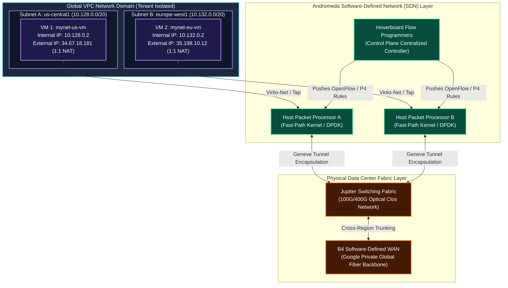

# GCP VPC Network Case Study: Deep-Dive Packet Lifecycle, Distributed Firewall Engine & Compute Integration

Welcome to the **Google Cloud Virtual Private Cloud (VPC) Deep-Dive Architecture & Packet Lifecycle Case Study**. This comprehensive engineering guide explains how Google Cloud's software-defined networking (**Andromeda SDN**) operates under the hood, how packets traverse the virtual and physical network infrastructure, how the distributed stateful firewall engine filters and drops/allows traffic, and how Compute Engine VMs physically and logically connect to VPC networks and subnetworks.

---

## Case Study Directory Sitemap

| Document | Focus Area | Key Architectural Concepts Covered |
| :--- | :--- | :--- |
| [**1. High-Level Architecture (HLD)**](file:///home/btpl-lap-22/live/gcd/vpc-network/casestudy/hld-architecture.md) | Network Topology & SDN Control Plane | Andromeda SDN Control/Data Plane, Hoverboard Flow Programmers, Global VPC Infrastructure, Jupiter/B4 Data Center Fabric, Subnet-Route-Firewall Binding. |
| [**2. Low-Level Packet Lifecycle (LLD)**](file:///home/btpl-lap-22/live/gcd/vpc-network/casestudy/lld-packet-lifecycle.md) | Packet Traversal & Network Mechanics | Guest OS Socket $\rightarrow$ Virtio-Net Driver $\rightarrow$ Hypervisor Tap Interface $\rightarrow$ Andromeda Packet Processor $\rightarrow$ Geneve/STT Encapsulation $\rightarrow$ Physical Wire $\rightarrow$ Decapsulation $\rightarrow$ Destination Delivery. |
| [**3. Stateful Firewall Engine Deep Dive**](file:///home/btpl-lap-22/live/gcd/vpc-network/casestudy/firewall-deep-dive.md) | Firewall Filtering & Security Enforcement | Distributed Connection Tracking Engine (`conntrack`), Priority Evaluation (0-65535), Deny-Override, Target Tags, Service Accounts, Hierarchical Policies, Packet Drop Flowchart. |
| [**4. Compute & Network Integration**](file:///home/btpl-lap-22/live/gcd/vpc-network/casestudy/compute-network-integration.md) | Hypervisor & VM Connectivity | Virtual Network Interfaces (vNICs), Subnet CIDR Binding, 4 Reserved Subnet IPs, 1:1 NAT Transparency, Metadata Server (`169.254.169.254`), Multi-NIC, **Connectivity Scope Isolation Matrix**, and **Common GCP VPC Network Design Patterns (Multi-Zone HA, Multi-Region Globalization, Cloud NAT Outbound, Private Google Access)**. |

| [**5. Operations & Troubleshooting Manual**](file:///home/btpl-lap-22/live/gcd/vpc-network/casestudy/commands-and-troubleshooting.md) | CLI Commands & Diagnostic Manual | `gcloud compute` CLI, Network Intelligence Center Connectivity Tests, VPC Flow Logs, Packet Mirroring, Diagnostic Error Resolution Matrix. |
| [**6. Hands-On Configuration Guide**](file:///home/btpl-lap-22/live/gcd/vpc-network/casestudy/hands-on-network-configuration-guide.md) | Step-by-Step Practical Blueprints | 6 real-world deployment scenarios: Custom VPC, Auto-to-Custom conversion, Cloud NAT, VPC Peering, Multi-NIC, PSC. |

---

## Core System Architecture Overview

---

## Summary of Key Learnings & Engineering Concepts

1. **Software-Defined Networking (Andromeda)**: GCP does not use physical switches or hardware middleboxes for VPC routing and firewalling. All network logic is programmed into Andromeda software packet processors co-located on the Linux hypervisors hosting Google Compute Engine VMs.
2. **Stateful Connection Tracking**: GCP Distributed Firewalls operate statefully at the hypervisor level. When an egress packet or ingress packet opens a session, the hypervisor's conntrack engine stores the session tuples `(src_ip, src_port, dst_ip, dst_port, protocol)`. Return response packets bypass firewall rule evaluation automatically.
3. **Hypervisor 1:1 NAT Transparency**: Public External IPs are NOT configured on the Guest OS interface (`eth0` / `nic0`). The Guest OS only sees its private RFC 1918 internal IP address. Andromeda packet processors perform 1:1 Network Address Translation (NAT) at the hypervisor egress/ingress boundary invisibly.
4. **VPC Network Isolation Boundary**: Separate VPC networks represent completely isolated routing domains. Internal IP traffic directed across unpeered VPC networks is dropped at the source hypervisor's Andromeda routing lookup stage before ever entering the physical wire.

---

## Related Workspace References

- [Main VPC Module Readme](file:///home/btpl-lap-22/live/gcd/vpc-network/README.md)
- [VPC High-Level & Low-Level Design](file:///home/btpl-lap-22/live/gcd/vpc-network/hld-lld-design.md)
- [VPC Decision Tree Guide](file:///home/btpl-lap-22/live/gcd/vpc-network/decision-tree.md)
- [VPC CLI Operations Manual](file:///home/btpl-lap-22/live/gcd/vpc-network/shell-commands.md)
