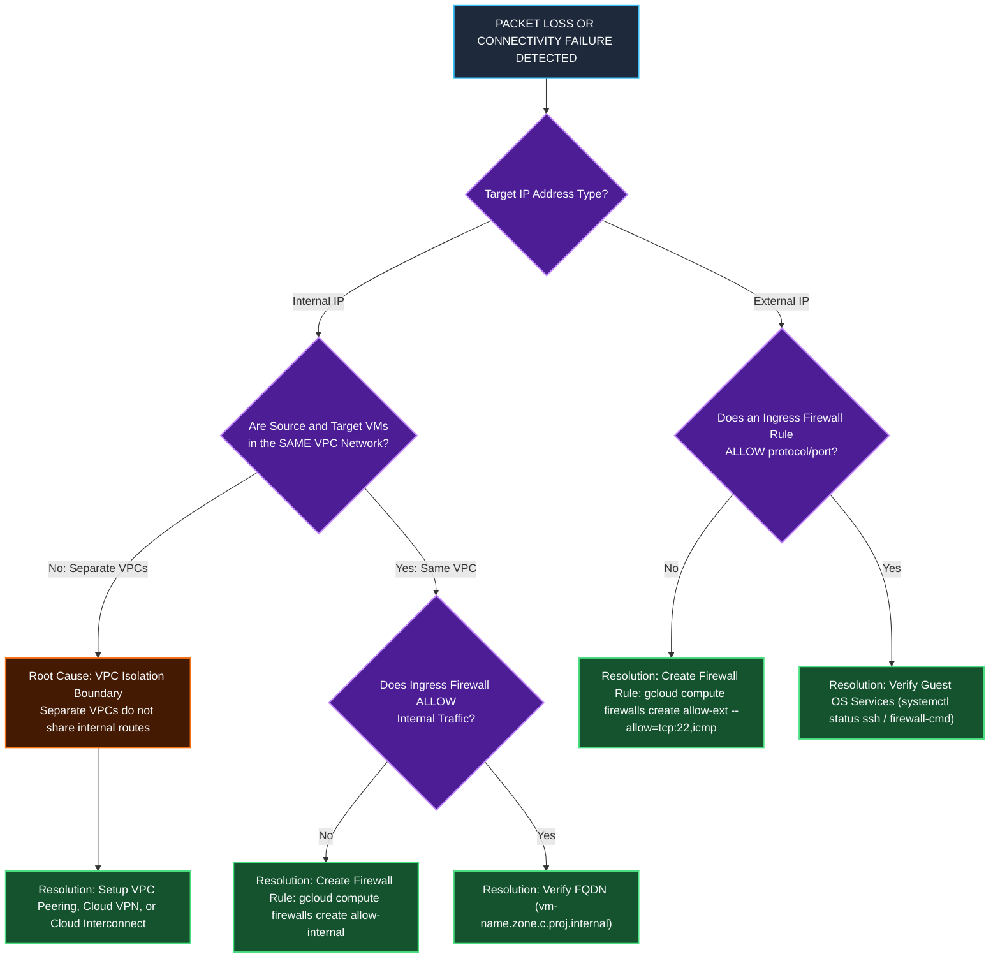

# Operations, Diagnostic Commands & Troubleshooting Manual

This document provides a comprehensive CLI manual (`gcloud compute`), detailed parameter-by-parameter technical definitions and rationale, advanced enterprise networking commands (Cloud NAT, VPC Peering, Private Service Connect, Network Firewall Policies), diagnostic verification workflows using **Network Intelligence Center Connectivity Tests**, **VPC Flow Logs**, **Packet Mirroring**, and a **Troubleshooting Error Matrix** for GCP VPC networks.

---

## 1. Deep-Dive CLI Command Reference (`gcloud compute`)

### 1.1 VPC Network Management (`gcloud compute networks`)

#### Command: Create Custom Mode VPC Network
```bash
gcloud compute networks create privatenet \
    --subnet-mode=custom \
    --bgp-routing-mode=global \
    --mtu=1460 \
    --description="Enterprise Production Custom Mode VPC Network"
```

##### Parameter Breakdown & Technical Rationale:

| Parameter / Flag | Type | Definition & Purpose | Default Value | Technical Rationale & Impact |
| :--- | :--- | :--- | :--- | :--- |
| `privatenet` | Positional | **VPC Network Name**: Unique identifier string. Must comply with RFC 1035 (`[a-z]([-a-z0-9]*[a-z0-9])?`, 1-63 chars). | *Required* | Serves as the primary administrative handle for the global virtual router domain and firewall container. |
| `--subnet-mode` | Option | **Subnet Creation Mode**: Accepts `auto` or `custom`. | `auto` | `custom` mode creates zero subnets initially. Required in production to prevent IP CIDR overlaps during multi-cloud or VPC Peering setups. |
| `--bgp-routing-mode` | Option | **Dynamic BGP Scope**: Accepts `regional` or `global`. | `regional` | Controls how Cloud Routers propagate learned BGP routes. `global` advertises dynamic routes across all GCP regions globally via the B4 WAN backbone. |
| `--mtu` | Option | **Maximum Transmission Unit**: Integer bytes (`1460`, `1500`, `8850`). | `1460` | Sets packet payload size limit. Setting `8850` enables Jumbo Frames for high-throughput big data / HPC intra-VPC transfers. |
| `--description` | Option | **Metadata Description**: Arbitrary text string describing purpose. | *None* | Essential for enterprise governance, auditing, and infrastructure-as-code tracking. |

---

#### Command: Convert Auto Mode to Custom Mode Network
```bash
gcloud compute networks update mynetwork --switch-to-custom-mode
```

##### Parameter Breakdown & Technical Rationale:

| Parameter / Flag | Type | Definition & Purpose | Default Value | Technical Rationale & Impact |
| :--- | :--- | :--- | :--- | :--- |
| `mynetwork` | Positional | **Target Network Name**: The auto-mode network to modify. | *Required* | Identifies the target network resource. |
| `--switch-to-custom-mode` | Flag | **Mode Conversion Switch**: Converts subnet creation mode from Auto to Custom. | *None* | **Irreversible Operation**. Allows individual subnet deletion and custom range additions without destroying existing workloads or IPs. |

---

#### Command: Delete VPC Network
```bash
gcloud compute networks delete default --quiet
```

##### Parameter Breakdown & Technical Rationale:

| Parameter / Flag | Type | Definition & Purpose | Default Value | Technical Rationale & Impact |
| :--- | :--- | :--- | :--- | :--- |
| `default` | Positional | **Target Network Name**: The VPC network to delete. | *Required* | Target network resource identifier. |
| `--quiet` / `-q` | Flag | **Non-Interactive Execution**: Suppresses user confirmation prompts. | Interactive | Essential for automated CI/CD cleanup pipelines (Terraform / Bash scripts). |

---

### 1.2 Subnet Management (`gcloud compute networks subnets`)

#### Command: Create Custom Subnet
```bash
gcloud compute networks subnets create privatesubnet-us \
    --network=privatenet \
    --region=us-central1 \
    --range=172.16.0.0/24 \
    --enable-private-ip-google-access \
    --enable-flow-logs \
    --logging-flow-sampling=0.5 \
    --purpose=PRIVATE
```

##### Parameter Breakdown & Technical Rationale:

| Parameter / Flag | Type | Definition & Purpose | Default Value | Technical Rationale & Impact |
| :--- | :--- | :--- | :--- | :--- |
| `privatesubnet-us` | Positional | **Subnet Resource Name**: RFC 1035 compliant string. | *Required* | Identifies the regional subnetwork. |
| `--network` | Option | **Parent VPC Container**: Name of target VPC network. | *Required* | Binds the subnetwork CIDR block strictly to a single VPC routing table domain. |
| `--region` | Option | **GCP Region Placement**: Target geographical region (e.g. `us-central1`). | *Required* | Subnets are regional resources; a single subnet spans all availability zones in that region. |
| `--range` | Option | **IPv4 CIDR Block**: Primary IP address allocation (e.g. `172.16.0.0/24`). | *Required* | Defines available private IP pool. Must follow RFC 1918 rules (min `/29`, max `/8`). |
| `--enable-private-ip-google-access` | Flag | **Private Google Access**: Enables internal API connectivity. | `Disabled` | Allows VMs with **internal IP addresses only** to reach Google APIs (`storage.googleapis.com`, `bigquery.googleapis.com`) without public IPs. |
| `--enable-flow-logs` | Flag | **VPC Flow Logs**: Enables network telemetry logging. | `Disabled` | Captures 5-tuple flow records for security telemetry, auditing, and latency tracking. |
| `--logging-flow-sampling` | Option | **Flow Sampling Rate**: Float value from `0.0` (0%) to `1.0` (100%). | `0.5` (50%) | Controls log volume cost vs analytics accuracy. `0.5` samples 50% of network flows. |
| `--purpose` | Option | **Subnet Intended Purpose**: `PRIVATE` or `REGIONAL_MANAGED_PROXY`. | `PRIVATE` | `REGIONAL_MANAGED_PROXY` creates proxy-only subnets required for Envoy Application Load Balancers. |

---

#### Command: Zero-Downtime Subnet Expansion
```bash
gcloud compute networks subnets expand-ip-range privatesubnet-us \
    --region=us-central1 \
    --prefix-length=20
```

##### Parameter Breakdown & Technical Rationale:

| Parameter / Flag | Type | Definition & Purpose | Default Value | Technical Rationale & Impact |
| :--- | :--- | :--- | :--- | :--- |
| `privatesubnet-us` | Positional | **Target Subnet Name**: Subnet to expand. | *Required* | Target subnet identifier. |
| `--region` | Option | **Subnet Region**: Geographical region of target subnet. | *Required* | Required to locate regional subnet resource. |
| `--prefix-length` | Option | **New CIDR Prefix**: Smaller netmask number (e.g. expanding `/24` to `/20`). | *Required* | **One-way expansion**. Expands IP capacity dynamically without restarting VMs or destroying existing IP bindings. |

---

### 1.3 Firewall Rule Management (`gcloud compute firewalls`)

#### Command: Create Targeted Ingress Firewall Rule
```bash
gcloud compute firewalls create mynetwork-allow-icmp-ssh-rdp \
    --network=mynetwork \
    --direction=INGRESS \
    --priority=1000 \
    --action=ALLOW \
    --rules=icmp,tcp:22,tcp:3389 \
    --source-ranges=0.0.0.0/0 \
    --target-tags=web-server \
    --description="Allow Ingress ICMP, SSH, and RDP for Web Servers"
```

##### Parameter Breakdown & Technical Rationale:

| Parameter / Flag | Type | Definition & Purpose | Default Value | Technical Rationale & Impact |
| :--- | :--- | :--- | :--- | :--- |
| `mynetwork-allow-...` | Positional | **Firewall Rule Name**: Unique rule identifier. | *Required* | System handle for the firewall policy entry. |
| `--network` | Option | **Parent VPC Network**: Target VPC network. | `default` | Binds rule evaluation engine to all host hypervisors supporting instances in that VPC. |
| `--direction` | Option | **Traffic Flow Direction**: `INGRESS` (inbound) or `EGRESS` (outbound). | `INGRESS` | `INGRESS` filters incoming traffic; `EGRESS` filters outgoing traffic relative to vNIC interface. |
| `--priority` | Option | **Evaluation Priority**: Integer integer between `0` and `65535`. | `1000` | Rules are evaluated sequentially from lowest integer (`0`) to highest (`65535`). First match terminates evaluation. |
| `--action` | Option | **Match Action**: `ALLOW` or `DENY`. | `ALLOW` | Specifies whether matching packets are permitted (`ALLOW`) or dropped instantly (`DENY`). |
| `--rules` | Option | **Protocols & Ports**: Comma-separated specs (`icmp`, `tcp:22`, `udp:53`, `all`). | *Required* | Specifies transport protocols and destination port ranges allowed or denied by rule. |
| `--source-ranges` | Option | **Source CIDR Filters**: IPv4/IPv6 source networks (`0.0.0.0/0`, `35.235.240.0/20`). | *Required (Ingress)* | Restricts packet entry based on sender's origin IP address block. |
| `--target-tags` | Option | **Target Network Tags**: Comma-separated string labels (`web-server`). | *All Instances* | Enables micro-segmentation by restricting rule enforcement strictly to VMs carrying matching tags. |

---

### 1.4 Compute Engine Master Command Reference Guide (`gcloud compute instances`)

Google Compute Engine VM creation involves network interface binding, security posture configuration, storage selection, and IAM identity attachment. Below is the **All-in-One Master Provisioning Command** containing all enterprise parameters in one unified CLI call.

#### The Ultimate Compute Engine VM Creation Master Command
```bash
gcloud compute instances create prod-app-vm-01 \
    --project=my-gcp-project-id \
    --zone=us-central1-c \
    --machine-type=e2-standard-4 \
    --network=prod-vpc \
    --subnet=prod-subnet-us \
    --private-network-ip=10.130.0.50 \
    --no-address \
    --can-ip-forward \
    --tags=web-server,app-backend,prod-workload \
    --service-account=app-sa@my-gcp-project-id.iam.gserviceaccount.com \
    --scopes=cloud-platform \
    --image-family=debian-11 \
    --image-project=debian-cloud \
    --boot-disk-size=50GB \
    --boot-disk-type=pd-ssd \
    --boot-disk-auto-delete \
    --metadata=startup-script='#!/bin/bash apt-get update && apt-get install -y nginx' \
    --maintenance-policy=MIGRATE \
    --enable-shielded-vm \
    --shielded-secure-boot \
    --deletion-protection
```

---

#### Production Master Command Blueprints & Templates

##### Blueprint 1: Production Private Isolated Enterprise VM (`--no-address` + IAP SSH)
```bash
gcloud compute instances create db-private-vm \
    --zone=us-central1-c \
    --machine-type=e2-standard-2 \
    --subnet=privatenet-us \
    --no-address \
    --tags=db-server \
    --service-account=db-sa@my-project.iam.gserviceaccount.com \
    --scopes=cloud-platform
```

##### Blueprint 2: Public Web Application VM with Static External IP & Nginx Startup Script
```bash
# 1. Reserve Static External Regional IPv4 Address
gcloud compute addresses create web-static-ip --region=us-central1

# 2. Provision VM with Reserved External IP
gcloud compute instances create web-public-vm \
    --zone=us-central1-c \
    --machine-type=e2-medium \
    --subnet=publicnet-us \
    --address=web-static-ip \
    --tags=web-server,http-server,https-server \
    --metadata=startup-script='#!/bin/bash apt-get update && apt-get install -y nginx && systemctl enable --now nginx'
```

##### Blueprint 3: Multi-NIC Dual-Homed Appliance VM (`nic0` & `nic1`)
```bash
gcloud compute instances create firewall-nva-vm \
    --zone=us-central1-c \
    --machine-type=e2-standard-4 \
    --can-ip-forward \
    --network-interface=subnet=untrust-subnet-us,no-address=false \
    --network-interface=subnet=trust-subnet-us,no-address=true
```

##### Blueprint 4: Custom Hardware Spec VM (4 vCPU, 16 GB Memory)
```bash
gcloud compute instances create custom-app-vm \
    --zone=us-central1-c \
    --custom-cpu=4 \
    --custom-memory=16GB \
    --subnet=prod-subnet-us \
    --no-address
```

---

#### Compute Engine Master Parameter Breakdown Table

| Parameter / Flag | Type | Definition & Purpose | Default Value | Exact Technical Mechanics & Rationale |
| :--- | :--- | :--- | :--- | :--- |
| `prod-app-vm-01` | Positional | **VM Hostname / Resource ID** | *Required* | Defines VM name, internal DNS hostname (`vm-name.zone.c.proj.internal`), and GCP resource key. |
| `--zone` | Option | **Target Availability Zone** | Project default | Dictates physical datacenter placement in GCP region (`us-central1-a/b/c/f`). |
| `--machine-type` | Option | **Machine Family & Specs** | `n1-standard-1` | Sets vCPU count, RAM, and **Max vNIC Bandwidth** (e.g. 2 Gbps per vCPU up to 100 Gbps Tier 1). |
| `--custom-cpu` | Option | **Custom vCPU Count** | *None* | Explicitly assigns custom number of virtual cores (e.g. `--custom-cpu=4`). |
| `--custom-memory` | Option | **Custom RAM Allocation** | *None* | Sets exact RAM size (e.g. `--custom-memory=16GB` or `--custom-memory=16384MB`). |
| `--network` | Option | **VPC Network Attachment** | `default` | Binds primary interface (`nic0`) to a specific global VPC network domain. |
| `--subnet` | Option | **Regional Subnet Attachment** | `default` | Binds `nic0` to a specific subnet, assigning an internal RFC 1918 IPv4 address (`10.130.0.2`). |
| `--private-network-ip` | Option | **Static Internal IPv4 Address** | *DHCP Ephemeral* | Assigns a specific static private IP (`10.130.0.50`) instead of dynamic DHCP lease. |
| `--no-address` | Flag | **Suppress External IPv4 Address** | *Ephemeral Public* | **Hardens security posture** by omitting public IP allocation. VM only possesses an internal IP. |
| `--address` | Option | **Assign Static External IP** | *Ephemeral Public* | Binds a pre-reserved static public IPv4 address to `nic0` hypervisor 1:1 NAT mapping. |
| `--can-ip-forward` | Flag | **Enable IP Forwarding** | `Disabled` | **Mandatory for NAT Gateways & NVAs**. Allows host hypervisor tap to transmit packets with non-matching source IPs. |
| `--tags` | Option | **Network Metadata Tags** | *None* | Attaches comma-separated string labels (`web-server,db-client`) used by VPC firewall rules and routes. |
| `--service-account` | Option | **IAM Service Account Identity** | *Default Compute SA* | Attaches non-default IAM identity used for identity-based firewalls and GCP API authentication. |
| `--scopes` | Option | **OAuth API Scopes** | `default` | Grants authorization scopes (`cloud-platform` enables full IAM role delegation). |
| `--image-family` | Option | **OS Image Family** | *None* | Selects latest OS release version automatically (e.g. `debian-11`, `ubuntu-2204-lts`). |
| `--image-project` | Option | **OS Image Vendor Project** | *None* | Vendor image repository (`debian-cloud`, `ubuntu-os-cloud`, `centos-cloud`, `rhel-cloud`). |
| `--boot-disk-size` | Option | **Boot Disk Capacity** | `10GB` | Specifies OS root disk size in GB (e.g., `50GB`). |
| `--boot-disk-type` | Option | **Disk Storage Tech** | `pd-standard` | Storage tier: `pd-standard` (HDD), `pd-balanced` (SSD balanced), `pd-ssd` (Fast SSD), `hyperdisk-balanced`. |
| `--metadata` | Option | **Key-Value Pair Metadata** | *None* | Injects custom key-value pairs or startup scripts (`startup-script=...`) executed at first boot. |
| `--metadata-from-file` | Option | **Script File Injection** | *None* | Loads startup script directly from local file (`startup-script=path/to/script.sh`). |
| `--network-interface` | Option | **Multi-NIC Configuration** | *nic0 default* | Defines multiple vNIC interfaces attached to separate VPC networks (`--network-interface=subnet=sub1`). |
| `--deletion-protection` | Flag | **Enable Delete Protection** | `Disabled` | Prevents accidental VM deletion via Console or API until explicit removal of protection flag. |

---

#### Lifecycle & Operation Master Commands (`gcloud compute instances`)

##### 1. Connect via SSH over IAP (Private VM without Public IP)
```bash
gcloud compute ssh prod-app-vm-01 --zone=us-central1-c --tunnel-through-iap
```

##### 2. Copy Files via SCP over IAP
```bash
# Upload local file to VM
gcloud compute scp ./config.json prod-app-vm-01:/tmp/ --zone=us-central1-c --tunnel-through-iap

# Download file from VM to local
gcloud compute scp prod-app-vm-01:/var/log/nginx/access.log ./access.log --zone=us-central1-c --tunnel-through-iap
```

##### 3. Add or Remove Public IP on Running VM
```bash
# Add Ephemeral External IP to existing VM
gcloud compute instances add-access-config prod-app-vm-01 --zone=us-central1-c

# Remove External IP from VM (Convert back to Private VM)
gcloud compute instances delete-access-config prod-app-vm-01 --zone=us-central1-c --access-config-name="External NAT"
```

##### 4. Add or Remove Network Tags Dynamically
```bash
# Add network tags to VM
gcloud compute instances add-tags prod-app-vm-01 --zone=us-central1-c --tags=stage-server,api-backend

# Remove network tags from VM
gcloud compute instances remove-tags prod-app-vm-01 --zone=us-central1-c --tags=stage-server
```

##### 5. VM Power Management (Start, Stop, Reset, Delete)
```bash
# Stop VM (Frees vCPU/RAM billing; persistent disks retained)
gcloud compute instances stop prod-app-vm-01 --zone=us-central1-c

# Start stopped VM
gcloud compute instances start prod-app-vm-01 --zone=us-central1-c

# Reset VM (Hard power cycle)
gcloud compute instances reset prod-app-vm-01 --zone=us-central1-c

# Delete VM instance permanently
gcloud compute instances delete prod-app-vm-01 --zone=us-central1-c --quiet
```


---

### 1.5 Advanced Enterprise Commands (Cloud NAT, VPC Peering, PSC, Policies)

#### Command: Configure Cloud NAT Gateway (Outbound Internet Egress for Private VMs)
```bash
# 1. Create Cloud Router for BGP & NAT management
gcloud compute routers create nat-router-us \
    --network=privatenet \
    --region=us-central1

# 2. Create Cloud NAT Gateway attached to Cloud Router
gcloud compute routers nats create nat-gw-us \
    --router=nat-router-us \
    --region=us-central1 \
    --auto-allocate-nat-external-ips \
    --nat-all-subnet-ip-ranges \
    --enable-dynamic-port-allocation
```

##### Parameter Breakdown & Technical Rationale:

| Parameter / Flag | Type | Definition & Purpose | Technical Rationale & Impact |
| :--- | :--- | :--- | :--- |
| `nat-gw-us` | Positional | **Cloud NAT Gateway Name**: Identifier string. | Unique handle for the managed NAT service. |
| `--router` | Option | **Parent Cloud Router**: Associated Cloud Router. | Cloud NAT relies on Cloud Router control plane to program NAT state tables. |
| `--auto-allocate-nat-external-ips` | Flag | **Automatic Public IP Pool**: Allocates regional public IPs. | Automatically provisions and scales public IP addresses as outbound connection volume grows. |
| `--nat-all-subnet-ip-ranges` | Flag | **Subnet Traffic Scope**: Applies NAT to all subnets in region. | Allows all private VMs (without public IPs) across all subnets in `us-central1` to reach the Internet securely. |
| `--enable-dynamic-port-allocation` | Flag | **Dynamic SNAT Port Allocation**: Allocates ports on demand. | Prevents SNAT port exhaustion during traffic bursts by dynamically increasing ports per VM. |

---

#### Command: Enable & Query Cloud NAT Connection & Error Logging
```bash
# 1. Enable Cloud NAT Logging for Translations and Errors on existing NAT Gateway
gcloud compute routers nats update nat-config \
    --router=nat-router \
    --region=us-central1 \
    --enable-logging \
    --log-config-filter=ALL

# 2. View NAT Gateway logs using gcloud logging CLI
gcloud logging read \
    'resource.type="nat_gateway" AND resource.labels.gateway_name="nat-config"' \
    --limit=10 \
    --format="json"
```

##### Parameter Breakdown & Cloud Logging Filter Rationale:

| Parameter / Flag | Definition & Purpose | Rationale & Operational Value |
| :--- | :--- | :--- |
| `--enable-logging` | **Enable NAT Event Logging**: Captures connection creation and port exhaustion events. | Generates audit logs whenever a VM opens an outbound NAT session or drops packets due to port exhaustion. |
| `--log-config-filter=ALL` | **Log Filter Scope**: `ALL`, `ERRORS_ONLY`, or `TRANSLATIONS_ONLY`. | `ALL` records both successful outbound NAT port translations and failed connection attempts (port exhaustion). |
| `resource.type="nat_gateway"` | **Cloud Logging Resource Type**: Targets Cloud NAT telemetry. | Filters Cloud Logging stream to show only Cloud NAT translation logs. |


---

#### Command: Configure VPC Network Peering (Private Cross-VPC Routing)
```bash
gcloud compute networks peerings create peer-mynet-to-mgmt \
    --network=mynetwork \
    --peer-network=managementnet \
    --auto-accept \
    --export-custom-routes \
    --import-custom-routes
```

##### Parameter Breakdown & Technical Rationale:

| Parameter / Flag | Type | Definition & Purpose | Technical Rationale & Impact |
| :--- | :--- | :--- | :--- |
| `peer-mynet-to-mgmt` | Positional | **Peering Connection Name**: Unique handle. | Identifies the peering relationship entry. |
| `--network` | Option | **Local VPC Network**: Originating VPC network. | Specifies local network initiating the peering link. |
| `--peer-network` | Option | **Target Peer VPC Network**: Remote VPC network. | Connects both VPC routing tables privately over Google's SDN underlay. |
| `--export-custom-routes` | Flag | **Export Local Custom Routes**: Shares static/BGP routes. | Advertises custom static routes (e.g. Cloud VPN routes) to the peer network. |
| `--import-custom-routes` | Flag | **Import Remote Custom Routes**: Learns peer routes. | Integrates peer's custom routes into local VPC routing table automatically. |

---

#### Command: Configure Private Service Connect (PSC Endpoint for Google APIs)
```bash
# 1. Reserve internal IP for PSC
gcloud compute addresses create psc-storage-ip \
    --global \
    --purpose=PRIVATE_SERVICE_CONNECT \
    --addresses=10.128.10.100 \
    --network=mynetwork

# 2. Create Global Forwarding Rule for PSC
gcloud compute forwarding-rules create psc-storage-forwarding-rule \
    --global \
    --network=mynetwork \
    --address=psc-storage-ip \
    --target-google-apis-bundle=all-apis
```

##### Parameter Breakdown & Technical Rationale:

| Parameter / Flag | Type | Definition & Purpose | Technical Rationale & Impact |
| :--- | :--- | :--- | :--- |
| `--purpose=PRIVATE_SERVICE_CONNECT` | Option | **Address Intended Purpose**: Reserves IP for PSC. | Prevents normal VM dynamic DHCP allocation from taking `10.128.10.100`. |
| `--target-google-apis-bundle` | Option | **API Service Bundle**: Accepts `all-apis` or `vpc-sc`. | Routes all Google Cloud API traffic privately to IP `10.128.10.100` via internal Andromeda routing. |

---

## 2. Observability & Diagnostics Manual

### 2.1 Network Intelligence Center Connectivity Tests

```bash
gcloud compute network-management connectivity-tests create cross-vpc-test \
    --source-instance=projects/PROJECT_ID/zones/us-central1-c/instances/mynet-us-vm \
    --destination-instance=projects/PROJECT_ID/zones/us-central1-c/instances/managementnet-us-vm \
    --protocol=ICMP
```

##### Parameter Breakdown & Technical Rationale:

| Parameter / Flag | Type | Definition & Purpose | Technical Rationale & Impact |
| :--- | :--- | :--- | :--- |
| `cross-vpc-test` | Positional | **Test Name**: Unique identifier for the diagnostic test resource. | Used to reference and rerun the test via CLI or Cloud Console. |
| `--source-instance` | Option | **Origin VM Path**: Full GCP resource path of sending VM. | Specifies packet origin for Andromeda graph analysis. |
| `--destination-instance` | Option | **Destination VM Path**: Full GCP resource path of target VM. | Specifies packet destination for graph analysis. |
| `--protocol` | Option | **Transport Protocol**: `ICMP`, `TCP`, or `UDP`. | Dictates which protocol matching rules to evaluate in Andromeda flow tables. |

---

### 2.2 Packet Mirroring for Intrusion Detection (IDS)

```bash
gcloud compute packet-mirrorings create ids-mirroring \
    --region=us-central1 \
    --network=privatenet \
    --collector-ilb=projects/PROJECT_ID/regions/us-central1/forwardingRules/ids-ilb-rule \
    --mirrored-subnets=privatesubnet-us
```

##### Parameter Breakdown & Technical Rationale:

| Parameter / Flag | Type | Definition & Purpose | Technical Rationale & Impact |
| :--- | :--- | :--- | :--- |
| `ids-mirroring` | Positional | **Policy Name**: Name of the packet mirroring policy. | Resource handle for packet capture rule. |
| `--region` | Option | **Policy Region**: Regional placement of packet collector. | Packet mirroring is regional; collector ILB must reside in same region. |
| `--network` | Option | **Target VPC Network**: Parent VPC being monitored. | Scopes packet mirroring configuration to target VPC domain. |
| `--collector-ilb` | Option | **Collector Forwarding Rule**: Internal Load Balancer IP. | Routes exact copies of payload traffic to IDS/IPS packet inspection virtual appliances. |
| `--mirrored-subnets` | Option | **Source Subnets**: Subnetworks to capture traffic from. | Mirrors 100% of ingress/egress traffic on specified subnets without impacting production VM performance. |

---

## 3. Troubleshooting Decision Flowchart & Error Matrix



### Technical Error Diagnostic Matrix

| Symptom / Failure | Root Cause | Verification Command | Resolution Strategy |
| :--- | :--- | :--- | :--- |
| **`No more networks available`** during VM creation. | Default or target VPC network was deleted from project. | `gcloud compute networks list` | Create a custom VPC network (`gcloud compute networks create`) before launching instances. |
| **100% Packet Loss** when pinging internal IP across different VPCs. | VPC networks are isolated routing domains by default. | `gcloud compute networks describe <net>` | Set up **VPC Network Peering**, **Cloud VPN**, or **Cloud Interconnect** between the VPCs. |
| **SSH Timeout (`Connection timed out: port 22`)** via public IP. | Missing Ingress firewall rule allowing TCP 22 from `0.0.0.0/0` or `35.235.240.0/20` (IAP). | `gcloud compute firewalls list --filter="network=mynetwork"` | Create ingress firewall rule: `gcloud compute firewalls create allow-ssh --allow=tcp:22`. |
| **Ping succeeds via IP but fails via VM Name (`Name or service not known`)**. | Attempting to ping VM name across different subnets or unpeered VPC DNS domains. | `nslookup <vm-name>` inside VM | Use Fully Qualified Domain Name (FQDN): `<vm-name>.<zone>.c.<project-id>.internal`. |
| **Subnet Expansion Error**: `Invalid IP range`. | Attempted to shrink CIDR mask (e.g. `/20` to `/24`) or overlap existing subnets. | `gcloud compute networks subnets list` | CIDR expansion is **one-way only**. Only smaller prefix lengths (larger IP blocks) are allowed. |

---

## Related Workspace Documents

- [Case Study Index](file:///home/btpl-lap-22/live/gcd/vpc-network/casestudy/README.md)
- [High-Level Architecture (HLD)](file:///home/btpl-lap-22/live/gcd/vpc-network/casestudy/hld-architecture.md)
- [Low-Level Packet Lifecycle (LLD)](file:///home/btpl-lap-22/live/gcd/vpc-network/casestudy/lld-packet-lifecycle.md)
- [Stateful Firewall Deep Dive](file:///home/btpl-lap-22/live/gcd/vpc-network/casestudy/firewall-deep-dive.md)
- [Compute & Network Integration](file:///home/btpl-lap-22/live/gcd/vpc-network/casestudy/compute-network-integration.md)
