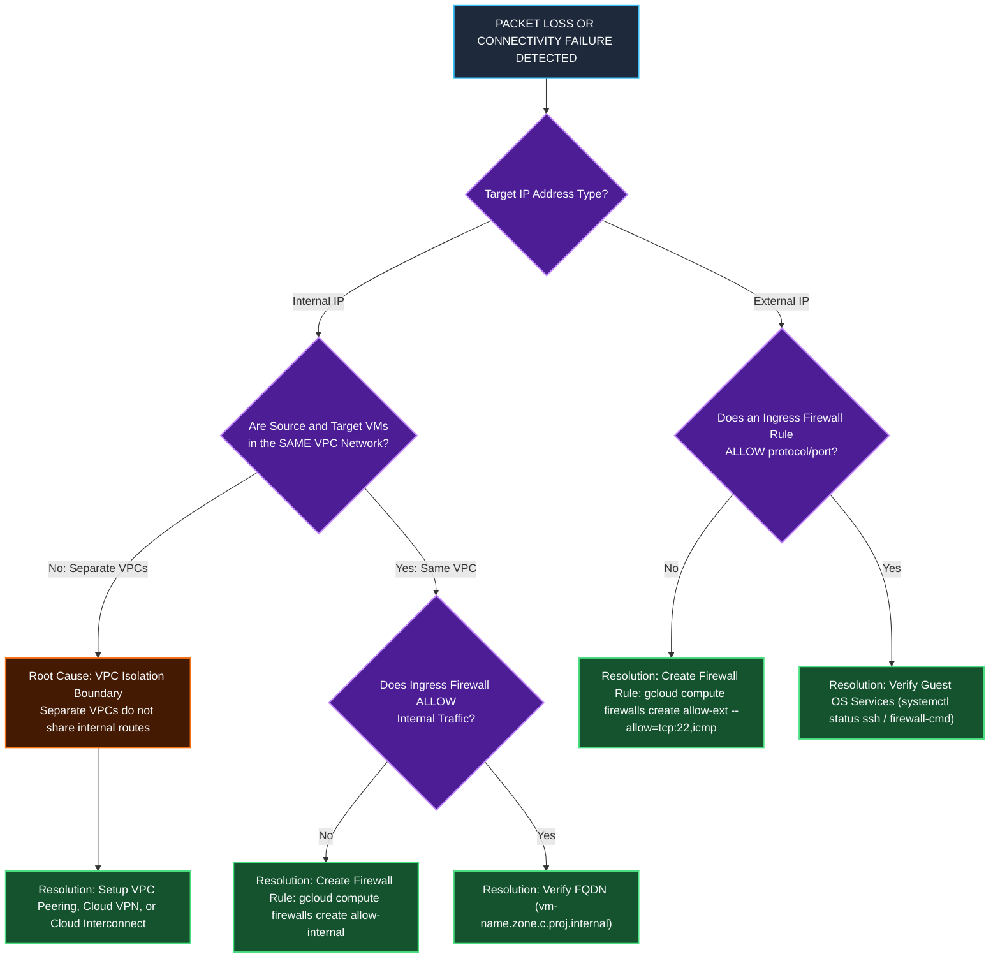

# Operations, Diagnostic Commands & Troubleshooting Manual

This document provides a comprehensive CLI manual (`gcloud compute`), diagnostic verification workflows using **Network Intelligence Center Connectivity Tests**, **VPC Flow Logs**, **Packet Mirroring**, and a **Troubleshooting Error Matrix** for GCP VPC networks.

---

## 1. Exhaustive CLI Command Reference (`gcloud compute`)

### 1.1 VPC Network Management

```bash
# 1. List all VPC networks in the active project
gcloud compute networks list

# 2. Describe details of a specific VPC network (e.g. mynetwork)
gcloud compute networks describe mynetwork

# 3. Create a Custom Mode VPC Network
gcloud compute networks create privatenet --subnet-mode=custom

# 4. Convert an Auto Mode VPC Network to Custom Mode
gcloud compute networks update mynetwork --switch-to-custom-mode

# 5. Delete a VPC Network (Fails if instances or subnets are actively bound)
gcloud compute networks delete default --quiet
```

### 1.2 Subnet Management

```bash
# 1. Create a Subnet in a Custom Network
gcloud compute networks subnets create privatesubnet-us \
    --network=privatenet \
    --region=us-central1 \
    --range=172.16.0.0/24

# 2. List all subnetworks sorted by parent network
gcloud compute networks subnets list --sort-by=NETWORK

# 3. Expand a Subnet CIDR block zero-downtime (e.g. expand /24 to /20)
gcloud compute networks subnets expand-ip-range privatesubnet-us \
    --region=us-central1 \
    --prefix-length=20
```

### 1.3 Firewall Rule Management

```bash
# 1. List all active firewall rules in the project
gcloud compute firewalls list

# 2. Create an Ingress Firewall Rule allowing ICMP, SSH (22), and RDP (3389)
gcloud compute firewalls create mynetwork-allow-icmp-ssh-rdp \
    --network=mynetwork \
    --allow=icmp,tcp:22,tcp:3389 \
    --source-ranges=0.0.0.0/0 \
    --priority=1000

# 3. Create a Targeted Ingress Firewall Rule using Network Tags
gcloud compute firewalls create allow-web-ingress \
    --network=mynetwork \
    --allow=tcp:80,tcp:443 \
    --target-tags=web-server \
    --source-ranges=0.0.0.0/0

# 4. Delete Default Firewall Rules
gcloud compute firewalls delete default-allow-icmp default-allow-ssh default-allow-rdp default-allow-internal --quiet
```

### 1.4 VM Instance Creation with Network Binding

```bash
# 1. Create a VM in a specific Subnet and Zone
gcloud compute instances create mynet-us-vm \
    --zone=us-central1-c \
    --machine-type=e2-micro \
    --subnet=mynetwork

# 2. Describe Instance Network Interface & IP Allocations
gcloud compute instances describe mynet-us-vm --zone=us-central1-c --format="get(networkInterfaces)"
```

---

## 2. Diagnostics with Network Intelligence Center Connectivity Tests

GCP provides **Connectivity Tests** to statically and dynamically analyze packet paths without sending live traffic.

```bash
# 1. Create a Connectivity Test between two VMs across VPC networks
gcloud compute network-management connectivity-tests create cross-vpc-test \
    --source-instance=projects/PROJECT_ID/zones/us-central1-c/instances/mynet-us-vm \
    --destination-instance=projects/PROJECT_ID/zones/us-central1-c/instances/managementnet-us-vm \
    --protocol=ICMP

# 2. Run and view test evaluation results
gcloud compute network-management connectivity-tests run cross-vpc-test

# Expected Output Result:
# Result: DROPPED
# Drop Cause: NO_ROUTE
# Explanation: Packet dropped at source virtual router. No route found from network 'mynetwork' to IP 10.130.0.2.
```

---

## 3. VPC Flow Logs & Packet Mirroring Setup

### 3.1 Enabling VPC Flow Logs on a Subnet

```bash
# Enable VPC Flow Logs with 50% sample rate to monitor packet drops and latency
gcloud compute networks subnets update privatesubnet-us \
    --region=us-central1 \
    --enable-flow-logs \
    --logging-aggregation-interval=interval-5-sec \
    --logging-flow-sampling=0.5 \
    --logging-metadata=include-all
```

### 3.2 Setting Up Packet Mirroring for Intrusion Detection (IDS)

```bash
# Mirror all traffic on privatesubnet-us to an IDS Collector VM instance
gcloud compute packet-mirrorings create ids-mirroring \
    --region=us-central1 \
    --network=privatenet \
    --collector-ilb=projects/PROJECT_ID/regions/us-central1/forwardingRules/ids-ilb-rule \
    --mirrored-subnets=privatesubnet-us
```

---

## 4. Troubleshooting Decision Flowchart & Error Matrix



### Technical Error Diagnostic Matrix

| Symptom / Failure | Root Cause | Verification Command | Resolution Strategy |
| :--- | :--- | :--- | :--- |
| **`No more networks available`** during VM creation. | Default or target VPC network was deleted from project. | `gcloud compute networks list` | Create a custom VPC network (`gcloud compute networks create`) before launching instances. |
| **100% Packet Loss** when pinging internal IP across different VPCs. | VPC networks are isolated routing domains by default. | `gcloud compute networks describe <net>` | Set up **VPC Network Peering**, **Cloud VPN**, or **Cloud Interconnect** between the VPCs. |
| **SSH Timeout (`Connection timed out: port 22`)** via public IP. | Missing Ingress firewall rule allowing TCP 22 from `0.0.0.0/0` or `35.235.240.0/20` (IAP). | `gcloud compute firewalls list --filter="network=mynetwork"` | Create ingress firewall rule: `gcloud compute firewalls create allow-ssh --allow=tcp:22`. |
| **Ping succeeds via IP but fails via VM Name (`Name or service not known`)**. | Attempting to ping VM name across different subnets or unpeered VPC DNS domains. | `nslookup <vm-name>` inside VM | Use Fully Qualified Domain Name (FQDN): `<vm-name>.<zone>.c.<project-id>.internal`. |
| **Subnet Expansion Error**: `Invalid IP range`. | Attempted to shrink CIDR mask (e.g. `/20` to `/24`) or overlap existing subnets. | `gcloud compute networks subnets list` | CIDR expansion is **one-way only**. Only smaller prefix lengths (larger IP blocks) are allowed. |

---

## Related Workspace Documents

- [Case Study Index](file:///home/btpl-lap-22/live/gcd/vpc-network/casestudy/README.md)
- [High-Level Architecture (HLD)](file:///home/btpl-lap-22/live/gcd/vpc-network/casestudy/hld-architecture.md)
- [Low-Level Packet Lifecycle (LLD)](file:///home/btpl-lap-22/live/gcd/vpc-network/casestudy/lld-packet-lifecycle.md)
- [Stateful Firewall Deep Dive](file:///home/btpl-lap-22/live/gcd/vpc-network/casestudy/firewall-deep-dive.md)
- [Compute & Network Integration](file:///home/btpl-lap-22/live/gcd/vpc-network/casestudy/compute-network-integration.md)
