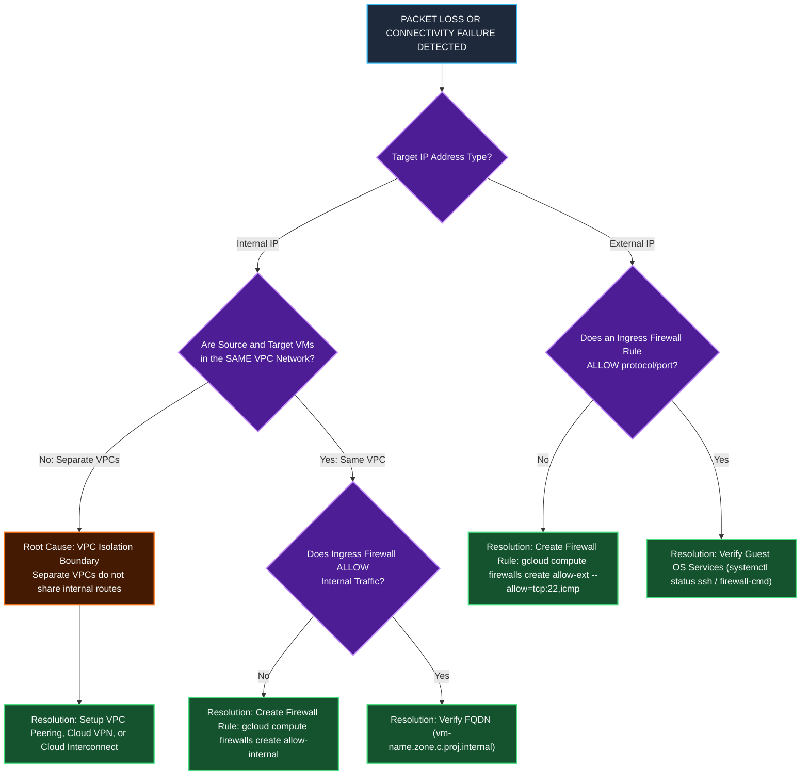

# Operations, Diagnostic Commands & Troubleshooting Manual

This document provides a comprehensive CLI manual (`gcloud compute`), detailed parameter-by-parameter technical definitions and rationale, diagnostic verification workflows using **Network Intelligence Center Connectivity Tests**, **VPC Flow Logs**, **Packet Mirroring**, and a **Troubleshooting Error Matrix** for GCP VPC networks.

---

## 1. Deep-Dive CLI Command Reference (`gcloud compute`)

### 1.1 VPC Network Management (`gcloud compute networks`)

#### Command: Create Custom Mode VPC Network
```bash
gcloud compute networks create privatenet \
    --subnet-mode=custom \
    --bgp-routing-mode=global \
    --mtu=1460 \
    --description="Enterprise Production Custom Mode VPC Network"
```

##### Parameter Breakdown & Technical Rationale:

| Parameter / Flag | Type | Definition & Purpose | Default Value | Technical Rationale & Impact |
| :--- | :--- | :--- | :--- | :--- |
| `privatenet` | Positional | **VPC Network Name**: Unique identifier string. Must comply with RFC 1035 (`[a-z]([-a-z0-9]*[a-z0-9])?`, 1-63 chars). | *Required* | Serves as the primary administrative handle for the global virtual router domain and firewall container. |
| `--subnet-mode` | Option | **Subnet Creation Mode**: Accepts `auto` or `custom`. | `auto` | `custom` mode creates zero subnets initially. Required in production to prevent IP CIDR overlaps during multi-cloud or VPC Peering setups. |
| `--bgp-routing-mode` | Option | **Dynamic BGP Scope**: Accepts `regional` or `global`. | `regional` | Controls how Cloud Routers propagate learned BGP routes. `global` advertises dynamic routes across all GCP regions globally via the B4 WAN backbone. |
| `--mtu` | Option | **Maximum Transmission Unit**: Integer bytes (`1460`, `1500`, `8850`). | `1460` | Sets packet payload size limit. Setting `8850` enables Jumbo Frames for high-throughput big data / HPC intra-VPC transfers. |
| `--description` | Option | **Metadata Description**: Arbitrary text string describing purpose. | *None* | Essential for enterprise governance, auditing, and infrastructure-as-code tracking. |

---

#### Command: Convert Auto Mode to Custom Mode Network
```bash
gcloud compute networks update mynetwork --switch-to-custom-mode
```

##### Parameter Breakdown & Technical Rationale:

| Parameter / Flag | Type | Definition & Purpose | Default Value | Technical Rationale & Impact |
| :--- | :--- | :--- | :--- | :--- |
| `mynetwork` | Positional | **Target Network Name**: The auto-mode network to modify. | *Required* | Identifies the target network resource. |
| `--switch-to-custom-mode` | Flag | **Mode Conversion Switch**: Converts subnet creation mode from Auto to Custom. | *None* | **Irreversible Operation**. Allows individual subnet deletion and custom range additions without destroying existing workloads or IPs. |

---

#### Command: Delete VPC Network
```bash
gcloud compute networks delete default --quiet
```

##### Parameter Breakdown & Technical Rationale:

| Parameter / Flag | Type | Definition & Purpose | Default Value | Technical Rationale & Impact |
| :--- | :--- | :--- | :--- | :--- |
| `default` | Positional | **Target Network Name**: The VPC network to delete. | *Required* | Target network resource identifier. |
| `--quiet` / `-q` | Flag | **Non-Interactive Execution**: Suppresses user confirmation prompts. | Interactive | Essential for automated CI/CD cleanup pipelines (Terraform / Bash scripts). |

---

### 1.2 Subnet Management (`gcloud compute networks subnets`)

#### Command: Create Custom Subnet
```bash
gcloud compute networks subnets create privatesubnet-us \
    --network=privatenet \
    --region=us-central1 \
    --range=172.16.0.0/24 \
    --enable-private-ip-google-access \
    --enable-flow-logs \
    --logging-flow-sampling=0.5 \
    --purpose=PRIVATE
```

##### Parameter Breakdown & Technical Rationale:

| Parameter / Flag | Type | Definition & Purpose | Default Value | Technical Rationale & Impact |
| :--- | :--- | :--- | :--- | :--- |
| `privatesubnet-us` | Positional | **Subnet Resource Name**: RFC 1035 compliant string. | *Required* | Identifies the regional subnetwork. |
| `--network` | Option | **Parent VPC Container**: Name of target VPC network. | *Required* | Binds the subnetwork CIDR block strictly to a single VPC routing table domain. |
| `--region` | Option | **GCP Region Placement**: Target geographical region (e.g. `us-central1`). | *Required* | Subnets are regional resources; a single subnet spans all availability zones in that region. |
| `--range` | Option | **IPv4 CIDR Block**: Primary IP address allocation (e.g. `172.16.0.0/24`). | *Required* | Defines available private IP pool. Must follow RFC 1918 rules (min `/29`, max `/8`). |
| `--enable-private-ip-google-access` | Flag | **Private Google Access**: Enables internal API connectivity. | `Disabled` | Allows VMs with **internal IP addresses only** to reach Google APIs (`storage.googleapis.com`, `bigquery.googleapis.com`) without public IPs. |
| `--enable-flow-logs` | Flag | **VPC Flow Logs**: Enables network telemetry logging. | `Disabled` | Captures 5-tuple flow records for security telemetry, auditing, and latency tracking. |
| `--logging-flow-sampling` | Option | **Flow Sampling Rate**: Float value from `0.0` (0%) to `1.0` (100%). | `0.5` (50%) | Controls log volume cost vs analytics accuracy. `0.5` samples 50% of network flows. |
| `--purpose` | Option | **Subnet Intended Purpose**: `PRIVATE` or `REGIONAL_MANAGED_PROXY`. | `PRIVATE` | `REGIONAL_MANAGED_PROXY` creates proxy-only subnets required for Envoy Application Load Balancers. |

---

#### Command: Zero-Downtime Subnet Expansion
```bash
gcloud compute networks subnets expand-ip-range privatesubnet-us \
    --region=us-central1 \
    --prefix-length=20
```

##### Parameter Breakdown & Technical Rationale:

| Parameter / Flag | Type | Definition & Purpose | Default Value | Technical Rationale & Impact |
| :--- | :--- | :--- | :--- | :--- |
| `privatesubnet-us` | Positional | **Target Subnet Name**: Subnet to expand. | *Required* | Target subnet identifier. |
| `--region` | Option | **Subnet Region**: Geographical region of target subnet. | *Required* | Required to locate regional subnet resource. |
| `--prefix-length` | Option | **New CIDR Prefix**: Smaller netmask number (e.g. expanding `/24` to `/20`). | *Required* | **One-way expansion**. Expands IP capacity dynamically without restarting VMs or destroying existing IP bindings. |

---

### 1.3 Firewall Rule Management (`gcloud compute firewalls`)

#### Command: Create Targeted Ingress Firewall Rule
```bash
gcloud compute firewalls create mynetwork-allow-icmp-ssh-rdp \
    --network=mynetwork \
    --direction=INGRESS \
    --priority=1000 \
    --action=ALLOW \
    --rules=icmp,tcp:22,tcp:3389 \
    --source-ranges=0.0.0.0/0 \
    --target-tags=web-server \
    --description="Allow Ingress ICMP, SSH, and RDP for Web Servers"
```

##### Parameter Breakdown & Technical Rationale:

| Parameter / Flag | Type | Definition & Purpose | Default Value | Technical Rationale & Impact |
| :--- | :--- | :--- | :--- | :--- |
| `mynetwork-allow-...` | Positional | **Firewall Rule Name**: Unique rule identifier. | *Required* | System handle for the firewall policy entry. |
| `--network` | Option | **Parent VPC Network**: Target VPC network. | `default` | Binds rule evaluation engine to all host hypervisors supporting instances in that VPC. |
| `--direction` | Option | **Traffic Flow Direction**: `INGRESS` (inbound) or `EGRESS` (outbound). | `INGRESS` | `INGRESS` filters incoming traffic; `EGRESS` filters outgoing traffic relative to vNIC interface. |
| `--priority` | Option | **Evaluation Priority**: Integer integer between `0` and `65535`. | `1000` | Rules are evaluated sequentially from lowest integer (`0`) to highest (`65535`). First match terminates evaluation. |
| `--action` | Option | **Match Action**: `ALLOW` or `DENY`. | `ALLOW` | Specifies whether matching packets are permitted (`ALLOW`) or dropped instantly (`DENY`). |
| `--rules` | Option | **Protocols & Ports**: Comma-separated specs (`icmp`, `tcp:22`, `udp:53`, `all`). | *Required* | Specifies transport protocols and destination port ranges allowed or denied by rule. |
| `--source-ranges` | Option | **Source CIDR Filters**: IPv4/IPv6 source networks (`0.0.0.0/0`, `35.235.240.0/20`). | *Required (Ingress)* | Restricts packet entry based on sender's origin IP address block. |
| `--target-tags` | Option | **Target Network Tags**: Comma-separated string labels (`web-server`). | *All Instances* | Enables micro-segmentation by restricting rule enforcement strictly to VMs carrying matching tags. |

---

### 1.4 VM Instance Provisioning (`gcloud compute instances`)

#### Command: Create Compute Engine VM Instance
```bash
gcloud compute instances create mynet-us-vm \
    --zone=us-central1-c \
    --machine-type=e2-micro \
    --subnet=privatesubnet-us \
    --no-address \
    --can-ip-forward \
    --tags=web-server \
    --service-account=app-sa@project-id.iam.gserviceaccount.com \
    --scopes=cloud-platform
```

##### Parameter Breakdown & Technical Rationale:

| Parameter / Flag | Type | Definition & Purpose | Default Value | Technical Rationale & Impact |
| :--- | :--- | :--- | :--- | :--- |
| `mynet-us-vm` | Positional | **Instance Name**: VM hostname and resource ID. | *Required* | Used for internal DNS resolution (`mynet-us-vm.zone.c.proj.internal`). |
| `--zone` | Option | **Target Zone**: Availability zone (e.g. `us-central1-c`). | *Default Zone* | Defines physical data center placement for fault tolerance. |
| `--machine-type` | Option | **Hardware Spec**: vCPU, memory, and max network bandwidth spec. | `n1-standard-1` | `e2-micro` provides shared vCPU for low-cost testing. Machine size dictates max vNIC bandwidth (e.g., 2 Gbps/vCPU). |
| `--subnet` | Option | **Subnet Binding**: Target subnetwork for `nic0`. | `default` | Connects VM interface to a specific subnetwork, assigning an internal RFC 1918 IP address. |
| `--no-address` | Flag | **Suppress Public IP**: Prevents External IP allocation. | *Ephemeral Assigned* | **Hardens security posture** by eliminating public internet attack surfaces; VM only possesses an internal IP. |
| `--can-ip-forward` | Flag | **IP Forwarding Switch**: Enables `canIpForward=true`. | `Disabled` | **Mandatory for NAT Gateways / NVAs**. Allows VM hypervisor tap to transmit packets with non-matching source IP headers. |
| `--tags` | Option | **Network Tags**: Instance string labels (`web-server`). | *None* | Attaches network metadata used by targeted firewall rules and custom route filters. |
| `--service-account` | Option | **IAM Service Account**: Identity attached to VM. | *Default SA* | Assigns fine-grained IAM identity used for identity-based firewall rules and GCP API authentication. |
| `--scopes` | Option | **API Access Scopes**: OAuth authorization scopes (`cloud-platform`). | *Default Scopes* | `cloud-platform` delegates full API access management to IAM roles attached to the Service Account. |

---

## 2. Observability & Diagnostics Manual

### 2.1 Network Intelligence Center Connectivity Tests

```bash
gcloud compute network-management connectivity-tests create cross-vpc-test \
    --source-instance=projects/PROJECT_ID/zones/us-central1-c/instances/mynet-us-vm \
    --destination-instance=projects/PROJECT_ID/zones/us-central1-c/instances/managementnet-us-vm \
    --protocol=ICMP
```

##### Parameter Breakdown & Technical Rationale:

| Parameter / Flag | Type | Definition & Purpose | Technical Rationale & Impact |
| :--- | :--- | :--- | :--- |
| `cross-vpc-test` | Positional | **Test Name**: Unique identifier for the diagnostic test resource. | Used to reference and rerun the test via CLI or Cloud Console. |
| `--source-instance` | Option | **Origin VM Path**: Full GCP resource path of sending VM. | Specifies packet origin for Andromeda graph analysis. |
| `--destination-instance` | Option | **Destination VM Path**: Full GCP resource path of target VM. | Specifies packet destination for graph analysis. |
| `--protocol` | Option | **Transport Protocol**: `ICMP`, `TCP`, or `UDP`. | Dictates which protocol matching rules to evaluate in Andromeda flow tables. |

---

### 2.2 Packet Mirroring for Intrusion Detection (IDS)

```bash
gcloud compute packet-mirrorings create ids-mirroring \
    --region=us-central1 \
    --network=privatenet \
    --collector-ilb=projects/PROJECT_ID/regions/us-central1/forwardingRules/ids-ilb-rule \
    --mirrored-subnets=privatesubnet-us
```

##### Parameter Breakdown & Technical Rationale:

| Parameter / Flag | Type | Definition & Purpose | Technical Rationale & Impact |
| :--- | :--- | :--- | :--- |
| `ids-mirroring` | Positional | **Policy Name**: Name of the packet mirroring policy. | Resource handle for packet capture rule. |
| `--region` | Option | **Policy Region**: Regional placement of packet collector. | Packet mirroring is regional; collector ILB must reside in same region. |
| `--network` | Option | **Target VPC Network**: Parent VPC being monitored. | Scopes packet mirroring configuration to target VPC domain. |
| `--collector-ilb` | Option | **Collector Forwarding Rule**: Internal Load Balancer IP. | Routes exact copies of payload traffic to IDS/IPS packet inspection virtual appliances. |
| `--mirrored-subnets` | Option | **Source Subnets**: Subnetworks to capture traffic from. | Mirrors 100% of ingress/egress traffic on specified subnets without impacting production VM performance. |

---

## 3. Troubleshooting Decision Flowchart & Error Matrix



### Technical Error Diagnostic Matrix

| Symptom / Failure | Root Cause | Verification Command | Resolution Strategy |
| :--- | :--- | :--- | :--- |
| **`No more networks available`** during VM creation. | Default or target VPC network was deleted from project. | `gcloud compute networks list` | Create a custom VPC network (`gcloud compute networks create`) before launching instances. |
| **100% Packet Loss** when pinging internal IP across different VPCs. | VPC networks are isolated routing domains by default. | `gcloud compute networks describe <net>` | Set up **VPC Network Peering**, **Cloud VPN**, or **Cloud Interconnect** between the VPCs. |
| **SSH Timeout (`Connection timed out: port 22`)** via public IP. | Missing Ingress firewall rule allowing TCP 22 from `0.0.0.0/0` or `35.235.240.0/20` (IAP). | `gcloud compute firewalls list --filter="network=mynetwork"` | Create ingress firewall rule: `gcloud compute firewalls create allow-ssh --allow=tcp:22`. |
| **Ping succeeds via IP but fails via VM Name (`Name or service not known`)**. | Attempting to ping VM name across different subnets or unpeered VPC DNS domains. | `nslookup <vm-name>` inside VM | Use Fully Qualified Domain Name (FQDN): `<vm-name>.<zone>.c.<project-id>.internal`. |
| **Subnet Expansion Error**: `Invalid IP range`. | Attempted to shrink CIDR mask (e.g. `/20` to `/24`) or overlap existing subnets. | `gcloud compute networks subnets list` | CIDR expansion is **one-way only**. Only smaller prefix lengths (larger IP blocks) are allowed. |

---

## Related Workspace Documents

- [Case Study Index](file:///home/btpl-lap-22/live/gcd/vpc-network/casestudy/README.md)
- [High-Level Architecture (HLD)](file:///home/btpl-lap-22/live/gcd/vpc-network/casestudy/hld-architecture.md)
- [Low-Level Packet Lifecycle (LLD)](file:///home/btpl-lap-22/live/gcd/vpc-network/casestudy/lld-packet-lifecycle.md)
- [Stateful Firewall Deep Dive](file:///home/btpl-lap-22/live/gcd/vpc-network/casestudy/firewall-deep-dive.md)
- [Compute & Network Integration](file:///home/btpl-lap-22/live/gcd/vpc-network/casestudy/compute-network-integration.md)
