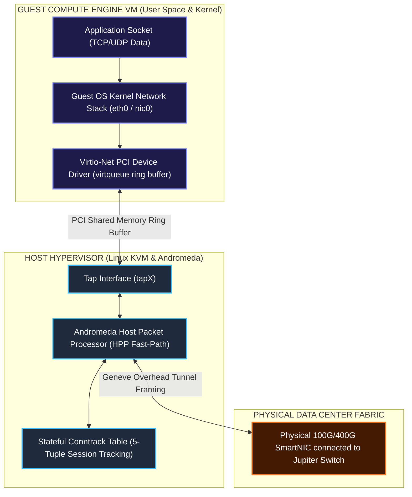
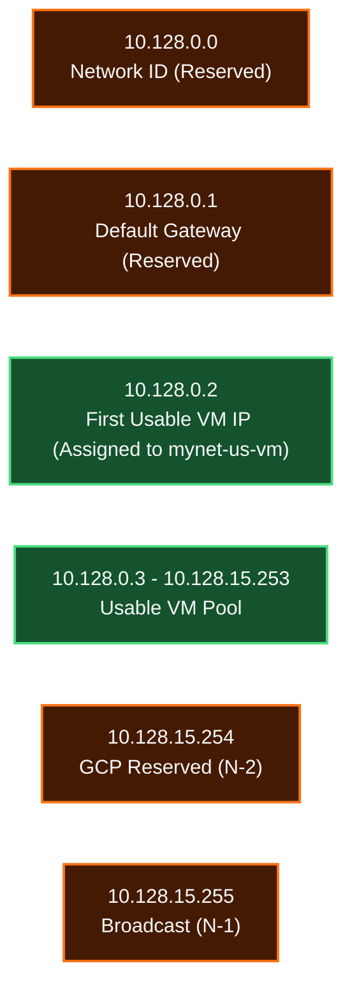
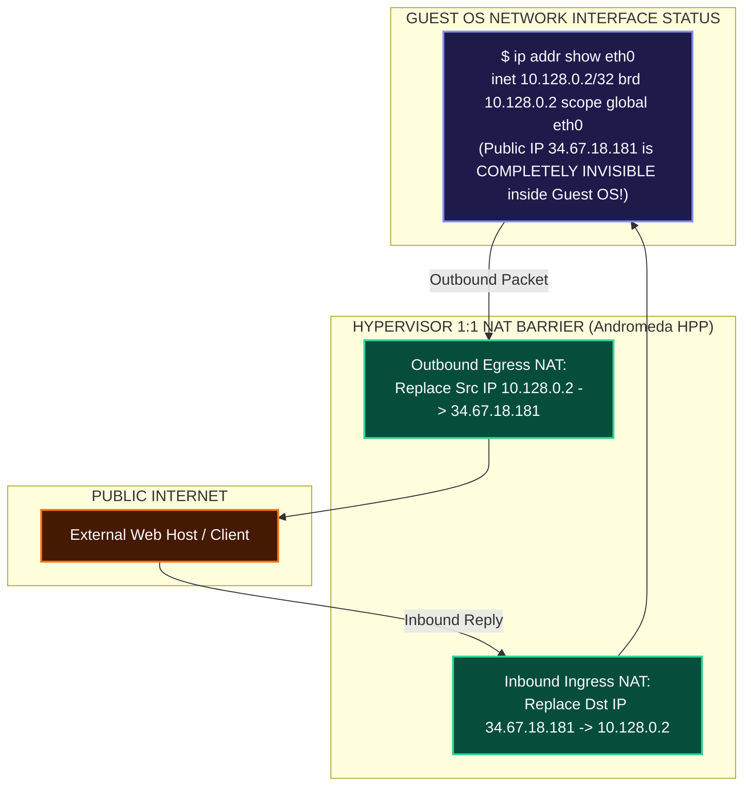
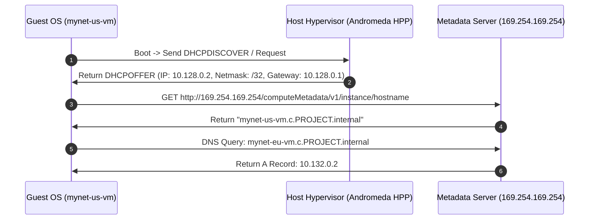
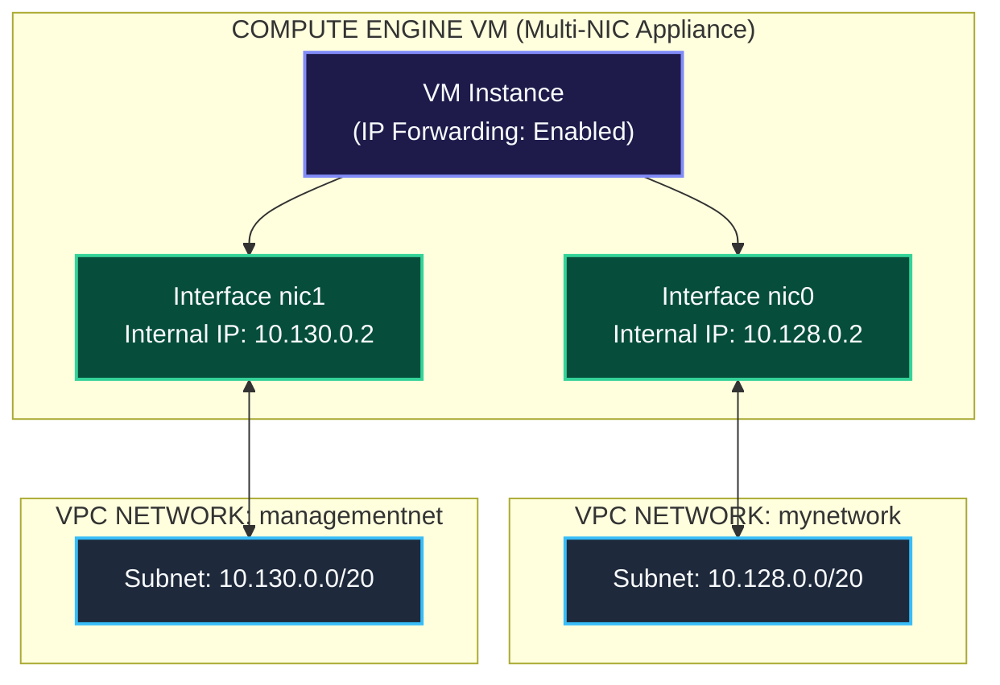

# Compute Engine & VPC Network Integration Mechanics

This document details how Compute Engine Virtual Machines (VMs) physically and logically integrate with Google Cloud VPC networks, hypervisor tap interfaces, subnets, internal DHCP/DNS services, 1:1 NAT transparency, and the **GCP Metadata Server (`169.254.169.254`)**.

---

## 1. Physical & Hypervisor Integration Architecture

When a Compute Engine VM is launched, the hypervisor allocates a virtual PCI Ethernet device (**virtio-net**) inside the guest instance and binds it to a software tap interface on the host.

---

## 2. Subnet Binding & The 4 Reserved Subnet IP Addresses

When a VM is placed in a subnetwork (e.g. `mynet-us-vm` in `10.128.0.0/20`), GCP assigns it a private RFC 1918 IPv4 address from that subnet's available block.

### Subnet IP Reservation Matrix (Example: `10.128.0.0/20`)

Every GCP subnetwork reserves **4 IP addresses**:

| IP Address | Role / Function | Description |
| :--- | :--- | :--- |
| `10.128.0.0` | **Network ID** | Identifies the start of the subnet CIDR block. |
| `10.128.0.1` | **Default Gateway** | Virtual Subnet Gateway routing traffic to other subnets or `0.0.0.0/0`. |
| `10.128.15.254` | **GCP Internal Reserved (`N-2`)** | Reserved by Google Cloud for infrastructure services and future capabilities. |
| `10.128.15.255` | **Broadcast Address (`N-1`)** | Reserved for subnet broadcast address. |

> **First Usable VM IP**: Because `.0` and `.1` are reserved, the first dynamically allocated internal IP address for a VM in any GCP subnet is **`.2`** (e.g., `10.128.0.2` for `mynet-us-vm` and `10.132.0.2` for `mynet-eu-vm`).

---

## 3. Hypervisor 1:1 NAT Transparency Mechanics

Compute Engine instances assigned a public External IP address (e.g., `34.67.18.181`) do **NOT** have this public IP configured directly on their OS kernel interface (`eth0`).

### Architectural Benefits of 1:1 NAT Transparency:
1. **Zero OS Reconfiguration**: Promotes seamless instance migration and snapshotting without editing guest network configuration files (`/etc/netplan` or `/etc/sysconfig/network-scripts`).
2. **Simplified IP Binding**: Applications inside the container or VM bind directly to `0.0.0.0` or `10.128.0.2` without requiring complex public IP interface bindings.

---

## 4. Metadata Server Magic IP (`169.254.169.254`) & Internal DHCP/DNS

Every Compute Engine VM relies on the **GCP Metadata Server** located at the link-local IPv4 address `169.254.169.254` (and IPv6 link-local `fe80::a60:8000:0:1`).

### Key Services Provided by `169.254.169.254`:
1. **Virtual Internal DHCP**: Andromeda intercepts guest DHCP requests and issues a static `/32` IP lease to `eth0` with default gateway `10.128.0.1` and route pointing to `169.254.169.254` for local resolution.
2. **Network-Scoped Zonal DNS Server**: Resolves internal instance names (`mynet-eu-vm.c.PROJECT.internal` $\rightarrow$ `10.132.0.2`). Scoped strictly to the specific VPC network domain.
3. **Instance Identity & Service Account Credentials**: Provides OAuth2 tokens for service accounts attached to the VM instance (`GET /computeMetadata/v1/instance/service-accounts/default/token`).

---

## 5. Multi-NIC Architecture (Connecting VMs to Multiple VPCs)

Compute Engine VMs can be configured with up to **8 Virtual Network Interfaces (`nic0` through `nic7`)**, allowing a single instance to connect directly to multiple distinct VPC networks.

### Multi-NIC Rules & Constraints:
- **Interface Creation Time**: Network interfaces (`nic0`, `nic1`...) MUST be added when the VM instance is **created**. You cannot attach or detach a vNIC to/from an existing VM while running.
- **VPC Isolation Maintenance**: Each vNIC connects to a completely separate VPC network. The GCP hypervisor does **NOT** route traffic between `nic0` and `nic1` automatically; routing between interfaces requires explicitly configuring IP forwarding (`canIpForward=true`) and guest OS kernel routing tables (`sysctl net.ipv4.ip_forward=1`).

---

## Related Workspace Documents

- [Case Study Index](file:///home/btpl-lap-22/live/gcd/vpc-network/casestudy/README.md)
- [High-Level Architecture (HLD)](file:///home/btpl-lap-22/live/gcd/vpc-network/casestudy/hld-architecture.md)
- [Low-Level Packet Lifecycle (LLD)](file:///home/btpl-lap-22/live/gcd/vpc-network/casestudy/lld-packet-lifecycle.md)
- [Stateful Firewall Deep Dive](file:///home/btpl-lap-22/live/gcd/vpc-network/casestudy/firewall-deep-dive.md)
