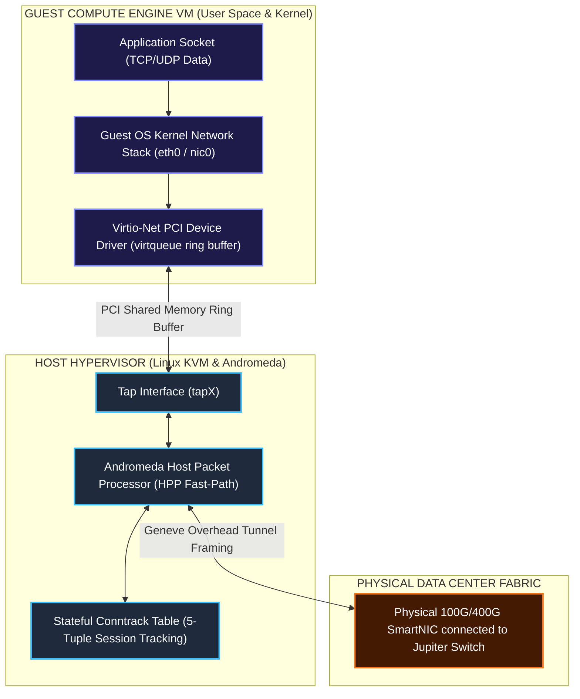
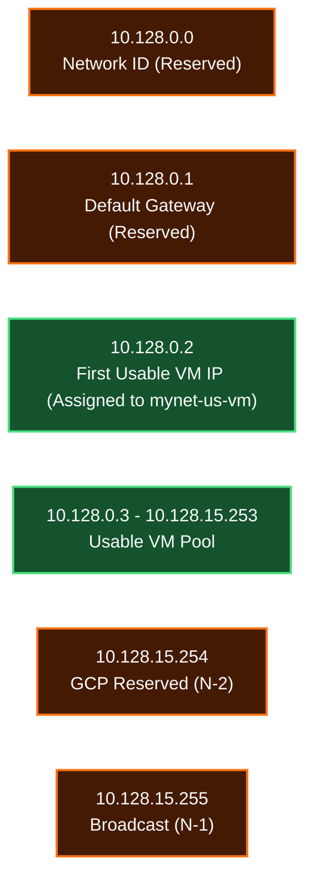
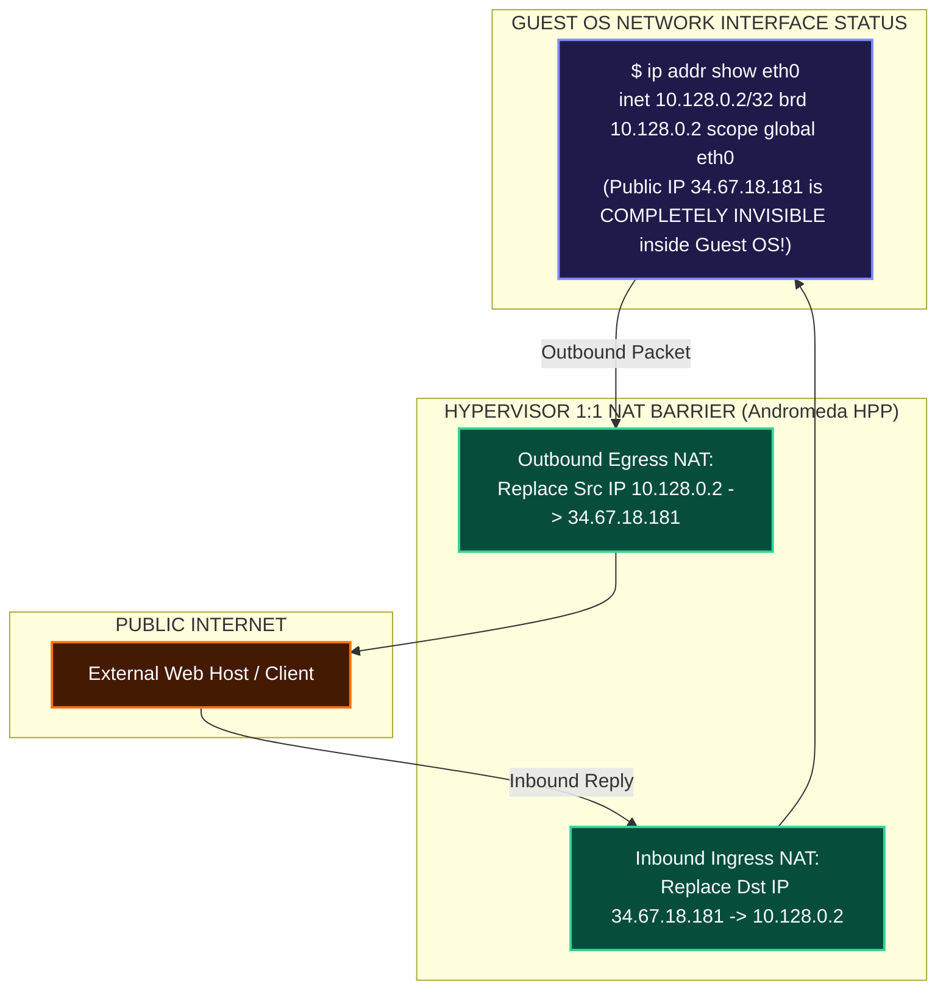
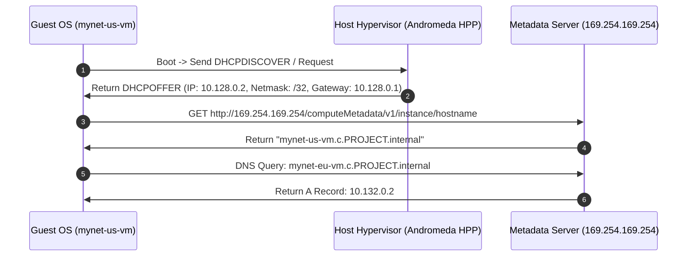
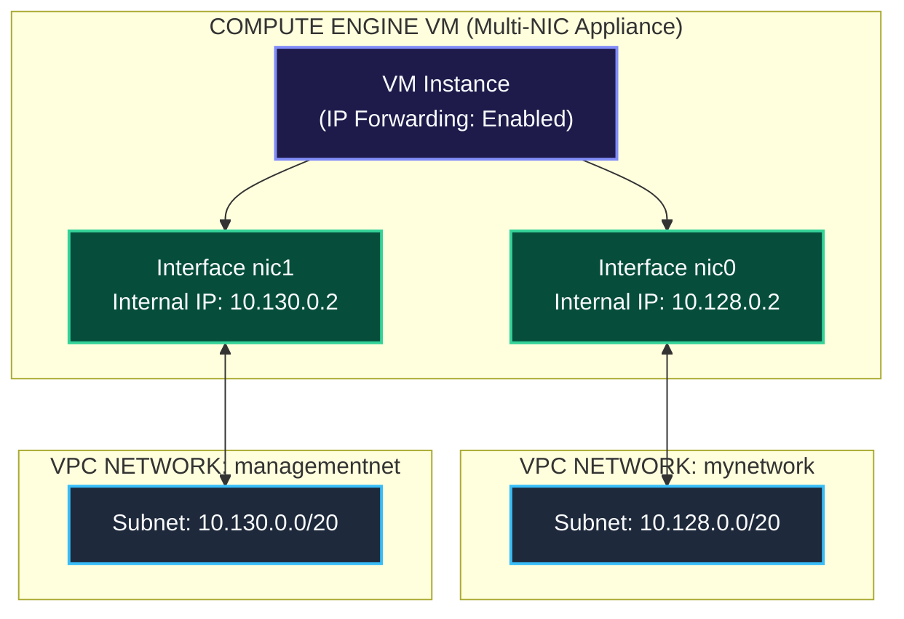
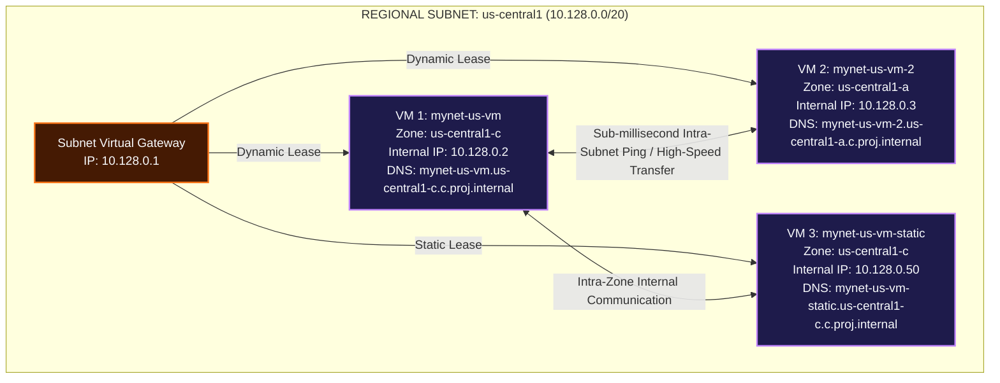

# Compute Engine & VPC Network Integration Mechanics

This document details how Compute Engine Virtual Machines (VMs) physically and logically integrate with Google Cloud VPC networks, hypervisor tap interfaces, subnets, internal DHCP/DNS services, 1:1 NAT transparency, the **GCP Metadata Server (`169.254.169.254`)**, and how to configure multiple instances on the same network.

---

## 1. Physical & Hypervisor Integration Architecture

When a Compute Engine VM is launched, the hypervisor allocates a virtual PCI Ethernet device (**virtio-net**) inside the guest instance and binds it to a software tap interface on the host.



---

## 2. Subnet Binding & The 4 Reserved Subnet IP Addresses

When a VM is placed in a subnetwork (e.g. `mynet-us-vm` in `10.128.0.0/20`), GCP assigns it a private RFC 1918 IPv4 address from that subnet's available block.

### Subnet IP Reservation Matrix (Example: `10.128.0.0/20`)

Every GCP subnetwork reserves **4 IP addresses**:

| IP Address | Role / Function | Description |
| :--- | :--- | :--- |
| `10.128.0.0` | **Network ID** | Identifies the start of the subnet CIDR block. |
| `10.128.0.1` | **Default Gateway** | Virtual Subnet Gateway routing traffic to other subnets or `0.0.0.0/0`. |
| `10.128.15.254` | **GCP Internal Reserved (`N-2`)** | Reserved by Google Cloud for infrastructure services and future capabilities. |
| `10.128.15.255` | **Broadcast Address (`N-1`)** | Reserved for subnet broadcast address. |



> **First Usable VM IP**: Because `.0` and `.1` are reserved, the first dynamically allocated internal IP address for a VM in any GCP subnet is **`.2`** (e.g., `10.128.0.2` for `mynet-us-vm` and `10.132.0.2` for `mynet-eu-vm`).

---

## 3. Hypervisor 1:1 NAT Transparency Mechanics

Compute Engine instances assigned a public External IP address (e.g., `34.67.18.181`) do **NOT** have this public IP configured directly on their OS kernel interface (`eth0`).



---

## 4. Metadata Server Magic IP (`169.254.169.254`) & Internal DHCP/DNS

Every Compute Engine VM relies on the **GCP Metadata Server** located at the link-local IPv4 address `169.254.169.254` (and IPv6 link-local `fe80::a60:8000:0:1`).



---

## 5. Multi-NIC Architecture (Connecting VMs to Multiple VPCs)

Compute Engine VMs can be configured with up to **8 Virtual Network Interfaces (`nic0` through `nic7`)**, allowing a single instance to connect directly to multiple distinct VPC networks.



---

## 6. How to Configure Multiple Instances on the Same VPC Network

To place multiple Compute Engine instances onto the same VPC network and subnetwork, you bind each instance's primary network interface (`nic0`) to the target network or subnet handle during creation.

### 6.1 CLI Workflow (`gcloud compute instances create`)

```bash
# Provision VM Instance 1 in us-central1-c on 'mynetwork'
gcloud compute instances create mynet-us-vm \
    --zone=us-central1-c \
    --machine-type=e2-micro \
    --network=mynetwork \
    --subnet=mynetwork

# Provision VM Instance 2 in us-central1-a on the SAME 'mynetwork' (Dynamic Internal IP)
gcloud compute instances create mynet-us-vm-2 \
    --zone=us-central1-a \
    --machine-type=e2-micro \
    --network=mynetwork \
    --subnet=mynetwork

# Provision VM Instance 3 in us-central1-c with a STATIC reserved Internal IP (10.128.0.50)
gcloud compute instances create mynet-us-vm-static \
    --zone=us-central1-c \
    --machine-type=e2-micro \
    --network=mynetwork \
    --subnet=mynetwork \
    --private-network-ip=10.128.0.50
```

### 6.2 GCP Console UI Workflow

1. Navigate to **Navigation Menu $\rightarrow$ Compute Engine $\rightarrow$ VM Instances**.
2. Click **Create Instance**.
3. Name the instance (e.g. `mynet-us-vm-2`) and select the desired **Region** and **Zone** (e.g., `us-central1` / `us-central1-a`).
4. Scroll down and expand **Advanced options $\rightarrow$ Networking**.
5. Under **Network interfaces**, click **default** to edit the interface:
   - Set **Network** to `mynetwork`.
   - Set **Subnetwork** to `mynetwork` (`10.128.0.0/20`).
   - Set **Primary internal IP** to `Automatic` (or `Custom` to reserve a static IP).
6. Click **Done**, then click **Create**. Repeat for subsequent instances.

### 6.3 Infrastructure as Code (Terraform)

```hcl
resource "google_compute_instance" "vm_instance_1" {
  name         = "mynet-us-vm-1"
  machine_type = "e2-micro"
  zone         = "us-central1-c"

  network_interface {
    network    = "mynetwork"
    subnetwork = "mynetwork"
  }
}

resource "google_compute_instance" "vm_instance_2" {
  name         = "mynet-us-vm-2"
  machine_type = "e2-micro"
  zone         = "us-central1-a"

  network_interface {
    network    = "mynetwork"
    subnetwork = "mynetwork"
  }
}
```

---

## 7. Architectural Benefits & Mechanics of Shared-VPC Instance Provisioning

Placing multiple VM instances into the same VPC network and subnetwork provides fundamental architectural advantages:



### Key Technical Reasons & Architectural Benefits:

1. **Zero-Cost Private Internal Communication**:
   - VMs on the same VPC network communicate privately via RFC 1918 internal IP addresses (`10.128.0.2` $\leftrightarrow$ `10.128.0.3`).
   - Intra-zone traffic over private IP is **$0.00/GB (Free)**, avoiding public internet bandwidth costs.

2. **Automatic Internal Zonal DNS Resolution**:
   - Every VM attached to the VPC automatically registers its hostname with the internal DNS server (`169.254.169.254`).
   - VMs ping or connect to each other by name (`ping mynet-us-vm-2`) without hardcoding IP addresses.

3. **Cross-Zone High Availability (HA) under One Subnet**:
   - GCP subnets are **Regional** and span **all Availability Zones** in that region.
   - You can place `mynet-us-vm` in `us-central1-c` and `mynet-us-vm-2` in `us-central1-a` under the *same* `10.128.0.0/20` subnet. This gives cross-zone data center redundancy while sharing a unified IP address space.

4. **Micro-Segmented Stateful Firewall Rules**:
   - Firewall rules defined for the network (e.g. `--source-ranges=10.128.0.0/9` or `--target-tags=web-server`) apply uniformly to all instances on that network.

5. **Private Load Balancing Target Pools**:
   - Multiple instances sharing a network can be pooled behind an **Internal Application Load Balancer (ILB)** or **Internal Network Load Balancer** to distribute application traffic across healthy backend VMs seamlessly.

---

## 8. Master Matrix: Connectivity Scopes (Same Network vs. Other Networks)

Understanding how networking behaves inside the **Same Network** versus across **Other Networks**—across Zonal, Regional, and Cross-Cloud/External boundaries—is critical for architecting secure and cost-optimized infrastructure in GCP.

### 8.1 Visual Topology of Connectivity Scopes

```mermaid
graph TD
    classDef sameVpc fill:#0F172A,stroke:#38BDF8,stroke-width:2px,color:#F8FAFC;
    classDef peerVpc fill:#1E1B4B,stroke:#818CF8,stroke-width:2px,color:#F8FAFC;
    classDef unpeerVpc fill:#450A0A,stroke:#F87171,stroke-width:2px,color:#F8FAFC;
    classDef hybrid fill:#451A03,stroke:#F97316,stroke-width:2px,color:#F8FAFC;
    classDef psc fill:#064E3B,stroke:#34D399,stroke-width:2px,color:#F8FAFC;

    subgraph SAME_VPC ["1. SAME NETWORK (GLOBAL VPC: mynetwork)"]
        subgraph REGION_US ["Region: us-central1"]
            subgraph ZONE_A ["Zone: us-central1-a"]
                VM_ZA1["VM 1: us-vm-1<br/>10.128.0.2"]:::sameVpc
                VM_ZA2["VM 2: us-vm-2<br/>10.128.0.3"]:::sameVpc
            end
            subgraph ZONE_C ["Zone: us-central1-c"]
                VM_ZC["VM 3: us-vm-3<br/>10.128.0.50"]:::sameVpc
            end
        end
        subgraph REGION_EU ["Region: europe-west1"]
            subgraph ZONE_EU ["Zone: europe-west1-b"]
                VM_EU["VM 4: eu-vm-1<br/>10.132.0.2"]:::sameVpc
            end
        end
    end

    subgraph OTHER_NETWORKS ["2. OTHER NETWORKS (CROSS-VPC / HYBRID / EXTERNAL)"]
        subgraph PEERED_VPC ["Peered VPC Network<br/>(partner-vpc: 172.16.0.0/16)"]
            VM_PEER["Peered VM<br/>172.16.0.5"]:::peerVpc
        end
        subgraph UNPEERED_VPC ["Unpeered VPC Network<br/>(isolated-vpc: 192.168.1.0/24)"]
            VM_UNPEER["Isolated VM<br/>192.168.1.10"]:::unpeerVpc
        end
        subgraph ON_PREM ["On-Premises / Hybrid Datacenter<br/>(10.200.0.0/16)"]
            ONPREM_SRV["On-Prem Server<br/>10.200.5.12"]:::hybrid
        end
        subgraph PSC_PRODUCER ["PSC Producer VPC<br/>(SaaS / Managed DB)"]
            PSC_EP["PSC NAT Endpoint<br/>10.128.0.250"]:::psc
        end
    end

    %% Same VPC connections
    VM_ZA1 <-->|Intra-Zone<br/>Internal IP ($0/GB)| VM_ZA2
    VM_ZA1 <-->|Cross-Zone Same Subnet<br/>Internal IP ($0.01/GB)| VM_ZC
    VM_ZA1 <-->|Cross-Region Diff Subnet<br/>Internal IP ($0.02-$0.05/GB)| VM_EU

    %% Other Network connections
    VM_ZA1 <-->|VPC Network Peering<br/>Direct Internal Routing| VM_PEER
    VM_ZA1 -.-x|UNPEERED CROSS-VPC<br/>Blocked by Default (ENETUNREACH)| VM_UNPEER
    VM_ZA1 <-->|Cloud VPN / Interconnect<br/>IPsec / BGP Fiber Tunnel| ONPREM_SRV
    VM_ZA1 -->|Private Service Connect<br/>1-Way Unidirectional NAT IP| PSC_EP
```

### 8.2 Comprehensive Scope Isolation Master Matrix Table

| Connectivity Scope | Network Scope | Zonal / Regional Boundary | Routing Mechanism & Path | Default Internal Connectivity (Ping / TCP) | Latency Profile | Data Transfer Egress Cost | Security & Isolation Enforcement |
|---|---|---|---|---|---|---|---|
| **Intra-Zone (Same Subnet)** | **Same VPC** Network | **Same Zone** (e.g., `us-central1-a` $\leftrightarrow$ `us-central1-a`) | Direct hypervisor-to-hypervisor encapsulation over local host physical switch | **ALLOWED** (Default subnet route `10.128.0.0/20` + ingress firewall check) | Ultra-Low (<0.5 ms) | **$0.00 / GB** (Free) | Enforced by stateful VPC Firewall rules on VM vNIC |
| **Cross-Zone (Same Subnet)** | **Same VPC** Network | **Cross-Zone / Same Region** (e.g., `us-central1-a` $\leftrightarrow$ `us-central1-c`) | Global VPC routing over regional datacenter fiber interconnects | **ALLOWED** (Subnets are regional; automatically spans all availability zones) | Very Low (<1 - 2 ms) | **$0.01 / GB** (Cross-zone fee) | Firewall target tags, service accounts, and IP ranges |
| **Cross-Region (Diff Subnets)** | **Same VPC** Network | **Cross-Region** (e.g., `us-central1` $\leftrightarrow$ `europe-west1`) | GCP Private Global B4 Fiber Backbone (No public internet encapsulation) | **ALLOWED** (Global VPC routes `10.132.0.0/20` exchanged automatically) | Distance dependent (20ms - 150ms WAN) | **$0.02 - $0.12 / GB** (Inter-region egress rate) | Global VPC Firewall policies evaluated at destination vNIC |
| **Unpeered Cross-VPC** | **Other VPC** Network | Any Zone / Any Region | **NO ROUTE EXISTS** (Source Andromeda drops packet at host level `ENETUNREACH`) | **BLOCKED (100% Loss)** over Internal IP; **ALLOWED** over External IP if allowed by ingress FW | Infinite (Packet dropped at source hypervisor) | N/A over Internal IP (Blocked) | Complete multi-tenant hard boundary isolation |
| **Peered Cross-VPC (VPC Peering)** | **Other VPC** Network | Any Zone / Any Region | Direct non-overlapping subnet route exchange between Andromeda SDN control planes | **ALLOWED** over RFC 1918 Internal IP (No intermediate gateway or proxy hop) | Same as Same-VPC Cross-Zone / Cross-Region | Standard Cross-Zone / Cross-Region egress fees (Peering link is free) | Administrative isolation; custom route export/import controls & firewalls |
| **Shared VPC (Host $\leftrightarrow$ Service)** | **Same Shared VPC** | Any Zone / Any Region | Native VPC routing; Service Projects attach vNICs directly to Host VPC subnets | **ALLOWED** as native internal traffic | Same as Same-VPC Intra/Cross Zone | Standard intra-VPC regional/zonal rates | Centralized Network Admin IAM control; granular subnet access via IAM |
| **Hybrid Cloud (VPN / Interconnect)** | **Other Network** (On-Prem / Multi-Cloud) | On-Premises Datacenter $\leftrightarrow$ GCP Region | Cloud VPN (IPsec IKEv2) or Cloud Interconnect (Private SLA Fiber + BGP Router) | **ALLOWED** over private IP via advertised BGP routes | VPN: 5-20ms WAN; Interconnect: Deterministic <5ms | Outbound Egress rate ($0.02 - $0.05/GB) + Attachment/Tunnel fee | Encrypted IPsec tunnels, BGP route filters, Cloud Router policy |
| **Private Service Connect (PSC)** | **Other VPC** (Producer Network) | Consumer Region $\leftrightarrow$ Producer Service | Consumer local endpoint IP (`10.128.0.250`) mapped via 1-Way NAT to Producer ILB | **ALLOWED** (1-Way TCP/UDP service endpoint access; **No ICMP ping**) | Ultra-Low (Local endpoint line-rate) | $0.01 / GB + Endpoint hourly fee | Unidirectional 1-way access; Producer VPC IP topology remains completely hidden |
| **Cloud NAT / Internet Gateway** | **External Network** (Public Internet) | GCP Subnet $\rightarrow$ Worldwide Public Internet | Default Route `0.0.0.0/0` $\rightarrow$ Cloud NAT Gateway $\rightarrow$ Public Internet IGW | **ALLOWED Outbound** (Stateful translation); **BLOCKED Inbound** (Unsolicited connections dropped) | Internet dependent | Internet Egress ($0.08-$0.12/GB) + NAT Processing ($0.045/GB) | Stateful NAT translation hides internal RFC1918 IPs; No public IP assigned to VM |

### 8.3 Key Takeaways & Decision Guidelines for Network Engineering

1. **Within the Same VPC**:
   - Connectivity across zones and regions is **seamless, private, and automatic** due to GCP's **Global VPC architecture**.
   - Subnets span all zones in a region, so moving VMs to another zone in the same subnet requires **zero network reconfiguration**.

2. **Across Other VPC Networks**:
   - **Default State**: Complete isolation (`ENETUNREACH`). Unpeered VPCs cannot talk to each other over internal IP addresses.
   - **For High-Performance Low-Latency Collaboration**: Use **VPC Network Peering** (exchanges internal routes with zero latency impact and zero gateway cost).
   - **For Centralized Governance & Multi-Team Operations**: Use **Shared VPC** (allows Service Projects to host VMs on shared, centrally-managed host subnets).
   - **For Secure 1-Way SaaS / Microservice Publishing**: Use **Private Service Connect (PSC)** (exposes only a single service IP without exposing the entire network or allowing reverse connections).
   - **For Enterprise On-Premises Integration**: Use **Cloud VPN** (small/medium bandwidth) or **Dedicated Cloud Interconnect** (high bandwidth SLA-backed fiber).

---

## Related Workspace Documents

- [Case Study Index](file:///home/btpl-lap-22/live/gcd/vpc-network/casestudy/README.md)
- [High-Level Architecture (HLD)](file:///home/btpl-lap-22/live/gcd/vpc-network/casestudy/hld-architecture.md)
- [Low-Level Packet Lifecycle (LLD)](file:///home/btpl-lap-22/live/gcd/vpc-network/casestudy/lld-packet-lifecycle.md)
- [Stateful Firewall Deep Dive](file:///home/btpl-lap-22/live/gcd/vpc-network/casestudy/firewall-deep-dive.md)
- [Commands & Diagnostics Manual](file:///home/btpl-lap-22/live/gcd/vpc-network/casestudy/commands-and-troubleshooting.md)

