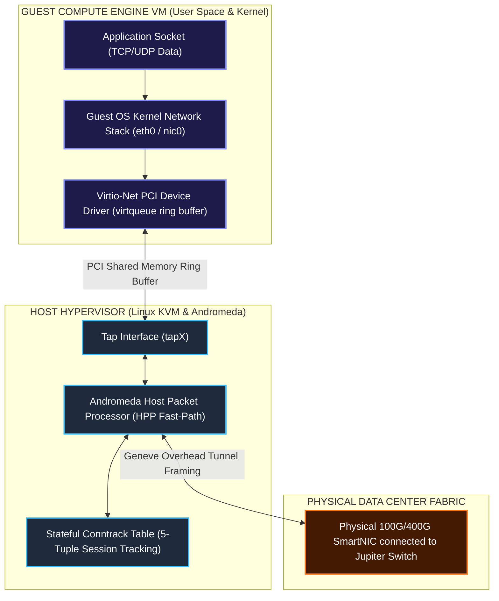
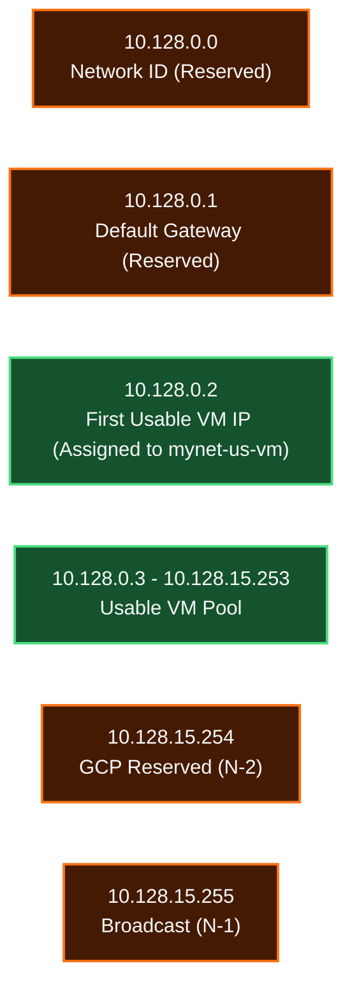
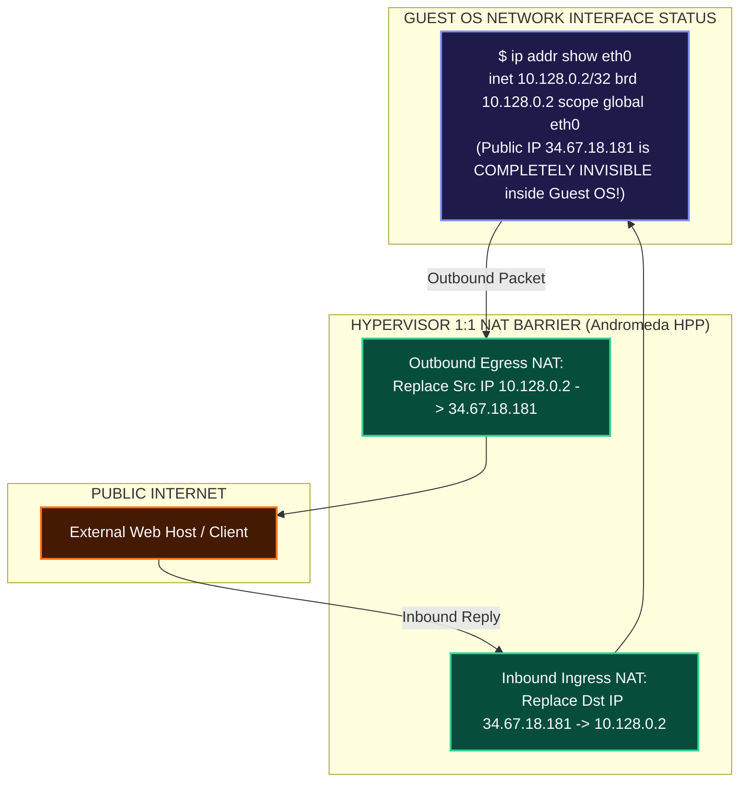
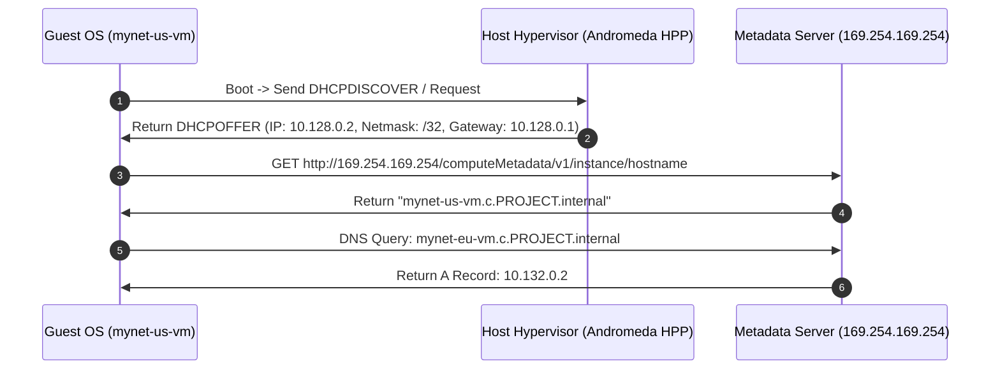
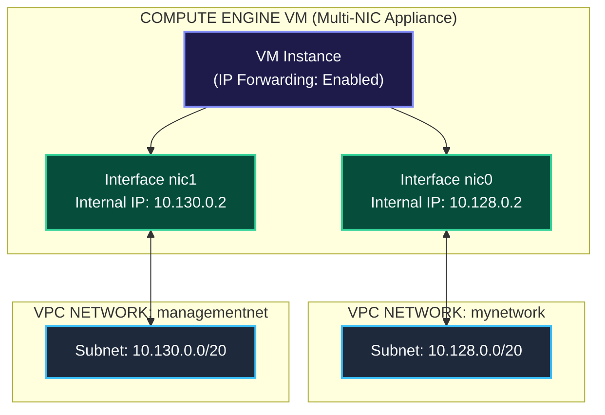
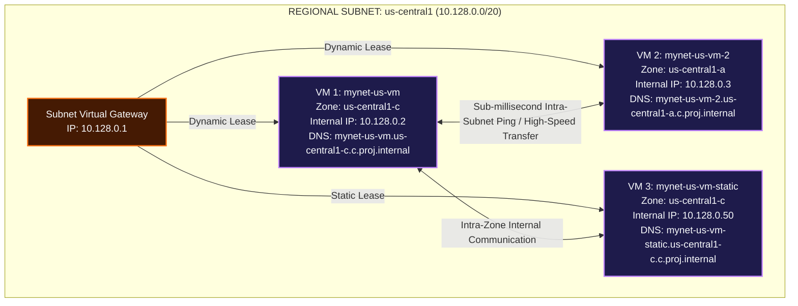

# Compute Engine & VPC Network Integration Mechanics

This document details how Compute Engine Virtual Machines (VMs) physically and logically integrate with Google Cloud VPC networks, hypervisor tap interfaces, subnets, internal DHCP/DNS services, 1:1 NAT transparency, the **GCP Metadata Server (`169.254.169.254`)**, and how to configure multiple instances on the same network.

---

## 1. Physical & Hypervisor Integration Architecture

When a Compute Engine VM is launched, the hypervisor allocates a virtual PCI Ethernet device (**virtio-net**) inside the guest instance and binds it to a software tap interface on the host.



---

## 2. Subnet Binding & The 4 Reserved Subnet IP Addresses

When a VM is placed in a subnetwork (e.g. `mynet-us-vm` in `10.128.0.0/20`), GCP assigns it a private RFC 1918 IPv4 address from that subnet's available block.

### Subnet IP Reservation Matrix (Example: `10.128.0.0/20`)

Every GCP subnetwork reserves **4 IP addresses**:

| IP Address | Role / Function | Description |
| :--- | :--- | :--- |
| `10.128.0.0` | **Network ID** | Identifies the start of the subnet CIDR block. |
| `10.128.0.1` | **Default Gateway** | Virtual Subnet Gateway routing traffic to other subnets or `0.0.0.0/0`. |
| `10.128.15.254` | **GCP Internal Reserved (`N-2`)** | Reserved by Google Cloud for infrastructure services and future capabilities. |
| `10.128.15.255` | **Broadcast Address (`N-1`)** | Reserved for subnet broadcast address. |



> **First Usable VM IP**: Because `.0` and `.1` are reserved, the first dynamically allocated internal IP address for a VM in any GCP subnet is **`.2`** (e.g., `10.128.0.2` for `mynet-us-vm` and `10.132.0.2` for `mynet-eu-vm`).

---

## 3. Hypervisor 1:1 NAT Transparency Mechanics

Compute Engine instances assigned a public External IP address (e.g., `34.67.18.181`) do **NOT** have this public IP configured directly on their OS kernel interface (`eth0`).



---

## 4. Metadata Server Magic IP (`169.254.169.254`) & Internal DHCP/DNS

Every Compute Engine VM relies on the **GCP Metadata Server** located at the link-local IPv4 address `169.254.169.254` (and IPv6 link-local `fe80::a60:8000:0:1`).



---

## 5. Multi-NIC Architecture (Connecting VMs to Multiple VPCs)

Compute Engine VMs can be configured with up to **8 Virtual Network Interfaces (`nic0` through `nic7`)**, allowing a single instance to connect directly to multiple distinct VPC networks.



---

## 6. How to Configure Multiple Instances on the Same VPC Network

To place multiple Compute Engine instances onto the same VPC network and subnetwork, you bind each instance's primary network interface (`nic0`) to the target network or subnet handle during creation.

### 6.1 CLI Workflow (`gcloud compute instances create`)

```bash
# Provision VM Instance 1 in us-central1-c on 'mynetwork'
gcloud compute instances create mynet-us-vm \
    --zone=us-central1-c \
    --machine-type=e2-micro \
    --network=mynetwork \
    --subnet=mynetwork

# Provision VM Instance 2 in us-central1-a on the SAME 'mynetwork' (Dynamic Internal IP)
gcloud compute instances create mynet-us-vm-2 \
    --zone=us-central1-a \
    --machine-type=e2-micro \
    --network=mynetwork \
    --subnet=mynetwork

# Provision VM Instance 3 in us-central1-c with a STATIC reserved Internal IP (10.128.0.50)
gcloud compute instances create mynet-us-vm-static \
    --zone=us-central1-c \
    --machine-type=e2-micro \
    --network=mynetwork \
    --subnet=mynetwork \
    --private-network-ip=10.128.0.50
```

### 6.2 GCP Console UI Workflow

1. Navigate to **Navigation Menu $\rightarrow$ Compute Engine $\rightarrow$ VM Instances**.
2. Click **Create Instance**.
3. Name the instance (e.g. `mynet-us-vm-2`) and select the desired **Region** and **Zone** (e.g., `us-central1` / `us-central1-a`).
4. Scroll down and expand **Advanced options $\rightarrow$ Networking**.
5. Under **Network interfaces**, click **default** to edit the interface:
   - Set **Network** to `mynetwork`.
   - Set **Subnetwork** to `mynetwork` (`10.128.0.0/20`).
   - Set **Primary internal IP** to `Automatic` (or `Custom` to reserve a static IP).
6. Click **Done**, then click **Create**. Repeat for subsequent instances.

### 6.3 Infrastructure as Code (Terraform)

```hcl
resource "google_compute_instance" "vm_instance_1" {
  name         = "mynet-us-vm-1"
  machine_type = "e2-micro"
  zone         = "us-central1-c"

  network_interface {
    network    = "mynetwork"
    subnetwork = "mynetwork"
  }
}

resource "google_compute_instance" "vm_instance_2" {
  name         = "mynet-us-vm-2"
  machine_type = "e2-micro"
  zone         = "us-central1-a"

  network_interface {
    network    = "mynetwork"
    subnetwork = "mynetwork"
  }
}
```

---

## 7. Architectural Benefits & Mechanics of Shared-VPC Instance Provisioning

Placing multiple VM instances into the same VPC network and subnetwork provides fundamental architectural advantages:



### Key Technical Reasons & Architectural Benefits:

1. **Zero-Cost Private Internal Communication**:
   - VMs on the same VPC network communicate privately via RFC 1918 internal IP addresses (`10.128.0.2` $\leftrightarrow$ `10.128.0.3`).
   - Intra-zone traffic over private IP is **$0.00/GB (Free)**, avoiding public internet bandwidth costs.

2. **Automatic Internal Zonal DNS Resolution**:
   - Every VM attached to the VPC automatically registers its hostname with the internal DNS server (`169.254.169.254`).
   - VMs ping or connect to each other by name (`ping mynet-us-vm-2`) without hardcoding IP addresses.

3. **Cross-Zone High Availability (HA) under One Subnet**:
   - GCP subnets are **Regional** and span **all Availability Zones** in that region.
   - You can place `mynet-us-vm` in `us-central1-c` and `mynet-us-vm-2` in `us-central1-a` under the *same* `10.128.0.0/20` subnet. This gives cross-zone data center redundancy while sharing a unified IP address space.

4. **Micro-Segmented Stateful Firewall Rules**:
   - Firewall rules defined for the network (e.g. `--source-ranges=10.128.0.0/9` or `--target-tags=web-server`) apply uniformly to all instances on that network.

5. **Private Load Balancing Target Pools**:
   - Multiple instances sharing a network can be pooled behind an **Internal Application Load Balancer (ILB)** or **Internal Network Load Balancer** to distribute application traffic across healthy backend VMs seamlessly.

---

## Related Workspace Documents

- [Case Study Index](file:///home/btpl-lap-22/live/gcd/vpc-network/casestudy/README.md)
- [High-Level Architecture (HLD)](file:///home/btpl-lap-22/live/gcd/vpc-network/casestudy/hld-architecture.md)
- [Low-Level Packet Lifecycle (LLD)](file:///home/btpl-lap-22/live/gcd/vpc-network/casestudy/lld-packet-lifecycle.md)
- [Stateful Firewall Deep Dive](file:///home/btpl-lap-22/live/gcd/vpc-network/casestudy/firewall-deep-dive.md)
- [Commands & Diagnostics Manual](file:///home/btpl-lap-22/live/gcd/vpc-network/casestudy/commands-and-troubleshooting.md)
