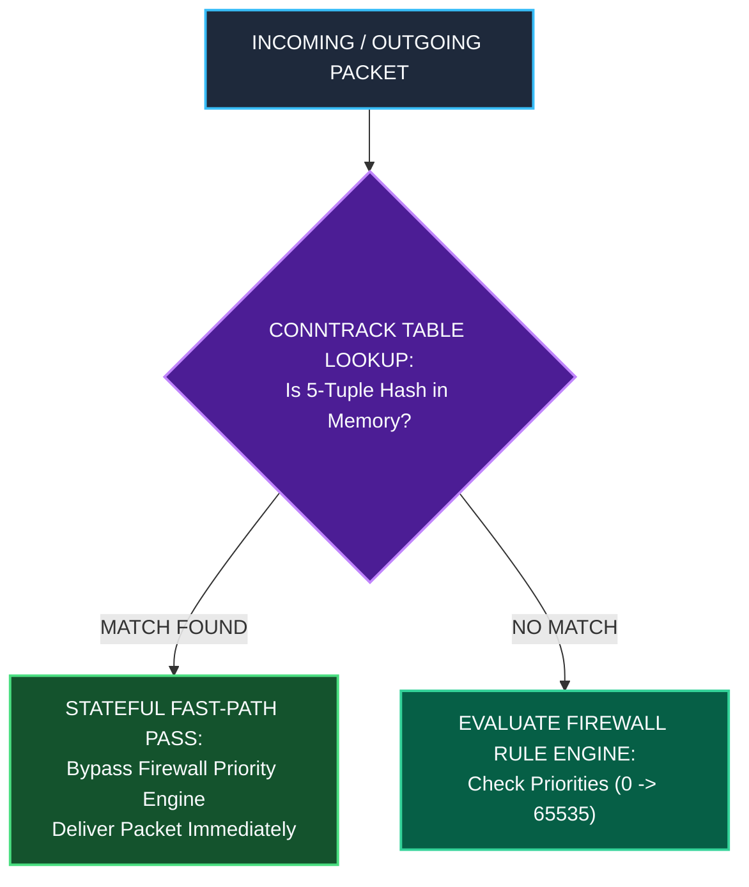
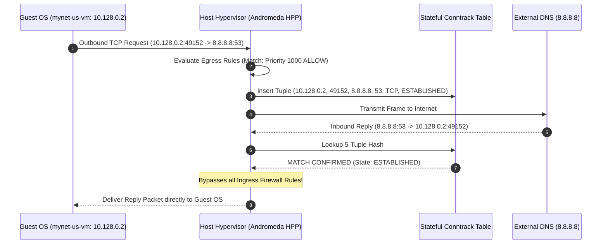
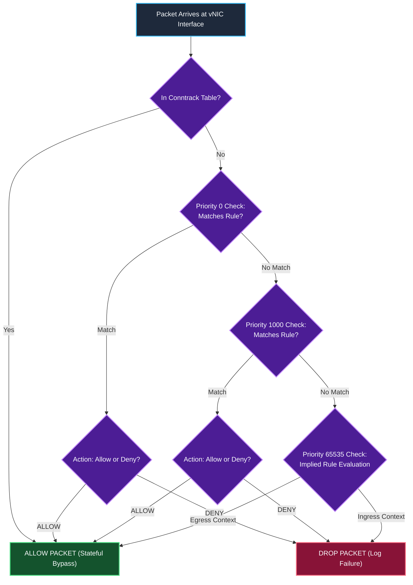
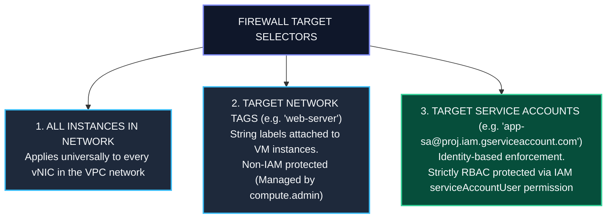
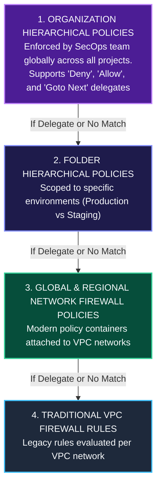
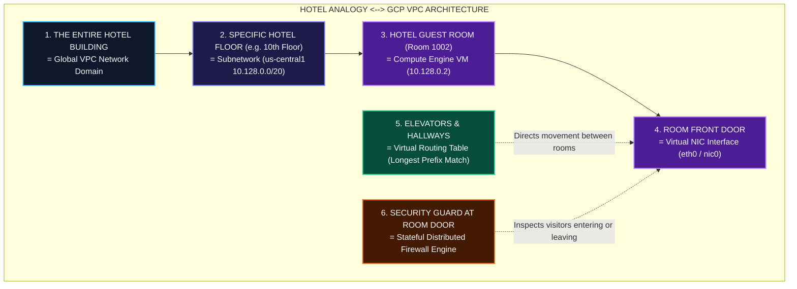
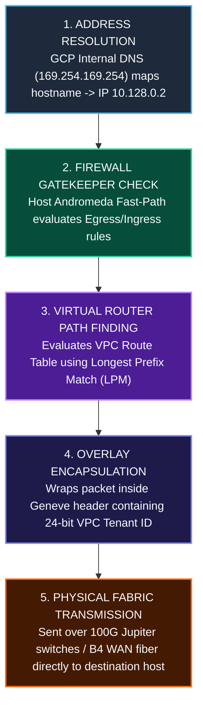

# Distributed Stateful Firewall Engine & Packet Filtering Deep Dive

This document details the architecture, evaluation engine, connection tracking mechanics (`conntrack`), rule priority hierarchy, packet blocking behavior of Google Cloud's **Distributed Stateful Firewall Engine**, and an in-depth breakdown of **Ingress vs. Egress traffic flow**.

---

## 1. Architectural Foundation: Distributed Enforcement

Unlike traditional cloud or enterprise network architectures that route traffic through centralized hardware firewall appliances, Virtual Router VMs, or perimeter middleboxes, GCP Distributed Firewalls are **enforced in parallel directly on the Linux hypervisor host of every Compute Engine instance**.

```mermaid
graph TD
    classDef trad fill:#451A03,stroke:#F97316,stroke-width:2px,color:#F8FAFC;
    classDef dist fill:#064E3B,stroke:#34D399,stroke-width:2px,color:#F8FAFC;
    classDef vm fill:#1E1B4B,stroke:#818CF8,stroke-width:2px,color:#F8FAFC;

    subgraph Traditional Architecture ["TRADITIONAL CENTRALIZED FIREWALL ARCHITECTURE"]
        VMA_T["VM A"]:::vm -->|Hair-pin Routing Bottleneck| Appliance["Hardware / Virtual Firewall Appliance<br/>(Single point of failure & throughput choke)"]:::trad
        Appliance --> VMB_T["VM B"]:::vm
    end

    subgraph GCP Architecture ["GCP DISTRIBUTED FIREWALL ARCHITECTURE"]
        VMA_G["VM A"]:::vm <-->|vNIC Firewall Kernel Tap A| HPP_A["Host Hypervisor Firewall A<br/>(Parallel Fast-Path)"]:::dist
        HPP_A <-->|Direct Jupiter Fabric Wire| HPP_B["Host Hypervisor Firewall B<br/>(Parallel Fast-Path)"]:::dist
        HPP_B <-->|vNIC Firewall Kernel Tap B| VMB_G["VM B"]:::vm
    end
```



---

## 2. Stateful Connection Tracking Mechanics (`conntrack`)

GCP Firewalls are strictly **stateful**. This means once a session is established and permitted by an egress or ingress rule, all bi-directional return packets belonging to that connection are automatically allowed.

### The Conntrack Session Tuple

The hypervisor host's Andromeda packet engine maintains a high-speed lock-free connection tracking table (`conntrack`). Each active session is keyed by a 5-tuple hash:

$$\text{Session Tuple} = \big( \text{Source IP}, \text{Source Port}, \text{Destination IP}, \text{Destination Port}, \text{Protocol} \big)$$



### Example: Connection State Lifecycle



---

## 3. Firewall Evaluation Priority & Match Logic

Firewall rules are processed sequentially based on **Priority Integer Values** ranging from `0` (highest priority) to `65535` (lowest priority).



---

## 4. Implied Firewall Rules

Every GCP VPC network contains **two unalterable implied firewall rules** operating at the lowest priority (`65535`):

| Rule Name | Direction | Priority | Source / Target | Action | Modification Allowed? |
| :--- | :--- | :--- | :--- | :--- | :--- |
| **`implied-deny-ingress`** | Ingress | `65535` | `0.0.0.0/0` $\rightarrow$ All Instances | **DENY** | **NO** (System Immutable) |
| **`implied-allow-egress`** | Egress | `65535` | All Instances $\rightarrow$ `0.0.0.0/0` | **ALLOW** | **NO** (System Immutable) |

> **Architectural Implication**: All inbound traffic to a VM is blocked by default unless an explicit ingress firewall rule (e.g. Priority 1000 `ALLOW tcp:22`) is created. All outbound traffic from a VM is allowed by default.

---

## 5. Targeting Selectors: Tags vs. Service Accounts

GCP Firewalls support three granular targeting mechanisms:



---

## 6. Hierarchical Policy Evaluation Pipeline

In enterprise organizations, firewall evaluation follows a 4-tier hierarchy before reaching the VPC Network level:



---

## 7. Layman & Executive Masterclass: Ingress vs. Egress & How VPC Navigates Traffic

### 7.1 What is Ingress vs. Egress?

Network traffic always moves relative to a **Virtual Machine's Network Interface (`eth0` / `nic0`)**.

```mermaid
graph LR
    classDef ext fill:#451A03,stroke:#F97316,stroke-width:2px,color:#F8FAFC;
    classDef nic fill:#064E3B,stroke:#34D399,stroke-width:2px,color:#F8FAFC;
    classDef vm fill:#1E1B4B,stroke:#818CF8,stroke-width:2px,color:#F8FAFC;

    Outside["Outside World / Internet / Another VM"]:::ext

    Outside -->|INGRESS: Traffic Entering IN<br/>Example: User connecting to Web App (Port 443)<br/>SSH terminal connection (Port 22)| NIC["VM Network Interface (eth0 / nic0)"]:::nic
    NIC -->|EGRESS: Traffic Leaving OUT<br/>Example: VM downloading OS updates (Port 443)<br/>VM querying external DB (Port 3306)| Outside
    NIC <--> VM["Compute Engine Guest Application"]:::vm
```

#### Detailed Comparison Matrix:

| Dimension | Ingress (Inbound Traffic) | Egress (Outbound Traffic) |
| :--- | :--- | :--- |
| **Flow Direction** | Outside World $\rightarrow$ **VM `eth0` Interface** | **VM `eth0` Interface** $\rightarrow$ Outside World |
| **Real-World Examples** | • User visiting `https://myapp.com` (TCP 443)<br/>• Admin SSHing into server (`gcloud compute ssh`) (TCP 22)<br/>• External monitoring pinging server (ICMP) | • Server running `apt-get update` to download patches<br/>• Web app querying external Database server<br/>• App calling third-party Payment API (`api.stripe.com`) |
| **Default Policy** | **DENIED BY DEFAULT** (`implied-deny-ingress`, Priority 65535). Must create explicit ALLOW rule! | **ALLOWED BY DEFAULT** (`implied-allow-egress`, Priority 65535). Can create DENY rules to block data exfiltration. |
| **Key Filtering Flags** | `--source-ranges`, `--target-tags`, `--target-service-accounts` | `--destination-ranges`, `--target-tags`, `--target-service-accounts` |

---

### 7.2 The Hotel Analogy: How VPC Network Components Work Together

To understand how a VPC navigates traffic, imagine an **Enterprise Hotel Building**:



#### How the Analogy Explains Traffic Flow:

1. **Visitor Knocking (Ingress Request)**: A visitor arrives at Room 1002 (Web client connecting to `10.128.0.2:443`). The **Security Guard (Firewall)** checks his guest rulebook. If Priority 1000 says `ALLOW tcp:443`, the guard opens the door.
2. **Room Occupant Leaving (Egress Request)**: Room 1002 occupant walks out to the kitchen (VM sending a DB query). The **Hallway Elevators (Virtual Router)** read the target destination address (`10.130.0.2`) and guide the occupant straight to the target floor.
3. **Ordering Room Service (Stateful Return Traffic)**: If Room 1002 orders food room service (outbound request), the security guard lets the delivery driver back inside automatically when food arrives (**Stateful Conntrack Bypass**), without requiring a separate visitor pass!

---

### 7.3 Step-by-Step Traffic Navigation Mechanics

When a user or VM sends a packet, the VPC network navigates traffic using **5 sequential components**:



---

## Related Workspace Documents

- [Case Study Index](file:///home/btpl-lap-22/live/gcd/vpc-network/casestudy/README.md)
- [High-Level Architecture (HLD)](file:///home/btpl-lap-22/live/gcd/vpc-network/casestudy/hld-architecture.md)
- [Low-Level Packet Lifecycle (LLD)](file:///home/btpl-lap-22/live/gcd/vpc-network/casestudy/lld-packet-lifecycle.md)
- [Compute & Network Integration](file:///home/btpl-lap-22/live/gcd/vpc-network/casestudy/compute-network-integration.md)
- [Commands & Diagnostics Manual](file:///home/btpl-lap-22/live/gcd/vpc-network/casestudy/commands-and-troubleshooting.md)
