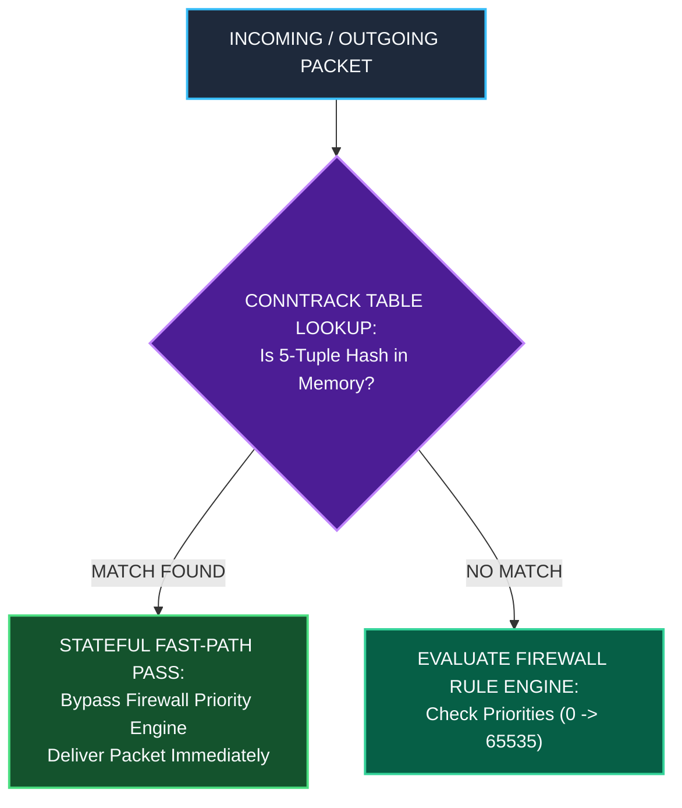
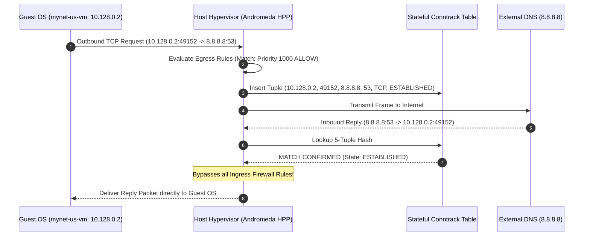
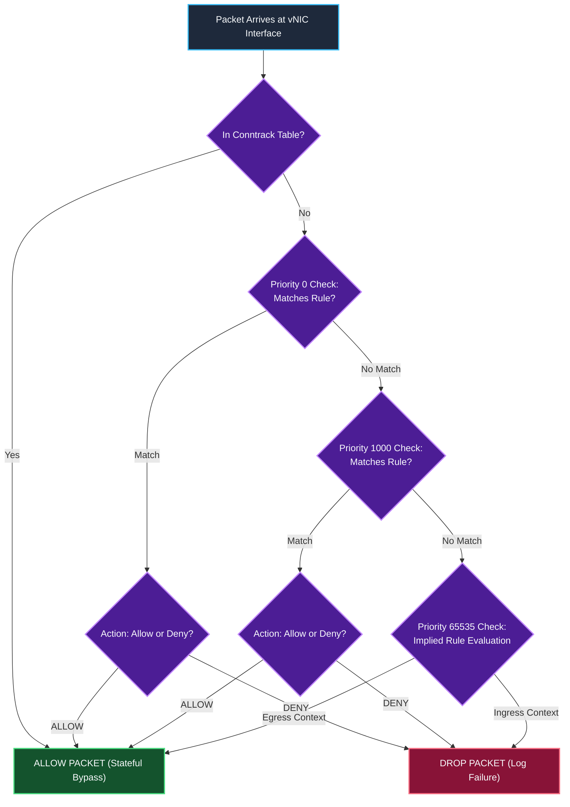
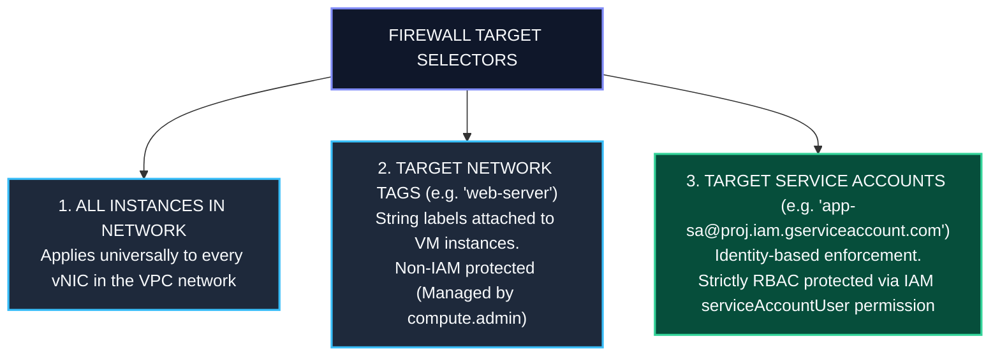
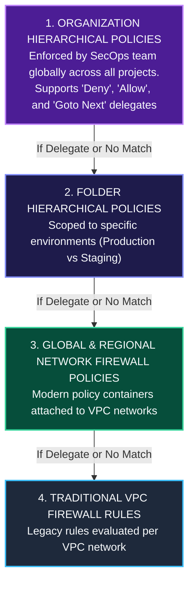

# Distributed Stateful Firewall Engine & Packet Filtering Deep Dive

This document details the architecture, evaluation engine, connection tracking mechanics (`conntrack`), rule priority hierarchy, and packet blocking behavior of Google Cloud's **Distributed Stateful Firewall Engine**.

---

## 1. Architectural Foundation: Distributed Enforcement

Unlike traditional cloud or enterprise network architectures that route traffic through centralized hardware firewall appliances, Virtual Router VMs, or perimeter middleboxes, GCP Distributed Firewalls are **enforced in parallel directly on the Linux hypervisor host of every Compute Engine instance**.

```mermaid
graph TD
    classDef trad fill:#451A03,stroke:#F97316,stroke-width:2px,color:#F8FAFC;
    classDef dist fill:#064E3B,stroke:#34D399,stroke-width:2px,color:#F8FAFC;
    classDef vm fill:#1E1B4B,stroke:#818CF8,stroke-width:2px,color:#F8FAFC;

    subgraph Traditional Architecture ["TRADITIONAL CENTRALIZED FIREWALL ARCHITECTURE"]
        VMA_T["VM A"]:::vm -->|Hair-pin Routing Bottleneck| Appliance["Hardware / Virtual Firewall Appliance<br/>(Single point of failure & throughput choke)"]:::trad
        Appliance --> VMB_T["VM B"]:::vm
    end

    subgraph GCP Architecture ["GCP DISTRIBUTED FIREWALL ARCHITECTURE"]
        VMA_G["VM A"]:::vm <-->|vNIC Firewall Kernel Tap A| HPP_A["Host Hypervisor Firewall A<br/>(Parallel Fast-Path)"]:::dist
        HPP_A <-->|Direct Jupiter Fabric Wire| HPP_B["Host Hypervisor Firewall B<br/>(Parallel Fast-Path)"]:::dist
        HPP_B <-->|vNIC Firewall Kernel Tap B| VMB_G["VM B"]:::vm
    end
```

---

## 2. Stateful Connection Tracking Mechanics (`conntrack`)

GCP Firewalls are strictly **stateful**. This means once a session is established and permitted by an egress or ingress rule, all bi-directional return packets belonging to that connection are automatically allowed.

### The Conntrack Session Tuple

The hypervisor host's Andromeda packet engine maintains a high-speed lock-free connection tracking table (`conntrack`). Each active session is keyed by a 5-tuple hash:

$$\text{Session Tuple} = \big( \text{Source IP}, \text{Source Port}, \text{Destination IP}, \text{Destination Port}, \text{Protocol} \big)$$

### Example: Connection State Lifecycle

---

## 3. Firewall Evaluation Priority & Match Logic

Firewall rules are processed sequentially based on **Priority Integer Values** ranging from `0` (highest priority) to `65535` (lowest priority).

### First-Match Engine Rule Execution

1. Firewall rules are evaluated from **lowest priority number to highest priority number** (e.g. Priority `1` evaluated before Priority `1000`).
2. The **first rule that matches** the packet attributes (Source IP, Destination IP, Protocol, Port, Target Tag/Service Account) terminates the evaluation chain.
3. If a higher priority rule evaluates to `DENY`, the packet is dropped immediately—even if a lower priority rule exists that would allow it (**Deny-Override**).

---

## 4. Implied Firewall Rules

Every GCP VPC network contains **two unalterable implied firewall rules** operating at the lowest priority (`65535`):

| Rule Name | Direction | Priority | Source / Target | Action | Modification Allowed? |
| :--- | :--- | :--- | :--- | :--- | :--- |
| **`implied-deny-ingress`** | Ingress | `65535` | `0.0.0.0/0` $\rightarrow$ All Instances | **DENY** | **NO** (System Immutable) |
| **`implied-allow-egress`** | Egress | `65535` | All Instances $\rightarrow$ `0.0.0.0/0` | **ALLOW** | **NO** (System Immutable) |

> **Architectural Implication**: All inbound traffic to a VM is blocked by default unless an explicit ingress firewall rule (e.g. Priority 1000 `ALLOW tcp:22`) is created. All outbound traffic from a VM is allowed by default.

---

## 5. Targeting Selectors: Tags vs. Service Accounts

GCP Firewalls support three granular targeting mechanisms:

---

## 6. Hierarchical Policy Evaluation Pipeline

In enterprise organizations, firewall evaluation follows a 4-tier hierarchy before reaching the VPC Network level:

---

## Related Workspace Documents

- [Case Study Index](file:///home/btpl-lap-22/live/gcd/vpc-network/casestudy/README.md)
- [High-Level Architecture (HLD)](file:///home/btpl-lap-22/live/gcd/vpc-network/casestudy/hld-architecture.md)
- [Low-Level Packet Lifecycle (LLD)](file:///home/btpl-lap-22/live/gcd/vpc-network/casestudy/lld-packet-lifecycle.md)
- [Compute & Network Integration](file:///home/btpl-lap-22/live/gcd/vpc-network/casestudy/compute-network-integration.md)
