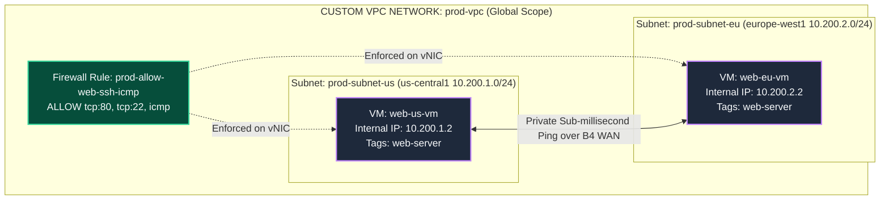
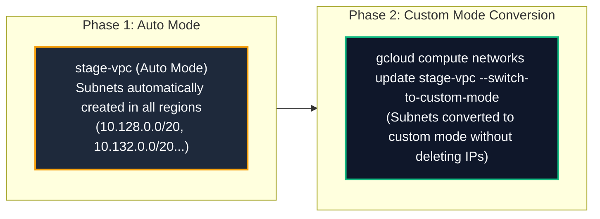
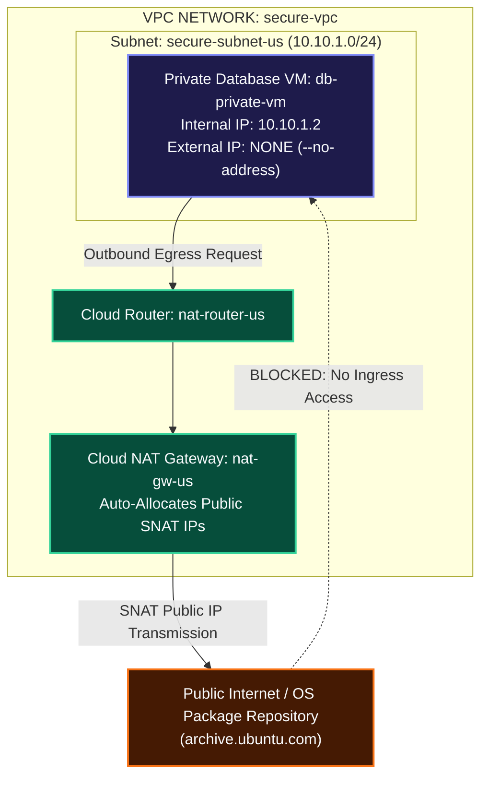
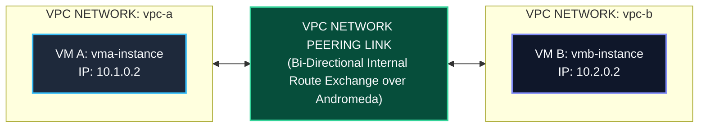
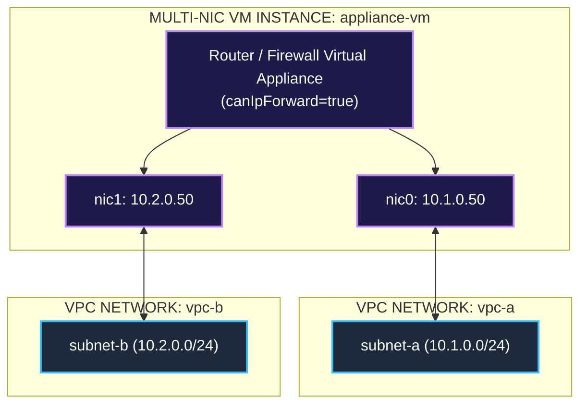
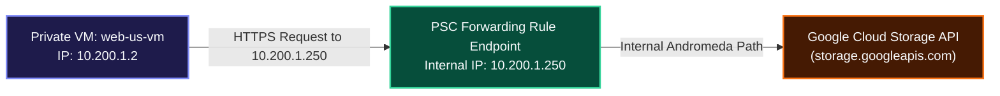

# Step-by-Step Hands-On Guide: Configuring Custom VPC Networks & Resource Attachments

This practical hands-on guide provides step-by-step blueprints, exact copy-pasteable `gcloud` CLI commands, GCP Console UI workflows, verification checks, and Mermaid architecture diagrams for 6 real-world VPC network deployment scenarios.

---

## Guide Index & Deployment Scenarios

| Scenario | Network Type | Target Workloads / Resources | Key Objective |
| :--- | :--- | :--- | :--- |
| [**Scenario 1**](#scenario-1-building-a-custom-vpc-network-from-scratch) | **Custom Mode VPC** | 2 Subnets, Web VMs, Firewall Rules | Build a production-grade Custom VPC network with custom subnets and secure targeted firewalls. |
| [**Scenario 2**](#scenario-2-auto-mode-vpc-creation--conversion-to-custom-mode) | **Auto Mode VPC** | Auto Subnets, VM Instances | Build an Auto Mode network, explore auto-allocated subnets, and execute a non-destructive conversion to Custom Mode. |
| [**Scenario 3**](#scenario-3-private-subnet-with-cloud-nat-outbound-egress) | **Private Subnet** | Private Database VMs (`--no-address`), Cloud NAT | Configure private VMs without public IPs that download updates via Cloud Router + Cloud NAT. |
| [**Scenario 4**](#scenario-4-vpc-network-peering-between-two-custom-networks) | **VPC Peering** | 2 Custom VPCs (`vpc-a`, `vpc-b`), Internal VMs | Establish bi-directional VPC Peering between two isolated VPCs to enable private cross-VPC ping. |
| [**Scenario 5**](#scenario-5-multi-nic-dual-homed-appliance-configuration) | **Multi-NIC VPC** | Dual-Homed Firewall VM (`nic0`, `nic1`) | Provision a VM instance with multiple vNIC interfaces attached to two separate VPC networks. |
| [**Scenario 6**](#scenario-6-private-service-connect-psc-for-google-apis) | **Private Service Connect** | Private VMs, Google Cloud APIs | Access Google Cloud Storage (`storage.googleapis.com`) privately from a VM via an internal PSC IP endpoint. |

---

## Scenario 1: Building a Custom VPC Network from Scratch

In this scenario, you build a production-grade **Custom Mode VPC Network** (`prod-vpc`) with two custom subnets (`prod-subnet-us` in `us-central1` and `prod-subnet-eu` in `europe-west1`), firewall rules, and Compute Engine VM instances.



### Step 1.1: Create the Custom VPC Network
```bash
gcloud compute networks create prod-vpc \
    --subnet-mode=custom \
    --bgp-routing-mode=global \
    --description="Production Custom VPC Network"
```
*Expected Output:*
```text
Created [https://www.googleapis.com/compute/v1/projects/PROJECT_ID/global/networks/prod-vpc].
NAME      SUBNET_MODE  BGP_ROUTING_MODE  IPV4_RANGE  GATEWAY_IPV4
prod-vpc  CUSTOM       GLOBAL
```

### Step 1.2: Provision Custom Regional Subnets
```bash
# Subnet 1: US Central (CIDR: 10.200.1.0/24)
gcloud compute networks subnets create prod-subnet-us \
    --network=prod-vpc \
    --region=us-central1 \
    --range=10.200.1.0/24 \
    --enable-private-ip-google-access

# Subnet 2: Europe West (CIDR: 10.200.2.0/24)
gcloud compute networks subnets create prod-subnet-eu \
    --network=prod-vpc \
    --region=europe-west1 \
    --range=10.200.2.0/24 \
    --enable-private-ip-google-access
```

### Step 1.3: Create Targeted Firewall Rules
```bash
# Allow IAP SSH (35.235.240.0/20), ICMP, and HTTP (Port 80)
gcloud compute firewalls create prod-allow-web-ssh-icmp \
    --network=prod-vpc \
    --direction=INGRESS \
    --priority=1000 \
    --action=ALLOW \
    --rules=icmp,tcp:22,tcp:80 \
    --source-ranges=0.0.0.0/0 \
    --target-tags=web-server
```

### Step 1.4: Launch VM Instances in Custom Subnets
```bash
# Launch VM in US Subnet
gcloud compute instances create web-us-vm \
    --zone=us-central1-c \
    --machine-type=e2-micro \
    --subnet=prod-subnet-us \
    --tags=web-server

# Launch VM in Europe Subnet
gcloud compute instances create web-eu-vm \
    --zone=europe-west1-c \
    --machine-type=e2-micro \
    --subnet=prod-subnet-eu \
    --tags=web-server
```

### Step 1.5: Verify Connectivity
```bash
# SSH into web-us-vm using IAP
gcloud compute ssh web-us-vm --zone=us-central1-c --tunnel-through-iap

# Inside web-us-vm: Ping internal IP of web-eu-vm (10.200.2.2)
ping -c 3 10.200.2.2
```
*Expected Output:*
```text
PING 10.200.2.2 (10.200.2.2) 56(84) bytes of data.
64 bytes from 10.200.2.2: icmp_seq=1 ttl=64 time=108.2 ms
64 bytes from 10.200.2.2: icmp_seq=2 ttl=64 time=107.9 ms
3 packets transmitted, 3 received, 0% packet loss
```

---

## Scenario 2: Auto Mode VPC Creation & Conversion to Custom Mode

In this scenario, you deploy an **Auto Mode VPC Network** (`stage-vpc`), inspect auto-provisioned regional subnets, and execute an irreversible conversion to **Custom Mode**.



### Step 2.1: Create Auto Mode VPC Network
```bash
gcloud compute networks create stage-vpc --subnet-mode=auto
```

### Step 2.2: List Auto-Created Subnets
```bash
gcloud compute networks subnets list --filter="network=stage-vpc" --format="table(name,region,ipCidrRange)"
```
*Expected Output:*
```text
NAME       REGION          IP_CIDR_RANGE
stage-vpc  us-central1     10.128.0.0/20
stage-vpc  europe-west1    10.132.0.0/20
stage-vpc  asia-east1      10.140.0.0/20
```

### Step 2.3: Convert Auto VPC to Custom Mode
```bash
gcloud compute networks update stage-vpc --switch-to-custom-mode
```

### Step 2.4: Verify Mode Conversion
```bash
gcloud compute networks describe stage-vpc --format="get(x_gservices.subnetCreationMode)"
# Output: CUSTOM
```

---

## Scenario 3: Private Subnet with Cloud NAT (Outbound Egress)

In this scenario, you deploy a **Private Subnet** containing a backend database VM (`db-private-vm`) with **no public External IP address (`--no-address`)**. You configure a **Cloud Router** and **Cloud NAT Gateway** to grant outbound internet egress for software patches (`apt-get update`) while remaining completely invisible to inbound internet attacks.



### Step 3.1: Create Private VPC & Subnet
```bash
gcloud compute networks create secure-vpc --subnet-mode=custom

gcloud compute networks subnets create secure-subnet-us \
    --network=secure-vpc \
    --region=us-central1 \
    --range=10.10.1.0/24 \
    --enable-private-ip-google-access
```

### Step 3.2: Configure Cloud Router & Cloud NAT Gateway
```bash
# 1. Create Cloud Router
gcloud compute routers create nat-router-us \
    --network=secure-vpc \
    --region=us-central1

# 2. Create Cloud NAT Gateway
gcloud compute routers nats create nat-gw-us \
    --router=nat-router-us \
    --region=us-central1 \
    --auto-allocate-nat-external-ips \
    --nat-all-subnet-ip-ranges \
    --enable-dynamic-port-allocation
```

### Step 3.3: Deploy Private Instance (`--no-address`)
```bash
gcloud compute instances create db-private-vm \
    --zone=us-central1-c \
    --machine-type=e2-micro \
    --subnet=secure-subnet-us \
    --no-address
```

### Step 3.4: Test Outbound Internet Access via Cloud NAT
```bash
# Allow IAP SSH Ingress Firewall Rule
gcloud compute firewalls create secure-allow-iap \
    --network=secure-vpc \
    --allow=tcp:22 \
    --source-ranges=35.235.240.0/20

# SSH into db-private-vm via IAP
gcloud compute ssh db-private-vm --zone=us-central1-c --tunnel-through-iap

# Inside db-private-vm: Verify egress internet connection works via NAT
curl -s https://ifconfig.me
# Returns the Cloud NAT Public Allocated IP address!
```

---

## Scenario 4: VPC Network Peering Between Two Custom Networks

In this scenario, you establish **Bi-Directional VPC Network Peering** between two separate custom VPC networks (`vpc-a` and `vpc-b`) to allow private internal IP ping across distinct VPC routing domains.



### Step 4.1: Create Both Custom VPC Networks & Subnets
```bash
# Network A
gcloud compute networks create vpc-a --subnet-mode=custom
gcloud compute networks subnets create subnet-a --network=vpc-a --region=us-central1 --range=10.1.0.0/24

# Network B
gcloud compute networks create vpc-b --subnet-mode=custom
gcloud compute networks subnets create subnet-b --network=vpc-b --region=us-central1 --range=10.2.0.0/24
```

### Step 4.2: Deploy Instances in Each VPC
```bash
gcloud compute instances create vma-instance --zone=us-central1-c --subnet=subnet-a
gcloud compute instances create vmb-instance --zone=us-central1-c --subnet=subnet-b
```

### Step 4.3: Configure Bi-Directional VPC Peering
```bash
# Peering 1: vpc-a -> vpc-b
gcloud compute networks peerings create peer-a-to-b \
    --network=vpc-a \
    --peer-network=vpc-b \
    --auto-accept

# Peering 2: vpc-b -> vpc-a
gcloud compute networks peerings create peer-b-to-a \
    --network=vpc-b \
    --peer-network=vpc-a \
    --auto-accept
```

### Step 4.4: Create Ingress Firewall Rules for Internal Ping
```bash
gcloud compute firewalls create vpc-a-allow-icmp --network=vpc-a --allow=icmp,tcp:22 --source-ranges=10.2.0.0/24,35.235.240.0/20
gcloud compute firewalls create vpc-b-allow-icmp --network=vpc-b --allow=icmp,tcp:22 --source-ranges=10.1.0.0/24,35.235.240.0/20
```

### Step 4.5: Verify Cross-VPC Private Connectivity
```bash
gcloud compute ssh vma-instance --zone=us-central1-c --tunnel-through-iap
# Inside vma-instance:
ping -c 3 10.2.0.2
# SUCCESS! Peering routes internal IP packets across VPCs!
```

---

## Scenario 5: Multi-NIC Dual-Homed Appliance Configuration

In this scenario, you provision a Compute Engine VM with **two virtual network interfaces (`nic0` and `nic1`)** connected simultaneously to `vpc-a` and `vpc-b`.



### Step 5.1: Create Multi-NIC Instance CLI Command
```bash
gcloud compute instances create appliance-vm \
    --zone=us-central1-c \
    --machine-type=n2-standard-2 \
    --can-ip-forward \
    --network-interface=subnet=subnet-a,private-network-ip=10.1.0.50 \
    --network-interface=subnet=subnet-b,private-network-ip=10.2.0.50
```

---

## Scenario 6: Private Service Connect (PSC) for Google APIs

In this scenario, you configure a private VM to access Google Cloud Storage buckets privately via an internal **Private Service Connect (PSC)** forwarding rule pointing to `10.200.1.250`.



### Step 6.1: Reserve Internal IP for PSC Endpoint
```bash
gcloud compute addresses create psc-storage-ip \
    --region=us-central1 \
    --subnet=prod-subnet-us \
    --addresses=10.200.1.250
```

### Step 6.2: Create PSC Forwarding Rule to Google APIs
```bash
gcloud compute forwarding-rules create psc-storage-rule \
    --region=us-central1 \
    --network=prod-vpc \
    --address=psc-storage-ip \
    --target-google-apis-bundle=all-apis
```

---

## Related Workspace Documents

- [Case Study Index](file:///home/btpl-lap-22/live/gcd/vpc-network/casestudy/README.md)
- [High-Level Architecture (HLD)](file:///home/btpl-lap-22/live/gcd/vpc-network/casestudy/hld-architecture.md)
- [Low-Level Packet Lifecycle (LLD)](file:///home/btpl-lap-22/live/gcd/vpc-network/casestudy/lld-packet-lifecycle.md)
- [Stateful Firewall Deep Dive](file:///home/btpl-lap-22/live/gcd/vpc-network/casestudy/firewall-deep-dive.md)
- [Compute & Network Integration](file:///home/btpl-lap-22/live/gcd/vpc-network/casestudy/compute-network-integration.md)
- [Commands & Diagnostics Manual](file:///home/btpl-lap-22/live/gcd/vpc-network/casestudy/commands-and-troubleshooting.md)
