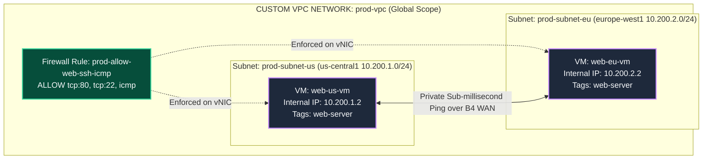
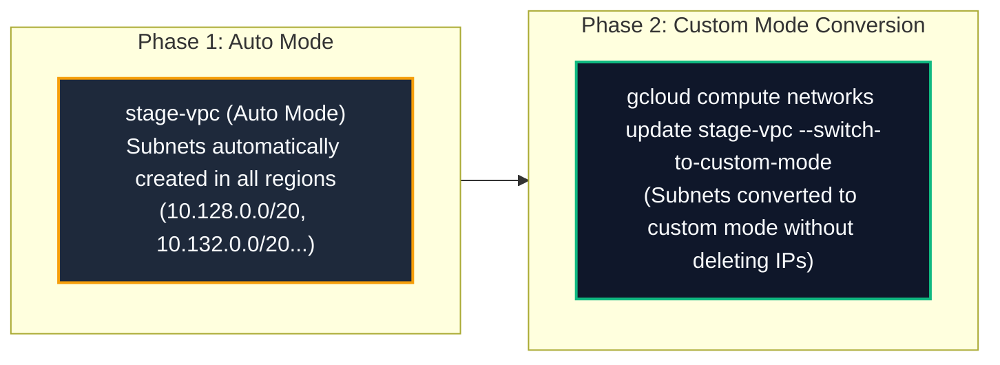
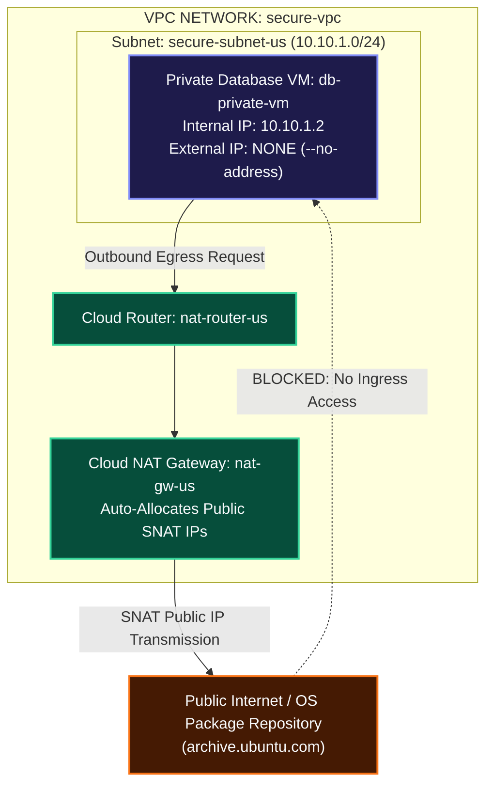
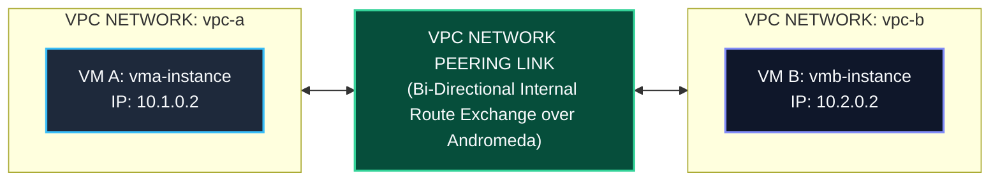
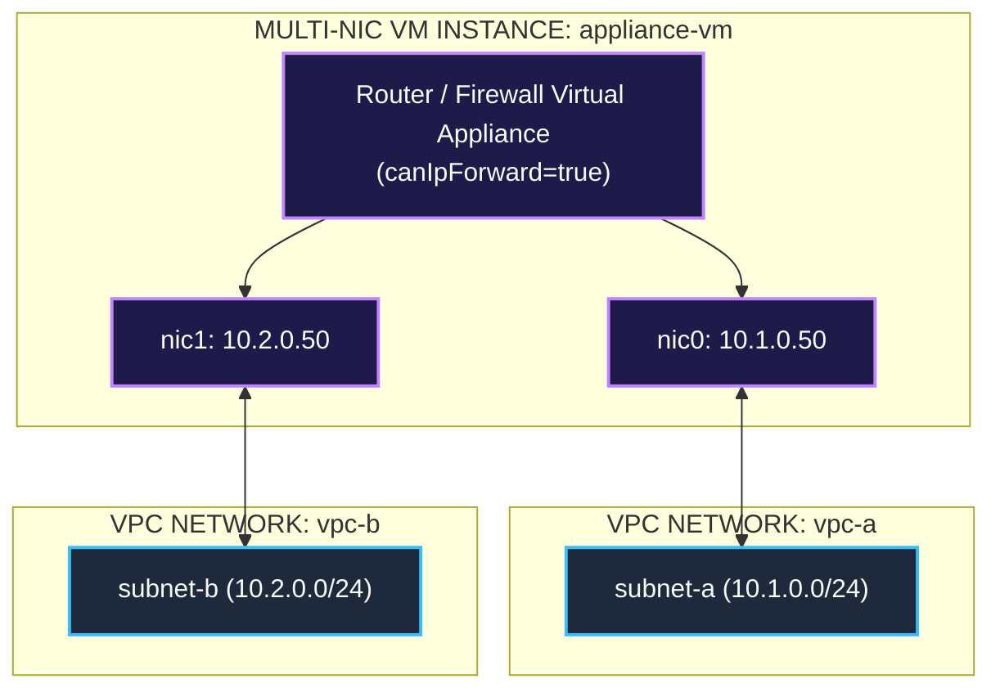
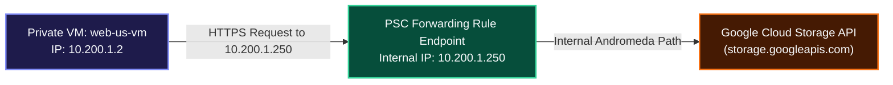
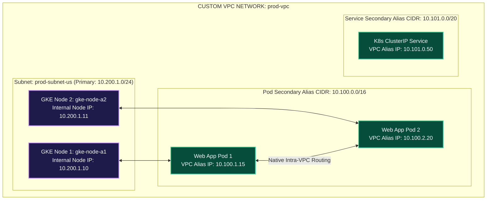

# Step-by-Step Hands-On Guide: Configuring Custom VPC Networks & Resource Attachments

This practical hands-on guide provides step-by-step blueprints, exact copy-pasteable `gcloud` CLI commands, GCP Console UI workflows, verification checks, and Mermaid architecture diagrams for 6 real-world VPC network deployment scenarios.

---

## Guide Index & Deployment Scenarios

| Scenario | Network Type | Target Workloads / Resources | Key Objective |
| :--- | :--- | :--- | :--- |
| [**Scenario 1**](#scenario-1-building-a-custom-vpc-network-from-scratch) | **Custom Mode VPC** | 2 Subnets, Web VMs, Firewall Rules | Build a production-grade Custom VPC network with custom subnets and secure targeted firewalls. |
| [**Scenario 2**](#scenario-2-auto-mode-vpc-creation--conversion-to-custom-mode) | **Auto Mode VPC** | Auto Subnets, VM Instances | Build an Auto Mode network, explore auto-allocated subnets, and execute a non-destructive conversion to Custom Mode. |
| [**Scenario 3**](#scenario-3-private-subnet-with-cloud-nat-outbound-egress) | **Private Subnet** | Private Database VMs (`--no-address`), Cloud NAT | Configure private VMs without public IPs that download updates via Cloud Router + Cloud NAT. |
| [**Scenario 4**](#scenario-4-vpc-network-peering-between-two-custom-networks) | **VPC Peering** | 2 Custom VPCs (`vpc-a`, `vpc-b`), Internal VMs | Establish bi-directional VPC Peering between two isolated VPCs to enable private cross-VPC ping. |
| [**Scenario 5**](#scenario-5-multi-nic-dual-homed-appliance-configuration) | **Multi-NIC VPC** | Dual-Homed Firewall VM (`nic0`, `nic1`) | Provision a VM instance with multiple vNIC interfaces attached to two separate VPC networks. |
| [**Scenario 6**](#scenario-6-private-service-connect-psc-for-google-apis) | **Private Service Connect** | Private VMs, Google Cloud APIs | Access Google Cloud Storage (`storage.googleapis.com`) privately from a VM via an internal PSC IP endpoint. |
| [**Scenario 7**](#scenario-7-vpc-native-private-gke-clusters-with-alias-ip-ranges) | **VPC-Native GKE** | Private GKE Cluster, Secondary Alias CIDRs | Deploy a private VPC-native GKE cluster with pod and service IP alias ranges on custom subnets. |
| [**Scenario 8**](#scenario-8-hands-on-blueprint--private-google-access-cloud-nat--connection-logging) | **Private Google Access & NAT** | Private VM (`--no-address`), PGA, Cloud NAT, Logging | Reproduce exact lab workflow: IAP tunnel (`35.235.240.0/20`), GCS bucket via PGA, Cloud NAT `apt-get update`, and Cloud NAT Logging. |


---

## Scenario 1: Building a Custom VPC Network from Scratch

In this scenario, you build a production-grade **Custom Mode VPC Network** (`prod-vpc`) with two custom subnets (`prod-subnet-us` in `us-central1` and `prod-subnet-eu` in `europe-west1`), firewall rules, and Compute Engine VM instances.



### Step 1.1: Create the Custom VPC Network
```bash
gcloud compute networks create prod-vpc \
    --subnet-mode=custom \
    --bgp-routing-mode=global \
    --description="Production Custom VPC Network"
```
*Expected Output:*
```text
Created [https://www.googleapis.com/compute/v1/projects/PROJECT_ID/global/networks/prod-vpc].
NAME      SUBNET_MODE  BGP_ROUTING_MODE  IPV4_RANGE  GATEWAY_IPV4
prod-vpc  CUSTOM       GLOBAL
```

### Step 1.2: Provision Custom Regional Subnets
```bash
# Subnet 1: US Central (CIDR: 10.200.1.0/24)
gcloud compute networks subnets create prod-subnet-us \
    --network=prod-vpc \
    --region=us-central1 \
    --range=10.200.1.0/24 \
    --enable-private-ip-google-access

# Subnet 2: Europe West (CIDR: 10.200.2.0/24)
gcloud compute networks subnets create prod-subnet-eu \
    --network=prod-vpc \
    --region=europe-west1 \
    --range=10.200.2.0/24 \
    --enable-private-ip-google-access
```

### Step 1.3: Create Targeted Firewall Rules
```bash
# Allow IAP SSH (35.235.240.0/20), ICMP, and HTTP (Port 80)
gcloud compute firewalls create prod-allow-web-ssh-icmp \
    --network=prod-vpc \
    --direction=INGRESS \
    --priority=1000 \
    --action=ALLOW \
    --rules=icmp,tcp:22,tcp:80 \
    --source-ranges=0.0.0.0/0 \
    --target-tags=web-server
```

### Step 1.4: Launch VM Instances in Custom Subnets
```bash
# Launch VM in US Subnet
gcloud compute instances create web-us-vm \
    --zone=us-central1-c \
    --machine-type=e2-micro \
    --subnet=prod-subnet-us \
    --tags=web-server

# Launch VM in Europe Subnet
gcloud compute instances create web-eu-vm \
    --zone=europe-west1-c \
    --machine-type=e2-micro \
    --subnet=prod-subnet-eu \
    --tags=web-server
```

### Step 1.5: Verify Connectivity
```bash
# SSH into web-us-vm using IAP
gcloud compute ssh web-us-vm --zone=us-central1-c --tunnel-through-iap

# Inside web-us-vm: Ping internal IP of web-eu-vm (10.200.2.2)
ping -c 3 10.200.2.2
```
*Expected Output:*
```text
PING 10.200.2.2 (10.200.2.2) 56(84) bytes of data.
64 bytes from 10.200.2.2: icmp_seq=1 ttl=64 time=108.2 ms
64 bytes from 10.200.2.2: icmp_seq=2 ttl=64 time=107.9 ms
3 packets transmitted, 3 received, 0% packet loss
```

---

## Scenario 2: Auto Mode VPC Creation & Conversion to Custom Mode

In this scenario, you deploy an **Auto Mode VPC Network** (`stage-vpc`), inspect auto-provisioned regional subnets, and execute an irreversible conversion to **Custom Mode**.



### Step 2.1: Create Auto Mode VPC Network
```bash
gcloud compute networks create stage-vpc --subnet-mode=auto
```

### Step 2.2: List Auto-Created Subnets
```bash
gcloud compute networks subnets list --filter="network=stage-vpc" --format="table(name,region,ipCidrRange)"
```
*Expected Output:*
```text
NAME       REGION          IP_CIDR_RANGE
stage-vpc  us-central1     10.128.0.0/20
stage-vpc  europe-west1    10.132.0.0/20
stage-vpc  asia-east1      10.140.0.0/20
```

### Step 2.3: Convert Auto VPC to Custom Mode
```bash
gcloud compute networks update stage-vpc --switch-to-custom-mode
```

### Step 2.4: Verify Mode Conversion
```bash
gcloud compute networks describe stage-vpc --format="get(x_gservices.subnetCreationMode)"
# Output: CUSTOM
```

---

## Scenario 3: Private Subnet with Cloud NAT (Outbound Egress)

In this scenario, you deploy a **Private Subnet** containing a backend database VM (`db-private-vm`) with **no public External IP address (`--no-address`)**. You configure a **Cloud Router** and **Cloud NAT Gateway** to grant outbound internet egress for software patches (`apt-get update`) while remaining completely invisible to inbound internet attacks.



### Step 3.1: Create Private VPC & Subnet
```bash
gcloud compute networks create secure-vpc --subnet-mode=custom

gcloud compute networks subnets create secure-subnet-us \
    --network=secure-vpc \
    --region=us-central1 \
    --range=10.10.1.0/24 \
    --enable-private-ip-google-access
```

### Step 3.2: Configure Cloud Router & Cloud NAT Gateway
```bash
# 1. Create Cloud Router
gcloud compute routers create nat-router-us \
    --network=secure-vpc \
    --region=us-central1

# 2. Create Cloud NAT Gateway
gcloud compute routers nats create nat-gw-us \
    --router=nat-router-us \
    --region=us-central1 \
    --auto-allocate-nat-external-ips \
    --nat-all-subnet-ip-ranges \
    --enable-dynamic-port-allocation
```

### Step 3.3: Deploy Private Instance (`--no-address`)
```bash
gcloud compute instances create db-private-vm \
    --zone=us-central1-c \
    --machine-type=e2-micro \
    --subnet=secure-subnet-us \
    --no-address
```

### Step 3.4: Test Outbound Internet Access via Cloud NAT
```bash
# Allow IAP SSH Ingress Firewall Rule
gcloud compute firewalls create secure-allow-iap \
    --network=secure-vpc \
    --allow=tcp:22 \
    --source-ranges=35.235.240.0/20

# SSH into db-private-vm via IAP
gcloud compute ssh db-private-vm --zone=us-central1-c --tunnel-through-iap

# Inside db-private-vm: Verify egress internet connection works via NAT
curl -s https://ifconfig.me
# Returns the Cloud NAT Public Allocated IP address!
```

---

## Scenario 4: VPC Network Peering Between Two Custom Networks

In this scenario, you establish **Bi-Directional VPC Network Peering** between two separate custom VPC networks (`vpc-a` and `vpc-b`) to allow private internal IP ping across distinct VPC routing domains.



### Step 4.1: Create Both Custom VPC Networks & Subnets
```bash
# Network A
gcloud compute networks create vpc-a --subnet-mode=custom
gcloud compute networks subnets create subnet-a --network=vpc-a --region=us-central1 --range=10.1.0.0/24

# Network B
gcloud compute networks create vpc-b --subnet-mode=custom
gcloud compute networks subnets create subnet-b --network=vpc-b --region=us-central1 --range=10.2.0.0/24
```

### Step 4.2: Deploy Instances in Each VPC
```bash
gcloud compute instances create vma-instance --zone=us-central1-c --subnet=subnet-a
gcloud compute instances create vmb-instance --zone=us-central1-c --subnet=subnet-b
```

### Step 4.3: Configure Bi-Directional VPC Peering
```bash
# Peering 1: vpc-a -> vpc-b
gcloud compute networks peerings create peer-a-to-b \
    --network=vpc-a \
    --peer-network=vpc-b \
    --auto-accept

# Peering 2: vpc-b -> vpc-a
gcloud compute networks peerings create peer-b-to-a \
    --network=vpc-b \
    --peer-network=vpc-a \
    --auto-accept
```

### Step 4.4: Create Ingress Firewall Rules for Internal Ping
```bash
gcloud compute firewalls create vpc-a-allow-icmp --network=vpc-a --allow=icmp,tcp:22 --source-ranges=10.2.0.0/24,35.235.240.0/20
gcloud compute firewalls create vpc-b-allow-icmp --network=vpc-b --allow=icmp,tcp:22 --source-ranges=10.1.0.0/24,35.235.240.0/20
```

### Step 4.5: Verify Cross-VPC Private Connectivity
```bash
gcloud compute ssh vma-instance --zone=us-central1-c --tunnel-through-iap
# Inside vma-instance:
ping -c 3 10.2.0.2
# SUCCESS! Peering routes internal IP packets across VPCs!
```

---

## Scenario 5: Multi-NIC Dual-Homed Appliance Configuration

In this scenario, you provision a Compute Engine VM with **two virtual network interfaces (`nic0` and `nic1`)** connected simultaneously to `vpc-a` and `vpc-b`.



### Step 5.1: Create Multi-NIC Instance CLI Command
```bash
gcloud compute instances create appliance-vm \
    --zone=us-central1-c \
    --machine-type=n2-standard-2 \
    --can-ip-forward \
    --network-interface=subnet=subnet-a,private-network-ip=10.1.0.50 \
    --network-interface=subnet=subnet-b,private-network-ip=10.2.0.50
```

---

## Scenario 6: Private Service Connect (PSC) for Google APIs

In this scenario, you configure a private VM to access Google Cloud Storage buckets privately via an internal **Private Service Connect (PSC)** forwarding rule pointing to `10.200.1.250`.



### Step 6.1: Reserve Internal IP for PSC Endpoint
```bash
gcloud compute addresses create psc-storage-ip \
    --region=us-central1 \
    --subnet=prod-subnet-us \
    --addresses=10.200.1.250
```

### Step 6.2: Create PSC Forwarding Rule to Google APIs
```bash
gcloud compute forwarding-rules create psc-storage-rule \
    --region=us-central1 \
    --network=prod-vpc \
    --address=psc-storage-ip \
    --target-google-apis-bundle=all-apis
```

---

## Scenario 7: VPC-Native Private GKE Clusters with Alias IP Ranges

In this scenario, you provision a **VPC-Native Private Google Kubernetes Engine (GKE) Cluster** (`gke-prod-cluster`) attached to `prod-vpc` and `prod-subnet-us`. Every Kubernetes Pod receives a real IPv4 address dynamically from the VPC subnet secondary IPv4 alias ranges!



### Step 7.1: Create Subnet Secondary Ranges for GKE Pods and Services
```bash
# Add secondary IPv4 alias ranges to prod-subnet-us
gcloud compute networks subnets update prod-subnet-us \
    --region=us-central1 \
    --add-secondary-ranges=gke-pods-range=10.100.0.0/16,gke-services-range=10.101.0.0/20
```

##### Parameter Breakdown & Technical Rationale:

| Parameter / Flag | Type | Definition & Purpose | Default Value | Technical Rationale & Impact |
| :--- | :--- | :--- | :--- | :--- |
| `prod-subnet-us` | Positional | **Target Subnetwork**: The subnet to update. | *Required* | Identifies the primary node subnet. |
| `--add-secondary-ranges` | Option | **Secondary Subnet Alias Ranges**: Defines secondary IPv4 CIDR blocks attached to subnet. | *None* | `gke-pods-range=10.100.0.0/16` allocates 65,536 IP addresses dedicated to Kubernetes Pods. `gke-services-range=10.101.0.0/20` allocates 4,096 IPs for ClusterIP Services. |

---

### Step 7.2: Launch VPC-Native Private GKE Cluster
```bash
gcloud container clusters create gke-prod-cluster \
    --region=us-central1 \
    --network=prod-vpc \
    --subnetwork=prod-subnet-us \
    --cluster-secondary-range-name=gke-pods-range \
    --services-secondary-range-name=gke-services-range \
    --enable-ip-alias \
    --enable-private-nodes \
    --master-ipv4-cidr=172.16.0.0/28 \
    --enable-master-authorized-networks \
    --master-authorized-networks=10.200.1.0/24 \
    --enable-network-policy
```

##### Parameter Breakdown & Technical Rationale:

| Parameter / Flag | Type | Definition & Purpose | Technical Rationale & Impact |
| :--- | :--- | :--- | :--- |
| `gke-prod-cluster` | Positional | **Cluster Name**: Unique GKE cluster identifier. | Name handle for Kubernetes API server and GCP console. |
| `--enable-ip-alias` | Flag | **VPC-Native Networking Switch**: Enables Alias IP native VPC routing. | **Crucial Architecture Choice**: Replaces legacy Routes-Based networking with VPC-Native routing. Pod IPs are natively recognized by Andromeda SDN, eliminating overlay encapsulation overhead! |
| `--cluster-secondary-range-name` | Option | **Pod IP Secondary Range**: Binds Pods to secondary subnet CIDR. | Dynamically assigns Pod IPs from `10.100.0.0/16`. |
| `--services-secondary-range-name` | Option | **Service IP Secondary Range**: Binds K8s Services to secondary CIDR. | Dynamically assigns ClusterIP Service IPs from `10.101.0.0/20`. |
| `--enable-private-nodes` | Flag | **Private Node Enforcement**: Disables public external IPs on worker nodes. | **Security Hardening**: Nodes possess internal RFC 1918 IPs only (`10.200.1.x`), preventing direct internet attack vectors. Egress outbound internet access is routed securely via Cloud NAT. |
| `--master-ipv4-cidr` | Option | **GKE Master Private CIDR**: Dedicated `/28` range (e.g. `172.16.0.0/28`). | Reserves a private 16-host IP block for Google-managed Kubernetes Control Plane API servers, linked to VPC via internal peering. |
| `--enable-master-authorized-networks` | Flag | **Master API Server Lockdown**: Restricts access to API server (Port 443). | Locks down Kubernetes API server endpoint so only authorized management subnets can run `kubectl` commands. |
| `--master-authorized-networks` | Option | **Authorized CIDR Block**: Allowed client IP ranges (`10.200.1.0/24`). | Restricts API access strictly to management bastion VMs inside `prod-subnet-us`. |
| `--enable-network-policy` | Flag | **Kubernetes Network Policy Engine**: Enables Dataplane V2 / eBPF filtering. | Activates pod-level distributed firewalls (Ingress/Egress filtering) inside Kubernetes. |

---

### Step 7.3: Authenticate `kubectl` & Verify Pod Alias IPs
```bash
# Get cluster credentials
gcloud container clusters get-credentials gke-prod-cluster --region=us-central1

# Deploy web deployment
kubectl create deployment web-app --image=nginx:alpine --replicas=2

# Verify Pod IP addresses belong to VPC Secondary Range (10.100.x.x)
kubectl get pods -o wide
```
*Expected Terminal Output:*
```text
NAME                       READY   STATUS    RESTARTS   AGE   IP            NODE
web-app-74b89-x8q2z        1/1     Running   0          45s   10.100.1.15   gke-gke-prod-cluster-node-a1
web-app-74b89-m4k91        1/1     Running   0          45s   10.100.2.20   gke-gke-prod-cluster-node-a2
```

---

### Step 7.4: Apply Kubernetes Ingress & Egress Micro-Segmentation Network Policy
```yaml
# Apply Pod-level Ingress Policy
apiVersion: networking.k8s.io/v1
kind: NetworkPolicy
metadata:
  name: restrict-db-ingress
  namespace: default
spec:
  podSelector:
    matchLabels:
      app: backend-db
  policyTypes:
  - Ingress
  ingress:
  - from:
    - podSelector:
        matchLabels:
          app: web-app
    ports:
    - protocol: TCP
      port: 5432
```

---

## Scenario 8: Hands-On Blueprint — Private Google Access, Cloud NAT & Connection Logging

This scenario reproduces the exact lab workflow for configuring isolated private instances (`vm-internal`), securing SSH via IAP tunneling (`35.235.240.0/20`), validating Private Google Access (PGA) bucket transfers, deploying Cloud NAT for OS updates (`apt-get update`), and capturing NAT connection logs in Cloud Logging.

```mermaid
graph TD
    classDef iap fill:#1E293B,stroke:#38BDF8,stroke-width:2px,color:#F8FAFC;
    classDef nat fill:#451A03,stroke:#F97316,stroke-width:2px,color:#F8FAFC;
    classDef gcs fill:#064E3B,stroke:#34D399,stroke-width:2px,color:#F8FAFC;
    classDef vm fill:#1E1B4B,stroke:#C084FC,stroke-width:2px,color:#F8FAFC;

    subgraph VPC ["CUSTOM VPC NETWORK: privatenet"]
        subgraph Subnet ["Subnet: privatenet-us (10.130.0.0/20) [PGA ENABLED]"]
            VM["Private VM: vm-internal<br/>Internal IP: 10.130.0.2<br/>External IP: NONE"]:::vm
        end
        FW_IAP["Firewall Rule: privatenet-allow-ssh<br/>Source: 35.235.240.0/20 | ALLOW tcp:22"]:::iap
        Router["Cloud Router: nat-router"]:::nat
        NAT["Cloud NAT: nat-config<br/>[Logging: ALL TRANSLATIONS & ERRORS]"]:::nat
    end

    CloudShell["Cloud Shell / IAP Proxy Client"]:::iap
    GCS["Cloud Storage Bucket<br/>(gs://$MY_BUCKET/*.svg)"]:::gcs
    DebianRepo["Debian Apt Package Mirrors<br/>(deb.debian.org)"]:::nat
    Logging["Cloud Logging Explorer<br/>(resource.type=nat_gateway)"]:::nat

    CloudShell -->|1. SSH via IAP Tunneling| FW_IAP
    FW_IAP --> VM
    VM -->|2. Private Google Access (PGA)<br/>Internal Backbone Path| GCS
    VM -->|3. Outbound Egress SNAT| NAT
    NAT -->|4. Software Updates| DebianRepo
    NAT -.->|5. NAT Connection & Error Telemetry| Logging
```

### Step 8.1: Create Custom Network, Subnet & IAP Ingress Firewall Rule
```bash
# 1. Create Custom VPC Network
gcloud compute networks create privatenet --subnet-mode=custom

# 2. Create Subnet (PGA Disabled Initially to test isolation)
gcloud compute networks subnets create privatenet-us \
    --network=privatenet \
    --region=us-central1 \
    --range=10.130.0.0/20

# 3. Create Firewall Rule for IAP Tunneling SSH Access (35.235.240.0/20)
gcloud compute firewall-rules create privatenet-allow-ssh \
    --network=privatenet \
    --allow=tcp:22 \
    --source-ranges=35.235.240.0/20
```

### Step 8.2: Create Private VM Instance & Test Connection
```bash
# Create Instance with NO External IP address
gcloud compute instances create vm-internal \
    --zone=us-central1-c \
    --machine-type=e2-standard-2 \
    --subnet=privatenet-us \
    --no-address

# Connect to vm-internal using IAP TCP Forwarding Tunnel
gcloud compute ssh vm-internal --zone=us-central1-c --tunnel-through-iap

# Inside vm-internal: Test external IP connectivity (Fails as expected)
ping -c 2 www.google.com
# Expected Result: 100% packet loss (No external IP / NAT)
exit
```

### Step 8.3: Enable Private Google Access (PGA) & Test Cloud Storage Access
```bash
# Create a test Cloud Storage bucket from Cloud Shell
export MY_BUCKET="privatenet-test-bucket-$RANDOM"
gcloud storage buckets create gs://$MY_BUCKET --location=US

# Copy sample asset into bucket
gcloud storage cp gs://cloud-training/gcpnet/private/access.svg gs://$MY_BUCKET/

# SSH into vm-internal and attempt bucket copy BEFORE enabling PGA (FAILS)
gcloud compute ssh vm-internal --zone=us-central1-c --tunnel-through-iap --command="gcloud storage cp gs://$MY_BUCKET/*.svg ."
# Result: TIMEOUT / HANGS (PGA is OFF and VM has no public IP)

# Enable Private Google Access on Subnet
gcloud compute networks subnets update privatenet-us \
    --region=us-central1 \
    --enable-private-ip-google-access

# Retry bucket copy AFTER enabling PGA (SUCCEEDS!)
gcloud compute ssh vm-internal --zone=us-central1-c --tunnel-through-iap --command="gcloud storage cp gs://$MY_BUCKET/*.svg ."
# Result: Copy complete!
```

### Step 8.4: Configure Cloud NAT & Verify Software Updates (`apt-get update`)
```bash
# SSH into vm-internal and test apt update BEFORE NAT (FAILS for non-Google repos)
gcloud compute ssh vm-internal --zone=us-central1-c --tunnel-through-iap --command="sudo apt-get update"
# Result: Hangs / Fails connecting to deb.debian.org

# 1. Create Cloud Router
gcloud compute routers create nat-router \
    --network=privatenet \
    --region=us-central1

# 2. Create Cloud NAT Gateway
gcloud compute routers nats create nat-config \
    --router=nat-router \
    --region=us-central1 \
    --auto-allocate-nat-external-ips \
    --nat-all-subnet-ip-ranges

# Test apt update AFTER NAT (SUCCEEDS!)
gcloud compute ssh vm-internal --zone=us-central1-c --tunnel-through-iap --command="sudo apt-get update"
# Result: Reading package lists... Done!
```

### Step 8.5: Enable Cloud NAT Connection Logging & Query Telemetry
```bash
# Enable Logging for Translations and Errors on NAT Gateway
gcloud compute routers nats update nat-config \
    --router=nat-router \
    --region=us-central1 \
    --enable-logging \
    --log-config-filter=ALL

# Generate outbound NAT traffic from vm-internal
gcloud compute ssh vm-internal --zone=us-central1-c --tunnel-through-iap --command="sudo apt-get update"

# Read NAT logs from Cloud Logging CLI
gcloud logging read 'resource.type="nat_gateway" AND resource.labels.gateway_name="nat-config"' \
    --limit=5 \
    --format="json(timestamp, jsonPayload.connection, jsonPayload.allocation_status)"
```

---

## Scenario 9: Connectivity Scope Isolation Summary Matrix

For quick reference during operational deployment and troubleshooting, the table below contrasts connectivity behaviors inside the **Same Network** vs. **Other Networks** across Zonal, Regional, Cross-VPC, and External boundaries:

| Connection Scope | Target Boundary | Network Type | Internal IP Connectivity | Typical Egress Fee | Primary Security / Enforcement Mechanism |
|---|---|---|---|---|---|
| **Intra-Zone** | Same Subnet, Same Zone | Same VPC | **ALLOWED** (Direct host encap) | **$0.00 / GB** (Free) | Stateful VPC Firewall rules at VM vNIC |
| **Cross-Zone** | Same Subnet, Diff Zone | Same VPC | **ALLOWED** (Regional subnet) | **$0.01 / GB** | VPC Firewall target tags / service accounts |
| **Cross-Region** | Diff Subnet, Diff Region | Same VPC | **ALLOWED** (Global B4 fiber) | **$0.02 - $0.12 / GB** | Global VPC Firewall policies at vNIC |
| **Unpeered Cross-VPC** | Diff VPC Network | Other VPC | **BLOCKED (`ENETUNREACH`)** | N/A (Blocked) | Soft-switch route isolation; no default route |
| **Peered Cross-VPC** | Peered VPC Network | Other VPC | **ALLOWED** (Direct SDN peering) | Standard Cross-Zone/Region rates | Custom route export/import filters & FW rules |
| **Shared VPC** | Host $\leftrightarrow$ Service Project | Same Shared VPC | **ALLOWED** (Native VPC) | Standard regional/zonal rates | Shared VPC Network Admin IAM permissions |
| **Hybrid Cloud** | On-Prem / AWS / Azure | External Network | **ALLOWED** (Cloud VPN / Interconnect) | Egress rate + Tunnel fee | IPsec Encryption, BGP Cloud Router policies |
| **Private Service Connect** | Producer SaaS / Service | Other VPC | **ALLOWED (1-Way NAT Endpoint)** | $0.01 / GB + Endpoint fee | Unidirectional 1-Way service IP mapping |
| **Cloud NAT Gateway** | Public Internet | External Network | **ALLOWED Outbound Only** | Internet Egress + NAT Processing fee | Stateful NAT translation; unsolicited ingress dropped |

> [!NOTE]
> For a full architectural deep-dive into packet encapsulation paths, conntrack engines, and latency profiles across these scopes, refer to [Compute & Network Integration](file:///home/btpl-lap-22/live/gcd/vpc-network/casestudy/compute-network-integration.md#8-master-matrix-connectivity-scopes-same-network-vs-other-networks).

---

## Related Workspace Documents

- [Case Study Index](file:///home/btpl-lap-22/live/gcd/vpc-network/casestudy/README.md)
- [High-Level Architecture (HLD)](file:///home/btpl-lap-22/live/gcd/vpc-network/casestudy/hld-architecture.md)
- [Low-Level Packet Lifecycle (LLD)](file:///home/btpl-lap-22/live/gcd/vpc-network/casestudy/lld-packet-lifecycle.md)
- [Stateful Firewall Deep Dive](file:///home/btpl-lap-22/live/gcd/vpc-network/casestudy/firewall-deep-dive.md)
- [Compute & Network Integration](file:///home/btpl-lap-22/live/gcd/vpc-network/casestudy/compute-network-integration.md)
- [Commands & Diagnostics Manual](file:///home/btpl-lap-22/live/gcd/vpc-network/casestudy/commands-and-troubleshooting.md)
- [Kubernetes Shell Commands Manual](file:///home/btpl-lap-22/live/gcd/kubernetes/shell-commands.md)


