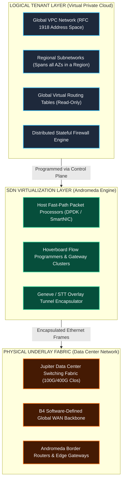
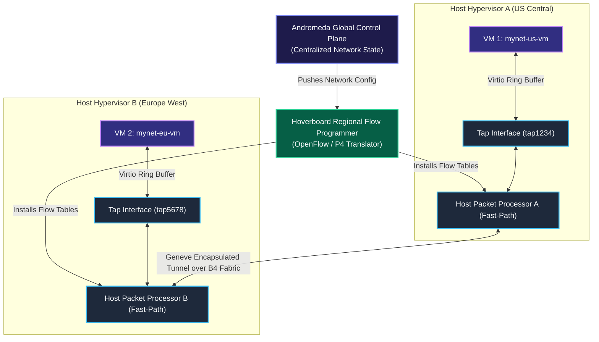
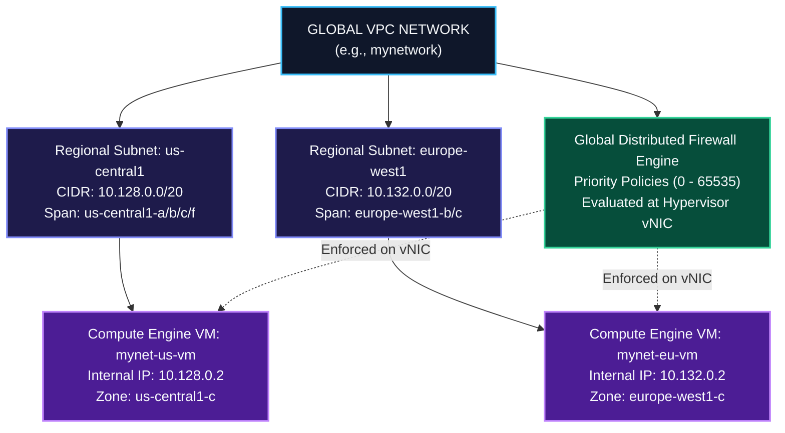
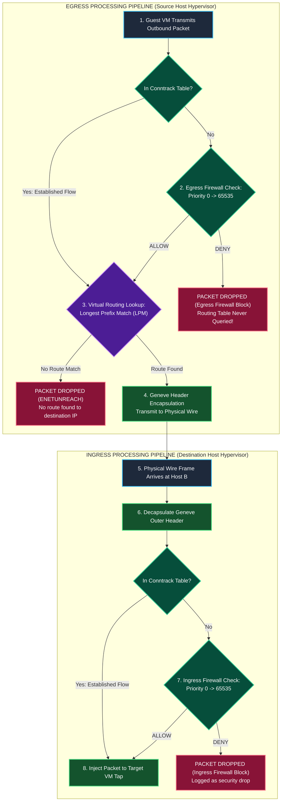
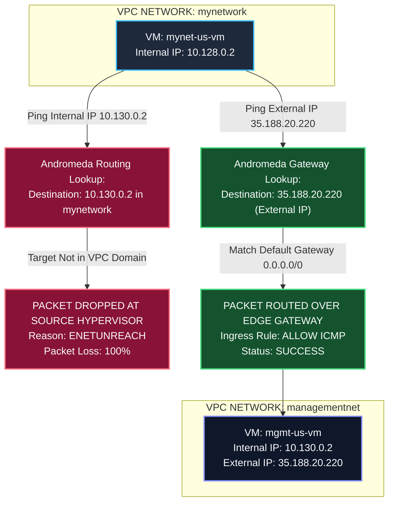

# High-Level Architecture (HLD): GCP VPC Networks & Andromeda SDN

This document details the **High-Level Architecture (HLD)** of Google Cloud Virtual Private Cloud (VPC) networks, Google's **Andromeda Software-Defined Network (SDN)** substrate, and the structural relationships between VPC networks, regional subnetworks, distributed firewalls, and routing tables.

---

## 1. Physical vs. Logical Infrastructure Stack

In traditional cloud or data center environments, networking relies on physical switches, VLAN tags, virtual wire routers, and hardware firewall appliances. Google Cloud decouples logical network constructs completely from physical infrastructure using **Andromeda SDN**.

---

## 2. Andromeda SDN Control & Data Plane Architecture

Andromeda is Google's NFV (Network Function Virtualization) software stack that delivers high-throughput, low-latency VPC networking.

### Andromeda Component Architecture Flowchart

1. **Andromeda Control Plane**: Maintains global tenant network state, subnet mappings, route tables, and firewall policies across all GCP regions.
2. **Hoverboard Flow Programmers**: Regional controllers that translate VPC configurations into low-level forwarding table entries (OpenFlow/P4-like rules) and push them down to hypervisors.
3. **Host Fast-Path Packet Processor**: Software module running on each Linux hypervisor host. It executes firewall checks, NAT transformations, and encapsulation in user-space or hardware offload engine (DPDK / SmartNIC) to achieve near-wire speed.
4. **Software Gateways**: High-capacity cluster routers used for fallback path resolution (when host fast-path cache misses occur) and external internet gateway routing.

---

## 3. Structural Relationship: VPC, Subnets, Firewalls & Routes

A **VPC Network** is a global resource that serves as a container for regional subnetworks, virtual routers, and distributed firewall rules.

---

## 4. Firewall and Route Interconnection Matrix

In Google Cloud VPC networking, **Virtual Routing Tables** and the **Distributed Firewall Engine** act as two distinct security and forwarding layers operating in sequence inside the hypervisor's Andromeda Host Packet Processor (HPP).

### Egress vs. Ingress Interconnection Evaluation Order

### Routing Table Precedence & Selection Rules

When a packet passes the Egress Firewall check, Andromeda evaluates the VPC's global virtual routing table using the following strict hierarchy:

1. **Longest Prefix Match (LPM)**: The route with the most specific subnet mask wins. For example, a route to `10.128.0.0/24` is chosen over `10.0.0.0/8`.
2. **Route Priority (Metric)**: If two routes have identical destination prefixes, the route with the **lowest priority integer** wins (e.g. Priority `100` beats Priority `1000`).
3. **Equal-Cost Multi-Path (ECMP)**: If multiple routes have identical destination prefixes and identical priorities, Andromeda spreads traffic across all matching next-hops using a 5-tuple hash.

---

## 5. Auto Mode vs. Custom Mode Topology

```mermaid
graph LR
    classDef auto fill:#1E293B,stroke:#F59E0B,stroke-width:2px,color:#F8FAFC;
    classDef custom fill:#0F172A,stroke:#10B981,stroke-width:2px,color:#F8FAFC;
    classDef action fill:#4C1D95,stroke:#C084FC,stroke-width:2px,color:#F8FAFC;

    subgraph AutoMode ["AUTO MODE VPC NETWORK"]
        A1["Auto-provisions one /20 subnet in every GCP region"]:::auto
        A2["Predefined CIDRs (10.128.0.0/20, 10.132.0.0/20...)"]:::auto
        A3["Preset Firewall Rules (Allow ICMP, SSH, RDP, Internal)"]:::auto
    end

    Convert["gcloud compute networks update --switch-to-custom-mode<br/>(One-Way Irreversible Migration)"]:::action

    subgraph CustomMode ["CUSTOM MODE VPC NETWORK"]
        C1["Zero subnets created by default"]:::custom
        C2["Administrator explicitly defines CIDR blocks (/24, /16...)"]:::custom
        C3["Recommended for production to avoid CIDR overlap"]:::custom
    end

    AutoMode --> Convert --> CustomMode
```

---

## 6. Cross-VPC Network Isolation Architecture

GCP VPC networks enforce **strict multi-tenant RFC 1918 isolation**.

---

## Related Workspace Documents

- [Case Study Index](file:///home/btpl-lap-22/live/gcd/vpc-network/casestudy/README.md)
- [Low-Level Packet Lifecycle (LLD)](file:///home/btpl-lap-22/live/gcd/vpc-network/casestudy/lld-packet-lifecycle.md)
- [Stateful Firewall Deep Dive](file:///home/btpl-lap-22/live/gcd/vpc-network/casestudy/firewall-deep-dive.md)
- [Compute & Network Integration](file:///home/btpl-lap-22/live/gcd/vpc-network/casestudy/compute-network-integration.md)
